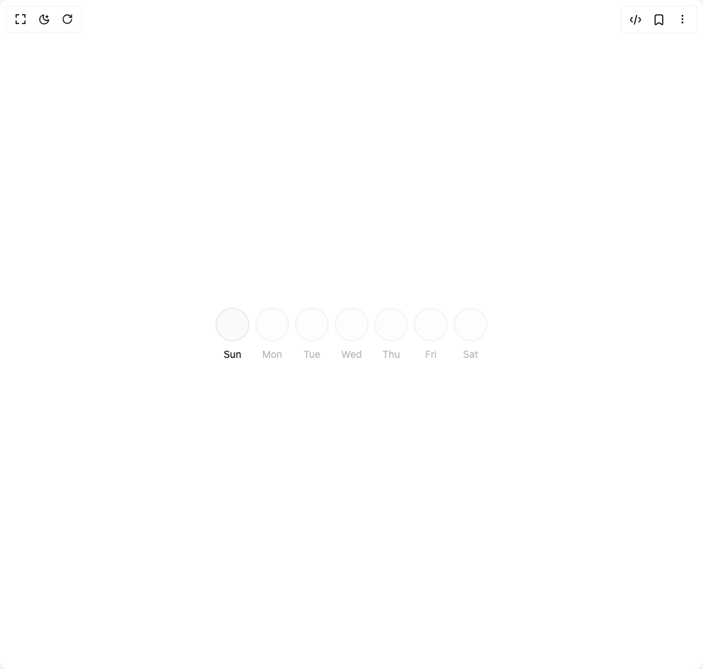

# Build Streak Calendar in BuilderStudio

> Build this component in our Agentic IDE: [BuilderStudio](https://builderstudio.dev).
>
> Join the BuilderStudio community on [Discord](https://discord.gg/QdWeSGCqfe) and [Reddit](https://reddit.com/r/builderstudio).



## Component

- Author group: `trophyso`
- Component: `streak-calendar`
- Variant: `default`
- Rendered HTML snapshot: [`rendered.html`](rendered.html)

## BuilderStudio prompt

You are implementing a React component based on a component reference.

## Component identity

- Author: trophyso
- Component slug: streak-calendar
- Demo slug: default
- Title: streak-calendar
- Description: 

## Goal

Recreate this component in a React + TypeScript + Tailwind CSS project. Preserve the visual layout, spacing, colors, border radius, shadows, interaction behavior, animation behavior, responsive behavior, and dark mode behavior shown in the rendered demo.

## Implementation requirements

- Use React and TypeScript.
- Use Tailwind CSS classes whenever possible.
- Keep the component self-contained unless the source files require helper components.
- If the source uses CSS variables, custom CSS, animations, or keyframes, include them.
- If the source uses external packages, list and use the required packages.
- Preserve accessibility attributes, button semantics, links, keyboard behavior, and ARIA attributes when visible in the source.
- Do not replace the component with a simplified placeholder.
- Return complete production-ready code.

## Dependencies

No reference metadata available.

## Rendered DOM snapshot

This is the rendered demo HTML extracted from the live preview. Use it to verify structure, class names, visible content, and layout.

```html
<div id="root"><div class="w-screen min-h-screen flex justify-center items-center"><div class="w-screen min-h-screen flex justify-center items-center"><div style="padding: 16px;"><div role="grid" aria-label="Streak calendar week view" class="w-full max-w-3xl"><div role="rowgroup" class="grid grid-cols-7 gap-2"><div class="flex flex-col items-center gap-2"><button type="button" role="gridcell" aria-current="date" aria-label="Sunday, June 28, no activity" class="relative flex h-12 w-12 items-center justify-center rounded-full border-2 transition-colors focus-visible:ring-ring focus-visible:ring-2 focus-visible:ring-offset-2 focus-visible:outline-none hover:opacity-90 !bg-primary-foreground !text-primary border-border/60 bg-muted/30"></button><span class="text-sm text-foreground">Sun</span></div><div class="flex flex-col items-center gap-2"><button type="button" role="gridcell" aria-label="Monday, June 29, future" disabled="" class="relative flex h-12 w-12 items-center justify-center rounded-full border-2 transition-colors focus-visible:ring-ring focus-visible:ring-2 focus-visible:ring-offset-2 focus-visible:outline-none border-border/40 bg-muted/20 text-muted-foreground/40 cursor-not-allowed"></button><span class="text-sm text-muted-foreground/50">Mon</span></div><div class="flex flex-col items-center gap-2"><button type="button" role="gridcell" aria-label="Tuesday, June 30, future" disabled="" class="relative flex h-12 w-12 items-center justify-center rounded-full border-2 transition-colors focus-visible:ring-ring focus-visible:ring-2 focus-visible:ring-offset-2 focus-visible:outline-none border-border/40 bg-muted/20 text-muted-foreground/40 cursor-not-allowed"></button><span class="text-sm text-muted-foreground/50">Tue</span></div><div class="flex flex-col items-center gap-2"><button type="button" role="gridcell" aria-label="Wednesday, July 1, future" disabled="" class="relative flex h-12 w-12 items-center justify-center rounded-full border-2 transition-colors focus-visible:ring-ring focus-visible:ring-2 focus-visible:ring-offset-2 focus-visible:outline-none border-border/40 bg-muted/20 text-muted-foreground/40 cursor-not-allowed"></button><span class="text-sm text-muted-foreground/50">Wed</span></div><div class="flex flex-col items-center gap-2"><button type="button" role="gridcell" aria-label="Thursday, July 2, future" disabled="" class="relative flex h-12 w-12 items-center justify-center rounded-full border-2 transition-colors focus-visible:ring-ring focus-visible:ring-2 focus-visible:ring-offset-2 focus-visible:outline-none border-border/40 bg-muted/20 text-muted-foreground/40 cursor-not-allowed"></button><span class="text-sm text-muted-foreground/50">Thu</span></div><div class="flex flex-col items-center gap-2"><button type="button" role="gridcell" aria-label="Friday, July 3, future" disabled="" class="relative flex h-12 w-12 items-center justify-center rounded-full border-2 transition-colors focus-visible:ring-ring focus-visible:ring-2 focus-visible:ring-offset-2 focus-visible:outline-none border-border/40 bg-muted/20 text-muted-foreground/40 cursor-not-allowed"></button><span class="text-sm text-muted-foreground/50">Fri</span></div><div class="flex flex-col items-center gap-2"><button type="button" role="gridcell" aria-label="Saturday, July 4, future" disabled="" class="relative flex h-12 w-12 items-center justify-center rounded-full border-2 transition-colors focus-visible:ring-ring focus-visible:ring-2 focus-visible:ring-offset-2 focus-visible:outline-none border-border/40 bg-muted/20 text-muted-foreground/40 cursor-not-allowed"></button><span class="text-sm text-muted-foreground/50">Sat</span></div></div></div></div></div></div></div>
```

## Reference source files

No reference source files were available.
