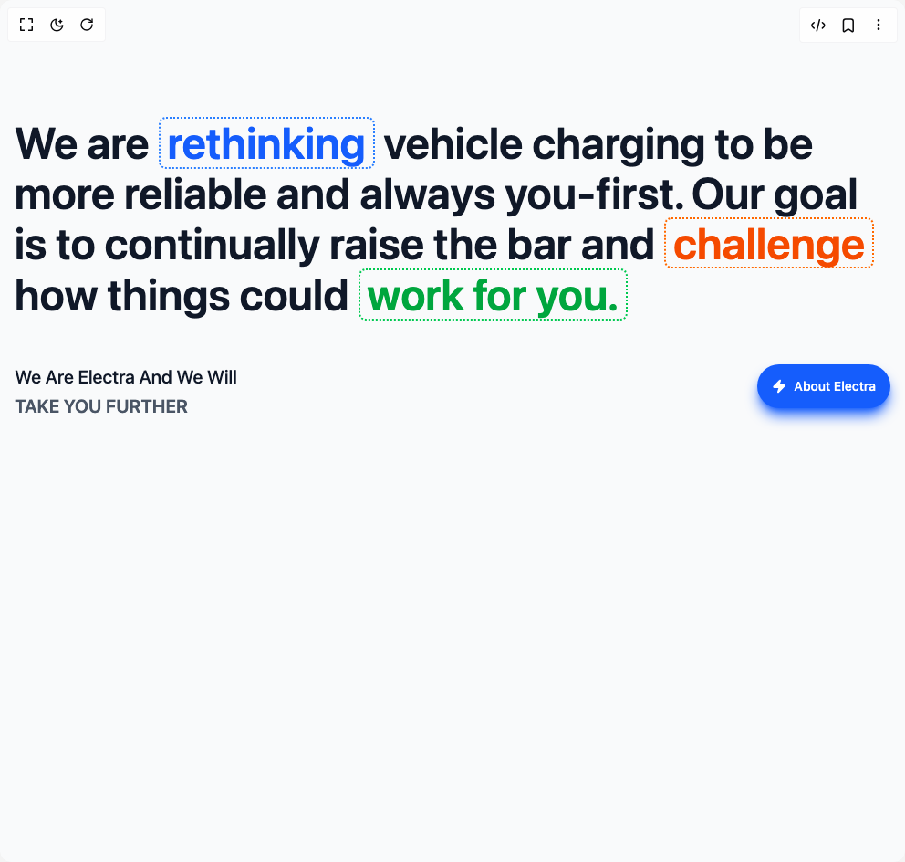

# Build About Section 2 in BuilderStudio

> Build this component in our Agentic IDE: [BuilderStudio](https://builderstudio.dev).
>
> Join the BuilderStudio community on [Discord](https://discord.gg/QdWeSGCqfe) and [Reddit](https://reddit.com/r/builderstudio).



## Component

- Author group: `ui-layouts`
- Component: `about-section-2`
- Variant: `default`
- Rendered HTML snapshot: [`rendered.html`](rendered.html)

## BuilderStudio prompt

You are implementing a React component based on a component reference.

## Component identity

- Author: ui-layouts
- Component slug: about-section-2
- Demo slug: default
- Title: about-section-2
- Description: 

## Goal

Recreate this component in a React + TypeScript + Tailwind CSS project. Preserve the visual layout, spacing, colors, border radius, shadows, interaction behavior, animation behavior, responsive behavior, and dark mode behavior shown in the rendered demo.

## Implementation requirements

- Use React and TypeScript.
- Use Tailwind CSS classes whenever possible.
- Keep the component self-contained unless the source files require helper components.
- If the source uses CSS variables, custom CSS, animations, or keyframes, include them.
- If the source uses external packages, list and use the required packages.
- Preserve accessibility attributes, button semantics, links, keyboard behavior, and ARIA attributes when visible in the source.
- Do not replace the component with a simplified placeholder.
- Return complete production-ready code.

## Dependencies

No reference metadata available.

## Rendered DOM snapshot

This is the rendered demo HTML extracted from the live preview. Use it to verify structure, class names, visible content, and layout.

```html
<div id="root"><div class="w-screen min-h-screen flex justify-center items-center"><div class="w-screen min-h-screen flex justify-center items-center"><section class="py-32 px-4 bg-gray-50 min-h-screen"><div class="max-w-6xl mx-auto"><div class="flex flex-col lg:flex-row items-start gap-8"><div class="flex-1"><h1 class="sm:text-4xl text-2xl md:text-5xl !leading-[110%] font-semibold text-gray-900 mb-8" style="filter: blur(0px); opacity: 1; transform: none;">We are <span class="text-blue-600 border-2 border-blue-500 inline-block xl:h-16  border-dotted px-2 rounded-md" style="filter: blur(0px); opacity: 1;">rethinking</span> vehicle charging to be more reliable and always you-first. Our goal is to continually raise the bar and <span class="text-orange-600 border-2 border-orange-500 inline-block xl:h-16 border-dotted px-2 rounded-md" style="filter: blur(0px); opacity: 1;">challenge</span> how things could <span class="text-green-600 border-2 border-green-500 inline-block xl:h-16 border-dotted px-2 rounded-md" style="filter: blur(0px); opacity: 1;">work for you.</span></h1><div class="mt-12 flex gap-2 justify-between"><div class="mb-4 sm:text-xl text-xs" style="filter: blur(0px); opacity: 1;"><div class=" font-medium text-gray-900 mb-1 capitalize">We are Electra and we will</div><div class=" text-gray-600 font-semibold uppercase">take you further</div></div><button class="bg-blue-600 gap-2 font-medium shadow-lg shadow-blue-600 text-white h-12 px-4 rounded-full text-sm inline-flex items-center cursor-pointer" style="filter: blur(0px); opacity: 1;"><svg xmlns="http://www.w3.org/2000/svg" width="16" height="16" viewBox="0 0 24 24" fill="white" stroke="currentColor" stroke-width="2" stroke-linecap="round" stroke-linejoin="round" class="lucide lucide-zap" aria-hidden="true"><path d="M4 14a1 1 0 0 1-.78-1.63l9.9-10.2a.5.5 0 0 1 .86.46l-1.92 6.02A1 1 0 0 0 13 10h7a1 1 0 0 1 .78 1.63l-9.9 10.2a.5.5 0 0 1-.86-.46l1.92-6.02A1 1 0 0 0 11 14z"></path></svg>About Electra</button></div></div></div></div></section></div></div></div>
```

## Reference source files

No reference source files were available.
