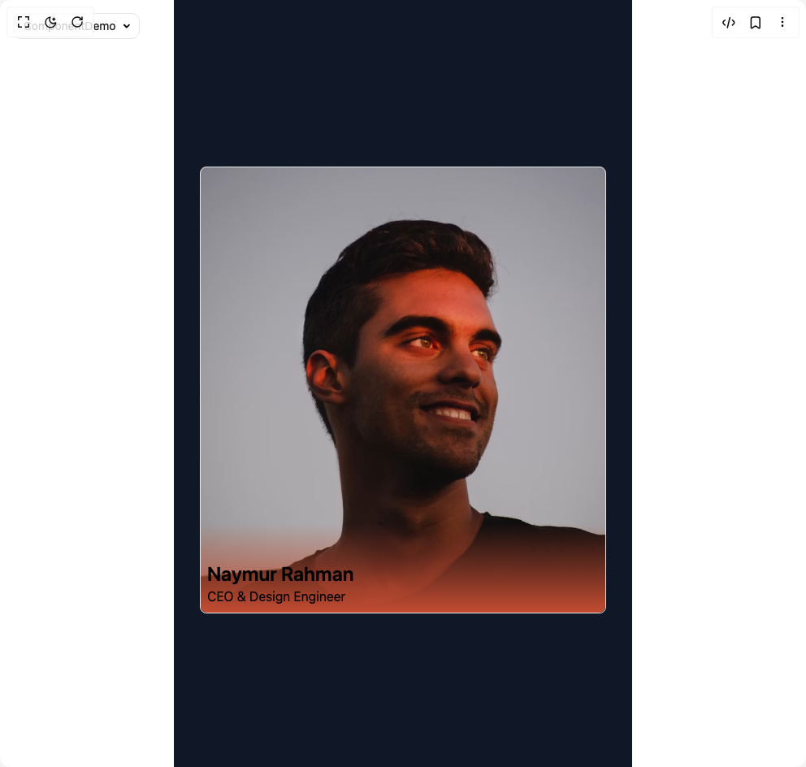

# Build Card Hover 2 in BuilderStudio

> Build this component in our Agentic IDE: [BuilderStudio](https://builderstudio.dev).
>
> Join the BuilderStudio community on [Discord](https://discord.gg/QdWeSGCqfe) and [Reddit](https://reddit.com/r/builderstudio).



## Component

- Author group: `ui-layouts`
- Component: `card-hover-2`
- Variant: `default`
- Rendered HTML snapshot: [`rendered.html`](rendered.html)

## BuilderStudio prompt

You are implementing a React component based on a component reference.

## Component identity

- Author: ui-layouts
- Component slug: card-hover-2
- Demo slug: default
- Title: card-hover-2
- Description: 

## Goal

Recreate this component in a React + TypeScript + Tailwind CSS project. Preserve the visual layout, spacing, colors, border radius, shadows, interaction behavior, animation behavior, responsive behavior, and dark mode behavior shown in the rendered demo.

## Implementation requirements

- Use React and TypeScript.
- Use Tailwind CSS classes whenever possible.
- Keep the component self-contained unless the source files require helper components.
- If the source uses CSS variables, custom CSS, animations, or keyframes, include them.
- If the source uses external packages, list and use the required packages.
- Preserve accessibility attributes, button semantics, links, keyboard behavior, and ARIA attributes when visible in the source.
- Do not replace the component with a simplified placeholder.
- Return complete production-ready code.

## Dependencies

No reference metadata available.

## Rendered DOM snapshot

This is the rendered demo HTML extracted from the live preview. Use it to verify structure, class names, visible content, and layout.

```html
<div id="root"><div class="fixed top-4 left-4 z-10"><select class="appearance-none h-8 max-w-[200px] text-sm leading-tight rounded-lg pl-3 pr-7 py-0 border bg-background focus:outline-none focus:ring-0"><option value="named_DemoOne_ComponentDemo">ComponentDemo</option></select><div class="absolute top-1/2 transform -translate-y-1/2 right-2 pointer-events-none"><svg class="w-4 h-4 fill-current" viewBox="0 0 20 20"><path d="M5.516 7.548c.436-.446 1.043-.48 1.576 0L10 10.405l2.908-2.857c.533-.48 1.14-.446 1.576 0 .436.445.408 1.197 0 1.615l-3.734 3.705c-.533.534-1.39.534-1.923 0l-3.734-3.705c-.408-.418-.436-1.17 0-1.615z"></path></svg></div></div><div class="w-screen min-h-screen flex justify-center items-center"><div class="flex flex-col items-center justify-center gap-12 p-8 bg-gray-900 min-h-screen text-white"><div class="flex flex-wrap justify-center gap-8"><div class="flex flex-col items-center gap-2"><div class="relative mt-4 overflow-hidden group mx-auto dark:bg-black bg-white dark:border-0 border rounded-md dark:text-white text-black flex flex-col w-[500px] h-[550px]"><div class="w-full h-full"></div><article class="p-8 w-full h-full overflow-hidden z-10 absolute top-0 flex flex-col justify-end rounded-md opacity-0 group-hover:opacity-100 transition-all duration-300 bg-[#c34c32]"><div class="translate-y-10 group-hover:translate-y-0 transition-all duration-300 space-y-2"><h1 class="md:text-2xl font-semibold">Who We are</h1><p class="sm:text-base text-sm">Lorem ipsum dolor sit amet, consectetur adipisicing elit. Ad consectetur ducimus vel nemo deserunt possimus inventore ipsum nostrum. Sapiente, facilis?</p><button class="p-2 bg-black flex rounded-md text-white">Learn More <svg xmlns="http://www.w3.org/2000/svg" width="24" height="24" viewBox="0 0 24 24" fill="none" stroke="currentColor" stroke-width="2" stroke-linecap="round" stroke-linejoin="round" class="lucide lucide-chevrons-right" aria-hidden="true"><path d="m6 17 5-5-5-5"></path><path d="m13 17 5-5-5-5"></path></svg></button></div></article><article class="p-2 w-full h-[20%] flex flex-col justify-end overflow-hidden absolute bottom-0 rounded-b-md opacity-100 group-hover:opacity-0 group-hover:-bottom-4 transition-all duration-300 bg-gradient-to-t from-[#c34c32]"><h1 class="md:text-2xl font-semibold">Naymur Rahman</h1><p class="sm:text-base text-sm">CEO &amp; Design Engineer</p></article></div></div></div></div></div></div>
```

## Reference source files

No reference source files were available.
