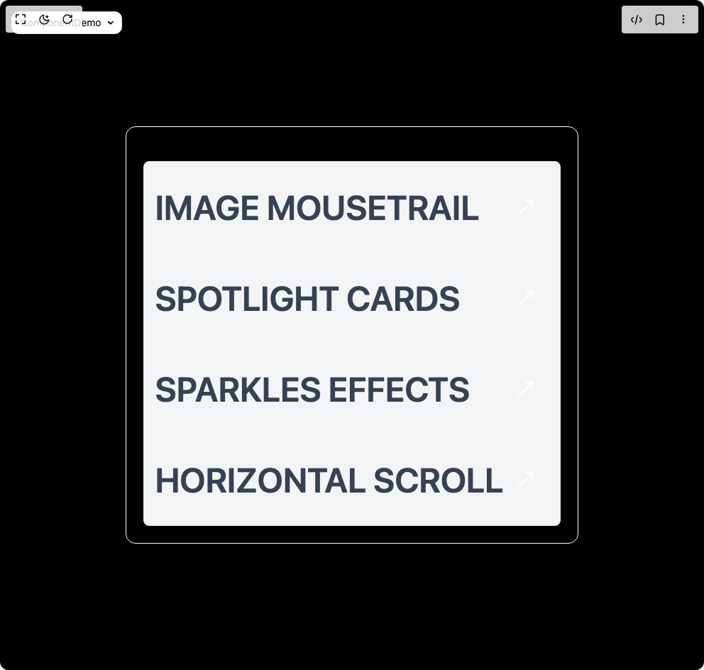

# Build Image Reveal in BuilderStudio

> Build this component in our Agentic IDE: [BuilderStudio](https://builderstudio.dev).
>
> Join the BuilderStudio community on [Discord](https://discord.gg/QdWeSGCqfe) and [Reddit](https://reddit.com/r/builderstudio).



## Component

- Author group: `ui-layouts`
- Component: `image-reveal`
- Variant: `default`
- Rendered HTML snapshot: [`rendered.html`](rendered.html)

## BuilderStudio prompt

You are implementing a React component based on a component reference.

## Component identity

- Author: ui-layouts
- Component slug: image-reveal
- Demo slug: default
- Title: image-reveal
- Description: 

## Goal

Recreate this component in a React + TypeScript + Tailwind CSS project. Preserve the visual layout, spacing, colors, border radius, shadows, interaction behavior, animation behavior, responsive behavior, and dark mode behavior shown in the rendered demo.

## Implementation requirements

- Use React and TypeScript.
- Use Tailwind CSS classes whenever possible.
- Keep the component self-contained unless the source files require helper components.
- If the source uses CSS variables, custom CSS, animations, or keyframes, include them.
- If the source uses external packages, list and use the required packages.
- Preserve accessibility attributes, button semantics, links, keyboard behavior, and ARIA attributes when visible in the source.
- Do not replace the component with a simplified placeholder.
- Return complete production-ready code.

## Dependencies

No reference metadata available.

## Rendered DOM snapshot

This is the rendered demo HTML extracted from the live preview. Use it to verify structure, class names, visible content, and layout.

```html
<div id="root"><div class="fixed top-4 left-4 z-10"><select class="appearance-none h-8 max-w-[200px] text-sm leading-tight rounded-lg pl-3 pr-7 py-0 border bg-background focus:outline-none focus:ring-0"><option value="named_DemoOne_ComponentDemo">ComponentDemo</option></select><div class="absolute top-1/2 transform -translate-y-1/2 right-2 pointer-events-none"><svg class="w-4 h-4 fill-current" viewBox="0 0 20 20"><path d="M5.516 7.548c.436-.446 1.043-.48 1.576 0L10 10.405l2.908-2.857c.533-.48 1.14-.446 1.576 0 .436.445.408 1.197 0 1.615l-3.734 3.705c-.533.534-1.39.534-1.923 0l-3.734-3.705c-.408-.418-.436-1.17 0-1.615z"></path></svg></div></div><div class="w-screen min-h-screen flex justify-center items-center"><div class="flex flex-col items-center justify-center gap-12 p-8 bg-black min-h-screen text-white w-full"><div class="flex justify-center w-full"><div class="flex flex-col items-center gap-4 border p-6 rounded-xl border-white bg-black shadow-lg"><h2 class="text-2xl font-semibold mb-2"></h2><div class="relative w-full min-h-fit rounded-md border dark:bg-gradient-to-b from-black from-10% to-gray-950 to-100% bg-gray-100"><div class="cursor-pointer relative sm:flex items-center justify-between p-4 text-xl sm:text-2xl md:text-5xl"><h2 class="newFont uppercase font-semibold sm:py-6 py-2 relative text-xl sm:text-2xl md:text-5xl text-gray-700 dark:text-gray-300">Image Mousetrail</h2><button class="sm:block hidden p-4 rounded-full transition-all duration-300 ease-out"><svg xmlns="http://www.w3.org/2000/svg" width="24" height="24" viewBox="0 0 24 24" fill="none" stroke="currentColor" stroke-width="2" stroke-linecap="round" stroke-linejoin="round" class="lucide lucide-move-up-right w-8 h-8" aria-hidden="true"><path d="M13 5H19V11"></path><path d="M19 5L5 19"></path></svg></button><div class="h-[2px] dark:bg-white bg-black absolute bottom-0 left-0 transition-all duration-300 ease-linear w-0"></div></div><div class="cursor-pointer relative sm:flex items-center justify-between p-4 text-xl sm:text-2xl md:text-5xl"><h2 class="newFont uppercase font-semibold sm:py-6 py-2 relative text-xl sm:text-2xl md:text-5xl text-gray-700 dark:text-gray-300">Spotlight Cards</h2><button class="sm:block hidden p-4 rounded-full transition-all duration-300 ease-out"><svg xmlns="http://www.w3.org/2000/svg" width="24" height="24" viewBox="0 0 24 24" fill="none" stroke="currentColor" stroke-width="2" stroke-linecap="round" stroke-linejoin="round" class="lucide lucide-move-up-right w-8 h-8" aria-hidden="true"><path d="M13 5H19V11"></path><path d="M19 5L5 19"></path></svg></button><div class="h-[2px] dark:bg-white bg-black absolute bottom-0 left-0 transition-all duration-300 ease-linear w-0"></div></div><div class="cursor-pointer relative sm:flex items-center justify-between p-4 text-xl sm:text-2xl md:text-5xl"><h2 class="newFont uppercase font-semibold sm:py-6 py-2 relative text-xl sm:text-2xl md:text-5xl text-gray-700 dark:text-gray-300">Sparkles Effects</h2><button class="sm:block hidden p-4 rounded-full transition-all duration-300 ease-out"><svg xmlns="http://www.w3.org/2000/svg" width="24" height="24" viewBox="0 0 24 24" fill="none" stroke="currentColor" stroke-width="2" stroke-linecap="round" stroke-linejoin="round" class="lucide lucide-move-up-right w-8 h-8" aria-hidden="true"><path d="M13 5H19V11"></path><path d="M19 5L5 19"></path></svg></button><div class="h-[2px] dark:bg-white bg-black absolute bottom-0 left-0 transition-all duration-300 ease-linear w-0"></div></div><div class="cursor-pointer relative sm:flex items-center justify-between p-4 text-xl sm:text-2xl md:text-5xl"><h2 class="newFont uppercase font-semibold sm:py-6 py-2 relative text-xl sm:text-2xl md:text-5xl text-gray-700 dark:text-gray-300">Horizontal Scroll</h2><button class="sm:block hidden p-4 rounded-full transition-all duration-300 ease-out"><svg xmlns="http://www.w3.org/2000/svg" width="24" height="24" viewBox="0 0 24 24" fill="none" stroke="currentColor" stroke-width="2" stroke-linecap="round" stroke-linejoin="round" class="lucide lucide-move-up-right w-8 h-8" aria-hidden="true"><path d="M13 5H19V11"></path><path d="M19 5L5 19"></path></svg></button><div class="h-[2px] dark:bg-white bg-black absolute bottom-0 left-0 transition-all duration-300 ease-linear w-0"></div></div></div></div></div></div></div></div>
```

## Reference source files

No reference source files were available.
