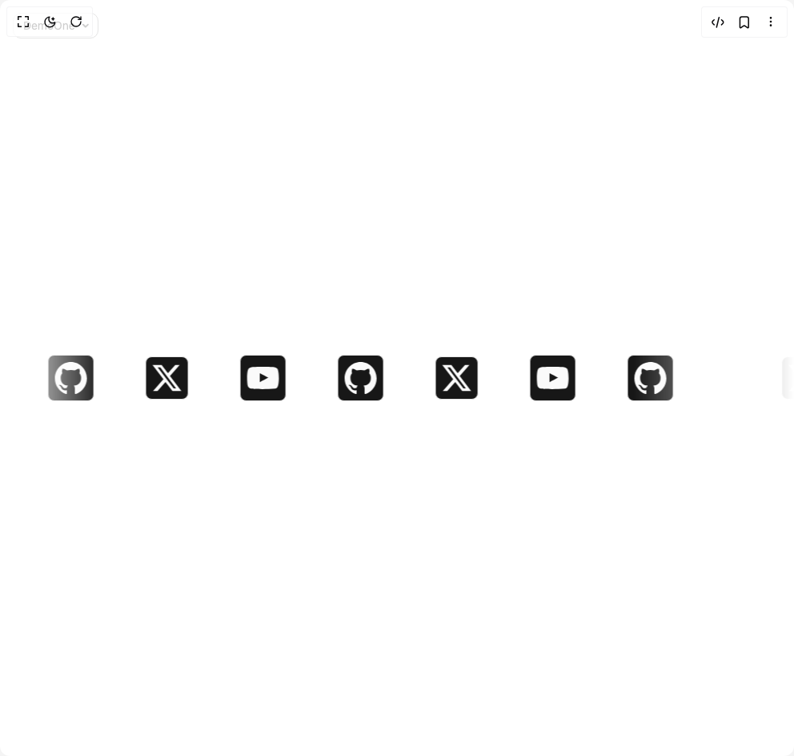

# Build Infinity Brand in BuilderStudio

> Build this component in our Agentic IDE: [BuilderStudio](https://builderstudio.dev).
>
> Join the BuilderStudio community on [Discord](https://discord.gg/QdWeSGCqfe) and [Reddit](https://reddit.com/r/builderstudio).



## Component

- Author group: `ui-layouts`
- Component: `infinity-brand`
- Variant: `default`
- Rendered HTML snapshot: [`rendered.html`](rendered.html)

## BuilderStudio prompt

You are implementing a React component based on a component reference.

## Component identity

- Author: ui-layouts
- Component slug: infinity-brand
- Demo slug: default
- Title: infinity-brand
- Description: 

## Goal

Recreate this component in a React + TypeScript + Tailwind CSS project. Preserve the visual layout, spacing, colors, border radius, shadows, interaction behavior, animation behavior, responsive behavior, and dark mode behavior shown in the rendered demo.

## Implementation requirements

- Use React and TypeScript.
- Use Tailwind CSS classes whenever possible.
- Keep the component self-contained unless the source files require helper components.
- If the source uses CSS variables, custom CSS, animations, or keyframes, include them.
- If the source uses external packages, list and use the required packages.
- Preserve accessibility attributes, button semantics, links, keyboard behavior, and ARIA attributes when visible in the source.
- Do not replace the component with a simplified placeholder.
- Return complete production-ready code.

## Dependencies

No reference metadata available.

## Rendered DOM snapshot

This is the rendered demo HTML extracted from the live preview. Use it to verify structure, class names, visible content, and layout.

```html
<div id="root"><div class="fixed top-4 left-4 z-10"><select class="appearance-none h-8 max-w-[200px] text-sm leading-tight rounded-lg pl-3 pr-7 py-0 border bg-background focus:outline-none focus:ring-0"><option value="named_DemoOne_DemoOne">DemoOne</option></select><div class="absolute top-1/2 transform -translate-y-1/2 right-2 pointer-events-none"><svg class="w-4 h-4 fill-current" viewBox="0 0 20 20"><path d="M5.516 7.548c.436-.446 1.043-.48 1.576 0L10 10.405l2.908-2.857c.533-.48 1.14-.446 1.576 0 .436.445.408 1.197 0 1.615l-3.734 3.705c-.533.534-1.39.534-1.923 0l-3.734-3.705c-.408-.418-.436-1.17 0-1.615z"></path></svg></div></div><div class="w-screen min-h-screen flex justify-center items-center"><div class="flex w-full h-screen justify-center items-center"><style>
          @keyframes infinite-scroll {
            from { transform: translateX(0); }
            to { transform: translateX(-100%); }
          }
        </style><div class="w-full text-5xl py-8 inline-flex flex-nowrap overflow-hidden [mask-image:_linear-gradient(to_right,transparent_0,_black_128px,_black_calc(100%-200px),transparent_100%)]"><ul class="flex items-center justify-center md:justify-start sm:[&amp;_li]:mx-8 [&amp;_li]:mx-4 [&amp;_img]:max-w-none" style="animation: 25s linear 0s infinite normal none running infinite-scroll;"><li><a target="_blank" href="https://x.com/naymur_dev" class="border bg-primary  text-primary-foreground text-2xl  sm:grid hidden place-content-center  p-2   rounded-md"><svg width="120" height="109" viewBox="0 0 120 109" fill="none" xmlns="http://www.w3.org/2000/svg" class=" fill-primary-foreground w-9 h-9"><path d="M94.5068 0H112.907L72.7076 46.172L120 109H82.9692L53.9674 70.8942L20.7818 109H2.3693L45.3666 59.6147L0 0H37.9685L64.1848 34.8292L94.5068 0ZM88.0484 97.9318H98.2448L32.4288 10.4872H21.4882L88.0484 97.9318Z"></path></svg></a></li><li><a target="_blank" href="https://www.youtube.com/naymurweb" class="border bg-primary  text-primary-foreground text-2xl  sm:grid hidden place-content-center  p-2   rounded-md"><svg width="206" height="143" viewBox="0 0 206 143" fill="none" xmlns="http://www.w3.org/2000/svg" class=" fill-primary-foreground w-10 h-10"><path fill-rule="evenodd" clip-rule="evenodd" d="M82.4536 97.9153V40.5946C102.803 50.1698 118.563 59.4196 137.202 69.3921C121.829 77.9181 102.803 87.4845 82.4536 97.9153ZM195.858 12.0864C192.348 7.46178 186.366 3.86191 179.996 2.6701C161.275 -0.884977 44.4825 -0.895089 25.7716 2.6701C20.664 3.62759 16.1159 5.94198 12.2089 9.53781C-4.25342 24.8174 0.905084 106.757 4.87314 120.03C6.54174 125.775 8.69882 129.918 11.4154 132.638C14.9154 136.234 19.7075 138.709 25.2119 139.82C40.6263 143.008 120.038 144.791 179.671 140.299C185.165 139.341 190.028 136.785 193.864 133.037C209.085 117.818 208.047 31.2775 195.858 12.0864Z"></path></svg></a></li><li><a target="_blank" href="https://github.com/ui-layouts/uilayouts" class="border bg-primary  text-primary-foreground text-2xl  sm:grid hidden place-content-center  p-2   rounded-md"><svg width="202" height="202" viewBox="0 0 202 202" fill="none" xmlns="http://www.w3.org/2000/svg" class=" fill-primary-foreground w-10 h-10"><path fill-rule="evenodd" clip-rule="evenodd" d="M101 0C156.782 0 202 46.3583 202 103.555C202 149.297 173.094 188.102 132.987 201.808C127.866 202.828 126.048 199.594 126.048 196.837C126.048 193.423 126.169 182.273 126.169 168.416C126.169 158.76 122.937 152.458 119.311 149.246C141.804 146.681 165.438 137.923 165.438 98.1495C165.438 86.8375 161.519 77.6066 155.035 70.3548C156.085 67.7389 159.55 57.2059 154.045 42.9447C154.045 42.9447 145.581 40.1699 126.3 53.5625C118.231 51.2698 109.585 50.1163 101 50.0759C92.415 50.1163 83.7795 51.2698 75.7197 53.5625C56.4186 40.1699 47.9346 42.9447 47.9346 42.9447C42.4503 57.2059 45.9146 67.7389 46.9549 70.3548C40.501 77.6066 36.5519 86.8375 36.5519 98.1495C36.5519 137.822 60.1354 146.714 82.5675 149.33C79.6789 151.916 77.063 156.477 76.154 163.173C70.397 165.819 55.7722 170.399 46.763 154.572C46.763 154.572 41.4201 144.623 31.2797 143.895C31.2797 143.895 21.4322 143.765 30.5929 150.188C30.5929 150.188 37.2084 153.37 41.8039 165.338C41.8039 165.338 47.7326 183.821 75.8308 177.559C75.8813 186.214 75.9722 194.372 75.9722 196.837C75.9722 199.574 74.1138 202.777 69.0739 201.818C28.9365 188.132 0 149.308 0 103.555C0 46.3583 45.2278 0 101 0Z"></path></svg></a></li><li><a target="_blank" href="https://x.com/naymur_dev" class="border bg-primary  text-primary-foreground text-2xl  sm:grid hidden place-content-center  p-2   rounded-md"><svg width="120" height="109" viewBox="0 0 120 109" fill="none" xmlns="http://www.w3.org/2000/svg" class=" fill-primary-foreground w-9 h-9"><path d="M94.5068 0H112.907L72.7076 46.172L120 109H82.9692L53.9674 70.8942L20.7818 109H2.3693L45.3666 59.6147L0 0H37.9685L64.1848 34.8292L94.5068 0ZM88.0484 97.9318H98.2448L32.4288 10.4872H21.4882L88.0484 97.9318Z"></path></svg></a></li><li><a target="_blank" href="https://www.youtube.com/naymurweb" class="border bg-primary  text-primary-foreground text-2xl  sm:grid hidden place-content-center  p-2   rounded-md"><svg width="206" height="143" viewBox="0 0 206 143" fill="none" xmlns="http://www.w3.org/2000/svg" class=" fill-primary-foreground w-10 h-10"><path fill-rule="evenodd" clip-rule="evenodd" d="M82.4536 97.9153V40.5946C102.803 50.1698 118.563 59.4196 137.202 69.3921C121.829 77.9181 102.803 87.4845 82.4536 97.9153ZM195.858 12.0864C192.348 7.46178 186.366 3.86191 179.996 2.6701C161.275 -0.884977 44.4825 -0.895089 25.7716 2.6701C20.664 3.62759 16.1159 5.94198 12.2089 9.53781C-4.25342 24.8174 0.905084 106.757 4.87314 120.03C6.54174 125.775 8.69882 129.918 11.4154 132.638C14.9154 136.234 19.7075 138.709 25.2119 139.82C40.6263 143.008 120.038 144.791 179.671 140.299C185.165 139.341 190.028 136.785 193.864 133.037C209.085 117.818 208.047 31.2775 195.858 12.0864Z"></path></svg></a></li><li><a target="_blank" href="https://github.com/ui-layouts/uilayouts" class="border bg-primary  text-primary-foreground text-2xl  sm:grid hidden place-content-center  p-2   rounded-md"><svg width="202" height="202" viewBox="0 0 202 202" fill="none" xmlns="http://www.w3.org/2000/svg" class=" fill-primary-foreground w-10 h-10"><path fill-rule="evenodd" clip-rule="evenodd" d="M101 0C156.782 0 202 46.3583 202 103.555C202 149.297 173.094 188.102 132.987 201.808C127.866 202.828 126.048 199.594 126.048 196.837C126.048 193.423 126.169 182.273 126.169 168.416C126.169 158.76 122.937 152.458 119.311 149.246C141.804 146.681 165.438 137.923 165.438 98.1495C165.438 86.8375 161.519 77.6066 155.035 70.3548C156.085 67.7389 159.55 57.2059 154.045 42.9447C154.045 42.9447 145.581 40.1699 126.3 53.5625C118.231 51.2698 109.585 50.1163 101 50.0759C92.415 50.1163 83.7795 51.2698 75.7197 53.5625C56.4186 40.1699 47.9346 42.9447 47.9346 42.9447C42.4503 57.2059 45.9146 67.7389 46.9549 70.3548C40.501 77.6066 36.5519 86.8375 36.5519 98.1495C36.5519 137.822 60.1354 146.714 82.5675 149.33C79.6789 151.916 77.063 156.477 76.154 163.173C70.397 165.819 55.7722 170.399 46.763 154.572C46.763 154.572 41.4201 144.623 31.2797 143.895C31.2797 143.895 21.4322 143.765 30.5929 150.188C30.5929 150.188 37.2084 153.37 41.8039 165.338C41.8039 165.338 47.7326 183.821 75.8308 177.559C75.8813 186.214 75.9722 194.372 75.9722 196.837C75.9722 199.574 74.1138 202.777 69.0739 201.818C28.9365 188.132 0 149.308 0 103.555C0 46.3583 45.2278 0 101 0Z"></path></svg></a></li><li><a target="_blank" href="https://x.com/naymur_dev" class="border bg-primary  text-primary-foreground text-2xl  sm:grid hidden place-content-center  p-2   rounded-md"><svg width="120" height="109" viewBox="0 0 120 109" fill="none" xmlns="http://www.w3.org/2000/svg" class=" fill-primary-foreground w-9 h-9"><path d="M94.5068 0H112.907L72.7076 46.172L120 109H82.9692L53.9674 70.8942L20.7818 109H2.3693L45.3666 59.6147L0 0H37.9685L64.1848 34.8292L94.5068 0ZM88.0484 97.9318H98.2448L32.4288 10.4872H21.4882L88.0484 97.9318Z"></path></svg></a></li><li><a target="_blank" href="https://www.youtube.com/naymurweb" class="border bg-primary  text-primary-foreground text-2xl  sm:grid hidden place-content-center  p-2   rounded-md"><svg width="206" height="143" viewBox="0 0 206 143" fill="none" xmlns="http://www.w3.org/2000/svg" class=" fill-primary-foreground w-10 h-10"><path fill-rule="evenodd" clip-rule="evenodd" d="M82.4536 97.9153V40.5946C102.803 50.1698 118.563 59.4196 137.202 69.3921C121.829 77.9181 102.803 87.4845 82.4536 97.9153ZM195.858 12.0864C192.348 7.46178 186.366 3.86191 179.996 2.6701C161.275 -0.884977 44.4825 -0.895089 25.7716 2.6701C20.664 3.62759 16.1159 5.94198 12.2089 9.53781C-4.25342 24.8174 0.905084 106.757 4.87314 120.03C6.54174 125.775 8.69882 129.918 11.4154 132.638C14.9154 136.234 19.7075 138.709 25.2119 139.82C40.6263 143.008 120.038 144.791 179.671 140.299C185.165 139.341 190.028 136.785 193.864 133.037C209.085 117.818 208.047 31.2775 195.858 12.0864Z"></path></svg></a></li><li><a target="_blank" href="https://github.com/ui-layouts/uilayouts" class="border bg-primary  text-primary-foreground text-2xl  sm:grid hidden place-content-center  p-2   rounded-md"><svg width="202" height="202" viewBox="0 0 202 202" fill="none" xmlns="http://www.w3.org/2000/svg" class=" fill-primary-foreground w-10 h-10"><path fill-rule="evenodd" clip-rule="evenodd" d="M101 0C156.782 0 202 46.3583 202 103.555C202 149.297 173.094 188.102 132.987 201.808C127.866 202.828 126.048 199.594 126.048 196.837C126.048 193.423 126.169 182.273 126.169 168.416C126.169 158.76 122.937 152.458 119.311 149.246C141.804 146.681 165.438 137.923 165.438 98.1495C165.438 86.8375 161.519 77.6066 155.035 70.3548C156.085 67.7389 159.55 57.2059 154.045 42.9447C154.045 42.9447 145.581 40.1699 126.3 53.5625C118.231 51.2698 109.585 50.1163 101 50.0759C92.415 50.1163 83.7795 51.2698 75.7197 53.5625C56.4186 40.1699 47.9346 42.9447 47.9346 42.9447C42.4503 57.2059 45.9146 67.7389 46.9549 70.3548C40.501 77.6066 36.5519 86.8375 36.5519 98.1495C36.5519 137.822 60.1354 146.714 82.5675 149.33C79.6789 151.916 77.063 156.477 76.154 163.173C70.397 165.819 55.7722 170.399 46.763 154.572C46.763 154.572 41.4201 144.623 31.2797 143.895C31.2797 143.895 21.4322 143.765 30.5929 150.188C30.5929 150.188 37.2084 153.37 41.8039 165.338C41.8039 165.338 47.7326 183.821 75.8308 177.559C75.8813 186.214 75.9722 194.372 75.9722 196.837C75.9722 199.574 74.1138 202.777 69.0739 201.818C28.9365 188.132 0 149.308 0 103.555C0 46.3583 45.2278 0 101 0Z"></path></svg></a></li></ul><ul class="flex items-center justify-center md:justify-start sm:[&amp;_li]:mx-8 [&amp;_li]:mx-4 [&amp;_img]:max-w-none" aria-hidden="true" style="animation: 25s linear 0s infinite normal none running infinite-scroll;"><li><a target="_blank" href="https://x.com/naymur_dev" class="border bg-primary  text-primary-foreground text-2xl  sm:grid hidden place-content-center  p-2   rounded-md"><svg width="120" height="109" viewBox="0 0 120 109" fill="none" xmlns="http://www.w3.org/2000/svg" class=" fill-primary-foreground w-9 h-9"><path d="M94.5068 0H112.907L72.7076 46.172L120 109H82.9692L53.9674 70.8942L20.7818 109H2.3693L45.3666 59.6147L0 0H37.9685L64.1848 34.8292L94.5068 0ZM88.0484 97.9318H98.2448L32.4288 10.4872H21.4882L88.0484 97.9318Z"></path></svg></a></li><li><a target="_blank" href="https://www.youtube.com/naymurweb" class="border bg-primary  text-primary-foreground text-2xl  sm:grid hidden place-content-center  p-2   rounded-md"><svg width="206" height="143" viewBox="0 0 206 143" fill="none" xmlns="http://www.w3.org/2000/svg" class=" fill-primary-foreground w-10 h-10"><path fill-rule="evenodd" clip-rule="evenodd" d="M82.4536 97.9153V40.5946C102.803 50.1698 118.563 59.4196 137.202 69.3921C121.829 77.9181 102.803 87.4845 82.4536 97.9153ZM195.858 12.0864C192.348 7.46178 186.366 3.86191 179.996 2.6701C161.275 -0.884977 44.4825 -0.895089 25.7716 2.6701C20.664 3.62759 16.1159 5.94198 12.2089 9.53781C-4.25342 24.8174 0.905084 106.757 4.87314 120.03C6.54174 125.775 8.69882 129.918 11.4154 132.638C14.9154 136.234 19.7075 138.709 25.2119 139.82C40.6263 143.008 120.038 144.791 179.671 140.299C185.165 139.341 190.028 136.785 193.864 133.037C209.085 117.818 208.047 31.2775 195.858 12.0864Z"></path></svg></a></li><li><a target="_blank" href="https://github.com/ui-layouts/uilayouts" class="border bg-primary  text-primary-foreground text-2xl  sm:grid hidden place-content-center  p-2   rounded-md"><svg width="202" height="202" viewBox="0 0 202 202" fill="none" xmlns="http://www.w3.org/2000/svg" class=" fill-primary-foreground w-10 h-10"><path fill-rule="evenodd" clip-rule="evenodd" d="M101 0C156.782 0 202 46.3583 202 103.555C202 149.297 173.094 188.102 132.987 201.808C127.866 202.828 126.048 199.594 126.048 196.837C126.048 193.423 126.169 182.273 126.169 168.416C126.169 158.76 122.937 152.458 119.311 149.246C141.804 146.681 165.438 137.923 165.438 98.1495C165.438 86.8375 161.519 77.6066 155.035 70.3548C156.085 67.7389 159.55 57.2059 154.045 42.9447C154.045 42.9447 145.581 40.1699 126.3 53.5625C118.231 51.2698 109.585 50.1163 101 50.0759C92.415 50.1163 83.7795 51.2698 75.7197 53.5625C56.4186 40.1699 47.9346 42.9447 47.9346 42.9447C42.4503 57.2059 45.9146 67.7389 46.9549 70.3548C40.501 77.6066 36.5519 86.8375 36.5519 98.1495C36.5519 137.822 60.1354 146.714 82.5675 149.33C79.6789 151.916 77.063 156.477 76.154 163.173C70.397 165.819 55.7722 170.399 46.763 154.572C46.763 154.572 41.4201 144.623 31.2797 143.895C31.2797 143.895 21.4322 143.765 30.5929 150.188C30.5929 150.188 37.2084 153.37 41.8039 165.338C41.8039 165.338 47.7326 183.821 75.8308 177.559C75.8813 186.214 75.9722 194.372 75.9722 196.837C75.9722 199.574 74.1138 202.777 69.0739 201.818C28.9365 188.132 0 149.308 0 103.555C0 46.3583 45.2278 0 101 0Z"></path></svg></a></li><li><a target="_blank" href="https://x.com/naymur_dev" class="border bg-primary  text-primary-foreground text-2xl  sm:grid hidden place-content-center  p-2   rounded-md"><svg width="120" height="109" viewBox="0 0 120 109" fill="none" xmlns="http://www.w3.org/2000/svg" class=" fill-primary-foreground w-9 h-9"><path d="M94.5068 0H112.907L72.7076 46.172L120 109H82.9692L53.9674 70.8942L20.7818 109H2.3693L45.3666 59.6147L0 0H37.9685L64.1848 34.8292L94.5068 0ZM88.0484 97.9318H98.2448L32.4288 10.4872H21.4882L88.0484 97.9318Z"></path></svg></a></li><li><a target="_blank" href="https://www.youtube.com/naymurweb" class="border bg-primary  text-primary-foreground text-2xl  sm:grid hidden place-content-center  p-2   rounded-md"><svg width="206" height="143" viewBox="0 0 206 143" fill="none" xmlns="http://www.w3.org/2000/svg" class=" fill-primary-foreground w-10 h-10"><path fill-rule="evenodd" clip-rule="evenodd" d="M82.4536 97.9153V40.5946C102.803 50.1698 118.563 59.4196 137.202 69.3921C121.829 77.9181 102.803 87.4845 82.4536 97.9153ZM195.858 12.0864C192.348 7.46178 186.366 3.86191 179.996 2.6701C161.275 -0.884977 44.4825 -0.895089 25.7716 2.6701C20.664 3.62759 16.1159 5.94198 12.2089 9.53781C-4.25342 24.8174 0.905084 106.757 4.87314 120.03C6.54174 125.775 8.69882 129.918 11.4154 132.638C14.9154 136.234 19.7075 138.709 25.2119 139.82C40.6263 143.008 120.038 144.791 179.671 140.299C185.165 139.341 190.028 136.785 193.864 133.037C209.085 117.818 208.047 31.2775 195.858 12.0864Z"></path></svg></a></li><li><a target="_blank" href="https://github.com/ui-layouts/uilayouts" class="border bg-primary  text-primary-foreground text-2xl  sm:grid hidden place-content-center  p-2   rounded-md"><svg width="202" height="202" viewBox="0 0 202 202" fill="none" xmlns="http://www.w3.org/2000/svg" class=" fill-primary-foreground w-10 h-10"><path fill-rule="evenodd" clip-rule="evenodd" d="M101 0C156.782 0 202 46.3583 202 103.555C202 149.297 173.094 188.102 132.987 201.808C127.866 202.828 126.048 199.594 126.048 196.837C126.048 193.423 126.169 182.273 126.169 168.416C126.169 158.76 122.937 152.458 119.311 149.246C141.804 146.681 165.438 137.923 165.438 98.1495C165.438 86.8375 161.519 77.6066 155.035 70.3548C156.085 67.7389 159.55 57.2059 154.045 42.9447C154.045 42.9447 145.581 40.1699 126.3 53.5625C118.231 51.2698 109.585 50.1163 101 50.0759C92.415 50.1163 83.7795 51.2698 75.7197 53.5625C56.4186 40.1699 47.9346 42.9447 47.9346 42.9447C42.4503 57.2059 45.9146 67.7389 46.9549 70.3548C40.501 77.6066 36.5519 86.8375 36.5519 98.1495C36.5519 137.822 60.1354 146.714 82.5675 149.33C79.6789 151.916 77.063 156.477 76.154 163.173C70.397 165.819 55.7722 170.399 46.763 154.572C46.763 154.572 41.4201 144.623 31.2797 143.895C31.2797 143.895 21.4322 143.765 30.5929 150.188C30.5929 150.188 37.2084 153.37 41.8039 165.338C41.8039 165.338 47.7326 183.821 75.8308 177.559C75.8813 186.214 75.9722 194.372 75.9722 196.837C75.9722 199.574 74.1138 202.777 69.0739 201.818C28.9365 188.132 0 149.308 0 103.555C0 46.3583 45.2278 0 101 0Z"></path></svg></a></li></ul></div></div></div></div>
```

## Reference source files

No reference source files were available.
