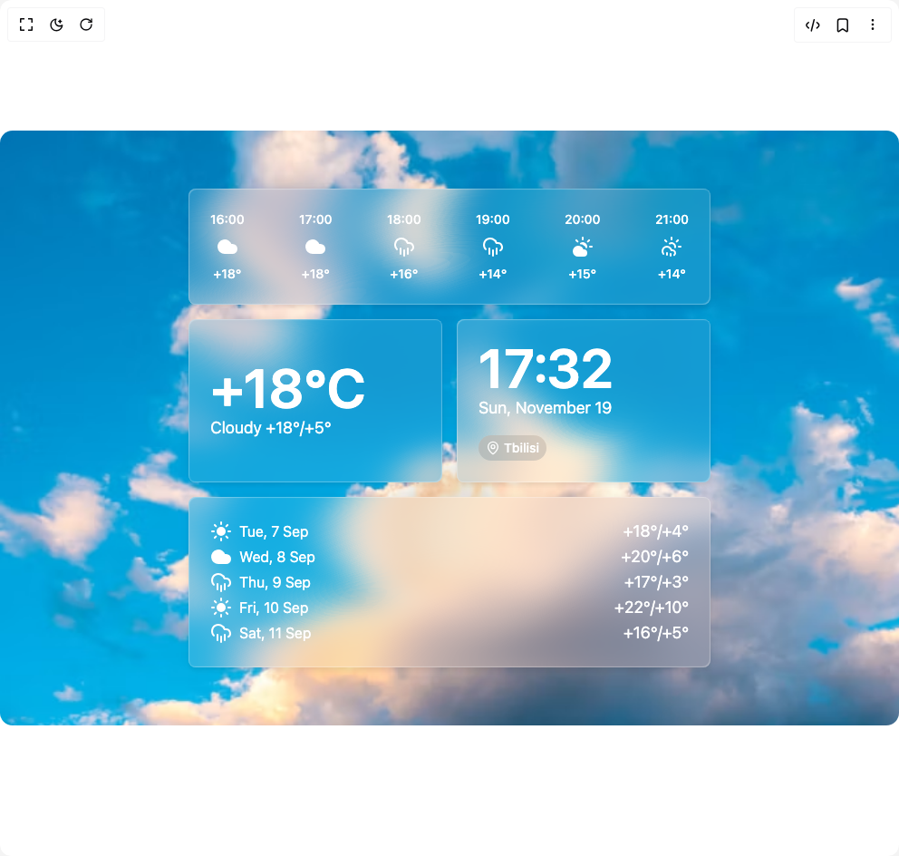

# Build Liquid Weather Glass in BuilderStudio

> Build this component in our Agentic IDE: [BuilderStudio](https://builderstudio.dev).
>
> Join the BuilderStudio community on [Discord](https://discord.gg/QdWeSGCqfe) and [Reddit](https://reddit.com/r/builderstudio).



## Component

- Author group: `ui-layouts`
- Component: `liquid-weather-glass`
- Variant: `default`
- Rendered HTML snapshot: [`rendered.html`](rendered.html)

## BuilderStudio prompt

You are implementing a React component based on a component reference.

## Component identity

- Author: ui-layouts
- Component slug: liquid-weather-glass
- Demo slug: default
- Title: liquid-weather-glass
- Description: 

## Goal

Recreate this component in a React + TypeScript + Tailwind CSS project. Preserve the visual layout, spacing, colors, border radius, shadows, interaction behavior, animation behavior, responsive behavior, and dark mode behavior shown in the rendered demo.

## Implementation requirements

- Use React and TypeScript.
- Use Tailwind CSS classes whenever possible.
- Keep the component self-contained unless the source files require helper components.
- If the source uses CSS variables, custom CSS, animations, or keyframes, include them.
- If the source uses external packages, list and use the required packages.
- Preserve accessibility attributes, button semantics, links, keyboard behavior, and ARIA attributes when visible in the source.
- Do not replace the component with a simplified placeholder.
- Return complete production-ready code.

## Dependencies

No reference metadata available.

## Rendered DOM snapshot

This is the rendered demo HTML extracted from the live preview. Use it to verify structure, class names, visible content, and layout.

```html
<div id="root"><div class="w-screen min-h-screen flex justify-center items-center"><div class="w-screen min-h-screen flex justify-center items-center"><div class="p-8 w-full gap-8 py-16 rounded-xl" style="background: url(&quot;https://images.unsplash.com/photo-1590867286251-8e26d9f255c0?q=80&amp;w=687&amp;auto=format&amp;fit=crop&amp;ixlib=rb-4.1.0&amp;ixid=M3wxMjA3fDB8MHxwaG90by1wYWdlfHx8fGVufDB8fHx8fA%3D%3D&quot;) center center / cover no-repeat;"><div class="grid w-full max-w-xl grid-cols-2 gap-4 mx-auto"><svg class="hidden"><defs><filter id="glass-blur" x="0" y="0" width="100%" height="100%" filterUnits="objectBoundingBox"><feTurbulence type="fractalNoise" baseFrequency="0.003 0.007" numOctaves="1" result="turbulence"></feTurbulence><feDisplacementMap in="SourceGraphic" in2="turbulence" scale="200" xChannelSelector="R" yChannelSelector="G"></feDisplacementMap></filter></defs></svg><div class="relative cursor-grab active:cursor-grabbing col-span-2 p-6 text-white bg-white/8" draggable="false" tabindex="0" style="border-radius: 8px; user-select: none; touch-action: none;"><div class="absolute inset-0 backdrop-blur-xl z-0" style="border-radius: 8px; filter: url(&quot;#glass-blur&quot;);"></div><div class="absolute inset-0 z-10" style="border-radius: 8px; box-shadow: rgba(0, 0, 0, 0.05) 0px 4px 4px, rgba(0, 0, 0, 0.05) 0px 0px 12px;"></div><div class="absolute inset-0 z-20" style="border-radius: 8px; box-shadow: rgba(255, 255, 255, 0.3) 1px 1px 1px 0px inset, rgba(255, 255, 255, 0.3) -1px -1px 1px 0px inset;"></div><div class="relative z-30"><div class="flex justify-between text-sm font-medium"><div class="flex flex-col items-center gap-2"><span>16:00</span><svg xmlns="http://www.w3.org/2000/svg" width="24" height="24" viewBox="0 0 24 24" fill="none" stroke="currentColor" stroke-width="2" stroke-linecap="round" stroke-linejoin="round" class="lucide lucide-cloud h-6 w-6 fill-white" aria-hidden="true"><path d="M17.5 19H9a7 7 0 1 1 6.71-9h1.79a4.5 4.5 0 1 1 0 9Z"></path></svg><span>+18°</span></div><div class="flex flex-col items-center gap-2"><span>17:00</span><svg xmlns="http://www.w3.org/2000/svg" width="24" height="24" viewBox="0 0 24 24" fill="none" stroke="currentColor" stroke-width="2" stroke-linecap="round" stroke-linejoin="round" class="lucide lucide-cloud h-6 w-6 fill-white" aria-hidden="true"><path d="M17.5 19H9a7 7 0 1 1 6.71-9h1.79a4.5 4.5 0 1 1 0 9Z"></path></svg><span>+18°</span></div><div class="flex flex-col items-center gap-2"><span>18:00</span><svg xmlns="http://www.w3.org/2000/svg" width="24" height="24" viewBox="0 0 24 24" fill="none" stroke="currentColor" stroke-width="2" stroke-linecap="round" stroke-linejoin="round" class="lucide lucide-cloud-rain h-6 w-6" aria-hidden="true"><path d="M4 14.899A7 7 0 1 1 15.71 8h1.79a4.5 4.5 0 0 1 2.5 8.242"></path><path d="M16 14v6"></path><path d="M8 14v6"></path><path d="M12 16v6"></path></svg><span>+16°</span></div><div class="flex flex-col items-center gap-2"><span>19:00</span><svg xmlns="http://www.w3.org/2000/svg" width="24" height="24" viewBox="0 0 24 24" fill="none" stroke="currentColor" stroke-width="2" stroke-linecap="round" stroke-linejoin="round" class="lucide lucide-cloud-rain h-6 w-6" aria-hidden="true"><path d="M4 14.899A7 7 0 1 1 15.71 8h1.79a4.5 4.5 0 0 1 2.5 8.242"></path><path d="M16 14v6"></path><path d="M8 14v6"></path><path d="M12 16v6"></path></svg><span>+14°</span></div><div class="flex flex-col items-center gap-2"><span>20:00</span><svg xmlns="http://www.w3.org/2000/svg" width="24" height="24" viewBox="0 0 24 24" fill="none" stroke="currentColor" stroke-width="2" stroke-linecap="round" stroke-linejoin="round" class="lucide lucide-cloud-sun h-6 w-6 fill-white" aria-hidden="true"><path d="M12 2v2"></path><path d="m4.93 4.93 1.41 1.41"></path><path d="M20 12h2"></path><path d="m19.07 4.93-1.41 1.41"></path><path d="M15.947 12.65a4 4 0 0 0-5.925-4.128"></path><path d="M13 22H7a5 5 0 1 1 4.9-6H13a3 3 0 0 1 0 6Z"></path></svg><span>+15°</span></div><div class="flex flex-col items-center gap-2"><span>21:00</span><svg xmlns="http://www.w3.org/2000/svg" width="24" height="24" viewBox="0 0 24 24" fill="none" stroke="currentColor" stroke-width="2" stroke-linecap="round" stroke-linejoin="round" class="lucide lucide-cloud-sun-rain h-6 w-6" aria-hidden="true"><path d="M12 2v2"></path><path d="m4.93 4.93 1.41 1.41"></path><path d="M20 12h2"></path><path d="m19.07 4.93-1.41 1.41"></path><path d="M15.947 12.65a4 4 0 0 0-5.925-4.128"></path><path d="M3 20a5 5 0 1 1 8.9-4H13a3 3 0 0 1 2 5.24"></path><path d="M11 20v2"></path><path d="M7 19v2"></path></svg><span>+14°</span></div></div></div></div><svg class="hidden"><defs><filter id="glass-blur" x="0" y="0" width="100%" height="100%" filterUnits="objectBoundingBox"><feTurbulence type="fractalNoise" baseFrequency="0.003 0.007" numOctaves="1" result="turbulence"></feTurbulence><feDisplacementMap in="SourceGraphic" in2="turbulence" scale="200" xChannelSelector="R" yChannelSelector="G"></feDisplacementMap></filter></defs></svg><div class="relative cursor-grab active:cursor-grabbing rounded-3xl p-6 text-white bg-white/8 flex flex-col items-start justify-center" draggable="false" tabindex="0" style="border-radius: 8px; user-select: none; touch-action: none;"><div class="absolute inset-0 backdrop-blur-xl z-0" style="border-radius: 8px; filter: url(&quot;#glass-blur&quot;);"></div><div class="absolute inset-0 z-10" style="border-radius: 8px; box-shadow: rgba(0, 0, 0, 0.05) 0px 4px 4px, rgba(0, 0, 0, 0.05) 0px 0px 12px;"></div><div class="absolute inset-0 z-20" style="border-radius: 8px; box-shadow: rgba(255, 255, 255, 0.3) 1px 1px 1px 0px inset, rgba(255, 255, 255, 0.3) -1px -1px 1px 0px inset;"></div><div class="relative z-30"><div class="text-6xl font-semibold">+18°C</div><div class="text-lg">Cloudy +18°/+5°</div></div></div><svg class="hidden"><defs><filter id="glass-blur" x="0" y="0" width="100%" height="100%" filterUnits="objectBoundingBox"><feTurbulence type="fractalNoise" baseFrequency="0.003 0.007" numOctaves="1" result="turbulence"></feTurbulence><feDisplacementMap in="SourceGraphic" in2="turbulence" scale="200" xChannelSelector="R" yChannelSelector="G"></feDisplacementMap></filter></defs></svg><div class="relative cursor-grab active:cursor-grabbing rounded-3xl p-6 text-white bg-white/8 flex flex-col items-start justify-center" draggable="false" tabindex="0" style="border-radius: 8px; user-select: none; touch-action: none;"><div class="absolute inset-0 backdrop-blur-xl z-0" style="border-radius: 8px; filter: url(&quot;#glass-blur&quot;);"></div><div class="absolute inset-0 z-10" style="border-radius: 8px; box-shadow: rgba(0, 0, 0, 0.05) 0px 4px 4px, rgba(0, 0, 0, 0.05) 0px 0px 12px;"></div><div class="absolute inset-0 z-20" style="border-radius: 8px; box-shadow: rgba(255, 255, 255, 0.3) 1px 1px 1px 0px inset, rgba(255, 255, 255, 0.3) -1px -1px 1px 0px inset;"></div><div class="relative z-30"><div class="text-6xl font-semibold">17:32</div><div class="text-lg">Sun, November 19</div><button class="mt-4 inline-flex items-center gap-1 rounded-full bg-black/10 backdrop-blur-xl px-2 py-1 text-sm font-medium"><svg xmlns="http://www.w3.org/2000/svg" width="24" height="24" viewBox="0 0 24 24" fill="none" stroke="currentColor" stroke-width="2" stroke-linecap="round" stroke-linejoin="round" class="lucide lucide-map-pin h-4 w-4" aria-hidden="true"><path d="M20 10c0 4.993-5.539 10.193-7.399 11.799a1 1 0 0 1-1.202 0C9.539 20.193 4 14.993 4 10a8 8 0 0 1 16 0"></path><circle cx="12" cy="10" r="3"></circle></svg>Tbilisi</button></div></div><svg class="hidden"><defs><filter id="glass-blur" x="0" y="0" width="100%" height="100%" filterUnits="objectBoundingBox"><feTurbulence type="fractalNoise" baseFrequency="0.003 0.007" numOctaves="1" result="turbulence"></feTurbulence><feDisplacementMap in="SourceGraphic" in2="turbulence" scale="200" xChannelSelector="R" yChannelSelector="G"></feDisplacementMap></filter></defs></svg><div class="relative cursor-grab active:cursor-grabbing col-span-2 rounded-3xl bg-white/8 p-6 text-white flex flex-col gap-4" draggable="false" tabindex="0" style="border-radius: 8px; user-select: none; touch-action: none;"><div class="absolute inset-0 backdrop-blur-xl z-0" style="border-radius: 8px; filter: url(&quot;#glass-blur&quot;);"></div><div class="absolute inset-0 z-10" style="border-radius: 8px; box-shadow: rgba(0, 0, 0, 0.05) 0px 4px 4px, rgba(0, 0, 0, 0.05) 0px 0px 12px;"></div><div class="absolute inset-0 z-20" style="border-radius: 8px; box-shadow: rgba(255, 255, 255, 0.3) 1px 1px 1px 0px inset, rgba(255, 255, 255, 0.3) -1px -1px 1px 0px inset;"></div><div class="relative z-30"><div class="flex items-center justify-between"><div class="flex items-center gap-2"><svg xmlns="http://www.w3.org/2000/svg" width="24" height="24" viewBox="0 0 24 24" fill="none" stroke="currentColor" stroke-width="2" stroke-linecap="round" stroke-linejoin="round" class="lucide lucide-sun h-6 w-6 fill-white" aria-hidden="true"><circle cx="12" cy="12" r="4"></circle><path d="M12 2v2"></path><path d="M12 20v2"></path><path d="m4.93 4.93 1.41 1.41"></path><path d="m17.66 17.66 1.41 1.41"></path><path d="M2 12h2"></path><path d="M20 12h2"></path><path d="m6.34 17.66-1.41 1.41"></path><path d="m19.07 4.93-1.41 1.41"></path></svg><span>Tue, 7 Sep</span></div><span class="text-lg">+18°/+4°</span></div><div class="flex items-center justify-between"><div class="flex items-center gap-2"><svg xmlns="http://www.w3.org/2000/svg" width="24" height="24" viewBox="0 0 24 24" fill="none" stroke="currentColor" stroke-width="2" stroke-linecap="round" stroke-linejoin="round" class="lucide lucide-cloud h-6 w-6 fill-white" aria-hidden="true"><path d="M17.5 19H9a7 7 0 1 1 6.71-9h1.79a4.5 4.5 0 1 1 0 9Z"></path></svg><span>Wed, 8 Sep</span></div><span class="text-lg">+20°/+6°</span></div><div class="flex items-center justify-between"><div class="flex items-center gap-2"><svg xmlns="http://www.w3.org/2000/svg" width="24" height="24" viewBox="0 0 24 24" fill="none" stroke="currentColor" stroke-width="2" stroke-linecap="round" stroke-linejoin="round" class="lucide lucide-cloud-rain h-6 w-6" aria-hidden="true"><path d="M4 14.899A7 7 0 1 1 15.71 8h1.79a4.5 4.5 0 0 1 2.5 8.242"></path><path d="M16 14v6"></path><path d="M8 14v6"></path><path d="M12 16v6"></path></svg><span>Thu, 9 Sep</span></div><span class="text-lg">+17°/+3°</span></div><div class="flex items-center justify-between"><div class="flex items-center gap-2"><svg xmlns="http://www.w3.org/2000/svg" width="24" height="24" viewBox="0 0 24 24" fill="none" stroke="currentColor" stroke-width="2" stroke-linecap="round" stroke-linejoin="round" class="lucide lucide-sun h-6 w-6 fill-white" aria-hidden="true"><circle cx="12" cy="12" r="4"></circle><path d="M12 2v2"></path><path d="M12 20v2"></path><path d="m4.93 4.93 1.41 1.41"></path><path d="m17.66 17.66 1.41 1.41"></path><path d="M2 12h2"></path><path d="M20 12h2"></path><path d="m6.34 17.66-1.41 1.41"></path><path d="m19.07 4.93-1.41 1.41"></path></svg><span>Fri, 10 Sep</span></div><span class="text-lg">+22°/+10°</span></div><div class="flex items-center justify-between"><div class="flex items-center gap-2"><svg xmlns="http://www.w3.org/2000/svg" width="24" height="24" viewBox="0 0 24 24" fill="none" stroke="currentColor" stroke-width="2" stroke-linecap="round" stroke-linejoin="round" class="lucide lucide-cloud-rain h-6 w-6" aria-hidden="true"><path d="M4 14.899A7 7 0 1 1 15.71 8h1.79a4.5 4.5 0 0 1 2.5 8.242"></path><path d="M16 14v6"></path><path d="M8 14v6"></path><path d="M12 16v6"></path></svg><span>Sat, 11 Sep</span></div><span class="text-lg">+16°/+5°</span></div></div></div></div></div></div></div></div>
```

## Reference source files

No reference source files were available.
