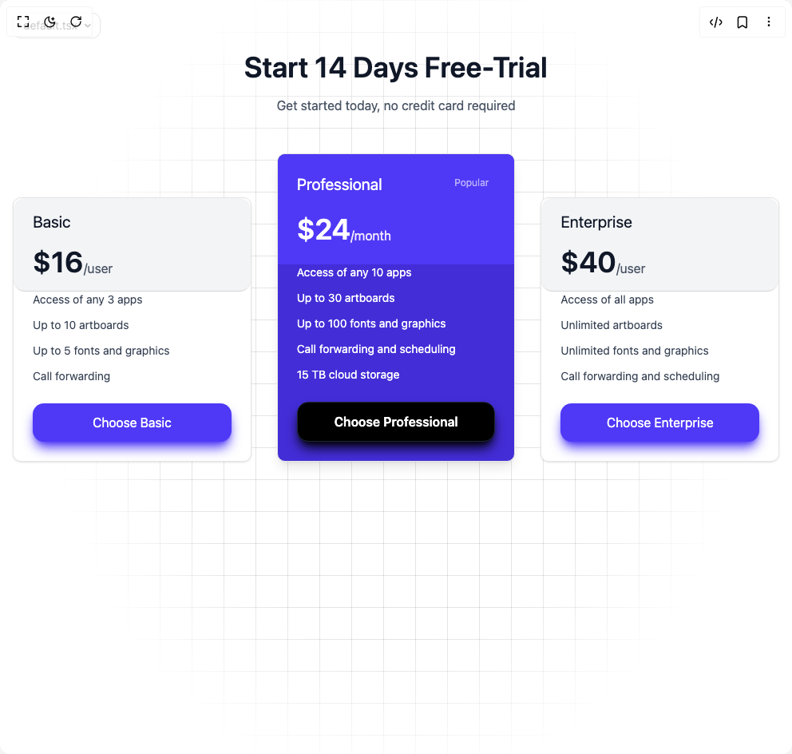

# Build Pricing Section 2 in BuilderStudio

> Build this component in our Agentic IDE: [BuilderStudio](https://builderstudio.dev).
>
> Join the BuilderStudio community on [Discord](https://discord.gg/QdWeSGCqfe) and [Reddit](https://reddit.com/r/builderstudio).



## Component

- Author group: `ui-layouts`
- Component: `pricing-section-2`
- Variant: `default`
- Rendered HTML snapshot: [`rendered.html`](rendered.html)

## BuilderStudio prompt

You are implementing a React component based on a component reference.

## Component identity

- Author: ui-layouts
- Component slug: pricing-section-2
- Demo slug: default
- Title: pricing-section-2
- Description: 

## Goal

Recreate this component in a React + TypeScript + Tailwind CSS project. Preserve the visual layout, spacing, colors, border radius, shadows, interaction behavior, animation behavior, responsive behavior, and dark mode behavior shown in the rendered demo.

## Implementation requirements

- Use React and TypeScript.
- Use Tailwind CSS classes whenever possible.
- Keep the component self-contained unless the source files require helper components.
- If the source uses CSS variables, custom CSS, animations, or keyframes, include them.
- If the source uses external packages, list and use the required packages.
- Preserve accessibility attributes, button semantics, links, keyboard behavior, and ARIA attributes when visible in the source.
- Do not replace the component with a simplified placeholder.
- Return complete production-ready code.

## Dependencies

No reference metadata available.

## Rendered DOM snapshot

This is the rendered demo HTML extracted from the live preview. Use it to verify structure, class names, visible content, and layout.

```html
<div id="root"><div class="w-screen min-h-screen flex justify-center items-center"><div class="fixed top-4 left-4 z-10"><select class="appearance-none h-8 max-w-[200px] text-sm leading-tight rounded-lg pl-3 pr-7 py-0 border bg-background focus:outline-none focus:ring-0"><option value="default.tsx_DemoOne">default.tsx</option></select><div class="absolute top-1/2 transform -translate-y-1/2 right-2 pointer-events-none"><svg class="w-4 h-4 fill-current" viewBox="0 0 20 20"><path d="M5.516 7.548c.436-.446 1.043-.48 1.576 0L10 10.405l2.908-2.857c.533-.48 1.14-.446 1.576 0 .436.445.408 1.197 0 1.615l-3.734 3.705c-.533.534-1.39.534-1.923 0l-3.734-3.705c-.408-.418-.436-1.17 0-1.615z"></path></svg></div></div><div class="w-screen min-h-screen flex justify-center items-center"><section class="py-16 px-4 bg-white w-full relative min-h-screen"><div class="absolute bottom-0 left-0 right-0 top-0 bg-[linear-gradient(to_right,#0000001a_1px,transparent_1px),linear-gradient(to_bottom,#0000001a_1px,transparent_1px)] bg-[size:40px_40px] [mask-image:radial-gradient(ellipse_40%_50%_at_50%_50%,#000_70%,transparent_110%)]"></div><div class="max-w-6xl mx-auto"><article class="text-center mb-12"><h2 class="text-4xl font-semibold text-gray-900 mb-4"><span class="justify-center flex flex-wrap whitespace-pre-wrap"><span class="sr-only">Start 14 Days Free-Trial</span><span aria-hidden="true" class="inline-flex overflow-hidden"><span class="whitespace-pre-wrap relative"><span class="inline-block" style="transform: none;">Start</span></span><span> </span></span><span aria-hidden="true" class="inline-flex overflow-hidden"><span class="whitespace-pre-wrap relative"><span class="inline-block" style="transform: none;">14</span></span><span> </span></span><span aria-hidden="true" class="inline-flex overflow-hidden"><span class="whitespace-pre-wrap relative"><span class="inline-block" style="transform: none;">Days</span></span><span> </span></span><span aria-hidden="true" class="inline-flex overflow-hidden"><span class="whitespace-pre-wrap relative"><span class="inline-block" style="transform: none;">Free-Trial</span></span></span></span></h2><p class="text-gray-600" style="filter: blur(0px); opacity: 1; transform: none;">Get started today, no credit card required</p></article><div class="grid md:grid-cols-3 md:gap-8 gap-3 items-end"><div style="filter: blur(0px); opacity: 1; transform: none;"><div class="rounded-lg border text-card-foreground shadow-sm bg-white p-0 h-fit border-neutral-200"><div class="flex flex-col space-y-1.5 p-6 text-left py-4 border-b bg-gray-100 border-neutral-300 rounded-xl"><h3 class="text-xl text-gray-900 mb-4">Basic</h3><div class="flex justify-start items-end"><span class="text-4xl font-semibold text-gray-900">$16</span><span class="text-gray-600">/user</span></div></div><div class="p-6 pt-0 pb-6"><ul class="space-y-3 mb-6"><li class="text-sm text-gray-700">Access of any 3 apps</li><li class="text-sm text-gray-700">Up to 10 artboards</li><li class="text-sm text-gray-700">Up to 5 fonts and graphics</li><li class="text-sm text-gray-700">Call forwarding</li></ul><button class="w-full p-3 rounded-xl bg-indigo-600 shadow-lg shadow-indigo-600 text-white hover:bg-indigo-700">Choose Basic</button></div></div></div><div style="filter: blur(0px); opacity: 1; transform: none;"><div class="border text-card-foreground bg-indigo-700 p-0 rounded-lg shadow-lg relative h-fit border-neutral-200"><div class="flex flex-col space-y-1.5 p-6 bg-indigo-600 rounded-t-lg py-6"><div class="flex gap-2 justify-between"><h3 class="text-xl text-white mb-4">Professional</h3><span class="text-white/60 px-2 py-1 text-xs">Popular</span></div><div class="w-full justify-start flex items-end"><span class="text-4xl font-semibold text-white">$24</span><span class="text-purple-100">/month</span></div></div><div class="p-6 pt-0 pb-6"><ul class="space-y-3 mb-6"><li class="text-sm text-white">Access of any 10 apps</li><li class="text-sm text-white">Up to 30 artboards</li><li class="text-sm text-white">Up to 100 fonts and graphics</li><li class="text-sm text-white">Call forwarding and scheduling</li><li class="text-sm text-white">15 TB cloud storage</li></ul><button class="w-full p-3 border border-gray-800 shadow-lg shadow-black font-semibold  rounded-xl bg-black text-white hover:bg-gray-800">Choose Professional</button></div></div></div><div style="filter: blur(0px); opacity: 1; transform: none;"><div class="rounded-lg border text-card-foreground shadow-sm bg-white p-0 border-neutral-200"><div class="flex flex-col space-y-1.5 p-6 text-left py-4 border-b bg-gray-100 rounded-xl border-neutral-300"><h3 class="text-xl text-gray-900 mb-4">Enterprise</h3><div class="flex justify-start items-end"><span class="text-4xl font-semibold text-gray-900">$40</span><span class="text-gray-600">/user</span></div></div><div class="p-6 pt-0 pb-6"><ul class="space-y-3 mb-6"><li class="text-sm text-gray-700">Access of all apps</li><li class="text-sm text-gray-700">Unlimited artboards</li><li class="text-sm text-gray-700">Unlimited fonts and graphics</li><li class="text-sm text-gray-700">Call forwarding and scheduling</li></ul><button class="w-full p-3 rounded-xl bg-indigo-600 shadow-lg shadow-indigo-600 text-white hover:bg-indigo-700">Choose Enterprise</button></div></div></div></div></div></section></div></div></div>
```

## Reference source files

No reference source files were available.
