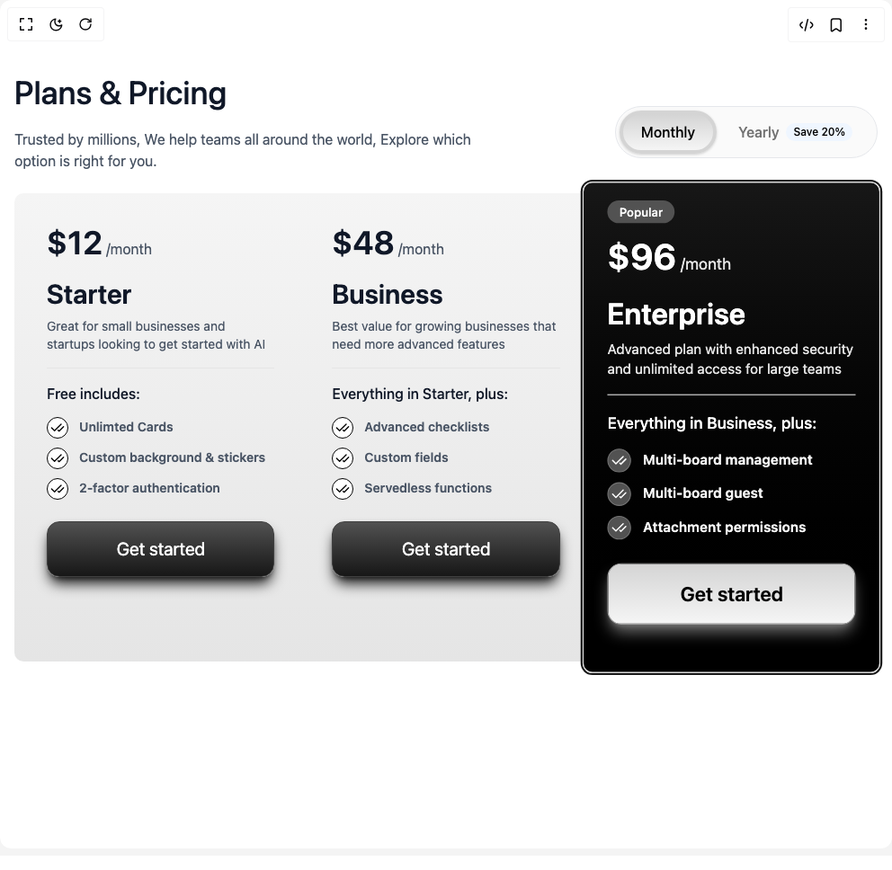

# Build Pricing Section 3 in BuilderStudio

> Build this component in our Agentic IDE: [BuilderStudio](https://builderstudio.dev).
>
> Join the BuilderStudio community on [Discord](https://discord.gg/QdWeSGCqfe) and [Reddit](https://reddit.com/r/builderstudio).



## Component

- Author group: `ui-layouts`
- Component: `pricing-section-3`
- Variant: `default`
- Rendered HTML snapshot: [`rendered.html`](rendered.html)

## BuilderStudio prompt

You are implementing a React component based on a component reference.

## Component identity

- Author: ui-layouts
- Component slug: pricing-section-3
- Demo slug: default
- Title: pricing-section-3
- Description: 

## Goal

Recreate this component in a React + TypeScript + Tailwind CSS project. Preserve the visual layout, spacing, colors, border radius, shadows, interaction behavior, animation behavior, responsive behavior, and dark mode behavior shown in the rendered demo.

## Implementation requirements

- Use React and TypeScript.
- Use Tailwind CSS classes whenever possible.
- Keep the component self-contained unless the source files require helper components.
- If the source uses CSS variables, custom CSS, animations, or keyframes, include them.
- If the source uses external packages, list and use the required packages.
- Preserve accessibility attributes, button semantics, links, keyboard behavior, and ARIA attributes when visible in the source.
- Do not replace the component with a simplified placeholder.
- Return complete production-ready code.

## Dependencies

No reference metadata available.

## Rendered DOM snapshot

This is the rendered demo HTML extracted from the live preview. Use it to verify structure, class names, visible content, and layout.

```html
<div id="root"><div class="w-screen min-h-screen flex justify-center items-center"><div class="w-screen min-h-screen flex justify-center items-center"><div class="bg-white w-full"><div class="px-4 pt-20 min-h-screen  max-w-7xl  mx-auto relative"><article class="flex sm:flex-row flex-col sm:pb-0 pb-4 sm:items-center items-start justify-between"><div class="text-left mb-6"><h2 class="text-4xl font-medium leading-[130%] text-gray-900 mb-4"><span class="justify-start flex flex-wrap whitespace-pre-wrap"><span class="sr-only">Plans &amp; Pricing</span><span aria-hidden="true" class="inline-flex overflow-hidden"><span class="whitespace-pre-wrap relative"><span class="inline-block" style="transform: none;">Plans</span></span><span> </span></span><span aria-hidden="true" class="inline-flex overflow-hidden"><span class="whitespace-pre-wrap relative"><span class="inline-block" style="transform: none;">&amp;</span></span><span> </span></span><span aria-hidden="true" class="inline-flex overflow-hidden"><span class="whitespace-pre-wrap relative"><span class="inline-block" style="transform: none;">Pricing</span></span></span></span></h2><p class="text-gray-600 w-[80%]" style="filter: blur(0px); opacity: 1; transform: none;">Trusted by millions, We help teams all around the world, Explore which option is right for you.</p></div><div style="filter: blur(0px); opacity: 1; transform: none;"><div class="flex justify-center shrink-0"><div class="relative z-10 mx-auto flex w-fit rounded-full bg-neutral-50 border border-gray-200 p-1"><button class="relative z-10 w-fit sm:h-12 cursor-pointer h-10 rounded-full sm:px-6 px-3 sm:py-2 py-1 font-medium transition-colors text-black"><span class="absolute top-0 left-0 sm:h-12 h-10 w-full rounded-full border-4 shadow-sm shadow-neutral-300 border-neutral-300 bg-gradient-to-t from-neutral-100 via-neutral-200 to-neutral-300" style="opacity: 1;"></span><span class="relative">Monthly</span></button><button class="relative z-10 w-fit cursor-pointer sm:h-12 h-10 flex-shrink-0 rounded-full sm:px-6 px-3 sm:py-2 py-1 font-medium transition-colors text-muted-foreground hover:text-black"><span class="relative flex items-center gap-2">Yearly<span class="rounded-full bg-blue-50 px-2 py-0.5 text-xs font-medium text-black">Save 20%</span></span></button></div></div></div></article><div class="grid md:grid-cols-3 gap-4 mx-auto  bg-gradient-to-b from-neutral-100 to-neutral-200 sm:p-3 rounded-lg" style="filter: blur(0px); opacity: 1; transform: none;"><div style="filter: blur(0px); opacity: 1; transform: none;"><div class="rounded-lg border relative flex-col flex justify-between border-none shadow-none bg-transparent pt-4 text-gray-900"><div class="p-6 pt-0"><div class="space-y-2 pb-3"><div class="flex items-baseline"><span class="text-4xl font-semibold ">$<number-flow-react class="text-4xl font-semibold"></number-flow-react></span><span class="text-gray-600 ml-1">/month</span></div></div><div class="flex justify-between"><h3 class="text-3xl font-semibold mb-2">Starter</h3></div><p class="text-sm text-gray-600 mb-4">Great for small businesses and startups looking to get started with AI</p><div class="space-y-3 pt-4 border-t border-neutral-200"><h4 class="font-medium text-base  mb-3">Free includes:</h4><ul class="space-y-2 font-semibold"><li class="flex items-center"><span class="text-black h-6 w-6 bg-white border border-black rounded-full grid place-content-center mt-0.5 mr-3"><svg xmlns="http://www.w3.org/2000/svg" width="24" height="24" viewBox="0 0 24 24" fill="none" stroke="currentColor" stroke-width="2" stroke-linecap="round" stroke-linejoin="round" class="lucide lucide-check-check h-4 w-4" aria-hidden="true"><path d="M18 6 7 17l-5-5"></path><path d="m22 10-7.5 7.5L13 16"></path></svg></span><span class="text-sm text-gray-600">Unlimted Cards</span></li><li class="flex items-center"><span class="text-black h-6 w-6 bg-white border border-black rounded-full grid place-content-center mt-0.5 mr-3"><svg xmlns="http://www.w3.org/2000/svg" width="24" height="24" viewBox="0 0 24 24" fill="none" stroke="currentColor" stroke-width="2" stroke-linecap="round" stroke-linejoin="round" class="lucide lucide-check-check h-4 w-4" aria-hidden="true"><path d="M18 6 7 17l-5-5"></path><path d="m22 10-7.5 7.5L13 16"></path></svg></span><span class="text-sm text-gray-600">Custom background &amp; stickers</span></li><li class="flex items-center"><span class="text-black h-6 w-6 bg-white border border-black rounded-full grid place-content-center mt-0.5 mr-3"><svg xmlns="http://www.w3.org/2000/svg" width="24" height="24" viewBox="0 0 24 24" fill="none" stroke="currentColor" stroke-width="2" stroke-linecap="round" stroke-linejoin="round" class="lucide lucide-check-check h-4 w-4" aria-hidden="true"><path d="M18 6 7 17l-5-5"></path><path d="m22 10-7.5 7.5L13 16"></path></svg></span><span class="text-sm text-gray-600">2-factor authentication</span></li></ul></div></div><div class="flex items-center p-6 pt-0"><button class="w-full mb-6 p-4 text-xl rounded-xl bg-gradient-to-t from-neutral-900 to-neutral-600  shadow-lg shadow-neutral-900 border border-neutral-700 text-white">Get started</button></div></div></div><div style="filter: blur(0px); opacity: 1; transform: none;"><div class="rounded-lg border relative flex-col flex justify-between border-none shadow-none bg-transparent pt-4 text-gray-900"><div class="p-6 pt-0"><div class="space-y-2 pb-3"><div class="flex items-baseline"><span class="text-4xl font-semibold ">$<number-flow-react class="text-4xl font-semibold"></number-flow-react></span><span class="text-gray-600 ml-1">/month</span></div></div><div class="flex justify-between"><h3 class="text-3xl font-semibold mb-2">Business</h3></div><p class="text-sm text-gray-600 mb-4">Best value for growing businesses that need more advanced features</p><div class="space-y-3 pt-4 border-t border-neutral-200"><h4 class="font-medium text-base  mb-3">Everything in Starter, plus:</h4><ul class="space-y-2 font-semibold"><li class="flex items-center"><span class="text-black h-6 w-6 bg-white border border-black rounded-full grid place-content-center mt-0.5 mr-3"><svg xmlns="http://www.w3.org/2000/svg" width="24" height="24" viewBox="0 0 24 24" fill="none" stroke="currentColor" stroke-width="2" stroke-linecap="round" stroke-linejoin="round" class="lucide lucide-check-check h-4 w-4" aria-hidden="true"><path d="M18 6 7 17l-5-5"></path><path d="m22 10-7.5 7.5L13 16"></path></svg></span><span class="text-sm text-gray-600">Advanced checklists</span></li><li class="flex items-center"><span class="text-black h-6 w-6 bg-white border border-black rounded-full grid place-content-center mt-0.5 mr-3"><svg xmlns="http://www.w3.org/2000/svg" width="24" height="24" viewBox="0 0 24 24" fill="none" stroke="currentColor" stroke-width="2" stroke-linecap="round" stroke-linejoin="round" class="lucide lucide-check-check h-4 w-4" aria-hidden="true"><path d="M18 6 7 17l-5-5"></path><path d="m22 10-7.5 7.5L13 16"></path></svg></span><span class="text-sm text-gray-600">Custom fields</span></li><li class="flex items-center"><span class="text-black h-6 w-6 bg-white border border-black rounded-full grid place-content-center mt-0.5 mr-3"><svg xmlns="http://www.w3.org/2000/svg" width="24" height="24" viewBox="0 0 24 24" fill="none" stroke="currentColor" stroke-width="2" stroke-linecap="round" stroke-linejoin="round" class="lucide lucide-check-check h-4 w-4" aria-hidden="true"><path d="M18 6 7 17l-5-5"></path><path d="m22 10-7.5 7.5L13 16"></path></svg></span><span class="text-sm text-gray-600">Servedless functions</span></li></ul></div></div><div class="flex items-center p-6 pt-0"><button class="w-full mb-6 p-4 text-xl rounded-xl bg-gradient-to-t from-neutral-900 to-neutral-600  shadow-lg shadow-neutral-900 border border-neutral-700 text-white">Get started</button></div></div></div><div style="filter: blur(0px); opacity: 1; transform: none;"><div class="rounded-lg border shadow-sm relative flex-col flex justify-between scale-110 ring-2 ring-neutral-900 bg-gradient-to-t from-black to-neutral-900 text-white"><div class="p-6 pt-0"><div class="space-y-2 pb-3"><div class="pt-4"><span class="bg-neutral-600 text-white px-3 py-1 rounded-full text-xs font-medium">Popular</span></div><div class="flex items-baseline"><span class="text-4xl font-semibold ">$<number-flow-react class="text-4xl font-semibold"></number-flow-react></span><span class="text-neutral-200 ml-1">/month</span></div></div><div class="flex justify-between"><h3 class="text-3xl font-semibold mb-2">Enterprise</h3></div><p class="text-sm text-neutral-200 mb-4">Advanced plan with enhanced security and unlimited access for large teams</p><div class="space-y-3 pt-4 border-t border-neutral-200"><h4 class="font-medium text-base  mb-3">Everything in Business, plus:</h4><ul class="space-y-2 font-semibold"><li class="flex items-center"><span class="text-white h-6 w-6 bg-neutral-600 border border-neutral-500 rounded-full grid place-content-center mt-0.5 mr-3"><svg xmlns="http://www.w3.org/2000/svg" width="24" height="24" viewBox="0 0 24 24" fill="none" stroke="currentColor" stroke-width="2" stroke-linecap="round" stroke-linejoin="round" class="lucide lucide-check-check h-4 w-4" aria-hidden="true"><path d="M18 6 7 17l-5-5"></path><path d="m22 10-7.5 7.5L13 16"></path></svg></span><span class="text-sm text-neutral-100">Multi-board management</span></li><li class="flex items-center"><span class="text-white h-6 w-6 bg-neutral-600 border border-neutral-500 rounded-full grid place-content-center mt-0.5 mr-3"><svg xmlns="http://www.w3.org/2000/svg" width="24" height="24" viewBox="0 0 24 24" fill="none" stroke="currentColor" stroke-width="2" stroke-linecap="round" stroke-linejoin="round" class="lucide lucide-check-check h-4 w-4" aria-hidden="true"><path d="M18 6 7 17l-5-5"></path><path d="m22 10-7.5 7.5L13 16"></path></svg></span><span class="text-sm text-neutral-100">Multi-board guest</span></li><li class="flex items-center"><span class="text-white h-6 w-6 bg-neutral-600 border border-neutral-500 rounded-full grid place-content-center mt-0.5 mr-3"><svg xmlns="http://www.w3.org/2000/svg" width="24" height="24" viewBox="0 0 24 24" fill="none" stroke="currentColor" stroke-width="2" stroke-linecap="round" stroke-linejoin="round" class="lucide lucide-check-check h-4 w-4" aria-hidden="true"><path d="M18 6 7 17l-5-5"></path><path d="m22 10-7.5 7.5L13 16"></path></svg></span><span class="text-sm text-neutral-100">Attachment permissions</span></li></ul></div></div><div class="flex items-center p-6 pt-0"><button class="w-full mb-6 p-4 text-xl rounded-xl bg-gradient-to-t from-neutral-100 to-neutral-300 font-semibold shadow-lg shadow-neutral-500 border border-neutral-400 text-black">Get started</button></div></div></div></div></div>;</div></div></div></div>
```

## Reference source files

No reference source files were available.
