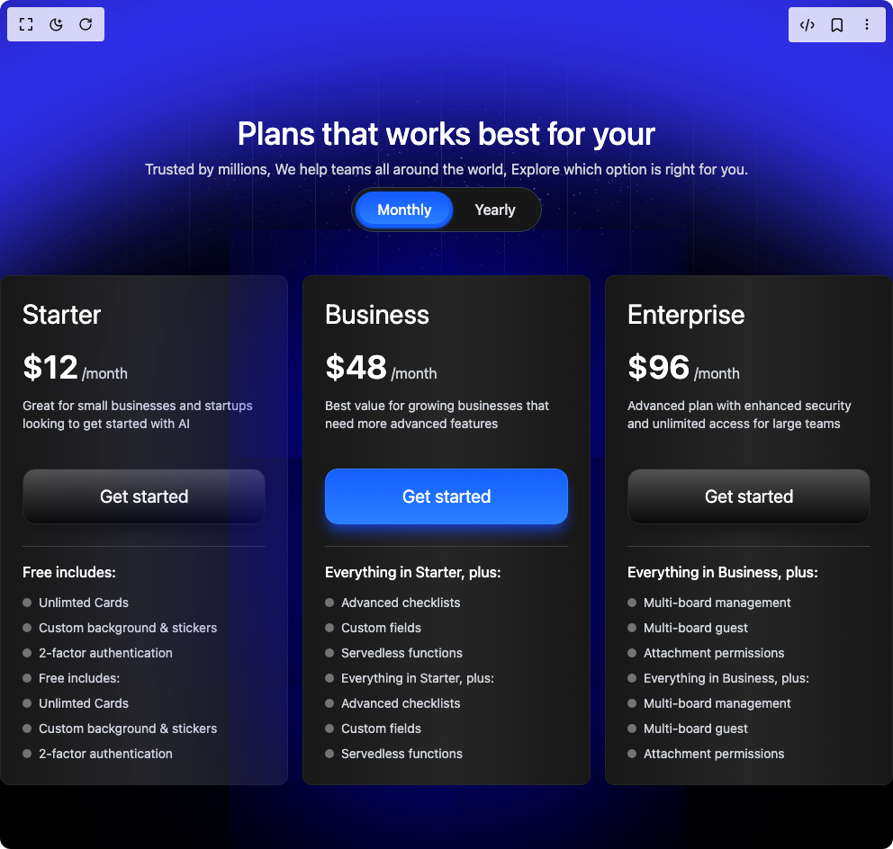

# Build Pricing Section 4 in BuilderStudio

> Build this component in our Agentic IDE: [BuilderStudio](https://builderstudio.dev).
>
> Join the BuilderStudio community on [Discord](https://discord.gg/QdWeSGCqfe) and [Reddit](https://reddit.com/r/builderstudio).



## Component

- Author group: `ui-layouts`
- Component: `pricing-section-4`
- Variant: `default`
- Rendered HTML snapshot: [`rendered.html`](rendered.html)

## BuilderStudio prompt

You are implementing a React component based on a component reference.

## Component identity

- Author: ui-layouts
- Component slug: pricing-section-4
- Demo slug: default
- Title: pricing-section-4
- Description: 

## Goal

Recreate this component in a React + TypeScript + Tailwind CSS project. Preserve the visual layout, spacing, colors, border radius, shadows, interaction behavior, animation behavior, responsive behavior, and dark mode behavior shown in the rendered demo.

## Implementation requirements

- Use React and TypeScript.
- Use Tailwind CSS classes whenever possible.
- Keep the component self-contained unless the source files require helper components.
- If the source uses CSS variables, custom CSS, animations, or keyframes, include them.
- If the source uses external packages, list and use the required packages.
- Preserve accessibility attributes, button semantics, links, keyboard behavior, and ARIA attributes when visible in the source.
- Do not replace the component with a simplified placeholder.
- Return complete production-ready code.

## Dependencies

No reference metadata available.

## Rendered DOM snapshot

This is the rendered demo HTML extracted from the live preview. Use it to verify structure, class names, visible content, and layout.

```html
<div id="root"><div class="w-screen min-h-screen flex justify-center items-center"><div class="w-screen min-h-screen flex justify-center items-center"><div class="w-full"><div class=" min-h-screen  mx-auto relative bg-black overflow-x-hidden"><div class="absolute top-0  h-96 w-screen overflow-hidden [mask-image:radial-gradient(50%_50%,white,transparent)] " style="filter: blur(0px); opacity: 1; transform: none;"><div class="absolute bottom-0 left-0 right-0 top-0 bg-[linear-gradient(to_right,#ffffff2c_1px,transparent_1px),linear-gradient(to_bottom,#3a3a3a01_1px,transparent_1px)] bg-[size:70px_80px] "></div><div id="«r0»" class="absolute inset-x-0 bottom-0 h-full w-full [mask-image:radial-gradient(50%_50%,white,transparent_85%)]"><canvas data-generated="true" style="width: 100% !important; height: 100% !important; pointer-events: none;" aria-hidden="true" height="384" width="992" pointer-events="none"></canvas></div></div><div class="absolute left-0 top-[-114px] w-full h-[113.625vh] flex flex-col items-start justify-start content-start flex-none flex-nowrap gap-2.5 overflow-hidden p-0 z-0" style="filter: blur(0px); opacity: 1; transform: none;"><div class="framer-1i5axl2"><div class="absolute left-[-568px] right-[-568px] top-0 h-[2053px] flex-none rounded-full" data-border="true" data-framer-name="Ellipse 1" style="border: 200px solid rgb(49, 49, 245); filter: blur(92px);"></div><div class="absolute left-[-568px] right-[-568px] top-0 h-[2053px] flex-none rounded-full" data-border="true" data-framer-name="Ellipse 2" style="border: 200px solid rgb(49, 49, 245); filter: blur(92px);"></div></div></div><article class="text-center mb-6 pt-32 max-w-3xl mx-auto space-y-2 relative z-50"><h2 class="text-4xl font-medium text-white"><span class="justify-center flex flex-wrap whitespace-pre-wrap"><span class="sr-only">Plans that works best for your</span><span aria-hidden="true" class="inline-flex overflow-hidden"><span class="whitespace-pre-wrap relative"><span class="inline-block" style="transform: none;">Plans</span></span><span> </span></span><span aria-hidden="true" class="inline-flex overflow-hidden"><span class="whitespace-pre-wrap relative"><span class="inline-block" style="transform: none;">that</span></span><span> </span></span><span aria-hidden="true" class="inline-flex overflow-hidden"><span class="whitespace-pre-wrap relative"><span class="inline-block" style="transform: none;">works</span></span><span> </span></span><span aria-hidden="true" class="inline-flex overflow-hidden"><span class="whitespace-pre-wrap relative"><span class="inline-block" style="transform: none;">best</span></span><span> </span></span><span aria-hidden="true" class="inline-flex overflow-hidden"><span class="whitespace-pre-wrap relative"><span class="inline-block" style="transform: none;">for</span></span><span> </span></span><span aria-hidden="true" class="inline-flex overflow-hidden"><span class="whitespace-pre-wrap relative"><span class="inline-block" style="transform: none;">your</span></span></span></span></h2><p class="text-gray-300" style="filter: blur(0px); opacity: 1; transform: none;">Trusted by millions, We help teams all around the world, Explore which option is right for you.</p><div style="filter: blur(0px); opacity: 1; transform: none;"><div class="flex justify-center"><div class="relative z-10 mx-auto flex w-fit rounded-full bg-neutral-900 border border-gray-700 p-1"><button class="relative z-10 w-fit h-10 rounded-full sm:px-6 px-3 sm:py-2 py-1 font-medium transition-colors text-white"><span class="absolute top-0 left-0 h-10 w-full rounded-full border-4 shadow-sm shadow-blue-600 border-blue-600 bg-gradient-to-t from-blue-500 to-blue-600" style="opacity: 1;"></span><span class="relative">Monthly</span></button><button class="relative z-10 w-fit h-10 flex-shrink-0 rounded-full sm:px-6 px-3 sm:py-2 py-1 font-medium transition-colors text-gray-200"><span class="relative flex items-center gap-2">Yearly</span></button></div></div></div></article><div class="absolute top-0 left-[10%] right-[10%] w-[80%] h-full z-0" style="background-image: radial-gradient(circle, rgb(32, 108, 232) 0%, transparent 70%); opacity: 0.6; mix-blend-mode: multiply;"></div><div class="grid md:grid-cols-3 max-w-5xl gap-4 py-6 mx-auto "><div style="filter: blur(0px); opacity: 1; transform: none;"><div class="rounded-lg border shadow-sm relative text-white border-neutral-800 bg-gradient-to-r from-neutral-900 via-neutral-800 to-neutral-900 z-10"><div class="flex flex-col space-y-1.5 p-6 text-left"><div class="flex justify-between"><h3 class="text-3xl mb-2">Starter</h3></div><div class="flex items-baseline"><span class="text-4xl font-semibold ">$<number-flow-react class="text-4xl font-semibold"></number-flow-react></span><span class="text-gray-300 ml-1">/month</span></div><p class="text-sm text-gray-300 mb-4">Great for small businesses and startups looking to get started with AI</p></div><div class="p-6 pt-0"><button class="w-full mb-6 p-4 text-xl rounded-xl bg-gradient-to-t from-neutral-950 to-neutral-600  shadow-lg shadow-neutral-900 border border-neutral-800 text-white">Get started</button><div class="space-y-3 pt-4 border-t border-neutral-700"><h4 class="font-medium text-base mb-3">Free includes:</h4><ul class="space-y-2"><li class="flex items-center gap-2"><span class="h-2.5 w-2.5 bg-neutral-500 rounded-full grid place-content-center"></span><span class="text-sm text-gray-300">Unlimted Cards</span></li><li class="flex items-center gap-2"><span class="h-2.5 w-2.5 bg-neutral-500 rounded-full grid place-content-center"></span><span class="text-sm text-gray-300">Custom background &amp; stickers</span></li><li class="flex items-center gap-2"><span class="h-2.5 w-2.5 bg-neutral-500 rounded-full grid place-content-center"></span><span class="text-sm text-gray-300">2-factor authentication</span></li><li class="flex items-center gap-2"><span class="h-2.5 w-2.5 bg-neutral-500 rounded-full grid place-content-center"></span><span class="text-sm text-gray-300">Free includes:</span></li><li class="flex items-center gap-2"><span class="h-2.5 w-2.5 bg-neutral-500 rounded-full grid place-content-center"></span><span class="text-sm text-gray-300">Unlimted Cards</span></li><li class="flex items-center gap-2"><span class="h-2.5 w-2.5 bg-neutral-500 rounded-full grid place-content-center"></span><span class="text-sm text-gray-300">Custom background &amp; stickers</span></li><li class="flex items-center gap-2"><span class="h-2.5 w-2.5 bg-neutral-500 rounded-full grid place-content-center"></span><span class="text-sm text-gray-300">2-factor authentication</span></li></ul></div></div></div></div><div style="filter: blur(0px); opacity: 1; transform: none;"><div class="rounded-lg border relative text-white border-neutral-800 bg-gradient-to-r from-neutral-900 via-neutral-800 to-neutral-900 shadow-[0px_-13px_300px_0px_#0900ff] z-20"><div class="flex flex-col space-y-1.5 p-6 text-left"><div class="flex justify-between"><h3 class="text-3xl mb-2">Business</h3></div><div class="flex items-baseline"><span class="text-4xl font-semibold ">$<number-flow-react class="text-4xl font-semibold"></number-flow-react></span><span class="text-gray-300 ml-1">/month</span></div><p class="text-sm text-gray-300 mb-4">Best value for growing businesses that need more advanced features</p></div><div class="p-6 pt-0"><button class="w-full mb-6 p-4 text-xl rounded-xl bg-gradient-to-t from-blue-500 to-blue-600  shadow-lg shadow-blue-800 border border-blue-500 text-white">Get started</button><div class="space-y-3 pt-4 border-t border-neutral-700"><h4 class="font-medium text-base mb-3">Everything in Starter, plus:</h4><ul class="space-y-2"><li class="flex items-center gap-2"><span class="h-2.5 w-2.5 bg-neutral-500 rounded-full grid place-content-center"></span><span class="text-sm text-gray-300">Advanced checklists</span></li><li class="flex items-center gap-2"><span class="h-2.5 w-2.5 bg-neutral-500 rounded-full grid place-content-center"></span><span class="text-sm text-gray-300">Custom fields</span></li><li class="flex items-center gap-2"><span class="h-2.5 w-2.5 bg-neutral-500 rounded-full grid place-content-center"></span><span class="text-sm text-gray-300">Servedless functions</span></li><li class="flex items-center gap-2"><span class="h-2.5 w-2.5 bg-neutral-500 rounded-full grid place-content-center"></span><span class="text-sm text-gray-300">Everything in Starter, plus:</span></li><li class="flex items-center gap-2"><span class="h-2.5 w-2.5 bg-neutral-500 rounded-full grid place-content-center"></span><span class="text-sm text-gray-300">Advanced checklists</span></li><li class="flex items-center gap-2"><span class="h-2.5 w-2.5 bg-neutral-500 rounded-full grid place-content-center"></span><span class="text-sm text-gray-300">Custom fields</span></li><li class="flex items-center gap-2"><span class="h-2.5 w-2.5 bg-neutral-500 rounded-full grid place-content-center"></span><span class="text-sm text-gray-300">Servedless functions</span></li></ul></div></div></div></div><div style="filter: blur(0px); opacity: 1; transform: none;"><div class="rounded-lg border shadow-sm relative text-white border-neutral-800 bg-gradient-to-r from-neutral-900 via-neutral-800 to-neutral-900 z-10"><div class="flex flex-col space-y-1.5 p-6 text-left"><div class="flex justify-between"><h3 class="text-3xl mb-2">Enterprise</h3></div><div class="flex items-baseline"><span class="text-4xl font-semibold ">$<number-flow-react class="text-4xl font-semibold"></number-flow-react></span><span class="text-gray-300 ml-1">/month</span></div><p class="text-sm text-gray-300 mb-4">Advanced plan with enhanced security and unlimited access for large teams</p></div><div class="p-6 pt-0"><button class="w-full mb-6 p-4 text-xl rounded-xl bg-gradient-to-t from-neutral-950 to-neutral-600  shadow-lg shadow-neutral-900 border border-neutral-800 text-white">Get started</button><div class="space-y-3 pt-4 border-t border-neutral-700"><h4 class="font-medium text-base mb-3">Everything in Business, plus:</h4><ul class="space-y-2"><li class="flex items-center gap-2"><span class="h-2.5 w-2.5 bg-neutral-500 rounded-full grid place-content-center"></span><span class="text-sm text-gray-300">Multi-board management</span></li><li class="flex items-center gap-2"><span class="h-2.5 w-2.5 bg-neutral-500 rounded-full grid place-content-center"></span><span class="text-sm text-gray-300">Multi-board guest</span></li><li class="flex items-center gap-2"><span class="h-2.5 w-2.5 bg-neutral-500 rounded-full grid place-content-center"></span><span class="text-sm text-gray-300">Attachment permissions</span></li><li class="flex items-center gap-2"><span class="h-2.5 w-2.5 bg-neutral-500 rounded-full grid place-content-center"></span><span class="text-sm text-gray-300">Everything in Business, plus:</span></li><li class="flex items-center gap-2"><span class="h-2.5 w-2.5 bg-neutral-500 rounded-full grid place-content-center"></span><span class="text-sm text-gray-300">Multi-board management</span></li><li class="flex items-center gap-2"><span class="h-2.5 w-2.5 bg-neutral-500 rounded-full grid place-content-center"></span><span class="text-sm text-gray-300">Multi-board guest</span></li><li class="flex items-center gap-2"><span class="h-2.5 w-2.5 bg-neutral-500 rounded-full grid place-content-center"></span><span class="text-sm text-gray-300">Attachment permissions</span></li></ul></div></div></div></div></div></div></div></div></div></div>
```

## Reference source files

No reference source files were available.
