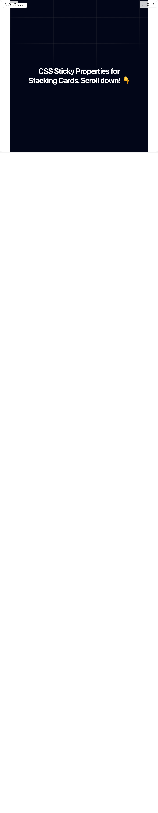

# Build Scroll Card in BuilderStudio

> Build this component in our Agentic IDE: [BuilderStudio](https://builderstudio.dev).
>
> Join the BuilderStudio community on [Discord](https://discord.gg/QdWeSGCqfe) and [Reddit](https://reddit.com/r/builderstudio).



## Component

- Author group: `ui-layouts`
- Component: `scroll-card`
- Variant: `default`
- Rendered HTML snapshot: [`rendered.html`](rendered.html)

## BuilderStudio prompt

You are implementing a React component based on a component reference.

## Component identity

- Author: ui-layouts
- Component slug: scroll-card
- Demo slug: default
- Title: scroll-card
- Description: 

## Goal

Recreate this component in a React + TypeScript + Tailwind CSS project. Preserve the visual layout, spacing, colors, border radius, shadows, interaction behavior, animation behavior, responsive behavior, and dark mode behavior shown in the rendered demo.

## Implementation requirements

- Use React and TypeScript.
- Use Tailwind CSS classes whenever possible.
- Keep the component self-contained unless the source files require helper components.
- If the source uses CSS variables, custom CSS, animations, or keyframes, include them.
- If the source uses external packages, list and use the required packages.
- Preserve accessibility attributes, button semantics, links, keyboard behavior, and ARIA attributes when visible in the source.
- Do not replace the component with a simplified placeholder.
- Return complete production-ready code.

## Dependencies

No reference metadata available.

## Rendered DOM snapshot

This is the rendered demo HTML extracted from the live preview. Use it to verify structure, class names, visible content, and layout.

```html
<div id="root"><div class="fixed top-4 left-4 z-10"><select class="appearance-none h-8 max-w-[200px] text-sm leading-tight rounded-lg pl-3 pr-7 py-0 border bg-background focus:outline-none focus:ring-0"><option value="named_DemoOne_ComponentDemo">ComponentDemo</option></select><div class="absolute top-1/2 transform -translate-y-1/2 right-2 pointer-events-none"><svg class="w-4 h-4 fill-current" viewBox="0 0 20 20"><path d="M5.516 7.548c.436-.446 1.043-.48 1.576 0L10 10.405l2.908-2.857c.533-.48 1.14-.446 1.576 0 .436.445.408 1.197 0 1.615l-3.734 3.705c-.533.534-1.39.534-1.923 0l-3.734-3.705c-.408-.418-.436-1.17 0-1.615z"></path></svg></div></div><div class="w-screen min-h-screen flex justify-center items-center"><main class="bg-black"><div class="wrapper"><section class="text-white h-screen w-full bg-slate-950 grid place-content-center sticky top-0"><div class="absolute bottom-0 left-0 right-0 top-0 bg-[linear-gradient(to_right,#4f4f4f2e_1px,transparent_1px),linear-gradient(to_bottom,#4f4f4f2e_1px,transparent_1px)] bg-[size:54px_54px] [mask-image:radial-gradient(ellipse_60%_50%_at_50%_0%,#000_70%,transparent_100%)]"></div><h1 class="2xl:text-7xl text-5xl px-8 font-semibold text-center tracking-tight leading-[120%]">CSS Sticky Properties for <br> Stacking Cards. Scroll down! 👇</h1></section></div><section class="text-white w-full bg-slate-950"><div class="flex justify-between px-16"><div class="grid gap-2"><figure class="sticky top-0 h-screen grid place-content-center"><article class="#E0E0E0 h-72 w-[30rem] rounded-lg rotate-6 p-4 grid place-content-center gap-4" style="background-color: rgb(224, 224, 224);"><h1 class="text-2xl font-semibold">Image MouseTrail</h1><p>An Mouse who is running with couple of images and the best part is you can hide all the images when you don't move your mouse. I hope you'll love it</p><a href="https://ui-layout.com/components/image-mousetrail" target="_blank" class="w-fit bg-black p-3 rounded-md cursor-pointer text-white">Click to View</a></article></figure><figure class="sticky top-0 h-screen grid place-content-center"><article class="#C0C0C0 h-72 w-[30rem] rounded-lg rotate-0 p-4 grid place-content-center gap-4" style="background-color: rgb(192, 192, 192);"><h1 class="text-2xl font-semibold">Progressive Carousel</h1><p>Lorem ipsum dolor sit amet consectetur adipisicing elit. Eius consequatur explicabo assumenda odit necessitatibus possimus ducimus aliquam. Ullam dignissimos animi officiis, in sequi et inventore harum ipsam sed.</p><a href="https://ui-layout.com/components/progressive-carousel" target="_blank" class="w-fit bg-black p-3 rounded-md cursor-pointer text-white">Click to View</a></article></figure><figure class="sticky top-0 h-screen grid place-content-center"><article class="#A0A0A0 h-72 w-[30rem] rounded-lg -rotate-6 p-4 grid place-content-center gap-4" style="background-color: rgb(160, 160, 160);"><h1 class="text-2xl font-semibold">Responsive Drawer</h1><p>Lorem ipsum dolor sit amet consectetur adipisicing elit. Eius consequatur explicabo assumenda odit necessitatibus possimus ducimus aliquam. Ullam dignissimos animi officiis, in sequi et inventore harum ipsam sed.</p><a href="https://ui-layout.com/components/drawer" target="_blank" class="w-fit bg-black p-3 rounded-md cursor-pointer text-white">Click to View</a></article></figure><figure class="sticky top-0 h-screen grid place-content-center"><article class="#808080 h-72 w-[30rem] rounded-lg rotate-0 p-4 grid place-content-center gap-4" style="background-color: rgb(128, 128, 128);"><h1 class="text-2xl font-semibold">Animated Globe</h1><p>Lorem ipsum dolor sit amet consectetur adipisicing elit. Eius consequatur explicabo assumenda odit necessitatibus possimus ducimus aliquam. Ullam dignissimos animi officiis, in sequi et inventore harum ipsam sed.</p><a href="https://ui-layout.com/components/globe" target="_blank" class="w-fit bg-black p-3 rounded-md cursor-pointer text-white">Click to View</a></article></figure></div><div class="sticky top-0 h-screen grid place-content-center"><h1 class="text-4xl px-8 font-medium text-center tracking-tight leading-[120%]">What We <br> Have Now😎</h1></div></div></section><footer class="group bg-slate-950 "><h1 class="text-[16vw] translate-y-20 leading-[100%] uppercase font-semibold text-center bg-gradient-to-r from-gray-400 to-gray-800 bg-clip-text text-transparent transition-all ease-linear">ui-layout</h1><div class="bg-black h-40 relative z-10 grid place-content-center text-2xl rounded-tr-full rounded-tl-full text-white"></div></footer></main></div></div>
```

## Reference source files

No reference source files were available.
