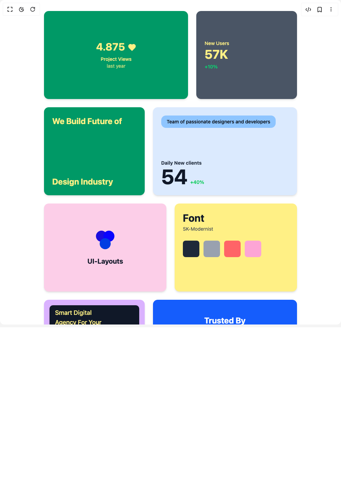

# Build Swapy Draggable Card in BuilderStudio

> Build this component in our Agentic IDE: [BuilderStudio](https://builderstudio.dev).
>
> Join the BuilderStudio community on [Discord](https://discord.gg/QdWeSGCqfe) and [Reddit](https://reddit.com/r/builderstudio).



## Component

- Author group: `ui-layouts`
- Component: `swapy-draggable-card`
- Variant: `default`
- Rendered HTML snapshot: [`rendered.html`](rendered.html)

## BuilderStudio prompt

You are implementing a React component based on a component reference.

## Component identity

- Author: ui-layouts
- Component slug: swapy-draggable-card
- Demo slug: default
- Title: swapy-draggable-card
- Description: 

## Goal

Recreate this component in a React + TypeScript + Tailwind CSS project. Preserve the visual layout, spacing, colors, border radius, shadows, interaction behavior, animation behavior, responsive behavior, and dark mode behavior shown in the rendered demo.

## Implementation requirements

- Use React and TypeScript.
- Use Tailwind CSS classes whenever possible.
- Keep the component self-contained unless the source files require helper components.
- If the source uses CSS variables, custom CSS, animations, or keyframes, include them.
- If the source uses external packages, list and use the required packages.
- Preserve accessibility attributes, button semantics, links, keyboard behavior, and ARIA attributes when visible in the source.
- Do not replace the component with a simplified placeholder.
- Return complete production-ready code.

## Dependencies

No reference metadata available.

## Rendered DOM snapshot

This is the rendered demo HTML extracted from the live preview. Use it to verify structure, class names, visible content, and layout.

```html
<div id="root"><div class="w-screen min-h-screen flex justify-center items-center"><div class="w-screen min-h-screen flex justify-center items-center"><div id="swapy" class="w-full container mx-auto p-4"><div class="grid w-full  grid-cols-12 gap-2 md:gap-6 py-4"><div class="data-[swapy-highlighted]:bg-neutral-200 data-[swapy-highlighted]:dark:bg-neutral-800 swapyItem rounded-lg h-64 lg:col-span-4 sm:col-span-7 col-span-12" data-swapy-slot="1"><div class="data-[swapy-dragging]:opacity-100 relative rounded-lg w-full h-full 2xl:text-xl text-sm" data-swapy-item="1"><div class="bg-emerald-600 rounded-xl h-full p-6 flex flex-col justify-center items-center text-center shadow-md"><div class="flex gap-2"><h2 class="text-yellow-200 2xl:text-5xl text-3xl font-bold mb-2">4.875</h2><div class="text-yellow-200 flex items-center gap-1 mb-1"><span class="text-xl"><svg xmlns="http://www.w3.org/2000/svg" width="24" height="24" viewBox="0 0 24 24" fill="none" stroke="currentColor" stroke-width="2" stroke-linecap="round" stroke-linejoin="round" class="lucide lucide-heart fill-yellow-200" aria-hidden="true"><path d="M19 14c1.49-1.46 3-3.21 3-5.5A5.5 5.5 0 0 0 16.5 3c-1.76 0-3 .5-4.5 2-1.5-1.5-2.74-2-4.5-2A5.5 5.5 0 0 0 2 8.5c0 2.3 1.5 4.05 3 5.5l7 7Z"></path></svg></span></div></div><p class="text-yellow-200 font-medium">Project Views</p><p class="text-yellow-200/80 text-sm">last year</p></div></div></div><div class="data-[swapy-highlighted]:bg-neutral-200 data-[swapy-highlighted]:dark:bg-neutral-800 swapyItem rounded-lg h-64 lg:col-span-3 sm:col-span-5 col-span-12" data-swapy-slot="2"><div class="data-[swapy-dragging]:opacity-100 relative rounded-lg w-full h-full 2xl:text-xl text-sm" data-swapy-item="2"><div class="bg-gray-600 rounded-xl h-full p-6 flex flex-col justify-center shadow-md"><p class="text-yellow-200 mb-1 font-medium">New Users</p><h2 class="text-yellow-200 2xl:text-6xl text-4xl font-bold leading-none">57K</h2><p class="text-green-400 font-medium mt-2">+10%</p></div></div></div><div class="data-[swapy-highlighted]:bg-neutral-200 data-[swapy-highlighted]:dark:bg-neutral-800 swapyItem rounded-lg h-64 lg:col-span-5 sm:col-span-5 col-span-12" data-swapy-slot="3"><div class="data-[swapy-dragging]:opacity-100 relative rounded-lg w-full h-full 2xl:text-xl text-sm" data-swapy-item="3"><div class="bg-emerald-600 text-yellow-200 rounded-xl h-full p-6 flex flex-col justify-between relative shadow-md"><p class="text-2xl font-bold">We Build Future of</p><p class="text-2xl font-bold">Design Industry</p></div></div></div><div class="data-[swapy-highlighted]:bg-neutral-200 data-[swapy-highlighted]:dark:bg-neutral-800 swapyItem rounded-lg h-64 lg:col-span-5 sm:col-span-7 col-span-12" data-swapy-slot="4"><div class="data-[swapy-dragging]:opacity-100 relative rounded-lg w-full h-full 2xl:text-xl text-sm" data-swapy-item="4"><div class="bg-blue-100 rounded-xl p-6 h-full  flex flex-col justify-between relative overflow-hidden shadow-md"><div class="bg-blue-300 text-black font-medium px-4 py-2 rounded-xl inline-block mb-4 max-w-fit">Team of passionate designers and developers</div><div><p class="font-bold text-gray-800">Daily New clients</p><div class="flex items-end gap-2"><span class="text-6xl font-bold text-gray-900">54</span><span class="text-green-500 font-medium mb-1">+40%</span></div></div></div></div></div><div class="data-[swapy-highlighted]:bg-neutral-200 data-[swapy-highlighted]:dark:bg-neutral-800 swapyItem rounded-lg h-64 lg:col-span-4 sm:col-span-6 col-span-12" data-swapy-slot="5"><div class="data-[swapy-dragging]:opacity-100 relative rounded-lg w-full h-full 2xl:text-xl text-sm" data-swapy-item="5"><div class="bg-pink-200 rounded-xl h-full p-6 flex flex-col items-center justify-center shadow-md"><div class="w-16 h-16 mb-4"><svg viewBox="0 0 100 100" class="w-full h-full"><circle cx="33" cy="33" r="25" fill="rgb(27, 13, 221)"></circle><circle cx="67" cy="33" r="25" fill="rgb(9, 4, 255)"></circle><circle cx="50" cy="67" r="25" fill="rgb(1, 61, 226)"></circle></svg></div><h2 class="2xl:text-3xl text-xl font-bold text-gray-900">UI-Layouts</h2></div></div></div><div class="data-[swapy-highlighted]:bg-neutral-200 data-[swapy-highlighted]:dark:bg-neutral-800 swapyItem rounded-lg h-64 lg:col-span-3 sm:col-span-6 col-span-12" data-swapy-slot="6"><div class="data-[swapy-dragging]:opacity-100 relative rounded-lg w-full h-full 2xl:text-xl text-sm" data-swapy-item="6"><div class="bg-yellow-200 rounded-xl h-full p-6 col-span-1 shadow-md"><h2 class="text-3xl font-bold mb-1 text-gray-900">Font</h2><p class="mb-6 text-gray-700">SK-Modernist</p><div class="flex gap-3 mt-4"><div class="w-12 h-12 bg-gray-800 rounded-md"></div><div class="w-12 h-12 bg-gray-400 rounded-md"></div><div class="w-12 h-12 bg-red-400 rounded-md"></div><div class="w-12 h-12 bg-pink-300 rounded-md"></div></div></div></div></div><div class="data-[swapy-highlighted]:bg-neutral-200 data-[swapy-highlighted]:dark:bg-neutral-800 swapyItem rounded-lg h-64 lg:col-span-4 sm:col-span-5 col-span-12" data-swapy-slot="7"><div class="data-[swapy-dragging]:opacity-100 relative rounded-lg w-full h-full 2xl:text-xl text-sm" data-swapy-item="7"><div class="bg-purple-300 rounded-xl h-full p-4 relative overflow-hidden shadow-md"><div class="bg-gray-900 text-yellow-200 text-lg font-medium px-4 py-2 rounded-lg inline-block mb-4 w-full"><p>Smart Digital</p><p>Agency For Your</p><p>Business</p></div><div class="flex  gap-2 h-20"><div class="w-full rounded-xl bg-purple-400  overflow-hidden"></div><div class="w-full rounded-xl bg-yellow-200  overflow-hidden ml-4"></div></div></div></div></div><div class="data-[swapy-highlighted]:bg-neutral-200 data-[swapy-highlighted]:dark:bg-neutral-800 swapyItem rounded-lg h-64 lg:col-span-4 sm:col-span-7 col-span-12" data-swapy-slot="8"><div class="data-[swapy-dragging]:opacity-100 relative rounded-lg w-full h-full 2xl:text-xl text-sm" data-swapy-item="8"><div class="bg-blue-600 rounded-xl h-full p-4 flex flex-col justify-center items-center text-white shadow-lg"><h3 class="text-2xl font-bold mb-2">Trusted By</h3><p class="text-3xl font-bold mb-4">500+ Users</p><div class="flex -space-x-2 mb-4"><div class="w-10 h-10 rounded-xl overflow-hidden border-2 border-blue-600 bg-gray-200"></div><div class="w-10 h-10 rounded-xl overflow-hidden border-2 border-blue-600 bg-gray-200"></div><div class="w-10 h-10 rounded-xl overflow-hidden border-2 border-blue-600 bg-gray-200"></div><div class="w-10 h-10 rounded-xl overflow-hidden border-2 border-blue-600 bg-gray-200"></div><div class="w-10 h-10 rounded-xl bg-yellow-500 border-2 border-blue-600 flex items-center justify-center"><svg xmlns="http://www.w3.org/2000/svg" width="24" height="24" viewBox="0 0 24 24" fill="none" stroke="currentColor" stroke-width="2" stroke-linecap="round" stroke-linejoin="round" class="lucide lucide-circle-plus w-5 h-5 text-white" aria-hidden="true"><circle cx="12" cy="12" r="10"></circle><path d="M8 12h8"></path><path d="M12 8v8"></path></svg></div></div><p class="text-sm">Don't Take Our Words For It...</p></div></div></div><div class="data-[swapy-highlighted]:bg-neutral-200 data-[swapy-highlighted]:dark:bg-neutral-800 swapyItem rounded-lg h-64 lg:col-span-4 sm:col-span-12 col-span-12" data-swapy-slot="9"><div class="data-[swapy-dragging]:opacity-100 relative rounded-lg w-full h-full 2xl:text-xl text-sm" data-swapy-item="9"><div class="bg-yellow-200 rounded-xl h-full p-6 shadow-lg"><h3 class="text-xl font-bold mb-4 text-neutral-950">Cards balance</h3><h2 class="text-3xl font-bold mb-6 text-neutral-800">$ 12,457</h2><div class="bg-black text-white rounded-lg p-4 shadow-sm"><div class="flex justify-between text-sm mb-2"><span>Card Holder</span><span>Expires</span></div><div class="flex justify-between font-medium"><span>Robert Fox</span><span>07/22</span></div></div></div></div></div></div></div></div></div></div>
```

## Reference source files

No reference source files were available.
