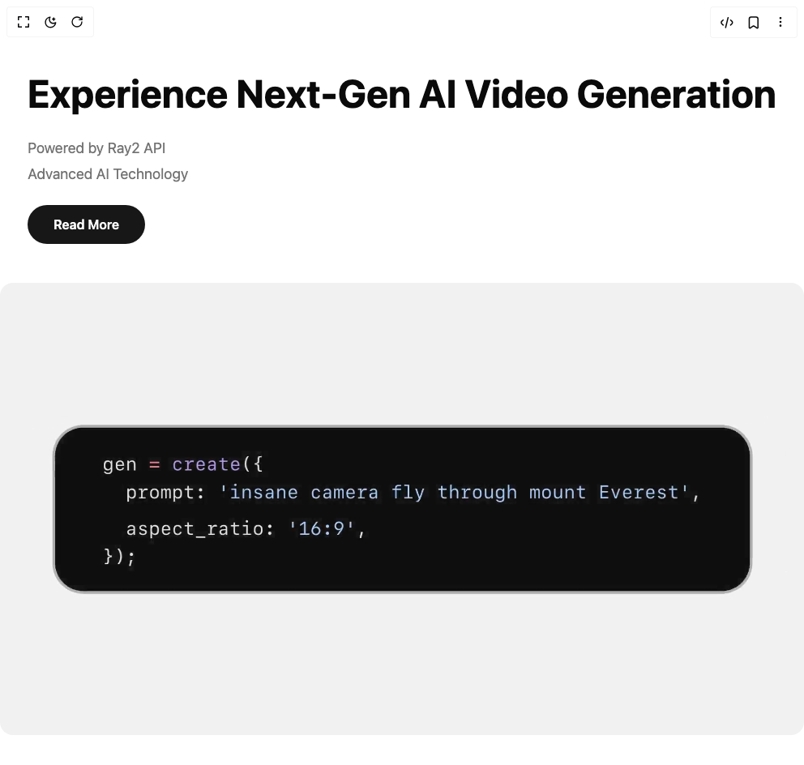

# Build Cta With Marquee in BuilderStudio

> Build this component in our Agentic IDE: [BuilderStudio](https://builderstudio.dev).
>
> Join the BuilderStudio community on [Discord](https://discord.gg/QdWeSGCqfe) and [Reddit](https://reddit.com/r/builderstudio).



## Component

- Author group: `uimix`
- Component: `cta-with-marquee`
- Variant: `cta-with-video`
- Rendered HTML snapshot: [`rendered.html`](rendered.html)

## BuilderStudio prompt

You are implementing a React component based on a component reference.

## Component identity

- Author: uimix
- Component slug: cta-with-marquee
- Demo slug: cta-with-video
- Title: cta-with-marquee
- Description: 

## Goal

Recreate this component in a React + TypeScript + Tailwind CSS project. Preserve the visual layout, spacing, colors, border radius, shadows, interaction behavior, animation behavior, responsive behavior, and dark mode behavior shown in the rendered demo.

## Implementation requirements

- Use React and TypeScript.
- Use Tailwind CSS classes whenever possible.
- Keep the component self-contained unless the source files require helper components.
- If the source uses CSS variables, custom CSS, animations, or keyframes, include them.
- If the source uses external packages, list and use the required packages.
- Preserve accessibility attributes, button semantics, links, keyboard behavior, and ARIA attributes when visible in the source.
- Do not replace the component with a simplified placeholder.
- Return complete production-ready code.

## Dependencies

No reference metadata available.

## Rendered DOM snapshot

This is the rendered demo HTML extracted from the live preview. Use it to verify structure, class names, visible content, and layout.

```html
<div id="root"><div class="w-screen min-h-screen flex justify-center items-center"><div class="w-screen min-h-screen flex justify-center items-center"><div class="min-h-screen bg-background text-foreground flex items-center overflow-hidden"><div class="w-full"><div class="flex flex-col lg:flex-row items-center lg:gap-8"><div class="flex-shrink-0 space-y-6 px-6 lg:px-12 py-12 lg:py-0 lg:max-w-2xl"><h1 class="text-4xl md:text-5xl lg:text-6xl font-bold leading-tight">Experience Next-Gen AI Video Generation</h1><div class="space-y-1 text-muted-foreground"><p class="text-lg">Powered by Ray2 API</p><p class="text-lg">Advanced AI Technology</p></div><button class="px-8 py-3 bg-primary text-primary-foreground rounded-full font-semibold hover:bg-primary/90 transition-colors">Read More</button></div><div class="flex-1 w-full lg:w-auto relative overflow-hidden rounded-2xl lg:rounded-none"><video src="https://static.cdn-luma.com/files/site/api/ray2/RAY2%20API%20Launch%20Twitter_smaller.mp4" autoplay="" loop="" playsinline="" class="w-full h-auto object-cover"></video></div></div></div></div></div></div></div>
```

## Reference source files

No reference source files were available.
