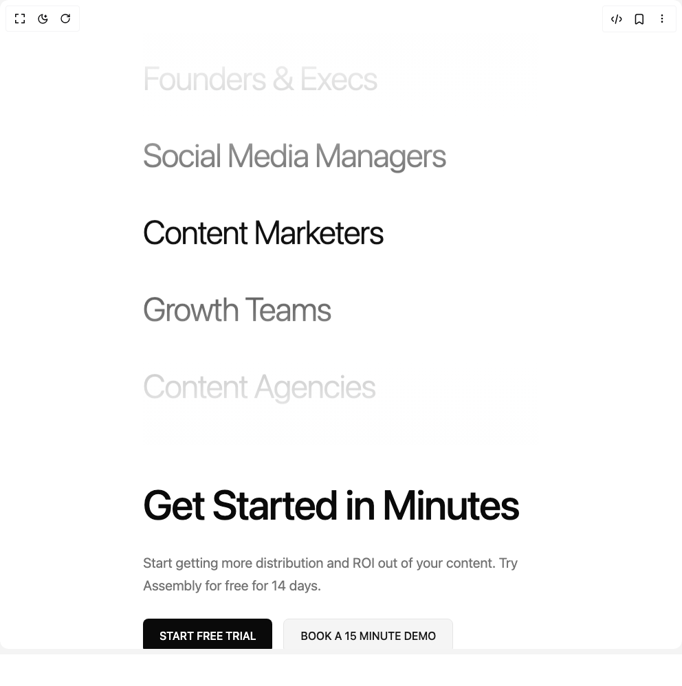

# Build Cta With Text Marquee in BuilderStudio

> Build this component in our Agentic IDE: [BuilderStudio](https://builderstudio.dev).
>
> Join the BuilderStudio community on [Discord](https://discord.gg/QdWeSGCqfe) and [Reddit](https://reddit.com/r/builderstudio).



## Component

- Author group: `uimix`
- Component: `cta-with-text-marquee`
- Variant: `cta-with-vertical-marquee-left`
- Rendered HTML snapshot: [`rendered.html`](rendered.html)

## BuilderStudio prompt

You are implementing a React component based on a component reference.

## Component identity

- Author: uimix
- Component slug: cta-with-text-marquee
- Demo slug: cta-with-vertical-marquee-left
- Title: cta-with-text-marquee
- Description: 

## Goal

Recreate this component in a React + TypeScript + Tailwind CSS project. Preserve the visual layout, spacing, colors, border radius, shadows, interaction behavior, animation behavior, responsive behavior, and dark mode behavior shown in the rendered demo.

## Implementation requirements

- Use React and TypeScript.
- Use Tailwind CSS classes whenever possible.
- Keep the component self-contained unless the source files require helper components.
- If the source uses CSS variables, custom CSS, animations, or keyframes, include them.
- If the source uses external packages, list and use the required packages.
- Preserve accessibility attributes, button semantics, links, keyboard behavior, and ARIA attributes when visible in the source.
- Do not replace the component with a simplified placeholder.
- Return complete production-ready code.

## Dependencies

No reference metadata available.

## Rendered DOM snapshot

This is the rendered demo HTML extracted from the live preview. Use it to verify structure, class names, visible content, and layout.

```html
<div id="root"><div class="w-screen min-h-screen flex justify-center items-center"><div class="w-screen min-h-screen flex justify-center items-center"><div class="min-h-screen bg-background text-foreground flex items-center justify-center px-6 py-12 overflow-hidden"><div class="w-full max-w-7xl animate-fade-in-up"><div class="grid grid-cols-1 lg:grid-cols-2 gap-12 lg:gap-24 items-center"><div class="relative h-[600px] lg:h-[700px] flex items-center justify-center animate-fade-in-up [animation-delay:400ms] lg:order-1"><div class="relative w-full h-full"><div class="group flex flex-col overflow-hidden h-full" style="--duration: 20s;"><div class="flex shrink-0 flex-col animate-marquee-vertical"><div class="text-4xl md:text-5xl lg:text-6xl xl:text-7xl font-light tracking-tight py-8 marquee-item" style="opacity: 0.25;">Content Agencies</div><div class="text-4xl md:text-5xl lg:text-6xl xl:text-7xl font-light tracking-tight py-8 marquee-item" style="opacity: 0.415807;">Founders &amp; Execs</div><div class="text-4xl md:text-5xl lg:text-6xl xl:text-7xl font-light tracking-tight py-8 marquee-item" style="opacity: 0.695807;">Social Media Managers</div><div class="text-4xl md:text-5xl lg:text-6xl xl:text-7xl font-light tracking-tight py-8 marquee-item" style="opacity: 0.975807;">Content Marketers</div><div class="text-4xl md:text-5xl lg:text-6xl xl:text-7xl font-light tracking-tight py-8 marquee-item" style="opacity: 0.744193;">Growth Teams</div></div><div class="flex shrink-0 flex-col animate-marquee-vertical" aria-hidden="true"><div class="text-4xl md:text-5xl lg:text-6xl xl:text-7xl font-light tracking-tight py-8 marquee-item" style="opacity: 0.464193;">Content Agencies</div><div class="text-4xl md:text-5xl lg:text-6xl xl:text-7xl font-light tracking-tight py-8 marquee-item" style="opacity: 0.25;">Founders &amp; Execs</div><div class="text-4xl md:text-5xl lg:text-6xl xl:text-7xl font-light tracking-tight py-8 marquee-item" style="opacity: 0.25;">Social Media Managers</div><div class="text-4xl md:text-5xl lg:text-6xl xl:text-7xl font-light tracking-tight py-8 marquee-item" style="opacity: 0.25;">Content Marketers</div><div class="text-4xl md:text-5xl lg:text-6xl xl:text-7xl font-light tracking-tight py-8 marquee-item" style="opacity: 0.25;">Growth Teams</div></div></div><div class="pointer-events-none absolute top-0 left-0 right-0 h-64 bg-gradient-to-b from-background via-background/50 to-transparent z-10"></div><div class="pointer-events-none absolute bottom-0 left-0 right-0 h-64 bg-gradient-to-t from-background via-background/50 to-transparent z-10"></div></div></div><div class="space-y-8 max-w-xl lg:order-2"><h1 class="text-5xl md:text-6xl lg:text-7xl font-medium leading-tight tracking-tight text-foreground animate-fade-in-up [animation-delay:200ms]">Get Started in Minutes</h1><p class="text-lg md:text-xl text-muted-foreground leading-relaxed animate-fade-in-up [animation-delay:400ms]">Start getting more distribution and ROI out of your content. Try Assembly for free for 14 days.</p><div class="flex flex-wrap gap-4 animate-fade-in-up [animation-delay:600ms]"><button class="group relative px-6 py-3 bg-foreground text-background rounded-md font-medium overflow-hidden transition-all duration-300 hover:scale-105 hover:shadow-lg"><span class="relative z-10">START FREE TRIAL</span><div class="absolute inset-0 bg-gradient-to-r from-transparent via-white/20 to-transparent translate-x-[-200%] group-hover:translate-x-[200%] transition-transform duration-700"></div></button><button class="group relative px-6 py-3 bg-secondary text-secondary-foreground rounded-md font-medium overflow-hidden transition-all duration-300 hover:scale-105 hover:shadow-lg border border-border"><span class="relative z-10">BOOK A 15 MINUTE DEMO</span><div class="absolute inset-0 bg-gradient-to-r from-transparent via-foreground/10 to-transparent translate-x-[-200%] group-hover:translate-x-[200%] transition-transform duration-700"></div></button></div></div></div></div></div></div></div></div>
```

## Reference source files

No reference source files were available.
