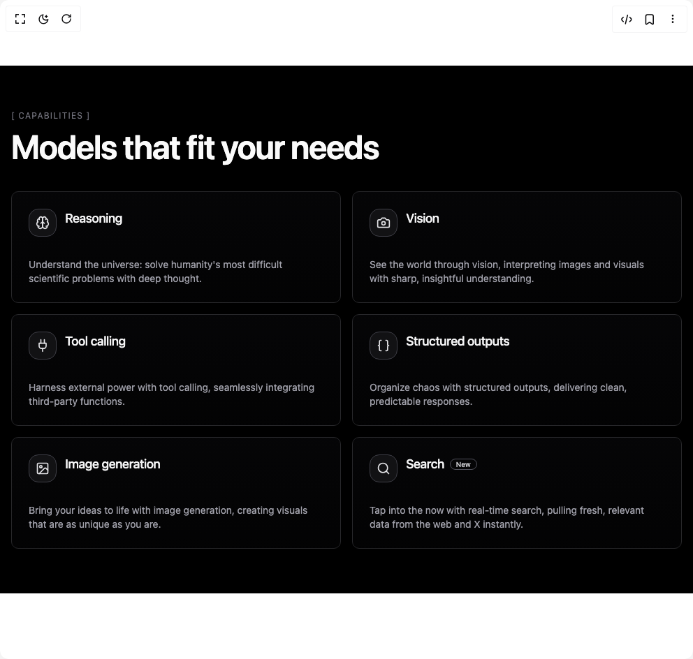

# Build Dark Grid in BuilderStudio

> Build this component in our Agentic IDE: [BuilderStudio](https://builderstudio.dev).
>
> Join the BuilderStudio community on [Discord](https://discord.gg/QdWeSGCqfe) and [Reddit](https://reddit.com/r/builderstudio).



## Component

- Author group: `uimix`
- Component: `dark-grid`
- Variant: `default`
- Rendered HTML snapshot: [`rendered.html`](rendered.html)

## BuilderStudio prompt

You are implementing a React component based on a component reference.

## Component identity

- Author: uimix
- Component slug: dark-grid
- Demo slug: default
- Title: dark-grid
- Description: 

## Goal

Recreate this component in a React + TypeScript + Tailwind CSS project. Preserve the visual layout, spacing, colors, border radius, shadows, interaction behavior, animation behavior, responsive behavior, and dark mode behavior shown in the rendered demo.

## Implementation requirements

- Use React and TypeScript.
- Use Tailwind CSS classes whenever possible.
- Keep the component self-contained unless the source files require helper components.
- If the source uses CSS variables, custom CSS, animations, or keyframes, include them.
- If the source uses external packages, list and use the required packages.
- Preserve accessibility attributes, button semantics, links, keyboard behavior, and ARIA attributes when visible in the source.
- Do not replace the component with a simplified placeholder.
- Return complete production-ready code.

## Dependencies

No reference metadata available.

## Rendered DOM snapshot

This is the rendered demo HTML extracted from the live preview. Use it to verify structure, class names, visible content, and layout.

```html
<div id="root"><div class="w-screen min-h-screen flex justify-center items-center"><div class="w-screen min-h-screen flex justify-center items-center"><div class="min-h-[60vh] w-full bg-black text-zinc-50"><div class="mx-auto max-w-6xl px-4 py-16"><p class="text-xs tracking-widest text-zinc-500">[ CAPABILITIES ]</p><h1 class="mt-3 text-4xl font-semibold tracking-tight sm:text-5xl">Models that fit your needs</h1><div class="mt-10 grid grid-cols-1 gap-4 sm:grid-cols-2 lg:grid-cols-3"><div class="rounded-lg border text-card-foreground shadow-sm group relative overflow-visible border-zinc-800 bg-gradient-to-b from-zinc-950/60 to-zinc-950/30 p-0 transition-colors duration-300 hover:border-zinc-700"><div class="pointer-events-none absolute inset-0 opacity-0 transition-opacity duration-300 group-hover:opacity-100"><div class="absolute -inset-[1px] rounded-xl bg-gradient-to-br from-white/10 via-white/5 to-transparent"></div></div><div class="pointer-events-none absolute inset-0 rounded-xl bg-gradient-to-tr from-white/0 to-white/0 group-hover:from-white/[0.03] group-hover:to-white/[0.06] transition-colors"></div><div class="pointer-events-none absolute inset-0 hidden group-hover:block"><div class="absolute -left-2 -top-2 h-3 w-3 bg-white"></div><div class="absolute -right-2 -top-2 h-3 w-3 bg-white"></div><div class="absolute -left-2 -bottom-2 h-3 w-3 bg-white"></div><div class="absolute -right-2 -bottom-2 h-3 w-3 bg-white"></div></div><div class="space-y-1.5 relative z-10 flex flex-row items-start gap-3 p-6"><div class="flex h-10 w-10 items-center justify-center rounded-xl border border-zinc-700 bg-zinc-900/70 text-zinc-200"><svg xmlns="http://www.w3.org/2000/svg" width="24" height="24" viewBox="0 0 24 24" fill="none" stroke="currentColor" stroke-width="2" stroke-linecap="round" stroke-linejoin="round" class="lucide lucide-brain h-5 w-5 text-zinc-200" aria-hidden="true"><path d="M12 5a3 3 0 1 0-5.997.125 4 4 0 0 0-2.526 5.77 4 4 0 0 0 .556 6.588A4 4 0 1 0 12 18Z"></path><path d="M12 5a3 3 0 1 1 5.997.125 4 4 0 0 1 2.526 5.77 4 4 0 0 1-.556 6.588A4 4 0 1 1 12 18Z"></path><path d="M15 13a4.5 4.5 0 0 1-3-4 4.5 4.5 0 0 1-3 4"></path><path d="M17.599 6.5a3 3 0 0 0 .399-1.375"></path><path d="M6.003 5.125A3 3 0 0 0 6.401 6.5"></path><path d="M3.477 10.896a4 4 0 0 1 .585-.396"></path><path d="M19.938 10.5a4 4 0 0 1 .585.396"></path><path d="M6 18a4 4 0 0 1-1.967-.516"></path><path d="M19.967 17.484A4 4 0 0 1 18 18"></path></svg></div><div class="flex-1"><div class="flex items-center gap-2"><h3 class="tracking-tight text-lg font-medium text-zinc-100">Reasoning</h3></div></div></div><div class="p-6 pt-0 relative z-10 px-6 pb-6 text-sm text-zinc-400">Understand the universe: solve humanity's most difficult scientific problems with deep thought.</div><div class="pointer-events-none absolute inset-0 rounded-xl ring-0 ring-white/0" style="opacity: 0;"></div></div><div class="rounded-lg border text-card-foreground shadow-sm group relative overflow-visible border-zinc-800 bg-gradient-to-b from-zinc-950/60 to-zinc-950/30 p-0 transition-colors duration-300 hover:border-zinc-700"><div class="pointer-events-none absolute inset-0 opacity-0 transition-opacity duration-300 group-hover:opacity-100"><div class="absolute -inset-[1px] rounded-xl bg-gradient-to-br from-white/10 via-white/5 to-transparent"></div></div><div class="pointer-events-none absolute inset-0 rounded-xl bg-gradient-to-tr from-white/0 to-white/0 group-hover:from-white/[0.03] group-hover:to-white/[0.06] transition-colors"></div><div class="pointer-events-none absolute inset-0 hidden group-hover:block"><div class="absolute -left-2 -top-2 h-3 w-3 bg-white"></div><div class="absolute -right-2 -top-2 h-3 w-3 bg-white"></div><div class="absolute -left-2 -bottom-2 h-3 w-3 bg-white"></div><div class="absolute -right-2 -bottom-2 h-3 w-3 bg-white"></div></div><div class="space-y-1.5 relative z-10 flex flex-row items-start gap-3 p-6"><div class="flex h-10 w-10 items-center justify-center rounded-xl border border-zinc-700 bg-zinc-900/70 text-zinc-200"><svg xmlns="http://www.w3.org/2000/svg" width="24" height="24" viewBox="0 0 24 24" fill="none" stroke="currentColor" stroke-width="2" stroke-linecap="round" stroke-linejoin="round" class="lucide lucide-camera h-5 w-5 text-zinc-200" aria-hidden="true"><path d="M14.5 4h-5L7 7H4a2 2 0 0 0-2 2v9a2 2 0 0 0 2 2h16a2 2 0 0 0 2-2V9a2 2 0 0 0-2-2h-3l-2.5-3z"></path><circle cx="12" cy="13" r="3"></circle></svg></div><div class="flex-1"><div class="flex items-center gap-2"><h3 class="tracking-tight text-lg font-medium text-zinc-100">Vision</h3></div></div></div><div class="p-6 pt-0 relative z-10 px-6 pb-6 text-sm text-zinc-400">See the world through vision, interpreting images and visuals with sharp, insightful understanding.</div><div class="pointer-events-none absolute inset-0 rounded-xl ring-0 ring-white/0" style="opacity: 0;"></div></div><div class="rounded-lg border text-card-foreground shadow-sm group relative overflow-visible border-zinc-800 bg-gradient-to-b from-zinc-950/60 to-zinc-950/30 p-0 transition-colors duration-300 hover:border-zinc-700"><div class="pointer-events-none absolute inset-0 opacity-0 transition-opacity duration-300 group-hover:opacity-100"><div class="absolute -inset-[1px] rounded-xl bg-gradient-to-br from-white/10 via-white/5 to-transparent"></div></div><div class="pointer-events-none absolute inset-0 rounded-xl bg-gradient-to-tr from-white/0 to-white/0 group-hover:from-white/[0.03] group-hover:to-white/[0.06] transition-colors"></div><div class="pointer-events-none absolute inset-0 hidden group-hover:block"><div class="absolute -left-2 -top-2 h-3 w-3 bg-white"></div><div class="absolute -right-2 -top-2 h-3 w-3 bg-white"></div><div class="absolute -left-2 -bottom-2 h-3 w-3 bg-white"></div><div class="absolute -right-2 -bottom-2 h-3 w-3 bg-white"></div></div><div class="space-y-1.5 relative z-10 flex flex-row items-start gap-3 p-6"><div class="flex h-10 w-10 items-center justify-center rounded-xl border border-zinc-700 bg-zinc-900/70 text-zinc-200"><svg xmlns="http://www.w3.org/2000/svg" width="24" height="24" viewBox="0 0 24 24" fill="none" stroke="currentColor" stroke-width="2" stroke-linecap="round" stroke-linejoin="round" class="lucide lucide-plug h-5 w-5 text-zinc-200" aria-hidden="true"><path d="M12 22v-5"></path><path d="M9 8V2"></path><path d="M15 8V2"></path><path d="M18 8v5a4 4 0 0 1-4 4h-4a4 4 0 0 1-4-4V8Z"></path></svg></div><div class="flex-1"><div class="flex items-center gap-2"><h3 class="tracking-tight text-lg font-medium text-zinc-100">Tool calling</h3></div></div></div><div class="p-6 pt-0 relative z-10 px-6 pb-6 text-sm text-zinc-400">Harness external power with tool calling, seamlessly integrating third‑party functions.</div><div class="pointer-events-none absolute inset-0 rounded-xl ring-0 ring-white/0" style="opacity: 0;"></div></div><div class="rounded-lg border text-card-foreground shadow-sm group relative overflow-visible border-zinc-800 bg-gradient-to-b from-zinc-950/60 to-zinc-950/30 p-0 transition-colors duration-300 hover:border-zinc-700"><div class="pointer-events-none absolute inset-0 opacity-0 transition-opacity duration-300 group-hover:opacity-100"><div class="absolute -inset-[1px] rounded-xl bg-gradient-to-br from-white/10 via-white/5 to-transparent"></div></div><div class="pointer-events-none absolute inset-0 rounded-xl bg-gradient-to-tr from-white/0 to-white/0 group-hover:from-white/[0.03] group-hover:to-white/[0.06] transition-colors"></div><div class="pointer-events-none absolute inset-0 hidden group-hover:block"><div class="absolute -left-2 -top-2 h-3 w-3 bg-white"></div><div class="absolute -right-2 -top-2 h-3 w-3 bg-white"></div><div class="absolute -left-2 -bottom-2 h-3 w-3 bg-white"></div><div class="absolute -right-2 -bottom-2 h-3 w-3 bg-white"></div></div><div class="space-y-1.5 relative z-10 flex flex-row items-start gap-3 p-6"><div class="flex h-10 w-10 items-center justify-center rounded-xl border border-zinc-700 bg-zinc-900/70 text-zinc-200"><svg xmlns="http://www.w3.org/2000/svg" width="24" height="24" viewBox="0 0 24 24" fill="none" stroke="currentColor" stroke-width="2" stroke-linecap="round" stroke-linejoin="round" class="lucide lucide-braces h-5 w-5 text-zinc-200" aria-hidden="true"><path d="M8 3H7a2 2 0 0 0-2 2v5a2 2 0 0 1-2 2 2 2 0 0 1 2 2v5c0 1.1.9 2 2 2h1"></path><path d="M16 21h1a2 2 0 0 0 2-2v-5c0-1.1.9-2 2-2a2 2 0 0 1-2-2V5a2 2 0 0 0-2-2h-1"></path></svg></div><div class="flex-1"><div class="flex items-center gap-2"><h3 class="tracking-tight text-lg font-medium text-zinc-100">Structured outputs</h3></div></div></div><div class="p-6 pt-0 relative z-10 px-6 pb-6 text-sm text-zinc-400">Organize chaos with structured outputs, delivering clean, predictable responses.</div><div class="pointer-events-none absolute inset-0 rounded-xl ring-0 ring-white/0" style="opacity: 0;"></div></div><div class="rounded-lg border text-card-foreground shadow-sm group relative overflow-visible border-zinc-800 bg-gradient-to-b from-zinc-950/60 to-zinc-950/30 p-0 transition-colors duration-300 hover:border-zinc-700"><div class="pointer-events-none absolute inset-0 opacity-0 transition-opacity duration-300 group-hover:opacity-100"><div class="absolute -inset-[1px] rounded-xl bg-gradient-to-br from-white/10 via-white/5 to-transparent"></div></div><div class="pointer-events-none absolute inset-0 rounded-xl bg-gradient-to-tr from-white/0 to-white/0 group-hover:from-white/[0.03] group-hover:to-white/[0.06] transition-colors"></div><div class="pointer-events-none absolute inset-0 hidden group-hover:block"><div class="absolute -left-2 -top-2 h-3 w-3 bg-white"></div><div class="absolute -right-2 -top-2 h-3 w-3 bg-white"></div><div class="absolute -left-2 -bottom-2 h-3 w-3 bg-white"></div><div class="absolute -right-2 -bottom-2 h-3 w-3 bg-white"></div></div><div class="space-y-1.5 relative z-10 flex flex-row items-start gap-3 p-6"><div class="flex h-10 w-10 items-center justify-center rounded-xl border border-zinc-700 bg-zinc-900/70 text-zinc-200"><svg xmlns="http://www.w3.org/2000/svg" width="24" height="24" viewBox="0 0 24 24" fill="none" stroke="currentColor" stroke-width="2" stroke-linecap="round" stroke-linejoin="round" class="lucide lucide-image h-5 w-5 text-zinc-200" aria-hidden="true"><rect width="18" height="18" x="3" y="3" rx="2" ry="2"></rect><circle cx="9" cy="9" r="2"></circle><path d="m21 15-3.086-3.086a2 2 0 0 0-2.828 0L6 21"></path></svg></div><div class="flex-1"><div class="flex items-center gap-2"><h3 class="tracking-tight text-lg font-medium text-zinc-100">Image generation</h3></div></div></div><div class="p-6 pt-0 relative z-10 px-6 pb-6 text-sm text-zinc-400">Bring your ideas to life with image generation, creating visuals that are as unique as you are.</div><div class="pointer-events-none absolute inset-0 rounded-xl ring-0 ring-white/0" style="opacity: 0;"></div></div><div class="rounded-lg border text-card-foreground shadow-sm group relative overflow-visible border-zinc-800 bg-gradient-to-b from-zinc-950/60 to-zinc-950/30 p-0 transition-colors duration-300 hover:border-zinc-700"><div class="pointer-events-none absolute inset-0 opacity-0 transition-opacity duration-300 group-hover:opacity-100"><div class="absolute -inset-[1px] rounded-xl bg-gradient-to-br from-white/10 via-white/5 to-transparent"></div></div><div class="pointer-events-none absolute inset-0 rounded-xl bg-gradient-to-tr from-white/0 to-white/0 group-hover:from-white/[0.03] group-hover:to-white/[0.06] transition-colors"></div><div class="pointer-events-none absolute inset-0 hidden group-hover:block"><div class="absolute -left-2 -top-2 h-3 w-3 bg-white"></div><div class="absolute -right-2 -top-2 h-3 w-3 bg-white"></div><div class="absolute -left-2 -bottom-2 h-3 w-3 bg-white"></div><div class="absolute -right-2 -bottom-2 h-3 w-3 bg-white"></div></div><div class="space-y-1.5 relative z-10 flex flex-row items-start gap-3 p-6"><div class="flex h-10 w-10 items-center justify-center rounded-xl border border-zinc-700 bg-zinc-900/70 text-zinc-200"><svg xmlns="http://www.w3.org/2000/svg" width="24" height="24" viewBox="0 0 24 24" fill="none" stroke="currentColor" stroke-width="2" stroke-linecap="round" stroke-linejoin="round" class="lucide lucide-search h-5 w-5 text-zinc-200" aria-hidden="true"><circle cx="11" cy="11" r="8"></circle><path d="m21 21-4.3-4.3"></path></svg></div><div class="flex-1"><div class="flex items-center gap-2"><h3 class="tracking-tight text-lg font-medium text-zinc-100">Search</h3><span class="rounded-full border border-zinc-600 px-2 py-0.5 text-[10px] leading-none text-zinc-300">New</span></div></div></div><div class="p-6 pt-0 relative z-10 px-6 pb-6 text-sm text-zinc-400">Tap into the now with real‑time search, pulling fresh, relevant data from the web and X instantly.</div><div class="pointer-events-none absolute inset-0 rounded-xl ring-0 ring-white/0" style="opacity: 0;"></div></div></div></div></div></div></div></div>
```

## Reference source files

No reference source files were available.
