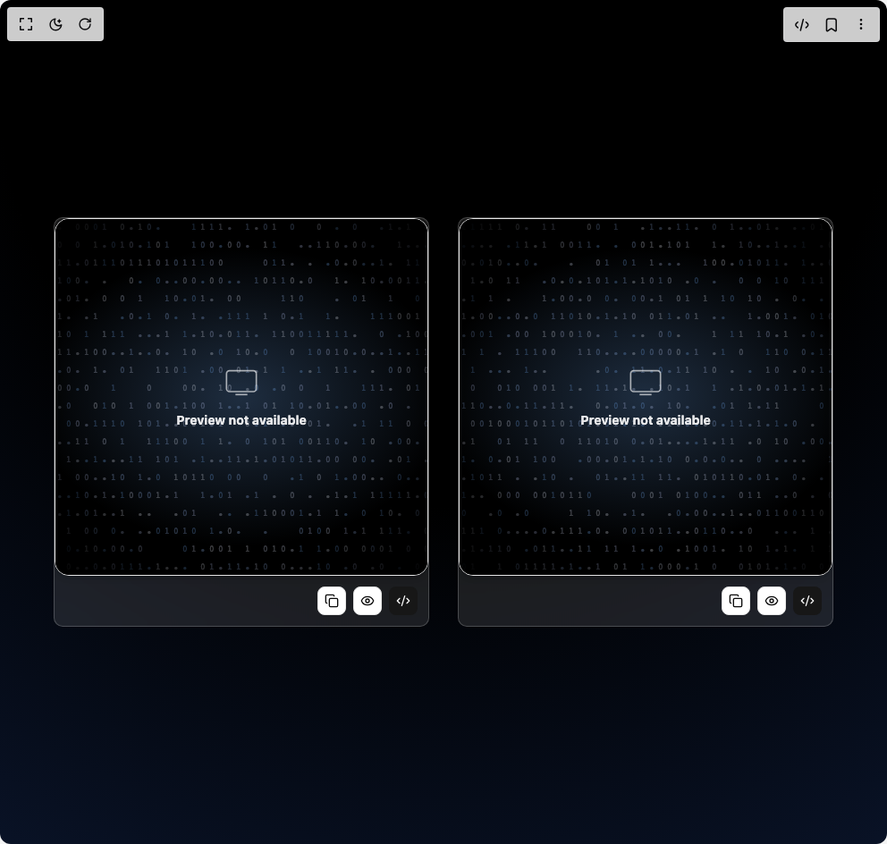

# Build Fallback Card in BuilderStudio

> Build this component in our Agentic IDE: [BuilderStudio](https://builderstudio.dev).
>
> Join the BuilderStudio community on [Discord](https://discord.gg/QdWeSGCqfe) and [Reddit](https://reddit.com/r/builderstudio).



## Component

- Author group: `uimix`
- Component: `fallback-card`
- Variant: `default`
- Rendered HTML snapshot: [`rendered.html`](rendered.html)

## BuilderStudio prompt

You are implementing a React component based on a component reference.

## Component identity

- Author: uimix
- Component slug: fallback-card
- Demo slug: default
- Title: fallback-card
- Description: 

## Goal

Recreate this component in a React + TypeScript + Tailwind CSS project. Preserve the visual layout, spacing, colors, border radius, shadows, interaction behavior, animation behavior, responsive behavior, and dark mode behavior shown in the rendered demo.

## Implementation requirements

- Use React and TypeScript.
- Use Tailwind CSS classes whenever possible.
- Keep the component self-contained unless the source files require helper components.
- If the source uses CSS variables, custom CSS, animations, or keyframes, include them.
- If the source uses external packages, list and use the required packages.
- Preserve accessibility attributes, button semantics, links, keyboard behavior, and ARIA attributes when visible in the source.
- Do not replace the component with a simplified placeholder.
- Return complete production-ready code.

## Dependencies

No reference metadata available.

## Rendered DOM snapshot

This is the rendered demo HTML extracted from the live preview. Use it to verify structure, class names, visible content, and layout.

```html
<div id="root"><div class="w-screen min-h-screen flex justify-center items-center"><div class="w-screen min-h-screen flex justify-center items-center"><div class="min-h-screen w-full relative flex items-center justify-center"><div class="absolute inset-0 z-0" style="background: radial-gradient(125% 125% at 50% 10%, rgb(0, 0, 0) 40%, rgb(13, 26, 54) 100%);"></div><div class="relative z-10 grid grid-cols-1 md:grid-cols-2 gap-8 p-8"><div style="opacity: 1; transform: none;"><div class="rounded-lg text-card-foreground shadow-sm w-[420px] overflow-hidden flex flex-col bg-white/10 dark:bg-white/10 backdrop-blur-md border border-white/20 hover:shadow-xl transition-shadow"><div class="w-full"><div class="relative flex flex-col items-center justify-center h-[400px] w-full overflow-hidden rounded-2xl border shadow-md bg-black text-white/90 undefined"><div class="absolute inset-0 opacity-25 z-10"><div class="relative w-full h-full overflow-hidden "><canvas class="block w-full h-full" width="416" height="398" style="width: 416px; height: 398px;"></canvas><div class="absolute inset-0 pointer-events-none bg-[radial-gradient(circle,rgba(0,0,0,0)_60%,rgba(0,0,0,1)_100%)]"></div></div></div><div class="absolute inset-0 z-0" style="background: radial-gradient(80% 60%, rgba(120, 180, 255, 0.25), transparent 70%), rgb(0, 0, 0);"></div><div class="relative z-20 flex flex-col items-center justify-center p-6"><svg xmlns="http://www.w3.org/2000/svg" class="w-10 h-10 mb-3 opacity-70" fill="none" viewBox="0 0 24 24" stroke="currentColor"><rect x="2" y="4" width="20" height="14" rx="2" ry="2"></rect><line x1="8" y1="20" x2="16" y2="20"></line></svg><p class="text-sm font-bold text-center">Preview not available</p></div></div></div><div class="items-center flex gap-2 justify-end p-3"><button class="inline-flex items-center justify-center whitespace-nowrap rounded-md text-sm font-medium ring-offset-background transition-colors focus-visible:outline-none focus-visible:ring-2 focus-visible:ring-ring focus-visible:ring-offset-2 disabled:pointer-events-none disabled:opacity-50 border border-input bg-background hover:bg-accent hover:text-accent-foreground h-8 w-8"><svg xmlns="http://www.w3.org/2000/svg" width="24" height="24" viewBox="0 0 24 24" fill="none" stroke="currentColor" stroke-width="2" stroke-linecap="round" stroke-linejoin="round" class="lucide lucide-copy w-4 h-4" aria-hidden="true"><rect width="14" height="14" x="8" y="8" rx="2" ry="2"></rect><path d="M4 16c-1.1 0-2-.9-2-2V4c0-1.1.9-2 2-2h10c1.1 0 2 .9 2 2"></path></svg></button><button class="inline-flex items-center justify-center whitespace-nowrap rounded-md text-sm font-medium ring-offset-background transition-colors focus-visible:outline-none focus-visible:ring-2 focus-visible:ring-ring focus-visible:ring-offset-2 disabled:pointer-events-none disabled:opacity-50 border border-input bg-background hover:bg-accent hover:text-accent-foreground h-8 w-8"><svg xmlns="http://www.w3.org/2000/svg" width="24" height="24" viewBox="0 0 24 24" fill="none" stroke="currentColor" stroke-width="2" stroke-linecap="round" stroke-linejoin="round" class="lucide lucide-eye w-4 h-4" aria-hidden="true"><path d="M2.062 12.348a1 1 0 0 1 0-.696 10.75 10.75 0 0 1 19.876 0 1 1 0 0 1 0 .696 10.75 10.75 0 0 1-19.876 0"></path><circle cx="12" cy="12" r="3"></circle></svg></button><button class="inline-flex items-center justify-center whitespace-nowrap rounded-md text-sm font-medium ring-offset-background transition-colors focus-visible:outline-none focus-visible:ring-2 focus-visible:ring-ring focus-visible:ring-offset-2 disabled:pointer-events-none disabled:opacity-50 bg-primary text-primary-foreground hover:bg-primary/90 h-8 w-8"><svg xmlns="http://www.w3.org/2000/svg" width="24" height="24" viewBox="0 0 24 24" fill="none" stroke="currentColor" stroke-width="2" stroke-linecap="round" stroke-linejoin="round" class="lucide lucide-code-xml w-4 h-4" aria-hidden="true"><path d="m18 16 4-4-4-4"></path><path d="m6 8-4 4 4 4"></path><path d="m14.5 4-5 16"></path></svg></button></div></div></div><div style="opacity: 1; transform: none;"><div class="rounded-lg text-card-foreground shadow-sm w-[420px] overflow-hidden flex flex-col bg-white/10 dark:bg-white/10 backdrop-blur-md border border-white/20 hover:shadow-xl transition-shadow"><div class="w-full"><div class="relative flex flex-col items-center justify-center h-[400px] w-full overflow-hidden rounded-2xl border shadow-md bg-black text-white/90 undefined"><div class="absolute inset-0 opacity-25 z-10"><div class="relative w-full h-full overflow-hidden "><canvas class="block w-full h-full" width="416" height="398" style="width: 416px; height: 398px;"></canvas><div class="absolute inset-0 pointer-events-none bg-[radial-gradient(circle,rgba(0,0,0,0)_60%,rgba(0,0,0,1)_100%)]"></div></div></div><div class="absolute inset-0 z-0" style="background: radial-gradient(80% 60%, rgba(120, 180, 255, 0.25), transparent 70%), rgb(0, 0, 0);"></div><div class="relative z-20 flex flex-col items-center justify-center p-6"><svg xmlns="http://www.w3.org/2000/svg" class="w-10 h-10 mb-3 opacity-70" fill="none" viewBox="0 0 24 24" stroke="currentColor"><rect x="2" y="4" width="20" height="14" rx="2" ry="2"></rect><line x1="8" y1="20" x2="16" y2="20"></line></svg><p class="text-sm font-bold text-center">Preview not available</p></div></div></div><div class="items-center flex gap-2 justify-end p-3"><button class="inline-flex items-center justify-center whitespace-nowrap rounded-md text-sm font-medium ring-offset-background transition-colors focus-visible:outline-none focus-visible:ring-2 focus-visible:ring-ring focus-visible:ring-offset-2 disabled:pointer-events-none disabled:opacity-50 border border-input bg-background hover:bg-accent hover:text-accent-foreground h-8 w-8"><svg xmlns="http://www.w3.org/2000/svg" width="24" height="24" viewBox="0 0 24 24" fill="none" stroke="currentColor" stroke-width="2" stroke-linecap="round" stroke-linejoin="round" class="lucide lucide-copy w-4 h-4" aria-hidden="true"><rect width="14" height="14" x="8" y="8" rx="2" ry="2"></rect><path d="M4 16c-1.1 0-2-.9-2-2V4c0-1.1.9-2 2-2h10c1.1 0 2 .9 2 2"></path></svg></button><button class="inline-flex items-center justify-center whitespace-nowrap rounded-md text-sm font-medium ring-offset-background transition-colors focus-visible:outline-none focus-visible:ring-2 focus-visible:ring-ring focus-visible:ring-offset-2 disabled:pointer-events-none disabled:opacity-50 border border-input bg-background hover:bg-accent hover:text-accent-foreground h-8 w-8"><svg xmlns="http://www.w3.org/2000/svg" width="24" height="24" viewBox="0 0 24 24" fill="none" stroke="currentColor" stroke-width="2" stroke-linecap="round" stroke-linejoin="round" class="lucide lucide-eye w-4 h-4" aria-hidden="true"><path d="M2.062 12.348a1 1 0 0 1 0-.696 10.75 10.75 0 0 1 19.876 0 1 1 0 0 1 0 .696 10.75 10.75 0 0 1-19.876 0"></path><circle cx="12" cy="12" r="3"></circle></svg></button><button class="inline-flex items-center justify-center whitespace-nowrap rounded-md text-sm font-medium ring-offset-background transition-colors focus-visible:outline-none focus-visible:ring-2 focus-visible:ring-ring focus-visible:ring-offset-2 disabled:pointer-events-none disabled:opacity-50 bg-primary text-primary-foreground hover:bg-primary/90 h-8 w-8"><svg xmlns="http://www.w3.org/2000/svg" width="24" height="24" viewBox="0 0 24 24" fill="none" stroke="currentColor" stroke-width="2" stroke-linecap="round" stroke-linejoin="round" class="lucide lucide-code-xml w-4 h-4" aria-hidden="true"><path d="m18 16 4-4-4-4"></path><path d="m6 8-4 4 4 4"></path><path d="m14.5 4-5 16"></path></svg></button></div></div></div></div></div></div></div></div>
```

## Reference source files

No reference source files were available.
