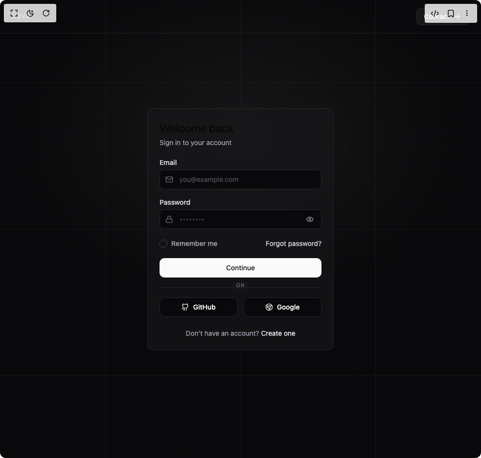

# Build Login Signup in BuilderStudio

> Build this component in our Agentic IDE: [BuilderStudio](https://builderstudio.dev).
>
> Join the BuilderStudio community on [Discord](https://discord.gg/QdWeSGCqfe) and [Reddit](https://reddit.com/r/builderstudio).



## Component

- Author group: `uimix`
- Component: `login-signup`
- Variant: `default`
- Rendered HTML snapshot: [`rendered.html`](rendered.html)

## BuilderStudio prompt

You are implementing a React component based on a component reference.

## Component identity

- Author: uimix
- Component slug: login-signup
- Demo slug: default
- Title: login-signup
- Description: 

## Goal

Recreate this component in a React + TypeScript + Tailwind CSS project. Preserve the visual layout, spacing, colors, border radius, shadows, interaction behavior, animation behavior, responsive behavior, and dark mode behavior shown in the rendered demo.

## Implementation requirements

- Use React and TypeScript.
- Use Tailwind CSS classes whenever possible.
- Keep the component self-contained unless the source files require helper components.
- If the source uses CSS variables, custom CSS, animations, or keyframes, include them.
- If the source uses external packages, list and use the required packages.
- Preserve accessibility attributes, button semantics, links, keyboard behavior, and ARIA attributes when visible in the source.
- Do not replace the component with a simplified placeholder.
- Return complete production-ready code.

## Dependencies

No reference metadata available.

## Rendered DOM snapshot

This is the rendered demo HTML extracted from the live preview. Use it to verify structure, class names, visible content, and layout.

```html
<div id="root"><div class="w-screen min-h-screen flex justify-center items-center"><div class="w-screen min-h-screen flex justify-center items-center"><section class="fixed inset-0 bg-zinc-950 text-zinc-50"><style>
        .accent-lines{position:absolute;inset:0;pointer-events:none;opacity:.7}
        .hline,.vline{position:absolute;background:#27272a;will-change:transform,opacity}
        .hline{left:0;right:0;height:1px;transform:scaleX(0);transform-origin:50% 50%;animation:drawX .8s cubic-bezier(.22,.61,.36,1) forwards}
        .vline{top:0;bottom:0;width:1px;transform:scaleY(0);transform-origin:50% 0%;animation:drawY .9s cubic-bezier(.22,.61,.36,1) forwards}
        .hline:nth-child(1){top:18%;animation-delay:.12s}
        .hline:nth-child(2){top:50%;animation-delay:.22s}
        .hline:nth-child(3){top:82%;animation-delay:.32s}
        .vline:nth-child(4){left:22%;animation-delay:.42s}
        .vline:nth-child(5){left:50%;animation-delay:.54s}
        .vline:nth-child(6){left:78%;animation-delay:.66s}
        .hline::after,.vline::after{content:"";position:absolute;inset:0;background:linear-gradient(90deg,transparent,rgba(250,250,250,.24),transparent);opacity:0;animation:shimmer .9s ease-out forwards}
        .hline:nth-child(1)::after{animation-delay:.12s}
        .hline:nth-child(2)::after{animation-delay:.22s}
        .hline:nth-child(3)::after{animation-delay:.32s}
        .vline:nth-child(4)::after{animation-delay:.42s}
        .vline:nth-child(5)::after{animation-delay:.54s}
        .vline:nth-child(6)::after{animation-delay:.66s}
        @keyframes drawX{0%{transform:scaleX(0);opacity:0}60%{opacity:.95}100%{transform:scaleX(1);opacity:.7}}
        @keyframes drawY{0%{transform:scaleY(0);opacity:0}60%{opacity:.95}100%{transform:scaleY(1);opacity:.7}}
        @keyframes shimmer{0%{opacity:0}35%{opacity:.25}100%{opacity:0}}

        /* === Card minimal fade-up animation === */
        .card-animate {
          opacity: 0;
          transform: translateY(20px);
          animation: fadeUp 0.8s cubic-bezier(.22,.61,.36,1) 0.4s forwards;
        }
        @keyframes fadeUp {
          to {
            opacity: 1;
            transform: translateY(0);
          }
        }
      </style><div class="absolute inset-0 pointer-events-none [background:radial-gradient(80%_60%_at_50%_30%,rgba(255,255,255,0.06),transparent_60%)]"></div><div class="accent-lines"><div class="hline"></div><div class="hline"></div><div class="hline"></div><div class="vline"></div><div class="vline"></div><div class="vline"></div></div><canvas class="absolute inset-0 w-full h-full opacity-50 mix-blend-screen pointer-events-none" width="992" height="944"></canvas><header class="absolute left-0 right-0 top-0 flex items-center justify-between px-6 py-4 border-b border-zinc-800/80"><span class="text-xs tracking-[0.14em] uppercase text-zinc-400">NOVA</span><button class="inline-flex items-center justify-center whitespace-nowrap text-sm font-medium ring-offset-background transition-colors focus-visible:outline-none focus-visible:ring-2 focus-visible:ring-ring focus-visible:ring-offset-2 disabled:pointer-events-none disabled:opacity-50 border hover:text-accent-foreground px-4 py-2 h-9 rounded-lg border-zinc-800 bg-zinc-900 text-zinc-50 hover:bg-zinc-900/80"><span class="mr-2">Contact</span><svg xmlns="http://www.w3.org/2000/svg" width="24" height="24" viewBox="0 0 24 24" fill="none" stroke="currentColor" stroke-width="2" stroke-linecap="round" stroke-linejoin="round" class="lucide lucide-arrow-right h-4 w-4" aria-hidden="true"><path d="M5 12h14"></path><path d="m12 5 7 7-7 7"></path></svg></button></header><div class="h-full w-full grid place-items-center px-4"><div class="rounded-lg border text-card-foreground shadow-sm card-animate w-full max-w-sm border-zinc-800 bg-zinc-900/70 backdrop-blur supports-[backdrop-filter]:bg-zinc-900/60"><div class="flex flex-col p-6 space-y-1"><h3 class="font-semibold tracking-tight text-2xl">Welcome back</h3><p class="text-sm text-zinc-400">Sign in to your account</p></div><div class="p-6 pt-0 grid gap-5"><div class="grid gap-2"><label class="text-sm font-medium leading-none peer-disabled:cursor-not-allowed peer-disabled:opacity-70 text-zinc-300" for="email">Email</label><div class="relative"><svg xmlns="http://www.w3.org/2000/svg" width="24" height="24" viewBox="0 0 24 24" fill="none" stroke="currentColor" stroke-width="2" stroke-linecap="round" stroke-linejoin="round" class="lucide lucide-mail absolute left-3 top-1/2 -translate-y-1/2 h-4 w-4 text-zinc-500" aria-hidden="true"><rect width="20" height="16" x="2" y="4" rx="2"></rect><path d="m22 7-8.97 5.7a1.94 1.94 0 0 1-2.06 0L2 7"></path></svg><input class="flex h-10 w-full rounded-md border px-3 py-2 text-sm ring-offset-background file:border-0 file:bg-transparent file:text-sm file:font-medium file:text-foreground focus-visible:outline-none focus-visible:ring-2 focus-visible:ring-ring focus-visible:ring-offset-2 disabled:cursor-not-allowed disabled:opacity-50 pl-10 bg-zinc-950 border-zinc-800 text-zinc-50 placeholder:text-zinc-600" id="email" placeholder="you@example.com" type="email"></div></div><div class="grid gap-2"><label class="text-sm font-medium leading-none peer-disabled:cursor-not-allowed peer-disabled:opacity-70 text-zinc-300" for="password">Password</label><div class="relative"><svg xmlns="http://www.w3.org/2000/svg" width="24" height="24" viewBox="0 0 24 24" fill="none" stroke="currentColor" stroke-width="2" stroke-linecap="round" stroke-linejoin="round" class="lucide lucide-lock absolute left-3 top-1/2 -translate-y-1/2 h-4 w-4 text-zinc-500" aria-hidden="true"><rect width="18" height="11" x="3" y="11" rx="2" ry="2"></rect><path d="M7 11V7a5 5 0 0 1 10 0v4"></path></svg><input class="flex h-10 w-full rounded-md border px-3 py-2 text-sm ring-offset-background file:border-0 file:bg-transparent file:text-sm file:font-medium file:text-foreground focus-visible:outline-none focus-visible:ring-2 focus-visible:ring-ring focus-visible:ring-offset-2 disabled:cursor-not-allowed disabled:opacity-50 pl-10 pr-10 bg-zinc-950 border-zinc-800 text-zinc-50 placeholder:text-zinc-600" id="password" placeholder="••••••••" type="password"><button type="button" aria-label="Show password" class="absolute right-2 top-1/2 -translate-y-1/2 p-2 rounded-md text-zinc-400 hover:text-zinc-200"><svg xmlns="http://www.w3.org/2000/svg" width="24" height="24" viewBox="0 0 24 24" fill="none" stroke="currentColor" stroke-width="2" stroke-linecap="round" stroke-linejoin="round" class="lucide lucide-eye h-4 w-4" aria-hidden="true"><path d="M2.062 12.348a1 1 0 0 1 0-.696 10.75 10.75 0 0 1 19.876 0 1 1 0 0 1 0 .696 10.75 10.75 0 0 1-19.876 0"></path><circle cx="12" cy="12" r="3"></circle></svg></button></div></div><div class="flex items-center justify-between"><div class="flex items-center gap-2"><button type="button" role="checkbox" aria-checked="false" data-state="unchecked" value="on" class="peer h-4 w-4 shrink-0 rounded-sm border ring-offset-background focus-visible:outline-none focus-visible:ring-2 focus-visible:ring-ring focus-visible:ring-offset-2 disabled:cursor-not-allowed disabled:opacity-50 border-zinc-700 data-[state=checked]:bg-zinc-50 data-[state=checked]:text-zinc-900" id="remember"></button><label class="text-sm font-medium leading-none peer-disabled:cursor-not-allowed peer-disabled:opacity-70 text-zinc-400" for="remember">Remember me</label></div><a href="#" class="text-sm text-zinc-300 hover:text-zinc-100">Forgot password?</a></div><button class="inline-flex items-center justify-center whitespace-nowrap text-sm font-medium ring-offset-background transition-colors focus-visible:outline-none focus-visible:ring-2 focus-visible:ring-ring focus-visible:ring-offset-2 disabled:pointer-events-none disabled:opacity-50 px-4 py-2 w-full h-10 rounded-lg bg-zinc-50 text-zinc-900 hover:bg-zinc-200">Continue</button><div class="relative"><div data-orientation="horizontal" role="none" class="shrink-0 h-[1px] w-full bg-zinc-800"></div><span class="absolute left-1/2 -translate-x-1/2 -top-3 bg-zinc-900/70 px-2 text-[11px] uppercase tracking-widest text-zinc-500">or</span></div><div class="grid grid-cols-2 gap-3"><button class="inline-flex items-center justify-center whitespace-nowrap text-sm font-medium ring-offset-background transition-colors focus-visible:outline-none focus-visible:ring-2 focus-visible:ring-ring focus-visible:ring-offset-2 disabled:pointer-events-none disabled:opacity-50 border hover:text-accent-foreground px-4 py-2 h-10 rounded-lg border-zinc-800 bg-zinc-950 text-zinc-50 hover:bg-zinc-900/80"><svg xmlns="http://www.w3.org/2000/svg" width="24" height="24" viewBox="0 0 24 24" fill="none" stroke="currentColor" stroke-width="2" stroke-linecap="round" stroke-linejoin="round" class="lucide lucide-github h-4 w-4 mr-2" aria-hidden="true"><path d="M15 22v-4a4.8 4.8 0 0 0-1-3.5c3 0 6-2 6-5.5.08-1.25-.27-2.48-1-3.5.28-1.15.28-2.35 0-3.5 0 0-1 0-3 1.5-2.64-.5-5.36-.5-8 0C6 2 5 2 5 2c-.3 1.15-.3 2.35 0 3.5A5.403 5.403 0 0 0 4 9c0 3.5 3 5.5 6 5.5-.39.49-.68 1.05-.85 1.65-.17.6-.22 1.23-.15 1.85v4"></path><path d="M9 18c-4.51 2-5-2-7-2"></path></svg>GitHub</button><button class="inline-flex items-center justify-center whitespace-nowrap text-sm font-medium ring-offset-background transition-colors focus-visible:outline-none focus-visible:ring-2 focus-visible:ring-ring focus-visible:ring-offset-2 disabled:pointer-events-none disabled:opacity-50 border hover:text-accent-foreground px-4 py-2 h-10 rounded-lg border-zinc-800 bg-zinc-950 text-zinc-50 hover:bg-zinc-900/80"><svg xmlns="http://www.w3.org/2000/svg" width="24" height="24" viewBox="0 0 24 24" fill="none" stroke="currentColor" stroke-width="2" stroke-linecap="round" stroke-linejoin="round" class="lucide lucide-chrome h-4 w-4 mr-2" aria-hidden="true"><circle cx="12" cy="12" r="10"></circle><circle cx="12" cy="12" r="4"></circle><line x1="21.17" x2="12" y1="8" y2="8"></line><line x1="3.95" x2="8.54" y1="6.06" y2="14"></line><line x1="10.88" x2="15.46" y1="21.94" y2="14"></line></svg>Google</button></div></div><div class="p-6 pt-0 flex items-center justify-center text-sm text-zinc-400">Don’t have an account?<a class="ml-1 text-zinc-200 hover:underline" href="#">Create one</a></div></div></div></section></div></div></div>
```

## Reference source files

No reference source files were available.
