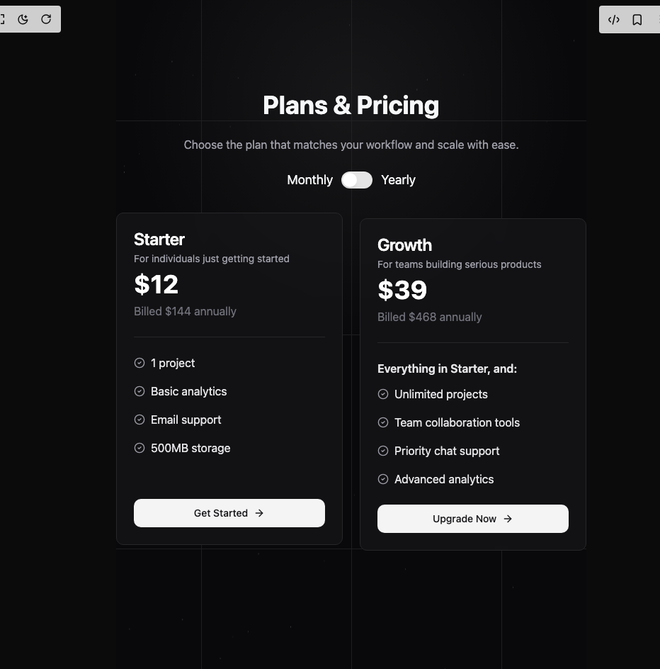

# Build Pricing Cards in BuilderStudio

> Build this component in our Agentic IDE: [BuilderStudio](https://builderstudio.dev).
>
> Join the BuilderStudio community on [Discord](https://discord.gg/QdWeSGCqfe) and [Reddit](https://reddit.com/r/builderstudio).



## Component

- Author group: `uimix`
- Component: `pricing-cards`
- Variant: `default`
- Rendered HTML snapshot: [`rendered.html`](rendered.html)

## BuilderStudio prompt

You are implementing a React component based on a component reference.

## Component identity

- Author: uimix
- Component slug: pricing-cards
- Demo slug: default
- Title: pricing-cards
- Description: 

## Goal

Recreate this component in a React + TypeScript + Tailwind CSS project. Preserve the visual layout, spacing, colors, border radius, shadows, interaction behavior, animation behavior, responsive behavior, and dark mode behavior shown in the rendered demo.

## Implementation requirements

- Use React and TypeScript.
- Use Tailwind CSS classes whenever possible.
- Keep the component self-contained unless the source files require helper components.
- If the source uses CSS variables, custom CSS, animations, or keyframes, include them.
- If the source uses external packages, list and use the required packages.
- Preserve accessibility attributes, button semantics, links, keyboard behavior, and ARIA attributes when visible in the source.
- Do not replace the component with a simplified placeholder.
- Return complete production-ready code.

## Dependencies

No reference metadata available.

## Rendered DOM snapshot

This is the rendered demo HTML extracted from the live preview. Use it to verify structure, class names, visible content, and layout.

```html
<div id="root"><div class="w-screen min-h-screen flex justify-center items-center"><div class="w-screen min-h-screen flex justify-center items-center"><section data-locked="true" class="relative min-h-screen py-24 md:py-32 bg-zinc-950 text-zinc-50 overflow-hidden isolate"><style>
        :where(html, body, #__next){
          margin:0; min-height:100%;
          background:#0b0b0c; color:#f6f7f8; color-scheme:dark;
          overflow-x:hidden; scrollbar-gutter:stable both-edges;
        }
        html{ background:#0b0b0c }
        section[data-locked]{ color:#f6f7f8; color-scheme:dark }
        .accent-lines{position:absolute;inset:0;pointer-events:none;opacity:.7}
        .hline,.vline{position:absolute;background:#27272a}
        .hline{left:0;right:0;height:1px;transform:scaleX(0);transform-origin:50% 50%;animation:drawX .6s ease forwards}
        .vline{top:0;bottom:0;width:1px;transform:scaleY(0);transform-origin:50% 0%;animation:drawY .7s ease forwards}
        .hline:nth-child(1){top:18%;animation-delay:.08s}
        .hline:nth-child(2){top:50%;animation-delay:.16s}
        .hline:nth-child(3){top:82%;animation-delay:.24s}
        .vline:nth-child(4){left:18%;animation-delay:.20s}
        .vline:nth-child(5){left:50%;animation-delay:.28s}
        .vline:nth-child(6){left:82%;animation-delay:.36s}
        @keyframes drawX{to{transform:scaleX(1)}}
        @keyframes drawY{to{transform:scaleY(1)}}
        .card-animate{opacity:0;transform:translateY(12px);animation:fadeUp .6s ease .25s forwards}
        @keyframes fadeUp{to{opacity:1;transform:translateY(0)}}
      </style><div class="pointer-events-none absolute inset-0 [background:radial-gradient(80%_60%_at_50%_15%,rgba(255,255,255,0.06),transparent_60%)]"></div><div aria-hidden="true" class="accent-lines"><div class="hline"></div><div class="hline"></div><div class="hline"></div><div class="vline"></div><div class="vline"></div><div class="vline"></div></div><canvas class="absolute inset-0 w-full h-full opacity-50 pointer-events-none" width="664" height="944" style="width: 664px; height: 944px;"></canvas><div class="relative container"><div class="mx-auto flex max-w-5xl flex-col items-center gap-6 text-center"><h2 class="text-pretty text-4xl font-bold lg:text-6xl">Plans &amp; Pricing</h2><p class="text-zinc-400 lg:text-xl">Choose the plan that matches your workflow and scale with ease.</p><div class="flex items-center gap-3 text-lg">Monthly<button type="button" role="switch" aria-checked="false" data-state="unchecked" value="on" class="peer inline-flex h-6 w-11 shrink-0 cursor-pointer items-center rounded-full border-2 border-transparent transition-colors focus-visible:outline-none focus-visible:ring-2 focus-visible:ring-ring focus-visible:ring-offset-2 focus-visible:ring-offset-background disabled:cursor-not-allowed disabled:opacity-50 data-[state=checked]:bg-primary data-[state=unchecked]:bg-input"><span data-state="unchecked" class="pointer-events-none block h-5 w-5 rounded-full bg-background shadow-lg ring-0 transition-transform data-[state=checked]:translate-x-5 data-[state=unchecked]:translate-x-0"></span></button>Yearly</div><div class="mt-2 flex flex-col items-stretch gap-6 md:flex-row"><div class="rounded-lg border text-card-foreground shadow-sm card-animate flex w-80 flex-col justify-between text-left border-zinc-800 bg-zinc-900/70 backdrop-blur supports-[backdrop-filter]:bg-zinc-900/60" style="animation-delay: 0.25s;"><div class="flex flex-col space-y-1.5 p-6"><h3 class="text-2xl font-semibold leading-none tracking-tight"><p class="text-zinc-50">Starter</p></h3><p class="text-sm text-zinc-400">For individuals just getting started</p><span class="text-4xl font-bold text-white">$12</span><p class="text-zinc-500">Billed $144 annually</p></div><div class="p-6 pt-0"><div data-orientation="horizontal" role="none" class="shrink-0 h-[1px] w-full mb-6 bg-zinc-800"></div><ul class="space-y-4"><li class="flex items-center gap-2 text-zinc-200"><svg xmlns="http://www.w3.org/2000/svg" width="24" height="24" viewBox="0 0 24 24" fill="none" stroke="currentColor" stroke-width="2" stroke-linecap="round" stroke-linejoin="round" class="lucide lucide-circle-check size-4 text-zinc-400" aria-hidden="true"><circle cx="12" cy="12" r="10"></circle><path d="m9 12 2 2 4-4"></path></svg><span>1 project</span></li><li class="flex items-center gap-2 text-zinc-200"><svg xmlns="http://www.w3.org/2000/svg" width="24" height="24" viewBox="0 0 24 24" fill="none" stroke="currentColor" stroke-width="2" stroke-linecap="round" stroke-linejoin="round" class="lucide lucide-circle-check size-4 text-zinc-400" aria-hidden="true"><circle cx="12" cy="12" r="10"></circle><path d="m9 12 2 2 4-4"></path></svg><span>Basic analytics</span></li><li class="flex items-center gap-2 text-zinc-200"><svg xmlns="http://www.w3.org/2000/svg" width="24" height="24" viewBox="0 0 24 24" fill="none" stroke="currentColor" stroke-width="2" stroke-linecap="round" stroke-linejoin="round" class="lucide lucide-circle-check size-4 text-zinc-400" aria-hidden="true"><circle cx="12" cy="12" r="10"></circle><path d="m9 12 2 2 4-4"></path></svg><span>Email support</span></li><li class="flex items-center gap-2 text-zinc-200"><svg xmlns="http://www.w3.org/2000/svg" width="24" height="24" viewBox="0 0 24 24" fill="none" stroke="currentColor" stroke-width="2" stroke-linecap="round" stroke-linejoin="round" class="lucide lucide-circle-check size-4 text-zinc-400" aria-hidden="true"><circle cx="12" cy="12" r="10"></circle><path d="m9 12 2 2 4-4"></path></svg><span>500MB storage</span></li></ul></div><div class="flex items-center p-6 pt-0 mt-auto"><a href="https://builderstudio.dev" target="_blank" rel="noreferrer" class="inline-flex items-center justify-center whitespace-nowrap text-sm font-medium ring-offset-background transition-colors focus-visible:outline-none focus-visible:ring-2 focus-visible:ring-ring focus-visible:ring-offset-2 disabled:pointer-events-none disabled:opacity-50 h-10 px-4 py-2 w-full rounded-lg bg-zinc-100 text-zinc-900 hover:bg-zinc-200">Get Started<svg xmlns="http://www.w3.org/2000/svg" width="24" height="24" viewBox="0 0 24 24" fill="none" stroke="currentColor" stroke-width="2" stroke-linecap="round" stroke-linejoin="round" class="lucide lucide-arrow-right ml-2 size-4" aria-hidden="true"><path d="M5 12h14"></path><path d="m12 5 7 7-7 7"></path></svg></a></div></div><div class="rounded-lg border text-card-foreground shadow-sm card-animate flex w-80 flex-col justify-between text-left border-zinc-800 bg-zinc-900/70 backdrop-blur supports-[backdrop-filter]:bg-zinc-900/60 md:translate-y-2" style="animation-delay: 0.33s;"><div class="flex flex-col space-y-1.5 p-6"><h3 class="text-2xl font-semibold leading-none tracking-tight"><p class="text-zinc-50">Growth</p></h3><p class="text-sm text-zinc-400">For teams building serious products</p><span class="text-4xl font-bold text-white">$39</span><p class="text-zinc-500">Billed $468 annually</p></div><div class="p-6 pt-0"><div data-orientation="horizontal" role="none" class="shrink-0 h-[1px] w-full mb-6 bg-zinc-800"></div><p class="mb-3 font-semibold text-zinc-200">Everything in Starter, and:</p><ul class="space-y-4"><li class="flex items-center gap-2 text-zinc-200"><svg xmlns="http://www.w3.org/2000/svg" width="24" height="24" viewBox="0 0 24 24" fill="none" stroke="currentColor" stroke-width="2" stroke-linecap="round" stroke-linejoin="round" class="lucide lucide-circle-check size-4 text-zinc-400" aria-hidden="true"><circle cx="12" cy="12" r="10"></circle><path d="m9 12 2 2 4-4"></path></svg><span>Unlimited projects</span></li><li class="flex items-center gap-2 text-zinc-200"><svg xmlns="http://www.w3.org/2000/svg" width="24" height="24" viewBox="0 0 24 24" fill="none" stroke="currentColor" stroke-width="2" stroke-linecap="round" stroke-linejoin="round" class="lucide lucide-circle-check size-4 text-zinc-400" aria-hidden="true"><circle cx="12" cy="12" r="10"></circle><path d="m9 12 2 2 4-4"></path></svg><span>Team collaboration tools</span></li><li class="flex items-center gap-2 text-zinc-200"><svg xmlns="http://www.w3.org/2000/svg" width="24" height="24" viewBox="0 0 24 24" fill="none" stroke="currentColor" stroke-width="2" stroke-linecap="round" stroke-linejoin="round" class="lucide lucide-circle-check size-4 text-zinc-400" aria-hidden="true"><circle cx="12" cy="12" r="10"></circle><path d="m9 12 2 2 4-4"></path></svg><span>Priority chat support</span></li><li class="flex items-center gap-2 text-zinc-200"><svg xmlns="http://www.w3.org/2000/svg" width="24" height="24" viewBox="0 0 24 24" fill="none" stroke="currentColor" stroke-width="2" stroke-linecap="round" stroke-linejoin="round" class="lucide lucide-circle-check size-4 text-zinc-400" aria-hidden="true"><circle cx="12" cy="12" r="10"></circle><path d="m9 12 2 2 4-4"></path></svg><span>Advanced analytics</span></li></ul></div><div class="flex items-center p-6 pt-0 mt-auto"><a href="https://builderstudio.dev" target="_blank" rel="noreferrer" class="inline-flex items-center justify-center whitespace-nowrap text-sm font-medium ring-offset-background transition-colors focus-visible:outline-none focus-visible:ring-2 focus-visible:ring-ring focus-visible:ring-offset-2 disabled:pointer-events-none disabled:opacity-50 h-10 px-4 py-2 w-full rounded-lg bg-zinc-100 text-zinc-900 hover:bg-zinc-200">Upgrade Now<svg xmlns="http://www.w3.org/2000/svg" width="24" height="24" viewBox="0 0 24 24" fill="none" stroke="currentColor" stroke-width="2" stroke-linecap="round" stroke-linejoin="round" class="lucide lucide-arrow-right ml-2 size-4" aria-hidden="true"><path d="M5 12h14"></path><path d="m12 5 7 7-7 7"></path></svg></a></div></div></div></div></div></section></div></div></div>
```

## Reference source files

No reference source files were available.
