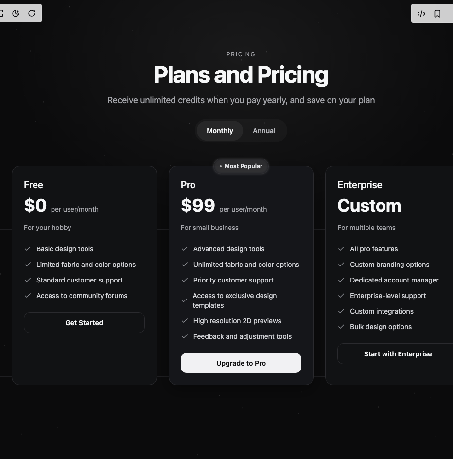

# Build Pricing Cards in BuilderStudio

> Build this component in our Agentic IDE: [BuilderStudio](https://builderstudio.dev).
>
> Join the BuilderStudio community on [Discord](https://discord.gg/QdWeSGCqfe) and [Reddit](https://reddit.com/r/builderstudio).



## Component

- Author group: `uimix`
- Component: `pricing-cards`
- Variant: `pricing-three-plans`
- Rendered HTML snapshot: [`rendered.html`](rendered.html)

## BuilderStudio prompt

You are implementing a React component based on a component reference.

## Component identity

- Author: uimix
- Component slug: pricing-cards
- Demo slug: pricing-three-plans
- Title: pricing-cards
- Description: 

## Goal

Recreate this component in a React + TypeScript + Tailwind CSS project. Preserve the visual layout, spacing, colors, border radius, shadows, interaction behavior, animation behavior, responsive behavior, and dark mode behavior shown in the rendered demo.

## Implementation requirements

- Use React and TypeScript.
- Use Tailwind CSS classes whenever possible.
- Keep the component self-contained unless the source files require helper components.
- If the source uses CSS variables, custom CSS, animations, or keyframes, include them.
- If the source uses external packages, list and use the required packages.
- Preserve accessibility attributes, button semantics, links, keyboard behavior, and ARIA attributes when visible in the source.
- Do not replace the component with a simplified placeholder.
- Return complete production-ready code.

## Dependencies

No reference metadata available.

## Rendered DOM snapshot

This is the rendered demo HTML extracted from the live preview. Use it to verify structure, class names, visible content, and layout.

```html
<div id="root"><div class="w-screen min-h-screen flex justify-center items-center"><div class="w-screen min-h-screen flex justify-center items-center"><section data-locked="true" class="relative w-full min-h-screen overflow-hidden is-ready" style="--bg: #0b0b0c; --text: #f6f7f8; --muted: #a6a7ac; --border: #2a2a2e; --card: #111214; --card-muted: #0f1012; --card-pop: #15161a; --accent-line: #27272a; --glow: rgba(255,255,255,0.08); --btn-primary-bg: #f1f1f3; --btn-primary-fg: #0c0c0d; --btn-ghost-border: #2a2a2e; --btn-ghost-hover: rgba(255,255,255,0.04);"><style>
        :where(html, body, #__next){
          margin:0; min-height:100%; background:var(--bg); color:var(--text);
          overflow-x:hidden; scrollbar-gutter: stable both-edges;
        }
        /* lock dark visuals regardless of OS theme */
        section[data-locked]{background:var(--bg);color:var(--text);color-scheme:dark}
        @media (prefers-color-scheme: light){section[data-locked]{background:var(--bg);color:var(--text);color-scheme:dark}}
        
        .accent-lines{position:absolute;inset:0;pointer-events:none;opacity:.7}
        .accent-lines .hline,.accent-lines .vline{position:absolute;background:var(--accent-line);animation-fill-mode:forwards}
        .accent-lines .hline{left:0;right:0;height:1px;transform:scaleX(0);transform-origin:50% 50%}
        .accent-lines .vline{top:0;bottom:0;width:1px;transform:scaleY(0);transform-origin:50% 0%}
        .is-ready .accent-lines .hline:nth-of-type(1){top:18%;animation:drawX .6s ease .08s forwards}
        .is-ready .accent-lines .hline:nth-of-type(2){top:50%;animation:drawX .6s ease .16s forwards}
        .is-ready .accent-lines .hline:nth-of-type(3){top:82%;animation:drawX .6s ease .24s forwards}
        .is-ready .accent-lines .vline:nth-of-type(1){left:18%;animation:drawY .7s ease .20s forwards}
        .is-ready .accent-lines .vline:nth-of-type(2){left:50%;animation:drawY .7s ease .28s forwards}
        .is-ready .accent-lines .vline:nth-of-type(3){left:82%;animation:drawY .7s ease .36s forwards}
        @keyframes drawX{to{transform:scaleX(1)}}
        @keyframes drawY{to{transform:scaleY(1)}}
        .kicker,.title,.subtitle{opacity:0;transform:translateY(8px)}
        .is-ready .kicker{animation:kIn .5s ease .08s forwards;letter-spacing:.22em}
        .is-ready .title{animation:tIn .6s cubic-bezier(.22,1,.36,1) .16s forwards}
        .is-ready .subtitle{animation:sIn .6s ease .26s forwards}
        @keyframes kIn{to{opacity:.9;transform:none;letter-spacing:.14em}}
        @keyframes tIn{to{opacity:1;transform:none}}
        @keyframes sIn{to{opacity:1;transform:none}}
        .card{background:var(--card);border:1px solid var(--border);border-radius:16px}
        .card-pop{background:var(--card-pop);border:1px solid var(--border);border-radius:16px;transform:scale(1.02);box-shadow:0 10px 30px rgba(0,0,0,.35);backdrop-filter:blur(6px)}
        .card-muted{background:var(--card-muted)}
        .card-animate{opacity:0;transform:translateY(12px)}
        .is-ready .card-animate{animation:fadeUp .6s ease forwards}
        @keyframes fadeUp{to{opacity:1;transform:translateY(0)}}
        .btn-primary{width:100%;border-radius:12px;padding:10px 16px;font-weight:600;font-size:14px;background:var(--btn-primary-bg);color:var(--btn-primary-fg);transition:transform .15s ease,filter .15s ease,background .2s ease}
        .btn-primary:hover{filter:brightness(.95)}
        .btn-primary:active{transform:translateY(1px)}
        .btn-ghost{width:100%;border-radius:12px;padding:10px 16px;font-weight:600;font-size:14px;color:var(--text);border:1px solid var(--btn-ghost-border);background:transparent;transition:background .2s ease,transform .15s ease}
        .btn-ghost:hover{background:var(--btn-ghost-hover)}
        .btn-ghost:active{transform:translateY(1px)}
        .chip{position:relative;border:1px solid var(--border);background:rgba(17,18,20,.6);color:#e6e7ea;border-radius:9999px;padding:6px 12px;font-size:12px;font-weight:500}
        .chip::before{content:"";position:absolute;inset:0;border-radius:9999px;background:var(--glow);filter:blur(2px)}
        .vignette{position:absolute;inset:0;pointer-events:none;background:radial-gradient(80% 60% at 50% 12%, rgba(255,255,255,.06), transparent 60%)}
      </style><div class="vignette"></div><div aria-hidden="true" class="accent-lines"><div class="hline"></div><div class="hline"></div><div class="hline"></div><div class="vline"></div><div class="vline"></div><div class="vline"></div></div><canvas class="absolute inset-0 h-full w-full opacity-50 pointer-events-none" width="992" height="944"></canvas><div class="relative mt-14"><div class="mx-auto max-w-7xl px-4 sm:px-6 lg:px-8 py-12"><div class="text-center mx-auto mb-12 max-w-3xl"><div class="kicker mb-2 text-xs uppercase tracking-[0.14em]" style="color: rgb(181, 182, 187);">Pricing</div><h1 class="title mb-4 text-4xl md:text-5xl lg:text-6xl font-bold tracking-tight" style="color: var(--text);">Plans and Pricing</h1><p class="subtitle mb-6 text-lg" style="color: var(--muted);">Receive unlimited credits when you pay yearly, and save on your plan</p><div class="subtitle inline-flex items-center rounded-full p-1" style="background: rgba(255, 255, 255, 0.03);"><button aria-pressed="true" style="padding: 10px 20px; border-radius: 9999px; font-size: 14px; font-weight: 600; background: rgba(255, 255, 255, 0.06); color: var(--text); transition: background 0.2s, color 0.2s;">Monthly</button><button aria-pressed="false" style="padding: 10px 20px; border-radius: 9999px; font-size: 14px; font-weight: 600; background: transparent; color: rgb(181, 182, 187); transition: background 0.2s, color 0.2s;">Annual</button></div></div><div class="mx-auto grid max-w-7xl grid-cols-1 gap-6 md:grid-cols-3"><div class="card-animate card" style="padding: 24px; animation-delay: 0.32s;"><div class="mb-6"><h3 class="mb-2 text-xl font-medium" style="color: var(--text);">Free</h3><div class="flex items-baseline gap-2"><span class="text-4xl font-bold" style="color: var(--text);">$0</span><span class="text-sm" style="color: var(--muted);">per user/month</span></div><p class="mt-4 text-sm" style="color: var(--muted);">For your hobby</p></div><div class="mb-6 space-y-3"><div class="flex items-center gap-2.5"><svg xmlns="http://www.w3.org/2000/svg" width="24" height="24" viewBox="0 0 24 24" fill="none" stroke="currentColor" stroke-width="2" stroke-linecap="round" stroke-linejoin="round" class="lucide lucide-check h-4 w-4" aria-hidden="true" style="color: rgb(142, 144, 150);"><path d="M20 6 9 17l-5-5"></path></svg><span class="text-sm" style="color: rgb(212, 213, 217);">Basic design tools</span></div><div class="flex items-center gap-2.5"><svg xmlns="http://www.w3.org/2000/svg" width="24" height="24" viewBox="0 0 24 24" fill="none" stroke="currentColor" stroke-width="2" stroke-linecap="round" stroke-linejoin="round" class="lucide lucide-check h-4 w-4" aria-hidden="true" style="color: rgb(142, 144, 150);"><path d="M20 6 9 17l-5-5"></path></svg><span class="text-sm" style="color: rgb(212, 213, 217);">Limited fabric and color options</span></div><div class="flex items-center gap-2.5"><svg xmlns="http://www.w3.org/2000/svg" width="24" height="24" viewBox="0 0 24 24" fill="none" stroke="currentColor" stroke-width="2" stroke-linecap="round" stroke-linejoin="round" class="lucide lucide-check h-4 w-4" aria-hidden="true" style="color: rgb(142, 144, 150);"><path d="M20 6 9 17l-5-5"></path></svg><span class="text-sm" style="color: rgb(212, 213, 217);">Standard customer support</span></div><div class="flex items-center gap-2.5"><svg xmlns="http://www.w3.org/2000/svg" width="24" height="24" viewBox="0 0 24 24" fill="none" stroke="currentColor" stroke-width="2" stroke-linecap="round" stroke-linejoin="round" class="lucide lucide-check h-4 w-4" aria-hidden="true" style="color: rgb(142, 144, 150);"><path d="M20 6 9 17l-5-5"></path></svg><span class="text-sm" style="color: rgb(212, 213, 217);">Access to community forums</span></div></div><button class="btn-ghost">Get Started</button></div><div class="card-animate card-pop" style="padding: 24px; animation-delay: 0.4s;"><div class="absolute -top-4 left-1/2 -translate-x-1/2"><div class="relative"><div class="absolute inset-0 rounded-full" style="background: rgba(255, 255, 255, 0.1); filter: blur(2px);"></div><div class="relative chip px-4 py-1.5" style="border-radius: 9999px; background: rgba(20, 20, 24, 0.6);"><div class="relative z-10 flex items-center gap-1.5"><span class="inline-block h-1 w-1 animate-pulse rounded-full" style="background: rgba(255, 255, 255, 0.7);"></span><span style="font-size: 12px; font-weight: 600; color: rgb(230, 231, 234);">Most Popular</span></div></div></div></div><div class="mb-6"><h3 class="mb-2 text-xl font-medium" style="color: var(--text);">Pro</h3><div class="flex items-baseline gap-2"><span class="text-4xl font-bold" style="color: var(--text);">$99</span><span class="text-sm" style="color: var(--muted);">per user/month</span></div><p class="mt-4 text-sm" style="color: var(--muted);">For small business</p></div><div class="mb-6 space-y-3"><div class="flex items-center gap-2.5"><svg xmlns="http://www.w3.org/2000/svg" width="24" height="24" viewBox="0 0 24 24" fill="none" stroke="currentColor" stroke-width="2" stroke-linecap="round" stroke-linejoin="round" class="lucide lucide-check h-4 w-4" aria-hidden="true" style="color: rgb(142, 144, 150);"><path d="M20 6 9 17l-5-5"></path></svg><span class="text-sm" style="color: rgb(212, 213, 217);">Advanced design tools</span></div><div class="flex items-center gap-2.5"><svg xmlns="http://www.w3.org/2000/svg" width="24" height="24" viewBox="0 0 24 24" fill="none" stroke="currentColor" stroke-width="2" stroke-linecap="round" stroke-linejoin="round" class="lucide lucide-check h-4 w-4" aria-hidden="true" style="color: rgb(142, 144, 150);"><path d="M20 6 9 17l-5-5"></path></svg><span class="text-sm" style="color: rgb(212, 213, 217);">Unlimited fabric and color options</span></div><div class="flex items-center gap-2.5"><svg xmlns="http://www.w3.org/2000/svg" width="24" height="24" viewBox="0 0 24 24" fill="none" stroke="currentColor" stroke-width="2" stroke-linecap="round" stroke-linejoin="round" class="lucide lucide-check h-4 w-4" aria-hidden="true" style="color: rgb(142, 144, 150);"><path d="M20 6 9 17l-5-5"></path></svg><span class="text-sm" style="color: rgb(212, 213, 217);">Priority customer support</span></div><div class="flex items-center gap-2.5"><svg xmlns="http://www.w3.org/2000/svg" width="24" height="24" viewBox="0 0 24 24" fill="none" stroke="currentColor" stroke-width="2" stroke-linecap="round" stroke-linejoin="round" class="lucide lucide-check h-4 w-4" aria-hidden="true" style="color: rgb(142, 144, 150);"><path d="M20 6 9 17l-5-5"></path></svg><span class="text-sm" style="color: rgb(212, 213, 217);">Access to exclusive design templates</span></div><div class="flex items-center gap-2.5"><svg xmlns="http://www.w3.org/2000/svg" width="24" height="24" viewBox="0 0 24 24" fill="none" stroke="currentColor" stroke-width="2" stroke-linecap="round" stroke-linejoin="round" class="lucide lucide-check h-4 w-4" aria-hidden="true" style="color: rgb(142, 144, 150);"><path d="M20 6 9 17l-5-5"></path></svg><span class="text-sm" style="color: rgb(212, 213, 217);">High resolution 2D previews</span></div><div class="flex items-center gap-2.5"><svg xmlns="http://www.w3.org/2000/svg" width="24" height="24" viewBox="0 0 24 24" fill="none" stroke="currentColor" stroke-width="2" stroke-linecap="round" stroke-linejoin="round" class="lucide lucide-check h-4 w-4" aria-hidden="true" style="color: rgb(142, 144, 150);"><path d="M20 6 9 17l-5-5"></path></svg><span class="text-sm" style="color: rgb(212, 213, 217);">Feedback and adjustment tools</span></div></div><button class="btn-primary">Upgrade to Pro</button></div><div class="card-animate card" style="padding: 24px; animation-delay: 0.48s;"><div class="mb-6"><h3 class="mb-2 text-xl font-medium" style="color: var(--text);">Enterprise</h3><div class="flex items-baseline gap-2"><span class="text-4xl font-bold" style="color: var(--text);">Custom</span></div><p class="mt-4 text-sm" style="color: var(--muted);">For multiple teams</p></div><div class="mb-6 space-y-3"><div class="flex items-center gap-2.5"><svg xmlns="http://www.w3.org/2000/svg" width="24" height="24" viewBox="0 0 24 24" fill="none" stroke="currentColor" stroke-width="2" stroke-linecap="round" stroke-linejoin="round" class="lucide lucide-check h-4 w-4" aria-hidden="true" style="color: rgb(142, 144, 150);"><path d="M20 6 9 17l-5-5"></path></svg><span class="text-sm" style="color: rgb(212, 213, 217);">All pro features</span></div><div class="flex items-center gap-2.5"><svg xmlns="http://www.w3.org/2000/svg" width="24" height="24" viewBox="0 0 24 24" fill="none" stroke="currentColor" stroke-width="2" stroke-linecap="round" stroke-linejoin="round" class="lucide lucide-check h-4 w-4" aria-hidden="true" style="color: rgb(142, 144, 150);"><path d="M20 6 9 17l-5-5"></path></svg><span class="text-sm" style="color: rgb(212, 213, 217);">Custom branding options</span></div><div class="flex items-center gap-2.5"><svg xmlns="http://www.w3.org/2000/svg" width="24" height="24" viewBox="0 0 24 24" fill="none" stroke="currentColor" stroke-width="2" stroke-linecap="round" stroke-linejoin="round" class="lucide lucide-check h-4 w-4" aria-hidden="true" style="color: rgb(142, 144, 150);"><path d="M20 6 9 17l-5-5"></path></svg><span class="text-sm" style="color: rgb(212, 213, 217);">Dedicated account manager</span></div><div class="flex items-center gap-2.5"><svg xmlns="http://www.w3.org/2000/svg" width="24" height="24" viewBox="0 0 24 24" fill="none" stroke="currentColor" stroke-width="2" stroke-linecap="round" stroke-linejoin="round" class="lucide lucide-check h-4 w-4" aria-hidden="true" style="color: rgb(142, 144, 150);"><path d="M20 6 9 17l-5-5"></path></svg><span class="text-sm" style="color: rgb(212, 213, 217);">Enterprise-level support</span></div><div class="flex items-center gap-2.5"><svg xmlns="http://www.w3.org/2000/svg" width="24" height="24" viewBox="0 0 24 24" fill="none" stroke="currentColor" stroke-width="2" stroke-linecap="round" stroke-linejoin="round" class="lucide lucide-check h-4 w-4" aria-hidden="true" style="color: rgb(142, 144, 150);"><path d="M20 6 9 17l-5-5"></path></svg><span class="text-sm" style="color: rgb(212, 213, 217);">Custom integrations</span></div><div class="flex items-center gap-2.5"><svg xmlns="http://www.w3.org/2000/svg" width="24" height="24" viewBox="0 0 24 24" fill="none" stroke="currentColor" stroke-width="2" stroke-linecap="round" stroke-linejoin="round" class="lucide lucide-check h-4 w-4" aria-hidden="true" style="color: rgb(142, 144, 150);"><path d="M20 6 9 17l-5-5"></path></svg><span class="text-sm" style="color: rgb(212, 213, 217);">Bulk design options</span></div></div><button class="btn-ghost">Start with Enterprise</button></div></div></div></div></section></div></div></div>
```

## Reference source files

No reference source files were available.
