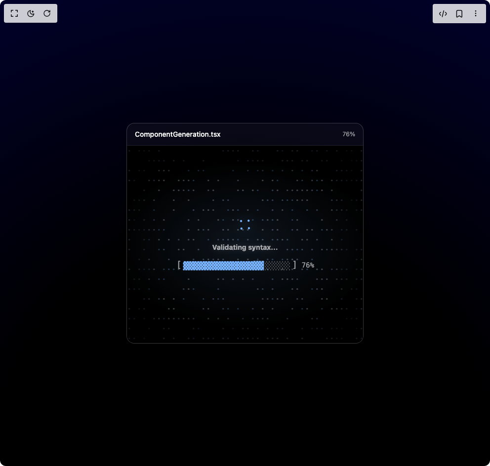

# Build Processing Card in BuilderStudio

> Build this component in our Agentic IDE: [BuilderStudio](https://builderstudio.dev).
>
> Join the BuilderStudio community on [Discord](https://discord.gg/QdWeSGCqfe) and [Reddit](https://reddit.com/r/builderstudio).



## Component

- Author group: `uimix`
- Component: `processing-card`
- Variant: `default`
- Rendered HTML snapshot: [`rendered.html`](rendered.html)

## BuilderStudio prompt

You are implementing a React component based on a component reference.

## Component identity

- Author: uimix
- Component slug: processing-card
- Demo slug: default
- Title: processing-card
- Description: 

## Goal

Recreate this component in a React + TypeScript + Tailwind CSS project. Preserve the visual layout, spacing, colors, border radius, shadows, interaction behavior, animation behavior, responsive behavior, and dark mode behavior shown in the rendered demo.

## Implementation requirements

- Use React and TypeScript.
- Use Tailwind CSS classes whenever possible.
- Keep the component self-contained unless the source files require helper components.
- If the source uses CSS variables, custom CSS, animations, or keyframes, include them.
- If the source uses external packages, list and use the required packages.
- Preserve accessibility attributes, button semantics, links, keyboard behavior, and ARIA attributes when visible in the source.
- Do not replace the component with a simplified placeholder.
- Return complete production-ready code.

## Dependencies

No reference metadata available.

## Rendered DOM snapshot

This is the rendered demo HTML extracted from the live preview. Use it to verify structure, class names, visible content, and layout.

```html
<div id="root"><div class="w-screen min-h-screen flex justify-center items-center"><div class="w-screen min-h-screen flex justify-center items-center"><div class="min-h-screen w-full relative flex items-center justify-center"><div class="absolute inset-0 z-0" style="background: radial-gradient(125% 125% at 50% 100%, rgb(0, 0, 0) 40%, rgb(1, 1, 51) 100%);"></div><div class="relative z-10 flex flex-col items-center space-y-4"><div class="w-[480px]"><div class="w-full rounded-2xl border overflow-hidden shadow-lg bg-[#0b0b0f] text-white border-white/10 rounded-2xl border border-white/20 shadow-lg bg-white/[0.03]"><div class="flex items-center justify-between px-4 py-3 border-b border-white/10"><div class="text-sm font-medium text-white truncate">ComponentGeneration.tsx</div><div class="text-xs text-white/60">76%</div></div><div class="relative h-[400px] w-full bg-black text-white overflow-hidden"><div class="absolute inset-0 opacity-25 z-10"><div class="relative w-full h-full bg-black overflow-hidden"><canvas class="block w-full h-full" width="478" height="400" style="width: 478px; height: 400px;"></canvas></div><div class="absolute inset-0 pointer-events-none"><div class="absolute top-0 left-0 w-full h-16 bg-gradient-to-b from-black/90 via-black/70 to-transparent blur-lg"></div><div class="absolute bottom-0 left-0 w-full h-16 bg-gradient-to-t from-black/90 via-black/70 to-transparent blur-lg"></div><div class="absolute top-0 left-0 w-16 h-full bg-gradient-to-r from-black/90 via-black/70 to-transparent blur-lg"></div><div class="absolute top-0 right-0 w-16 h-full bg-gradient-to-l from-black/90 via-black/70 to-transparent blur-lg"></div></div></div><div class="absolute inset-0 z-0" style="background: radial-gradient(80% 60%, rgba(120, 180, 255, 0.15), transparent 70%), rgb(0, 0, 0);"></div><div class="relative z-20 flex flex-col items-center justify-center h-full"><div class="mb-4"><div class="w-8 h-8 drop-shadow-[0_0_8px_rgba(120,180,255,0.4)]"><div class="custom-loader-5 size-md"><span></span></div></div></div><p class="text-sm font-bold text-center text-white mb-4 drop-shadow-[0_0_6px_rgba(229,231,235,0.2)]" style="opacity: 0; transform: translateY(5.03296px);">Validating syntax...</p><div class="font-mono text-lg"><div class="flex items-center text-white/80"><span class="text-white/60 mr-1">[</span><div class="flex"><span class="text-[#78b4ff]" style="opacity: 1; transform: none;">▓</span><span class="text-[#78b4ff]" style="opacity: 1; transform: none;">▓</span><span class="text-[#78b4ff]" style="opacity: 1; transform: none;">▓</span><span class="text-[#78b4ff]" style="opacity: 1; transform: none;">▓</span><span class="text-[#78b4ff]" style="opacity: 1; transform: none;">▓</span><span class="text-[#78b4ff]" style="opacity: 1; transform: none;">▓</span><span class="text-[#78b4ff]" style="opacity: 1; transform: none;">▓</span><span class="text-[#78b4ff]" style="opacity: 1; transform: none;">▓</span><span class="text-[#78b4ff]" style="opacity: 1; transform: none;">▓</span><span class="text-[#78b4ff]" style="opacity: 1; transform: none;">▓</span><span class="text-[#78b4ff]" style="opacity: 1; transform: none;">▓</span><span class="text-[#78b4ff]" style="opacity: 1; transform: none;">▓</span><span class="text-[#78b4ff]" style="opacity: 1; transform: none;">▓</span><span class="text-[#78b4ff]" style="opacity: 1; transform: scale(1.05671);">▓</span><span class="text-[#78b4ff]" style="opacity: 1; transform: scale(1.05671);">▓</span><span class="text-white/30" style="opacity: 1; transform: none;">░</span><span class="text-white/30" style="opacity: 1; transform: none;">░</span><span class="text-white/30" style="opacity: 1; transform: none;">░</span><span class="text-white/30" style="opacity: 1; transform: none;">░</span><span class="text-white/30" style="opacity: 1; transform: none;">░</span></div><span class="text-white/60 ml-1">]</span><span class="text-white/60 ml-2 text-sm">76%</span></div></div></div></div></div></div></div></div></div></div></div>
```

## Reference source files

No reference source files were available.
