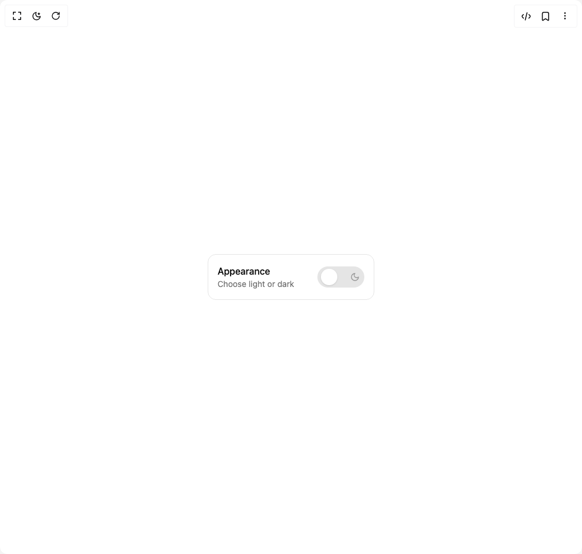

# Build Theme Switch in BuilderStudio

> Build this component in our Agentic IDE: [BuilderStudio](https://builderstudio.dev).
>
> Join the BuilderStudio community on [Discord](https://discord.gg/QdWeSGCqfe) and [Reddit](https://reddit.com/r/builderstudio).



## Component

- Author group: `uimix`
- Component: `theme-switch`
- Variant: `theme-switch-with-label`
- Rendered HTML snapshot: [`rendered.html`](rendered.html)

## BuilderStudio prompt

You are implementing a React component based on a component reference.

## Component identity

- Author: uimix
- Component slug: theme-switch
- Demo slug: theme-switch-with-label
- Title: theme-switch
- Description: 

## Goal

Recreate this component in a React + TypeScript + Tailwind CSS project. Preserve the visual layout, spacing, colors, border radius, shadows, interaction behavior, animation behavior, responsive behavior, and dark mode behavior shown in the rendered demo.

## Implementation requirements

- Use React and TypeScript.
- Use Tailwind CSS classes whenever possible.
- Keep the component self-contained unless the source files require helper components.
- If the source uses CSS variables, custom CSS, animations, or keyframes, include them.
- If the source uses external packages, list and use the required packages.
- Preserve accessibility attributes, button semantics, links, keyboard behavior, and ARIA attributes when visible in the source.
- Do not replace the component with a simplified placeholder.
- Return complete production-ready code.

## Dependencies

No reference metadata available.

## Rendered DOM snapshot

This is the rendered demo HTML extracted from the live preview. Use it to verify structure, class names, visible content, and layout.

```html
<div id="root"><div class="w-screen min-h-screen flex justify-center items-center"><div class="w-screen min-h-screen flex justify-center items-center"><div class="min-h-[50vh] grid place-items-center px-6"><div class="flex items-center gap-4 rounded-xl border p-4"><div class="grid"><span class="font-medium">Appearance</span><span class="text-sm text-muted-foreground">Choose light or dark</span></div><div class="relative flex items-center justify-center h-9 w-20 ml-6"><button type="button" role="switch" aria-checked="false" data-state="unchecked" value="on" class="peer inline-flex shrink-0 cursor-pointer items-center border-2 border-transparent focus-visible:ring-offset-background disabled:cursor-not-allowed disabled:opacity-50 data-[state=checked]:bg-primary data-[state=unchecked]:bg-input peer absolute inset-0 h-full w-full rounded-full bg-input/50 transition-colors focus-visible:outline-none focus-visible:ring-2 focus-visible:ring-ring focus-visible:ring-offset-2 [&amp;&gt;span]:h-7 [&amp;&gt;span]:w-7 [&amp;&gt;span]:rounded-full [&amp;&gt;span]:bg-background [&amp;&gt;span]:shadow [&amp;&gt;span]:z-10 data-[state=unchecked]:[&amp;&gt;span]:translate-x-1 data-[state=checked]:[&amp;&gt;span]:translate-x-[44px]"><span data-state="unchecked" class="pointer-events-none block h-5 w-5 rounded-full bg-background shadow-lg ring-0 transition-transform data-[state=checked]:translate-x-5 data-[state=unchecked]:translate-x-0"></span></button><span class="pointer-events-none absolute left-2 inset-y-0 z-0 flex items-center justify-center"><svg xmlns="http://www.w3.org/2000/svg" width="16" height="16" viewBox="0 0 24 24" fill="none" stroke="currentColor" stroke-width="2" stroke-linecap="round" stroke-linejoin="round" class="lucide lucide-sun transition-all duration-200 ease-out text-foreground scale-110" aria-hidden="true"><circle cx="12" cy="12" r="4"></circle><path d="M12 2v2"></path><path d="M12 20v2"></path><path d="m4.93 4.93 1.41 1.41"></path><path d="m17.66 17.66 1.41 1.41"></path><path d="M2 12h2"></path><path d="M20 12h2"></path><path d="m6.34 17.66-1.41 1.41"></path><path d="m19.07 4.93-1.41 1.41"></path></svg></span><span class="pointer-events-none absolute right-2 inset-y-0 z-0 flex items-center justify-center"><svg xmlns="http://www.w3.org/2000/svg" width="16" height="16" viewBox="0 0 24 24" fill="none" stroke="currentColor" stroke-width="2" stroke-linecap="round" stroke-linejoin="round" class="lucide lucide-moon transition-all duration-200 ease-out text-muted-foreground/70" aria-hidden="true"><path d="M12 3a6 6 0 0 0 9 9 9 9 0 1 1-9-9Z"></path></svg></span></div></div></div></div></div></div>
```

## Reference source files

No reference source files were available.
