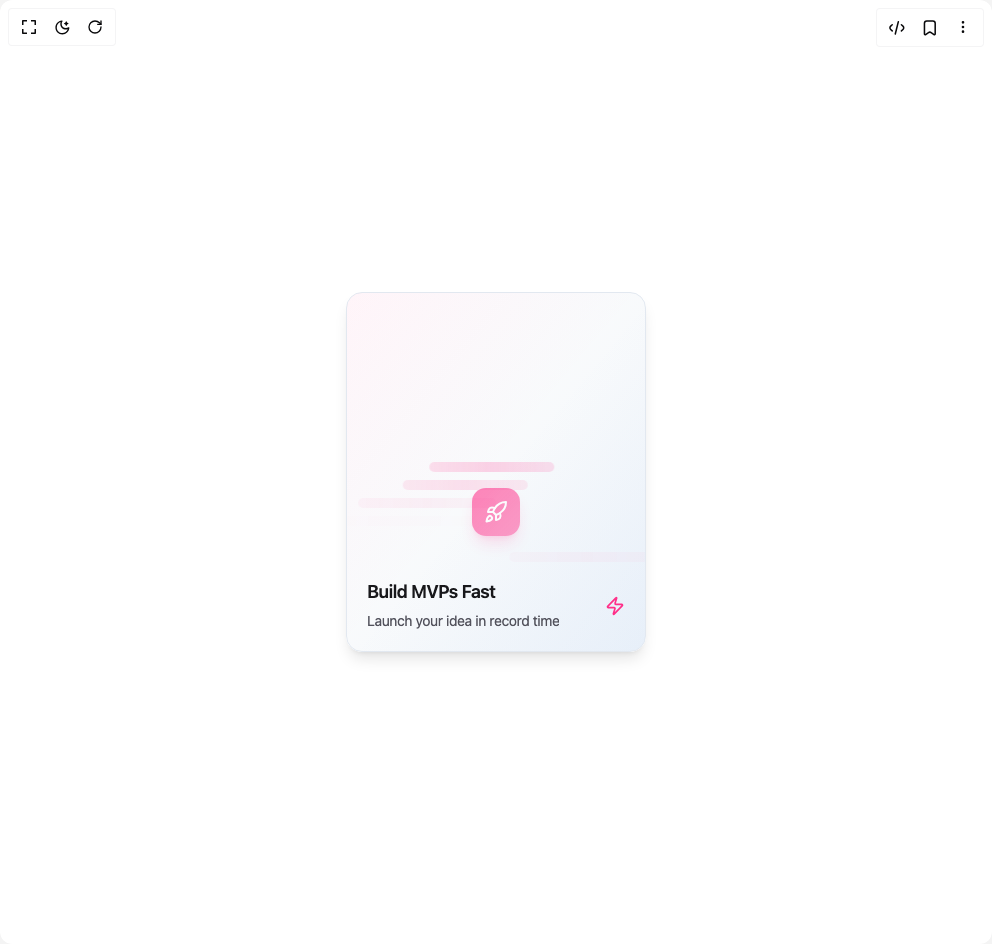
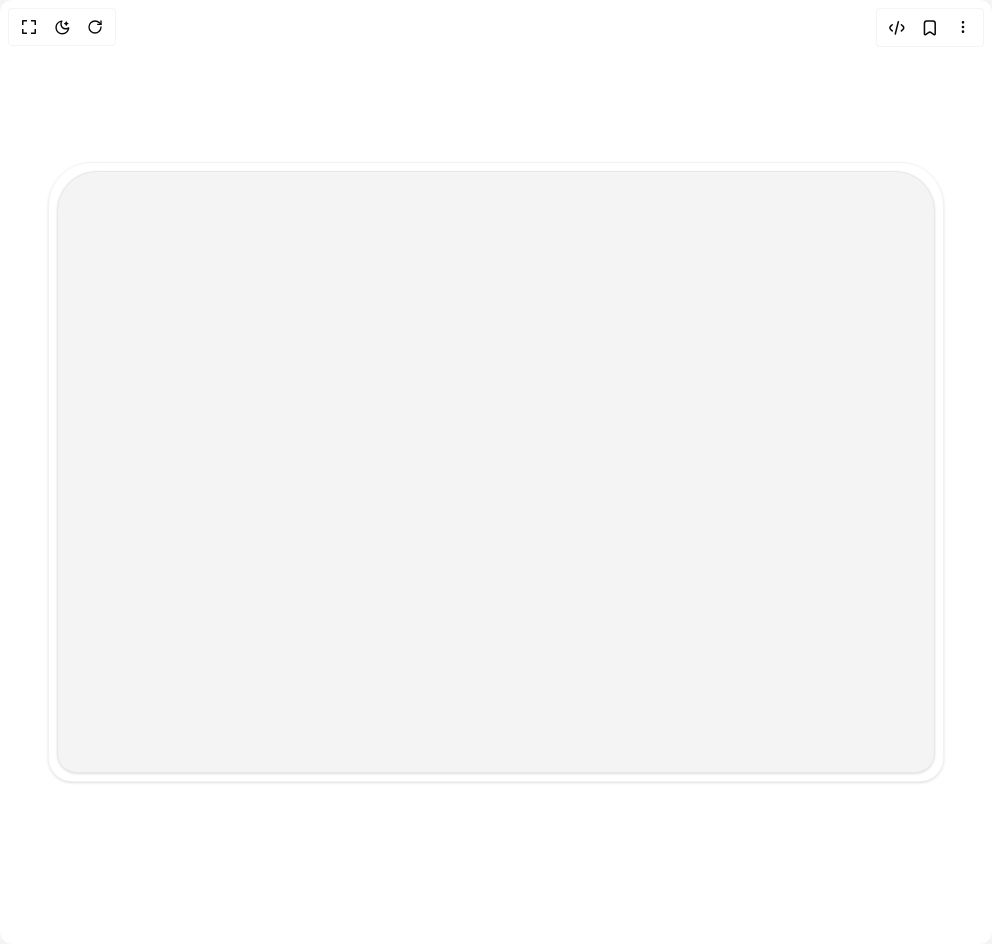
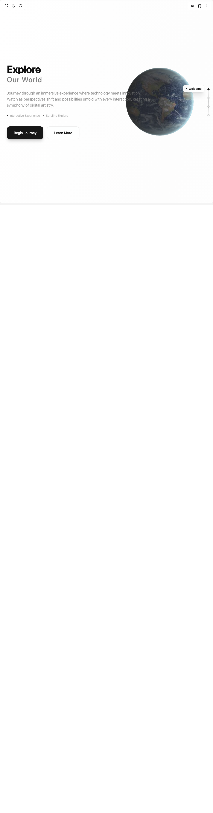
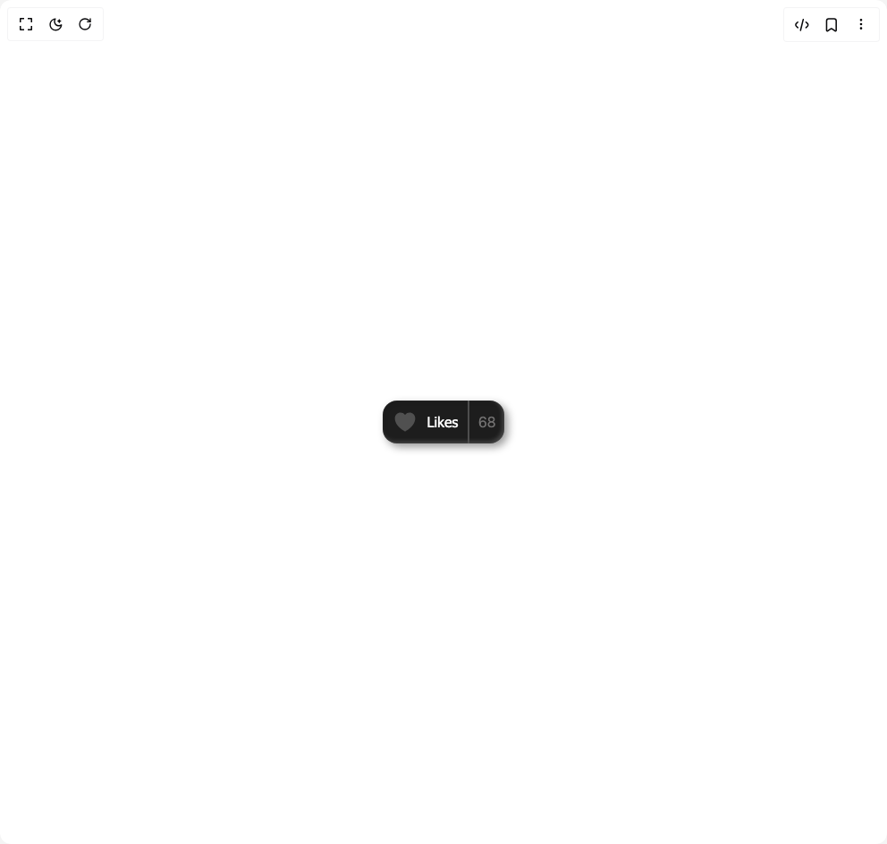
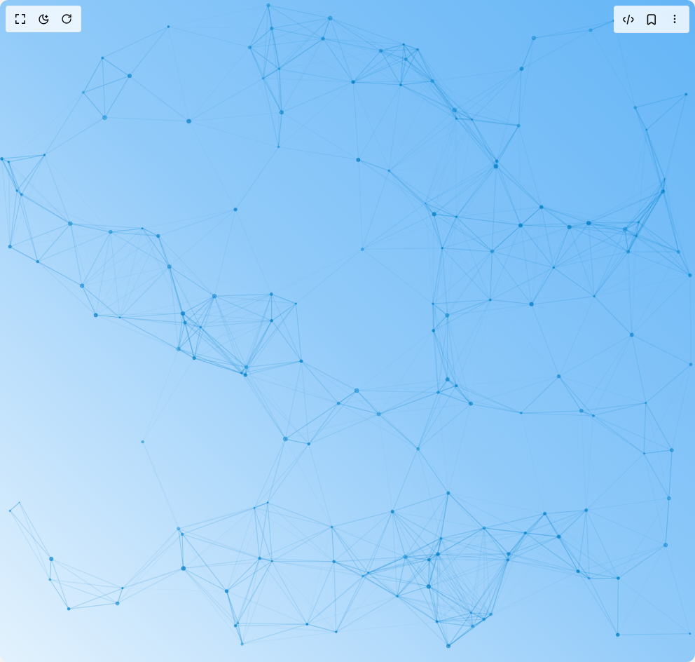
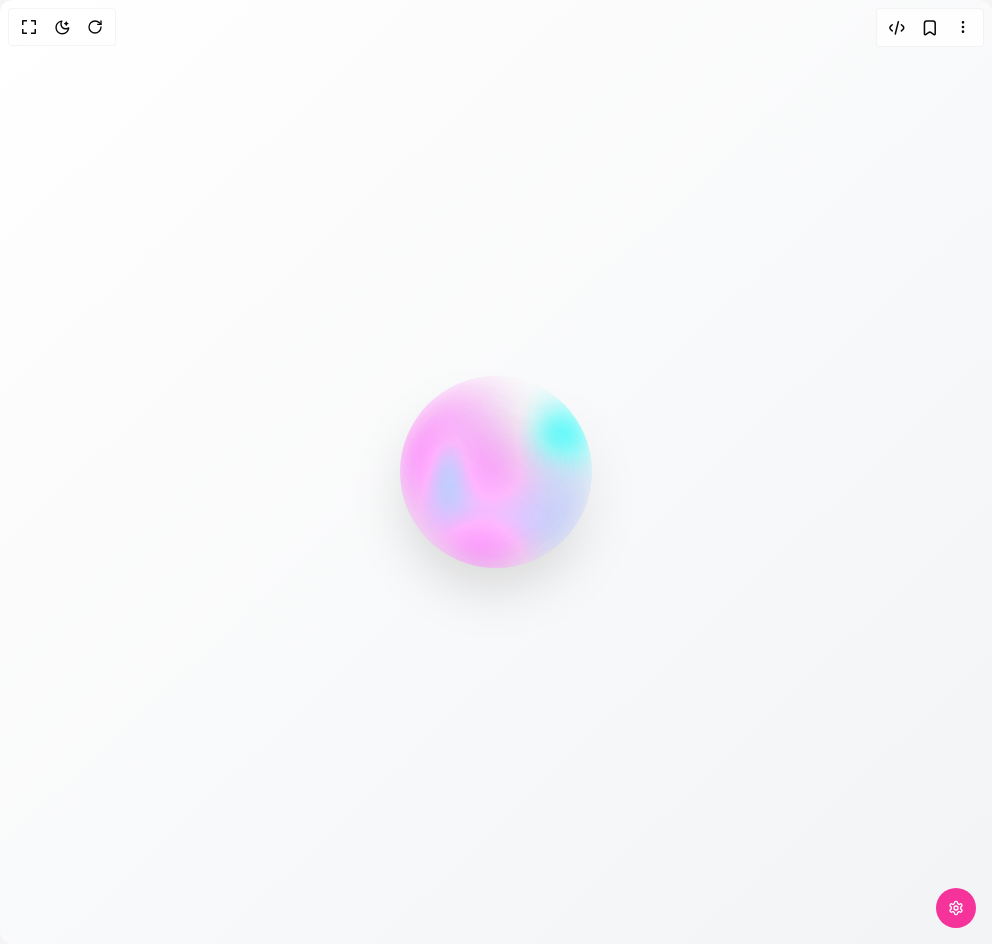
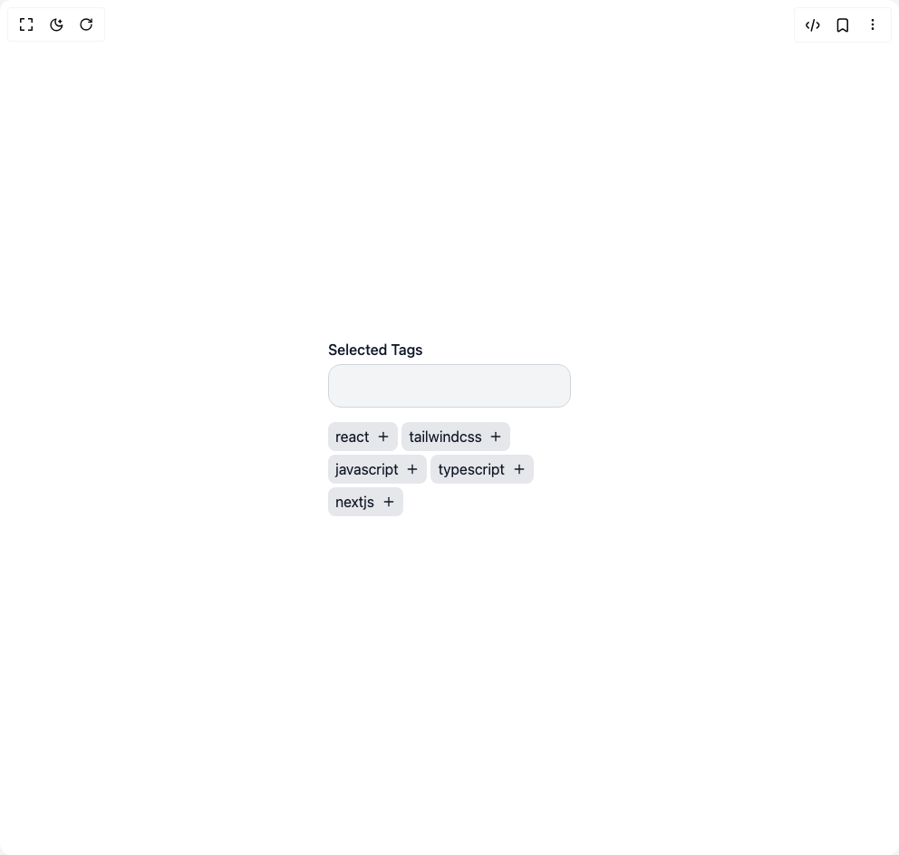
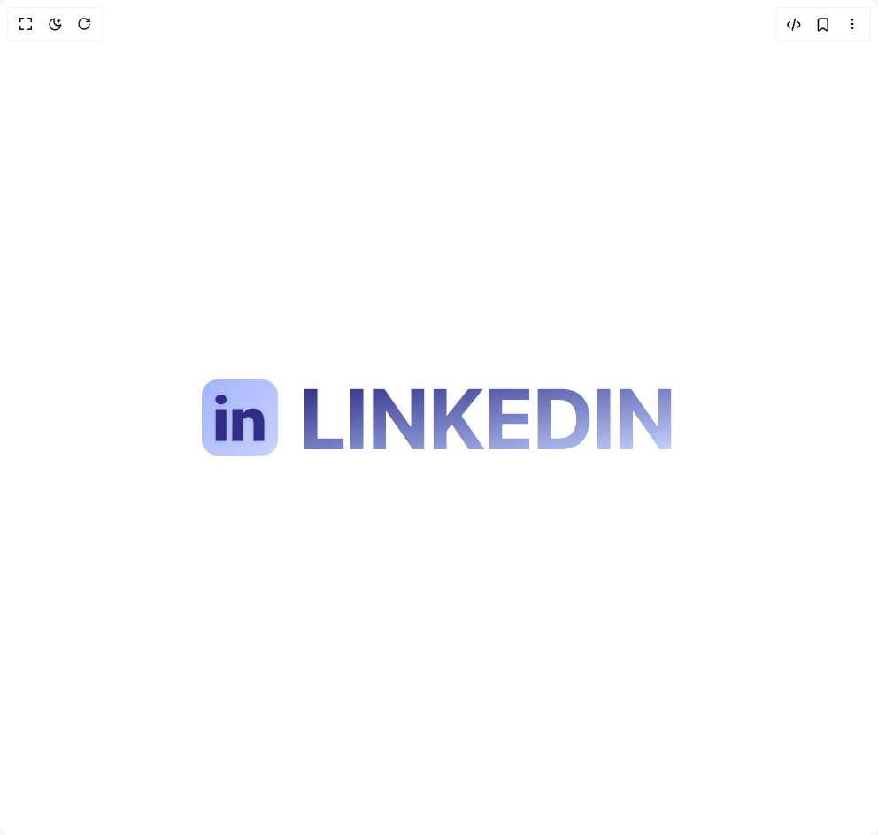
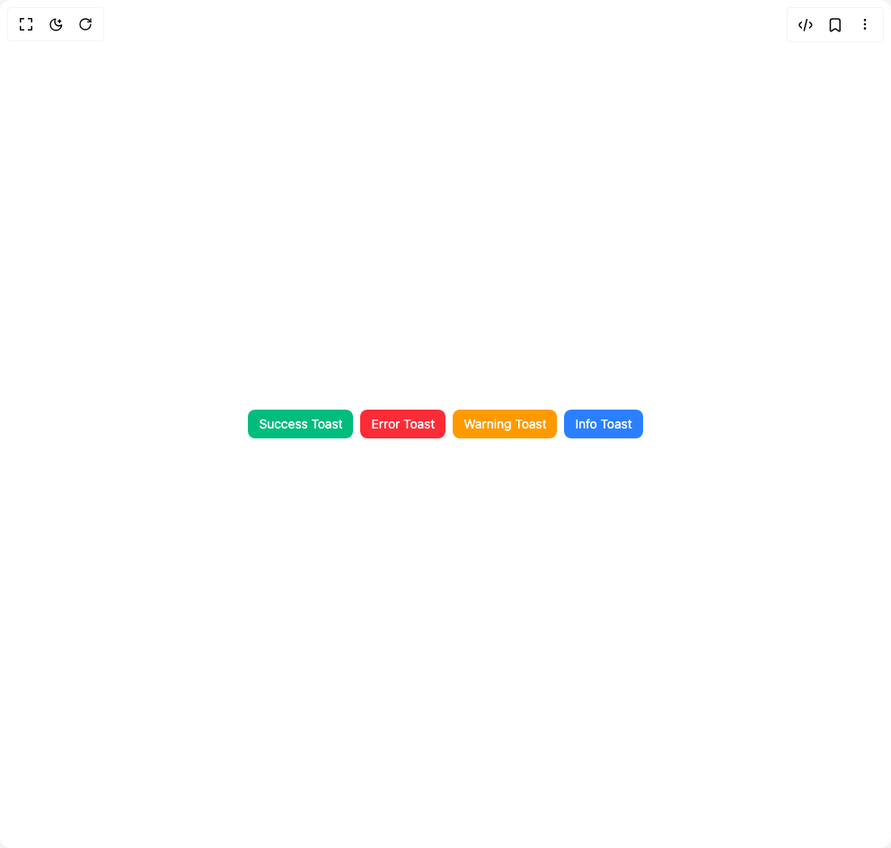

# Umairxd Components

14 components are available in this author group.

> Build any component in [BuilderStudio](https://builderstudio.dev), then share improvements with the community on [Discord](https://discord.gg/QdWeSGCqfe) or [Reddit](https://reddit.com/r/builderstudio).

| Preview | Component | Variant |
| --- | --- | --- |
|  | [Dark Mode Toggle](dark-mode-toggle/default/README.md) | `default` |
|  | [Flip Card](flip-card/default/README.md) | `default` |
|  | [Image Cursor Trail](image-cursor-trail/default/README.md) | `default` |
|  | [Landing Page](landing-page/default/README.md) | `default` |
|  | [Like Button](like-button/default/README.md) | `default` |
|  | [Particles Bg](particles-bg/default/README.md) | `default` |
|  | [Send Button](send-button/default/README.md) | `default` |
|  | [Share Button](share-button/default/README.md) | `default` |
|  | [Siri Orb](siri-orb/default/README.md) | `default` |
|  | [Star Button](star-button/default/README.md) | `default` |
|  | [Tags Select](tags-select/default/README.md) | `default` |
|  | [Text Swiper](text-swiper/default/README.md) | `default` |
|  | [Toast Buttons](toast-buttons/default/README.md) | `default` |
|  | [Tunnel Hero](tunnel-hero/default/README.md) | `default` |
