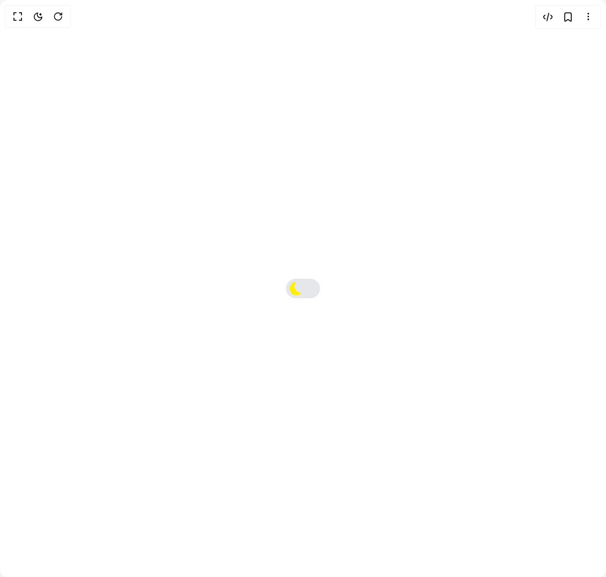

# Build Dark Mode Toggle in BuilderStudio

> Build this component in our Agentic IDE: [BuilderStudio](https://builderstudio.dev).
>
> Join the BuilderStudio community on [Discord](https://discord.gg/QdWeSGCqfe) and [Reddit](https://reddit.com/r/builderstudio).



## Component

- Author group: `umairxd`
- Component: `dark-mode-toggle`
- Variant: `default`
- Rendered HTML snapshot: [`rendered.html`](rendered.html)

## BuilderStudio prompt

You are implementing a React component based on a component reference.

## Component identity

- Author: UmairXD
- Component slug: dark-mode-toggle
- Demo slug: default
- Title: dark-mode-toggle
- Description: 

## Goal

Recreate this component in a React + TypeScript + Tailwind CSS project. Preserve the visual layout, spacing, colors, border radius, shadows, interaction behavior, animation behavior, responsive behavior, and dark mode behavior shown in the rendered demo.

## Implementation requirements

- Use React and TypeScript.
- Use Tailwind CSS classes whenever possible.
- Keep the component self-contained unless the source files require helper components.
- If the source uses CSS variables, custom CSS, animations, or keyframes, include them.
- If the source uses external packages, list and use the required packages.
- Preserve accessibility attributes, button semantics, links, keyboard behavior, and ARIA attributes when visible in the source.
- Do not replace the component with a simplified placeholder.
- Return complete production-ready code.

## Dependencies

No reference metadata available.

## Rendered DOM snapshot

This is the rendered demo HTML extracted from the live preview. Use it to verify structure, class names, visible content, and layout.

```html
<div id="root"><div class="w-screen min-h-screen flex justify-center items-center"><div class="w-screen min-h-screen flex justify-center items-center"><label class="relative inline-block w-[3.5em] h-[2em]"><input class="peer opacity-0 w-0 h-0" type="checkbox"><span class="absolute inset-0 cursor-pointer rounded-[30px] transition duration-500 bg-gray-200 peer-checked:bg-gray-400 dark:bg-[#0a1a44] dark:peer-checked:bg-[#102b6a] before:content-[''] before:absolute before:h-[1.4em] before:w-[1.4em] before:rounded-full before:left-[10%] before:bottom-[15%] before:shadow-[inset_8px_-4px_0px_0px_#fff000] before:bg-gray-200 dark:before:bg-[#0a1a44] before:transition before:duration-500 peer-checked:before:translate-x-full peer-checked:before:shadow-[inset_15px_-4px_0px_15px_#fff000]"></span></label></div></div></div>
```

## Reference source files

No reference source files were available.
