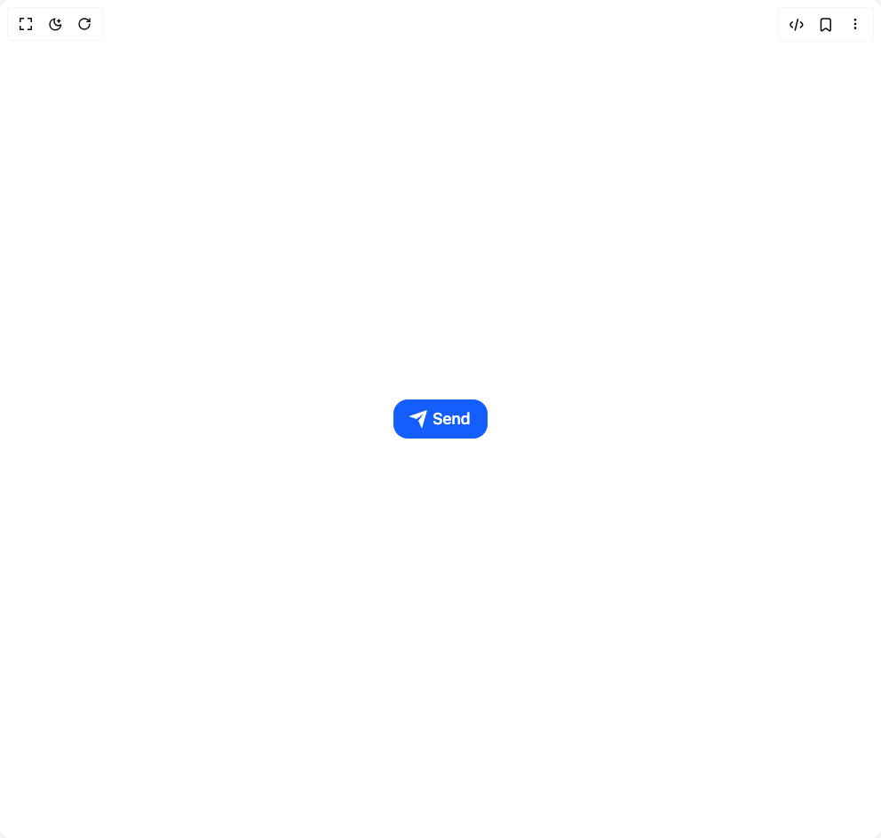

# Build Send Button in BuilderStudio

> Build this component in our Agentic IDE: [BuilderStudio](https://builderstudio.dev).
>
> Join the BuilderStudio community on [Discord](https://discord.gg/QdWeSGCqfe) and [Reddit](https://reddit.com/r/builderstudio).



## Component

- Author group: `umairxd`
- Component: `send-button`
- Variant: `default`
- Rendered HTML snapshot: [`rendered.html`](rendered.html)

## BuilderStudio prompt

You are implementing a React component based on a component reference.

## Component identity

- Author: UmairXD
- Component slug: send-button
- Demo slug: default
- Title: send-button
- Description: 

## Goal

Recreate this component in a React + TypeScript + Tailwind CSS project. Preserve the visual layout, spacing, colors, border radius, shadows, interaction behavior, animation behavior, responsive behavior, and dark mode behavior shown in the rendered demo.

## Implementation requirements

- Use React and TypeScript.
- Use Tailwind CSS classes whenever possible.
- Keep the component self-contained unless the source files require helper components.
- If the source uses CSS variables, custom CSS, animations, or keyframes, include them.
- If the source uses external packages, list and use the required packages.
- Preserve accessibility attributes, button semantics, links, keyboard behavior, and ARIA attributes when visible in the source.
- Do not replace the component with a simplified placeholder.
- Return complete production-ready code.

## Dependencies

No reference metadata available.

## Rendered DOM snapshot

This is the rendered demo HTML extracted from the live preview. Use it to verify structure, class names, visible content, and layout.

```html
<div id="root"><div class="w-screen min-h-screen flex justify-center items-center"><div class="w-screen min-h-screen flex justify-center items-center"><div class="sc-bRKDuR efeuUl"><button class="flex items-center rounded-2xl bg-blue-600 text-white text-lg font-medium px-5 py-2 pl-[0.9em] overflow-hidden transition-all duration-200 cursor-pointer active:scale-95"><div class="svg-wrapper-1 flex items-center"><div class="svg-wrapper flex items-center"><svg xmlns="http://www.w3.org/2000/svg" viewBox="0 0 24 24" width="24" height="24" class="transition-transform duration-300 origin-center"><path fill="none" d="M0 0h24v24H0z"></path><path fill="currentColor" d="M1.946 9.315c-.522-.174-.527-.455.01-.634l19.087-6.362c.529-.176.832.12.684.638l-5.454 19.086c-.15.529-.455.547-.679.045L12 14l6-8-8 6-8.054-2.685z"></path></svg></div></div><span class="ml-1 transition-transform duration-300">Send</span></button></div></div></div></div>
```

## Reference source files

No reference source files were available.
