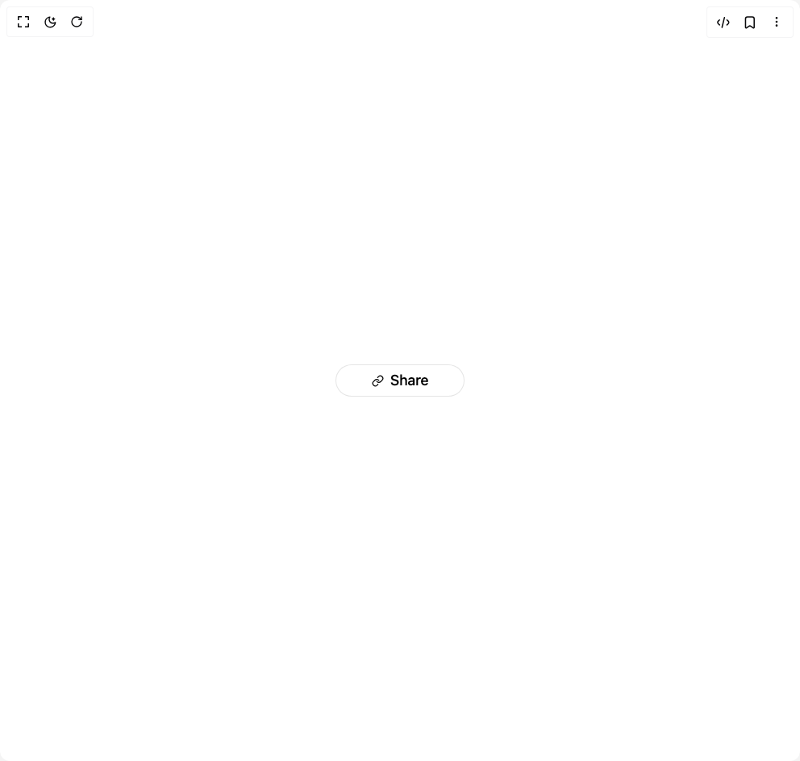

# Build Share Button in BuilderStudio

> Build this component in our Agentic IDE: [BuilderStudio](https://builderstudio.dev).
>
> Join the BuilderStudio community on [Discord](https://discord.gg/QdWeSGCqfe) and [Reddit](https://reddit.com/r/builderstudio).



## Component

- Author group: `umairxd`
- Component: `share-button`
- Variant: `default`
- Rendered HTML snapshot: [`rendered.html`](rendered.html)

## BuilderStudio prompt

You are implementing a React component based on a component reference.

## Component identity

- Author: UmairXD
- Component slug: share-button
- Demo slug: default
- Title: share-button
- Description: 

## Goal

Recreate this component in a React + TypeScript + Tailwind CSS project. Preserve the visual layout, spacing, colors, border radius, shadows, interaction behavior, animation behavior, responsive behavior, and dark mode behavior shown in the rendered demo.

## Implementation requirements

- Use React and TypeScript.
- Use Tailwind CSS classes whenever possible.
- Keep the component self-contained unless the source files require helper components.
- If the source uses CSS variables, custom CSS, animations, or keyframes, include them.
- If the source uses external packages, list and use the required packages.
- Preserve accessibility attributes, button semantics, links, keyboard behavior, and ARIA attributes when visible in the source.
- Do not replace the component with a simplified placeholder.
- Return complete production-ready code.

## Dependencies

No reference metadata available.

## Rendered DOM snapshot

This is the rendered demo HTML extracted from the live preview. Use it to verify structure, class names, visible content, and layout.

```html
<div id="root"><div class="w-screen min-h-screen flex justify-center items-center"><div class="w-screen min-h-screen flex justify-center items-center"><div class="flex items-center justify-center h-[200px]"><div class="relative inline-flex justify-center"><button class="relative w-40 h-10 rounded-3xl px-4 py-2 flex items-center justify-center bg-white dark:bg-black hover:bg-gray-50 dark:hover:bg-gray-950 text-black dark:text-white border border-black/10 dark:border-white/10 transition-all duration-300 opacity-100 text-lg font-medium"><span class="flex items-center gap-2"><svg xmlns="http://www.w3.org/2000/svg" width="15" height="15" viewBox="0 0 24 24" fill="none" stroke="currentColor" stroke-width="2" stroke-linecap="round" stroke-linejoin="round" class="lucide lucide-link" aria-hidden="true"><path d="M10 13a5 5 0 0 0 7.54.54l3-3a5 5 0 0 0-7.07-7.07l-1.72 1.71"></path><path d="M14 11a5 5 0 0 0-7.54-.54l-3 3a5 5 0 0 0 7.07 7.07l1.71-1.71"></path></svg>Share</span></button><div class="absolute inset-0 flex h-10 w-40 justify-center"><button type="button" class="h-10 w-10 flex items-center justify-center bg-black dark:bg-white text-white dark:text-black rounded-l-3xl border-r border-white/10 last:border-r-0 dark:border-black/10 hover:bg-gray-900 dark:hover:bg-gray-100 -translate-x-full opacity-0 transition-all duration-200"><svg xmlns="http://www.w3.org/2000/svg" width="24" height="24" viewBox="0 0 24 24" fill="none" stroke="currentColor" stroke-width="2" stroke-linecap="round" stroke-linejoin="round" class="lucide lucide-twitter size-4" aria-hidden="true"><path d="M22 4s-.7 2.1-2 3.4c1.6 10-9.4 17.3-18 11.6 2.2.1 4.4-.6 6-2C3 15.5.5 9.6 3 5c2.2 2.6 5.6 4.1 9 4-.9-4.2 4-6.6 7-3.8 1.1 0 3-1.2 3-1.2z"></path></svg></button><button type="button" class="h-10 w-10 flex items-center justify-center bg-black dark:bg-white text-white dark:text-black border-r border-white/10 last:border-r-0 dark:border-black/10 hover:bg-gray-900 dark:hover:bg-gray-100 -translate-x-full opacity-0 delay-[50ms] transition-all duration-200"><svg xmlns="http://www.w3.org/2000/svg" width="24" height="24" viewBox="0 0 24 24" fill="none" stroke="currentColor" stroke-width="2" stroke-linecap="round" stroke-linejoin="round" class="lucide lucide-facebook size-4" aria-hidden="true"><path d="M18 2h-3a5 5 0 0 0-5 5v3H7v4h3v8h4v-8h3l1-4h-4V7a1 1 0 0 1 1-1h3z"></path></svg></button><button type="button" class="h-10 w-10 flex items-center justify-center bg-black dark:bg-white text-white dark:text-black border-r border-white/10 last:border-r-0 dark:border-black/10 hover:bg-gray-900 dark:hover:bg-gray-100 -translate-x-full opacity-0 delay-100 transition-all duration-200"><svg xmlns="http://www.w3.org/2000/svg" width="24" height="24" viewBox="0 0 24 24" fill="none" stroke="currentColor" stroke-width="2" stroke-linecap="round" stroke-linejoin="round" class="lucide lucide-linkedin size-4" aria-hidden="true"><path d="M16 8a6 6 0 0 1 6 6v7h-4v-7a2 2 0 0 0-2-2 2 2 0 0 0-2 2v7h-4v-7a6 6 0 0 1 6-6z"></path><rect width="4" height="12" x="2" y="9"></rect><circle cx="4" cy="4" r="2"></circle></svg></button><button type="button" class="h-10 w-10 flex items-center justify-center bg-black dark:bg-white text-white dark:text-black rounded-r-3xl border-r border-white/10 last:border-r-0 dark:border-black/10 hover:bg-gray-900 dark:hover:bg-gray-100 -translate-x-full opacity-0 delay-150 transition-all duration-200"><svg xmlns="http://www.w3.org/2000/svg" width="24" height="24" viewBox="0 0 24 24" fill="none" stroke="currentColor" stroke-width="2" stroke-linecap="round" stroke-linejoin="round" class="lucide lucide-link size-4" aria-hidden="true"><path d="M10 13a5 5 0 0 0 7.54.54l3-3a5 5 0 0 0-7.07-7.07l-1.72 1.71"></path><path d="M14 11a5 5 0 0 0-7.54-.54l-3 3a5 5 0 0 0 7.07 7.07l1.71-1.71"></path></svg></button></div></div></div></div></div></div>
```

## Reference source files

No reference source files were available.
