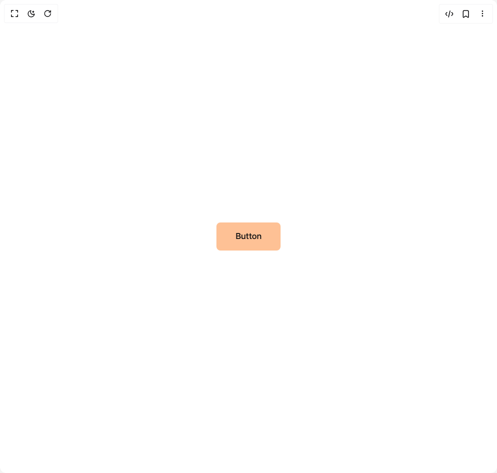

# Build Star Button in BuilderStudio

> Build this component in our Agentic IDE: [BuilderStudio](https://builderstudio.dev).
>
> Join the BuilderStudio community on [Discord](https://discord.gg/QdWeSGCqfe) and [Reddit](https://reddit.com/r/builderstudio).



## Component

- Author group: `umairxd`
- Component: `star-button`
- Variant: `default`
- Rendered HTML snapshot: [`rendered.html`](rendered.html)

## BuilderStudio prompt

You are implementing a React component based on a component reference.

## Component identity

- Author: UmairXD
- Component slug: star-button
- Demo slug: default
- Title: star-button
- Description: 

## Goal

Recreate this component in a React + TypeScript + Tailwind CSS project. Preserve the visual layout, spacing, colors, border radius, shadows, interaction behavior, animation behavior, responsive behavior, and dark mode behavior shown in the rendered demo.

## Implementation requirements

- Use React and TypeScript.
- Use Tailwind CSS classes whenever possible.
- Keep the component self-contained unless the source files require helper components.
- If the source uses CSS variables, custom CSS, animations, or keyframes, include them.
- If the source uses external packages, list and use the required packages.
- Preserve accessibility attributes, button semantics, links, keyboard behavior, and ARIA attributes when visible in the source.
- Do not replace the component with a simplified placeholder.
- Return complete production-ready code.

## Dependencies

No reference metadata available.

## Rendered DOM snapshot

This is the rendered demo HTML extracted from the live preview. Use it to verify structure, class names, visible content, and layout.

```html
<div id="root"><div class="w-screen min-h-screen flex justify-center items-center"><div class="w-screen min-h-screen flex justify-center items-center"><button class="
        group relative px-[35px] py-[12px] 
        text-[17px] font-medium 
        text-[#181818] 
        bg-[#fec195] 
        border-[3px] border-[#fec195] 
        rounded-md 
        shadow-[0_0_0_#fec1958c] 
        transition-all duration-300 ease-in-out 
        cursor-pointer
        hover:bg-transparent hover:text-[#fec195] hover:shadow-[0_0_25px_#fec1958c]
        active:scale-95
      ">Button<div class="
          absolute top-[20%] left-[20%] w-[25px] z-[-5] 
          transition-all duration-[1000ms] ease-[cubic-bezier(0.05,0.83,0.43,0.96)] 
          drop-shadow-[0_0_0_var(--tw-shadow-color)] 
          group-hover:top-[-80%] group-hover:left-[-30%] 
          group-hover:drop-shadow-[0_0_10px_var(--tw-shadow-color)] group-hover:z-[2]
        "><svg xmlns="http://www.w3.org/2000/svg" viewBox="0 0 784.11 815.53" class="
      w-full h-auto 
      fill-[#fec195] 
      dark:fill-[#fffdef]
    "><path d="M392.05 0c-20.9,210.08-184.06,378.41-392.05,407.78 207.96,29.37 371.12,197.68 392.05,407.74 20.93-210.06 184.09-378.37 392.05-407.74-207.98-29.38-371.16-197.69-392.06-407.78z"></path></svg></div><div class="
          absolute top-[45%] left-[45%] w-[15px] z-[-5] 
          transition-all duration-[1000ms] ease-[cubic-bezier(0,0.4,0,1.01)] 
          drop-shadow-[0_0_0_var(--tw-shadow-color)] 
          group-hover:top-[-25%] group-hover:left-[10%] 
          group-hover:drop-shadow-[0_0_10px_var(--tw-shadow-color)] group-hover:z-[2]
        "><svg xmlns="http://www.w3.org/2000/svg" viewBox="0 0 784.11 815.53" class="
      w-full h-auto 
      fill-[#fec195] 
      dark:fill-[#fffdef]
    "><path d="M392.05 0c-20.9,210.08-184.06,378.41-392.05,407.78 207.96,29.37 371.12,197.68 392.05,407.74 20.93-210.06 184.09-378.37 392.05-407.74-207.98-29.38-371.16-197.69-392.06-407.78z"></path></svg></div><div class="
          absolute top-[40%] left-[40%] w-[5px] z-[-5] 
          transition-all duration-[1000ms] ease-[cubic-bezier(0,0.4,0,1.01)] 
          drop-shadow-[0_0_0_var(--tw-shadow-color)] 
          group-hover:top-[55%] group-hover:left-[25%] 
          group-hover:drop-shadow-[0_0_10px_var(--tw-shadow-color)] group-hover:z-[2]
        "><svg xmlns="http://www.w3.org/2000/svg" viewBox="0 0 784.11 815.53" class="
      w-full h-auto 
      fill-[#fec195] 
      dark:fill-[#fffdef]
    "><path d="M392.05 0c-20.9,210.08-184.06,378.41-392.05,407.78 207.96,29.37 371.12,197.68 392.05,407.74 20.93-210.06 184.09-378.37 392.05-407.74-207.98-29.38-371.16-197.69-392.06-407.78z"></path></svg></div><div class="
          absolute top-[20%] left-[40%] w-[8px] z-[-5] 
          transition-all duration-[800ms] ease-[cubic-bezier(0,0.4,0,1.01)] 
          drop-shadow-[0_0_0_var(--tw-shadow-color)] 
          group-hover:top-[30%] group-hover:left-[80%] 
          group-hover:drop-shadow-[0_0_10px_var(--tw-shadow-color)] group-hover:z-[2]
        "><svg xmlns="http://www.w3.org/2000/svg" viewBox="0 0 784.11 815.53" class="
      w-full h-auto 
      fill-[#fec195] 
      dark:fill-[#fffdef]
    "><path d="M392.05 0c-20.9,210.08-184.06,378.41-392.05,407.78 207.96,29.37 371.12,197.68 392.05,407.74 20.93-210.06 184.09-378.37 392.05-407.74-207.98-29.38-371.16-197.69-392.06-407.78z"></path></svg></div><div class="
          absolute top-[25%] left-[45%] w-[15px] z-[-5] 
          transition-all duration-[600ms] ease-[cubic-bezier(0,0.4,0,1.01)] 
          drop-shadow-[0_0_0_var(--tw-shadow-color)] 
          group-hover:top-[25%] group-hover:left-[115%] 
          group-hover:drop-shadow-[0_0_10px_var(--tw-shadow-color)] group-hover:z-[2]
        "><svg xmlns="http://www.w3.org/2000/svg" viewBox="0 0 784.11 815.53" class="
      w-full h-auto 
      fill-[#fec195] 
      dark:fill-[#fffdef]
    "><path d="M392.05 0c-20.9,210.08-184.06,378.41-392.05,407.78 207.96,29.37 371.12,197.68 392.05,407.74 20.93-210.06 184.09-378.37 392.05-407.74-207.98-29.38-371.16-197.69-392.06-407.78z"></path></svg></div><div class="
          absolute top-[5%] left-[50%] w-[5px] z-[-5] 
          transition-all duration-[800ms] ease-in-out 
          drop-shadow-[0_0_0_var(--tw-shadow-color)] 
          group-hover:top-[5%] group-hover:left-[60%] 
          group-hover:drop-shadow-[0_0_10px_var(--tw-shadow-color)] group-hover:z-[2]
        "><svg xmlns="http://www.w3.org/2000/svg" viewBox="0 0 784.11 815.53" class="
      w-full h-auto 
      fill-[#fec195] 
      dark:fill-[#fffdef]
    "><path d="M392.05 0c-20.9,210.08-184.06,378.41-392.05,407.78 207.96,29.37 371.12,197.68 392.05,407.74 20.93-210.06 184.09-378.37 392.05-407.74-207.98-29.38-371.16-197.69-392.06-407.78z"></path></svg></div></button></div></div></div>
```

## Reference source files

No reference source files were available.
