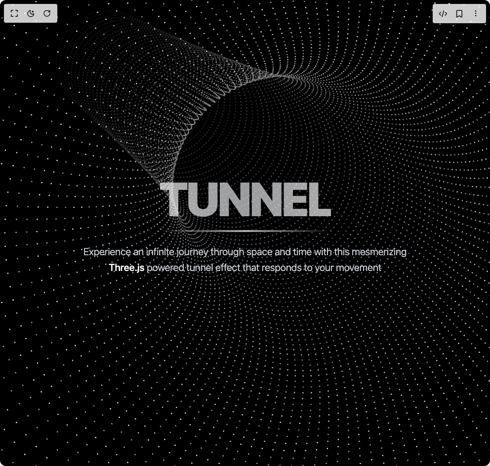

# Build Tunnel Hero in BuilderStudio

> Build this component in our Agentic IDE: [BuilderStudio](https://builderstudio.dev).
>
> Join the BuilderStudio community on [Discord](https://discord.gg/QdWeSGCqfe) and [Reddit](https://reddit.com/r/builderstudio).



## Component

- Author group: `umairxd`
- Component: `tunnel-hero`
- Variant: `default`
- Rendered HTML snapshot: [`rendered.html`](rendered.html)

## BuilderStudio prompt

You are implementing a React component based on a component reference.

## Component identity

- Author: UmairXD
- Component slug: tunnel-hero
- Demo slug: default
- Title: tunnel-hero
- Description: 

## Goal

Recreate this component in a React + TypeScript + Tailwind CSS project. Preserve the visual layout, spacing, colors, border radius, shadows, interaction behavior, animation behavior, responsive behavior, and dark mode behavior shown in the rendered demo.

## Implementation requirements

- Use React and TypeScript.
- Use Tailwind CSS classes whenever possible.
- Keep the component self-contained unless the source files require helper components.
- If the source uses CSS variables, custom CSS, animations, or keyframes, include them.
- If the source uses external packages, list and use the required packages.
- Preserve accessibility attributes, button semantics, links, keyboard behavior, and ARIA attributes when visible in the source.
- Do not replace the component with a simplified placeholder.
- Return complete production-ready code.

## Dependencies

No reference metadata available.

## Rendered DOM snapshot

This is the rendered demo HTML extracted from the live preview. Use it to verify structure, class names, visible content, and layout.

```html
<div id="root"><div class="w-screen min-h-screen flex justify-center items-center"><div class="w-screen min-h-screen flex justify-center items-center"><div class="bg-black text-white min-h-screen overflow-hidden relative"><canvas class="fixed top-0 left-0 w-full h-full" id="tunnel-canvas" data-engine="three.js r179" width="992" height="944" style="width: 992px; height: 944px;"></canvas><div class="relative z-10 flex flex-col items-center justify-center min-h-screen p-4 text-center"><div class="mb-8 space-y-3 md:space-y-6"><div class="inline-block"><h1 class="text-6xl md:text-8xl font-black tracking-tighter bg-gradient-to-r from-white via-gray-200 to-white bg-clip-text text-transparent animate-pulse">TUNNEL</h1><div class="h-1 w-full bg-gradient-to-r from-transparent via-white to-transparent mt-4 animate-pulse"></div></div><p class="text-lg md:text-xl px-0 leading-relaxed text-gray-300 max-w-2xl font-light">Experience an infinite journey through space and time with this mesmerizing<span class="text-white font-medium"> Three.js </span>powered tunnel effect that responds to your movement</p></div></div></div></div></div></div>
```

## Reference source files

No reference source files were available.
