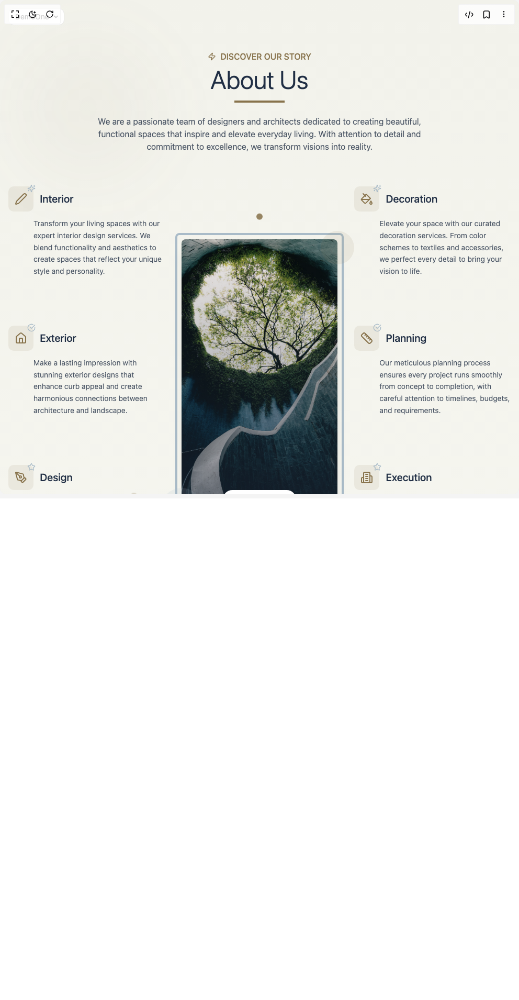

# Build About Us Section in BuilderStudio

> Build this component in our Agentic IDE: [BuilderStudio](https://builderstudio.dev).
>
> Join the BuilderStudio community on [Discord](https://discord.gg/QdWeSGCqfe) and [Reddit](https://reddit.com/r/builderstudio).



## Component

- Author group: `uniquesonu`
- Component: `about-us-section`
- Variant: `default`
- Rendered HTML snapshot: [`rendered.html`](rendered.html)

## BuilderStudio prompt

You are implementing a React component based on a component reference.

## Component identity

- Author: uniquesonu
- Component slug: about-us-section
- Demo slug: default
- Title: about-us-section
- Description: 

## Goal

Recreate this component in a React + TypeScript + Tailwind CSS project. Preserve the visual layout, spacing, colors, border radius, shadows, interaction behavior, animation behavior, responsive behavior, and dark mode behavior shown in the rendered demo.

## Implementation requirements

- Use React and TypeScript.
- Use Tailwind CSS classes whenever possible.
- Keep the component self-contained unless the source files require helper components.
- If the source uses CSS variables, custom CSS, animations, or keyframes, include them.
- If the source uses external packages, list and use the required packages.
- Preserve accessibility attributes, button semantics, links, keyboard behavior, and ARIA attributes when visible in the source.
- Do not replace the component with a simplified placeholder.
- Return complete production-ready code.

## Dependencies

No reference metadata available.

## Rendered DOM snapshot

This is the rendered demo HTML extracted from the live preview. Use it to verify structure, class names, visible content, and layout.

```html
<div id="root"><div class="fixed top-4 left-4 z-10"><select class="appearance-none h-8 max-w-[200px] text-sm leading-tight rounded-lg pl-3 pr-7 py-0 border bg-background focus:outline-none focus:ring-0"><option value="named_DemoOne_DemoOne">DemoOne</option></select><div class="absolute top-1/2 transform -translate-y-1/2 right-2 pointer-events-none"><svg class="w-4 h-4 fill-current" viewBox="0 0 20 20"><path d="M5.516 7.548c.436-.446 1.043-.48 1.576 0L10 10.405l2.908-2.857c.533-.48 1.14-.446 1.576 0 .436.445.408 1.197 0 1.615l-3.734 3.705c-.533.534-1.39.534-1.923 0l-3.734-3.705c-.408-.418-.436-1.17 0-1.615z"></path></svg></div></div><div class="w-screen min-h-screen flex justify-center items-center"><section id="about-section" class="w-full py-24 px-4 bg-gradient-to-b from-[#F2F2EB] to-[#F8F8F2] text-[#202e44] overflow-hidden relative"><div class="absolute top-20 left-10 w-64 h-64 rounded-full bg-[#88734C]/5 blur-3xl" style="transform: rotate(6.6176deg);"></div><div class="absolute bottom-20 right-10 w-80 h-80 rounded-full bg-[#A9BBC8]/5 blur-3xl" style="transform: rotate(-6.6176deg);"></div><div class="absolute top-1/2 left-1/4 w-4 h-4 rounded-full bg-[#88734C]/30" style="transform: translateY(-14.1204px);"></div><div class="absolute bottom-1/3 right-1/4 w-6 h-6 rounded-full bg-[#A9BBC8]/30" style="transform: translateY(0.595844px);"></div><div class="container mx-auto max-w-6xl relative z-10" style="opacity: 1;"><div class="flex flex-col items-center mb-6" style="opacity: 1; transform: none;"><span class="text-[#88734C] font-medium mb-2 flex items-center gap-2" style="opacity: 1; transform: none;"><svg xmlns="http://www.w3.org/2000/svg" width="24" height="24" viewBox="0 0 24 24" fill="none" stroke="currentColor" stroke-width="2" stroke-linecap="round" stroke-linejoin="round" class="lucide lucide-zap w-4 h-4" aria-hidden="true"><path d="M4 14a1 1 0 0 1-.78-1.63l9.9-10.2a.5.5 0 0 1 .86.46l-1.92 6.02A1 1 0 0 0 13 10h7a1 1 0 0 1 .78 1.63l-9.9 10.2a.5.5 0 0 1-.86-.46l1.92-6.02A1 1 0 0 0 11 14z"></path></svg>DISCOVER OUR STORY</span><h2 class="text-4xl md:text-5xl font-light mb-4 text-center">About Us</h2><div class="w-24 h-1 bg-[#88734C]" style="width: 96px;"></div></div><p class="text-center max-w-2xl mx-auto mb-16 text-[#202e44]/80" style="opacity: 1; transform: none;">We are a passionate team of designers and architects dedicated to creating beautiful, functional spaces that inspire and elevate everyday living. With attention to detail and commitment to excellence, we transform visions into reality.</p><div class="grid grid-cols-1 md:grid-cols-3 gap-8 relative"><div class="space-y-16"><div class="flex flex-col group" style="opacity: 1; transform: none;"><div class="flex items-center gap-3 mb-3" style="opacity: 1; transform: none;"><div class="text-[#88734C] bg-[#88734C]/10 p-3 rounded-lg transition-colors duration-300 group-hover:bg-[#88734C]/20 relative"><svg xmlns="http://www.w3.org/2000/svg" width="24" height="24" viewBox="0 0 24 24" fill="none" stroke="currentColor" stroke-width="2" stroke-linecap="round" stroke-linejoin="round" class="lucide lucide-pen w-6 h-6" aria-hidden="true"><path d="M21.174 6.812a1 1 0 0 0-3.986-3.987L3.842 16.174a2 2 0 0 0-.5.83l-1.321 4.352a.5.5 0 0 0 .623.622l4.353-1.32a2 2 0 0 0 .83-.497z"></path></svg><svg xmlns="http://www.w3.org/2000/svg" width="24" height="24" viewBox="0 0 24 24" fill="none" stroke="currentColor" stroke-width="2" stroke-linecap="round" stroke-linejoin="round" class="lucide lucide-sparkles w-4 h-4 absolute -top-1 -right-1 text-[#A9BBC8]" aria-hidden="true"><path d="M9.937 15.5A2 2 0 0 0 8.5 14.063l-6.135-1.582a.5.5 0 0 1 0-.962L8.5 9.936A2 2 0 0 0 9.937 8.5l1.582-6.135a.5.5 0 0 1 .963 0L14.063 8.5A2 2 0 0 0 15.5 9.937l6.135 1.581a.5.5 0 0 1 0 .964L15.5 14.063a2 2 0 0 0-1.437 1.437l-1.582 6.135a.5.5 0 0 1-.963 0z"></path><path d="M20 3v4"></path><path d="M22 5h-4"></path><path d="M4 17v2"></path><path d="M5 18H3"></path></svg></div><h3 class="text-xl font-medium text-[#202e44] group-hover:text-[#88734C] transition-colors duration-300">Interior</h3></div><p class="text-sm text-[#202e44]/80 leading-relaxed pl-12" style="opacity: 1;">Transform your living spaces with our expert interior design services. We blend functionality and aesthetics to create spaces that reflect your unique style and personality.</p><div class="mt-3 pl-12 flex items-center text-[#88734C] text-xs font-medium opacity-0 group-hover:opacity-100 transition-opacity duration-300" style="opacity: 0;"><span class="flex items-center gap-1">Learn more <svg xmlns="http://www.w3.org/2000/svg" width="24" height="24" viewBox="0 0 24 24" fill="none" stroke="currentColor" stroke-width="2" stroke-linecap="round" stroke-linejoin="round" class="lucide lucide-arrow-right w-3 h-3" aria-hidden="true"><path d="M5 12h14"></path><path d="m12 5 7 7-7 7"></path></svg></span></div></div><div class="flex flex-col group" style="opacity: 1; transform: none;"><div class="flex items-center gap-3 mb-3" style="opacity: 1; transform: none;"><div class="text-[#88734C] bg-[#88734C]/10 p-3 rounded-lg transition-colors duration-300 group-hover:bg-[#88734C]/20 relative"><svg xmlns="http://www.w3.org/2000/svg" width="24" height="24" viewBox="0 0 24 24" fill="none" stroke="currentColor" stroke-width="2" stroke-linecap="round" stroke-linejoin="round" class="lucide lucide-house w-6 h-6" aria-hidden="true"><path d="M15 21v-8a1 1 0 0 0-1-1h-4a1 1 0 0 0-1 1v8"></path><path d="M3 10a2 2 0 0 1 .709-1.528l7-5.999a2 2 0 0 1 2.582 0l7 5.999A2 2 0 0 1 21 10v9a2 2 0 0 1-2 2H5a2 2 0 0 1-2-2z"></path></svg><svg xmlns="http://www.w3.org/2000/svg" width="24" height="24" viewBox="0 0 24 24" fill="none" stroke="currentColor" stroke-width="2" stroke-linecap="round" stroke-linejoin="round" class="lucide lucide-circle-check-big w-4 h-4 absolute -top-1 -right-1 text-[#A9BBC8]" aria-hidden="true"><path d="M21.801 10A10 10 0 1 1 17 3.335"></path><path d="m9 11 3 3L22 4"></path></svg></div><h3 class="text-xl font-medium text-[#202e44] group-hover:text-[#88734C] transition-colors duration-300">Exterior</h3></div><p class="text-sm text-[#202e44]/80 leading-relaxed pl-12" style="opacity: 1;">Make a lasting impression with stunning exterior designs that enhance curb appeal and create harmonious connections between architecture and landscape.</p><div class="mt-3 pl-12 flex items-center text-[#88734C] text-xs font-medium opacity-0 group-hover:opacity-100 transition-opacity duration-300" style="opacity: 0;"><span class="flex items-center gap-1">Learn more <svg xmlns="http://www.w3.org/2000/svg" width="24" height="24" viewBox="0 0 24 24" fill="none" stroke="currentColor" stroke-width="2" stroke-linecap="round" stroke-linejoin="round" class="lucide lucide-arrow-right w-3 h-3" aria-hidden="true"><path d="M5 12h14"></path><path d="m12 5 7 7-7 7"></path></svg></span></div></div><div class="flex flex-col group" style="opacity: 1; transform: none;"><div class="flex items-center gap-3 mb-3" style="opacity: 1; transform: none;"><div class="text-[#88734C] bg-[#88734C]/10 p-3 rounded-lg transition-colors duration-300 group-hover:bg-[#88734C]/20 relative"><svg xmlns="http://www.w3.org/2000/svg" width="24" height="24" viewBox="0 0 24 24" fill="none" stroke="currentColor" stroke-width="2" stroke-linecap="round" stroke-linejoin="round" class="lucide lucide-pen-tool w-6 h-6" aria-hidden="true"><path d="M15.707 21.293a1 1 0 0 1-1.414 0l-1.586-1.586a1 1 0 0 1 0-1.414l5.586-5.586a1 1 0 0 1 1.414 0l1.586 1.586a1 1 0 0 1 0 1.414z"></path><path d="m18 13-1.375-6.874a1 1 0 0 0-.746-.776L3.235 2.028a1 1 0 0 0-1.207 1.207L5.35 15.879a1 1 0 0 0 .776.746L13 18"></path><path d="m2.3 2.3 7.286 7.286"></path><circle cx="11" cy="11" r="2"></circle></svg><svg xmlns="http://www.w3.org/2000/svg" width="24" height="24" viewBox="0 0 24 24" fill="none" stroke="currentColor" stroke-width="2" stroke-linecap="round" stroke-linejoin="round" class="lucide lucide-star w-4 h-4 absolute -top-1 -right-1 text-[#A9BBC8]" aria-hidden="true"><path d="M11.525 2.295a.53.53 0 0 1 .95 0l2.31 4.679a2.123 2.123 0 0 0 1.595 1.16l5.166.756a.53.53 0 0 1 .294.904l-3.736 3.638a2.123 2.123 0 0 0-.611 1.878l.882 5.14a.53.53 0 0 1-.771.56l-4.618-2.428a2.122 2.122 0 0 0-1.973 0L6.396 21.01a.53.53 0 0 1-.77-.56l.881-5.139a2.122 2.122 0 0 0-.611-1.879L2.16 9.795a.53.53 0 0 1 .294-.906l5.165-.755a2.122 2.122 0 0 0 1.597-1.16z"></path></svg></div><h3 class="text-xl font-medium text-[#202e44] group-hover:text-[#88734C] transition-colors duration-300">Design</h3></div><p class="text-sm text-[#202e44]/80 leading-relaxed pl-12" style="opacity: 1;">Our innovative design process combines creativity with practicality, resulting in spaces that are both beautiful and functional for everyday living.</p><div class="mt-3 pl-12 flex items-center text-[#88734C] text-xs font-medium opacity-0 group-hover:opacity-100 transition-opacity duration-300" style="opacity: 0;"><span class="flex items-center gap-1">Learn more <svg xmlns="http://www.w3.org/2000/svg" width="24" height="24" viewBox="0 0 24 24" fill="none" stroke="currentColor" stroke-width="2" stroke-linecap="round" stroke-linejoin="round" class="lucide lucide-arrow-right w-3 h-3" aria-hidden="true"><path d="M5 12h14"></path><path d="m12 5 7 7-7 7"></path></svg></span></div></div></div><div class="flex justify-center items-center order-first md:order-none mb-8 md:mb-0"><div class="relative w-full max-w-xs" style="opacity: 1; transform: none;"><div class="rounded-md overflow-hidden shadow-xl" style="opacity: 1; transform: none;"><div class="absolute inset-0 bg-gradient-to-t from-[#202e44]/50 to-transparent flex items-end justify-center p-4" style="opacity: 1;"><button class="bg-white text-[#202e44] px-4 py-2 rounded-full flex items-center gap-2 text-sm font-medium" tabindex="0">Our Portfolio <svg xmlns="http://www.w3.org/2000/svg" width="24" height="24" viewBox="0 0 24 24" fill="none" stroke="currentColor" stroke-width="2" stroke-linecap="round" stroke-linejoin="round" class="lucide lucide-arrow-right w-4 h-4" aria-hidden="true"><path d="M5 12h14"></path><path d="m12 5 7 7-7 7"></path></svg></button></div></div><div class="absolute inset-0 border-4 border-[#A9BBC8] rounded-md -m-3 z-[-1]" style="opacity: 1; transform: none;"></div><div class="absolute -top-4 -right-8 w-16 h-16 rounded-full bg-[#88734C]/10" style="opacity: 1; transform: none;"></div><div class="absolute -bottom-6 -left-10 w-20 h-20 rounded-full bg-[#A9BBC8]/15" style="opacity: 1; transform: none;"></div><div class="absolute -top-10 left-1/2 -translate-x-1/2 w-3 h-3 rounded-full bg-[#88734C]" style="transform: translateY(-8.76126px);"></div><div class="absolute -bottom-12 left-1/2 -translate-x-1/2 w-2 h-2 rounded-full bg-[#A9BBC8]" style="transform: translateY(1.34605px);"></div></div></div><div class="space-y-16"><div class="flex flex-col group" style="opacity: 1; transform: none;"><div class="flex items-center gap-3 mb-3" style="opacity: 1; transform: none;"><div class="text-[#88734C] bg-[#88734C]/10 p-3 rounded-lg transition-colors duration-300 group-hover:bg-[#88734C]/20 relative"><svg xmlns="http://www.w3.org/2000/svg" width="24" height="24" viewBox="0 0 24 24" fill="none" stroke="currentColor" stroke-width="2" stroke-linecap="round" stroke-linejoin="round" class="lucide lucide-paint-bucket w-6 h-6" aria-hidden="true"><path d="m19 11-8-8-8.6 8.6a2 2 0 0 0 0 2.8l5.2 5.2c.8.8 2 .8 2.8 0L19 11Z"></path><path d="m5 2 5 5"></path><path d="M2 13h15"></path><path d="M22 20a2 2 0 1 1-4 0c0-1.6 1.7-2.4 2-4 .3 1.6 2 2.4 2 4Z"></path></svg><svg xmlns="http://www.w3.org/2000/svg" width="24" height="24" viewBox="0 0 24 24" fill="none" stroke="currentColor" stroke-width="2" stroke-linecap="round" stroke-linejoin="round" class="lucide lucide-sparkles w-4 h-4 absolute -top-1 -right-1 text-[#A9BBC8]" aria-hidden="true"><path d="M9.937 15.5A2 2 0 0 0 8.5 14.063l-6.135-1.582a.5.5 0 0 1 0-.962L8.5 9.936A2 2 0 0 0 9.937 8.5l1.582-6.135a.5.5 0 0 1 .963 0L14.063 8.5A2 2 0 0 0 15.5 9.937l6.135 1.581a.5.5 0 0 1 0 .964L15.5 14.063a2 2 0 0 0-1.437 1.437l-1.582 6.135a.5.5 0 0 1-.963 0z"></path><path d="M20 3v4"></path><path d="M22 5h-4"></path><path d="M4 17v2"></path><path d="M5 18H3"></path></svg></div><h3 class="text-xl font-medium text-[#202e44] group-hover:text-[#88734C] transition-colors duration-300">Decoration</h3></div><p class="text-sm text-[#202e44]/80 leading-relaxed pl-12" style="opacity: 1;">Elevate your space with our curated decoration services. From color schemes to textiles and accessories, we perfect every detail to bring your vision to life.</p><div class="mt-3 pl-12 flex items-center text-[#88734C] text-xs font-medium opacity-0 group-hover:opacity-100 transition-opacity duration-300" style="opacity: 0;"><span class="flex items-center gap-1">Learn more <svg xmlns="http://www.w3.org/2000/svg" width="24" height="24" viewBox="0 0 24 24" fill="none" stroke="currentColor" stroke-width="2" stroke-linecap="round" stroke-linejoin="round" class="lucide lucide-arrow-right w-3 h-3" aria-hidden="true"><path d="M5 12h14"></path><path d="m12 5 7 7-7 7"></path></svg></span></div></div><div class="flex flex-col group" style="opacity: 1; transform: none;"><div class="flex items-center gap-3 mb-3" style="opacity: 1; transform: none;"><div class="text-[#88734C] bg-[#88734C]/10 p-3 rounded-lg transition-colors duration-300 group-hover:bg-[#88734C]/20 relative"><svg xmlns="http://www.w3.org/2000/svg" width="24" height="24" viewBox="0 0 24 24" fill="none" stroke="currentColor" stroke-width="2" stroke-linecap="round" stroke-linejoin="round" class="lucide lucide-ruler w-6 h-6" aria-hidden="true"><path d="M21.3 15.3a2.4 2.4 0 0 1 0 3.4l-2.6 2.6a2.4 2.4 0 0 1-3.4 0L2.7 8.7a2.41 2.41 0 0 1 0-3.4l2.6-2.6a2.41 2.41 0 0 1 3.4 0Z"></path><path d="m14.5 12.5 2-2"></path><path d="m11.5 9.5 2-2"></path><path d="m8.5 6.5 2-2"></path><path d="m17.5 15.5 2-2"></path></svg><svg xmlns="http://www.w3.org/2000/svg" width="24" height="24" viewBox="0 0 24 24" fill="none" stroke="currentColor" stroke-width="2" stroke-linecap="round" stroke-linejoin="round" class="lucide lucide-circle-check-big w-4 h-4 absolute -top-1 -right-1 text-[#A9BBC8]" aria-hidden="true"><path d="M21.801 10A10 10 0 1 1 17 3.335"></path><path d="m9 11 3 3L22 4"></path></svg></div><h3 class="text-xl font-medium text-[#202e44] group-hover:text-[#88734C] transition-colors duration-300">Planning</h3></div><p class="text-sm text-[#202e44]/80 leading-relaxed pl-12" style="opacity: 1;">Our meticulous planning process ensures every project runs smoothly from concept to completion, with careful attention to timelines, budgets, and requirements.</p><div class="mt-3 pl-12 flex items-center text-[#88734C] text-xs font-medium opacity-0 group-hover:opacity-100 transition-opacity duration-300" style="opacity: 0;"><span class="flex items-center gap-1">Learn more <svg xmlns="http://www.w3.org/2000/svg" width="24" height="24" viewBox="0 0 24 24" fill="none" stroke="currentColor" stroke-width="2" stroke-linecap="round" stroke-linejoin="round" class="lucide lucide-arrow-right w-3 h-3" aria-hidden="true"><path d="M5 12h14"></path><path d="m12 5 7 7-7 7"></path></svg></span></div></div><div class="flex flex-col group" style="opacity: 1; transform: none;"><div class="flex items-center gap-3 mb-3" style="opacity: 1; transform: none;"><div class="text-[#88734C] bg-[#88734C]/10 p-3 rounded-lg transition-colors duration-300 group-hover:bg-[#88734C]/20 relative"><svg xmlns="http://www.w3.org/2000/svg" width="24" height="24" viewBox="0 0 24 24" fill="none" stroke="currentColor" stroke-width="2" stroke-linecap="round" stroke-linejoin="round" class="lucide lucide-building2 lucide-building-2 w-6 h-6" aria-hidden="true"><path d="M6 22V4a2 2 0 0 1 2-2h8a2 2 0 0 1 2 2v18Z"></path><path d="M6 12H4a2 2 0 0 0-2 2v6a2 2 0 0 0 2 2h2"></path><path d="M18 9h2a2 2 0 0 1 2 2v9a2 2 0 0 1-2 2h-2"></path><path d="M10 6h4"></path><path d="M10 10h4"></path><path d="M10 14h4"></path><path d="M10 18h4"></path></svg><svg xmlns="http://www.w3.org/2000/svg" width="24" height="24" viewBox="0 0 24 24" fill="none" stroke="currentColor" stroke-width="2" stroke-linecap="round" stroke-linejoin="round" class="lucide lucide-star w-4 h-4 absolute -top-1 -right-1 text-[#A9BBC8]" aria-hidden="true"><path d="M11.525 2.295a.53.53 0 0 1 .95 0l2.31 4.679a2.123 2.123 0 0 0 1.595 1.16l5.166.756a.53.53 0 0 1 .294.904l-3.736 3.638a2.123 2.123 0 0 0-.611 1.878l.882 5.14a.53.53 0 0 1-.771.56l-4.618-2.428a2.122 2.122 0 0 0-1.973 0L6.396 21.01a.53.53 0 0 1-.77-.56l.881-5.139a2.122 2.122 0 0 0-.611-1.879L2.16 9.795a.53.53 0 0 1 .294-.906l5.165-.755a2.122 2.122 0 0 0 1.597-1.16z"></path></svg></div><h3 class="text-xl font-medium text-[#202e44] group-hover:text-[#88734C] transition-colors duration-300">Execution</h3></div><p class="text-sm text-[#202e44]/80 leading-relaxed pl-12" style="opacity: 1;">Watch your dream space come to life through our flawless execution. Our skilled team handles every aspect of implementation with precision and care.</p><div class="mt-3 pl-12 flex items-center text-[#88734C] text-xs font-medium opacity-0 group-hover:opacity-100 transition-opacity duration-300" style="opacity: 0;"><span class="flex items-center gap-1">Learn more <svg xmlns="http://www.w3.org/2000/svg" width="24" height="24" viewBox="0 0 24 24" fill="none" stroke="currentColor" stroke-width="2" stroke-linecap="round" stroke-linejoin="round" class="lucide lucide-arrow-right w-3 h-3" aria-hidden="true"><path d="M5 12h14"></path><path d="m12 5 7 7-7 7"></path></svg></span></div></div></div></div><div class="mt-24 grid grid-cols-1 sm:grid-cols-2 lg:grid-cols-4 gap-8" style="opacity: 0;"><div class="bg-white/50 backdrop-blur-sm p-6 rounded-xl flex flex-col items-center text-center group hover:bg-white transition-colors duration-300" style="opacity: 0; transform: translateY(20px);"><div class="w-14 h-14 rounded-full bg-[#202e44]/5 flex items-center justify-center mb-4 text-[#88734C] group-hover:bg-[#88734C]/10 transition-colors duration-300"><svg xmlns="http://www.w3.org/2000/svg" width="24" height="24" viewBox="0 0 24 24" fill="none" stroke="currentColor" stroke-width="2" stroke-linecap="round" stroke-linejoin="round" class="lucide lucide-award" aria-hidden="true"><path d="m15.477 12.89 1.515 8.526a.5.5 0 0 1-.81.47l-3.58-2.687a1 1 0 0 0-1.197 0l-3.586 2.686a.5.5 0 0 1-.81-.469l1.514-8.526"></path><circle cx="12" cy="8" r="6"></circle></svg></div><div class="text-3xl font-bold text-[#202e44] flex items-center"><span>0</span><span>+</span></div><p class="text-[#202e44]/70 text-sm mt-1">Projects Completed</p><div class="w-10 h-0.5 bg-[#88734C] mt-3 group-hover:w-16 transition-all duration-300"></div></div><div class="bg-white/50 backdrop-blur-sm p-6 rounded-xl flex flex-col items-center text-center group hover:bg-white transition-colors duration-300" style="opacity: 0; transform: translateY(20px);"><div class="w-14 h-14 rounded-full bg-[#202e44]/5 flex items-center justify-center mb-4 text-[#88734C] group-hover:bg-[#88734C]/10 transition-colors duration-300"><svg xmlns="http://www.w3.org/2000/svg" width="24" height="24" viewBox="0 0 24 24" fill="none" stroke="currentColor" stroke-width="2" stroke-linecap="round" stroke-linejoin="round" class="lucide lucide-users" aria-hidden="true"><path d="M16 21v-2a4 4 0 0 0-4-4H6a4 4 0 0 0-4 4v2"></path><circle cx="9" cy="7" r="4"></circle><path d="M22 21v-2a4 4 0 0 0-3-3.87"></path><path d="M16 3.13a4 4 0 0 1 0 7.75"></path></svg></div><div class="text-3xl font-bold text-[#202e44] flex items-center"><span>0</span><span>+</span></div><p class="text-[#202e44]/70 text-sm mt-1">Happy Clients</p><div class="w-10 h-0.5 bg-[#88734C] mt-3 group-hover:w-16 transition-all duration-300"></div></div><div class="bg-white/50 backdrop-blur-sm p-6 rounded-xl flex flex-col items-center text-center group hover:bg-white transition-colors duration-300" style="opacity: 0; transform: translateY(20px);"><div class="w-14 h-14 rounded-full bg-[#202e44]/5 flex items-center justify-center mb-4 text-[#88734C] group-hover:bg-[#88734C]/10 transition-colors duration-300"><svg xmlns="http://www.w3.org/2000/svg" width="24" height="24" viewBox="0 0 24 24" fill="none" stroke="currentColor" stroke-width="2" stroke-linecap="round" stroke-linejoin="round" class="lucide lucide-calendar" aria-hidden="true"><path d="M8 2v4"></path><path d="M16 2v4"></path><rect width="18" height="18" x="3" y="4" rx="2"></rect><path d="M3 10h18"></path></svg></div><div class="text-3xl font-bold text-[#202e44] flex items-center"><span>0</span><span></span></div><p class="text-[#202e44]/70 text-sm mt-1">Years Experience</p><div class="w-10 h-0.5 bg-[#88734C] mt-3 group-hover:w-16 transition-all duration-300"></div></div><div class="bg-white/50 backdrop-blur-sm p-6 rounded-xl flex flex-col items-center text-center group hover:bg-white transition-colors duration-300" style="opacity: 0; transform: translateY(20px);"><div class="w-14 h-14 rounded-full bg-[#202e44]/5 flex items-center justify-center mb-4 text-[#88734C] group-hover:bg-[#88734C]/10 transition-colors duration-300"><svg xmlns="http://www.w3.org/2000/svg" width="24" height="24" viewBox="0 0 24 24" fill="none" stroke="currentColor" stroke-width="2" stroke-linecap="round" stroke-linejoin="round" class="lucide lucide-trending-up" aria-hidden="true"><polyline points="22 7 13.5 15.5 8.5 10.5 2 17"></polyline><polyline points="16 7 22 7 22 13"></polyline></svg></div><div class="text-3xl font-bold text-[#202e44] flex items-center"><span>0</span><span>%</span></div><p class="text-[#202e44]/70 text-sm mt-1">Satisfaction Rate</p><div class="w-10 h-0.5 bg-[#88734C] mt-3 group-hover:w-16 transition-all duration-300"></div></div></div><div class="mt-20 bg-[#202e44] text-white p-8 rounded-xl flex flex-col md:flex-row items-center justify-between gap-6" style="opacity: 0; transform: translateY(30px);"><div class="flex-1"><h3 class="text-2xl font-medium mb-2">Ready to transform your space?</h3><p class="text-white/80">Let's create something beautiful together.</p></div><button class="bg-[#88734C] hover:bg-[#88734C]/90 text-white px-6 py-3 rounded-lg flex items-center gap-2 font-medium transition-colors" tabindex="0">Get Started <svg xmlns="http://www.w3.org/2000/svg" width="24" height="24" viewBox="0 0 24 24" fill="none" stroke="currentColor" stroke-width="2" stroke-linecap="round" stroke-linejoin="round" class="lucide lucide-arrow-right w-4 h-4" aria-hidden="true"><path d="M5 12h14"></path><path d="m12 5 7 7-7 7"></path></svg></button></div></div></section></div></div>
```

## Reference source files

No reference source files were available.
