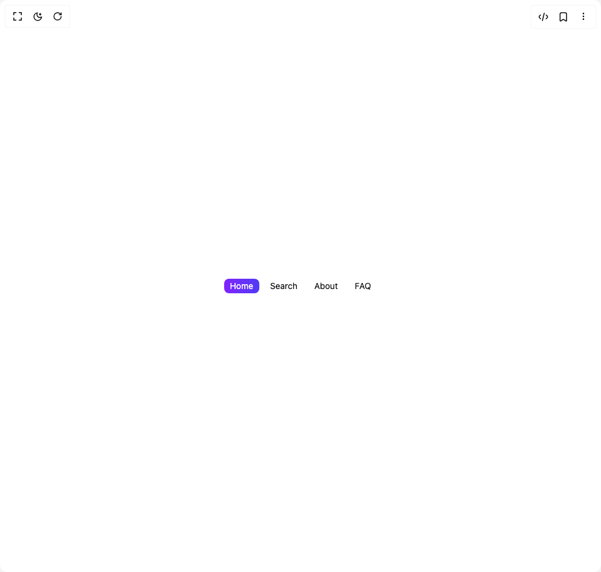

# Build Animated Chip Tab Component in BuilderStudio

> Build this component in our Agentic IDE: [BuilderStudio](https://builderstudio.dev).
>
> Join the BuilderStudio community on [Discord](https://discord.gg/QdWeSGCqfe) and [Reddit](https://reddit.com/r/builderstudio).



## Component

- Author group: `uniquesonu`
- Component: `animated-chip-tab-component`
- Variant: `default`
- Rendered HTML snapshot: [`rendered.html`](rendered.html)

## BuilderStudio prompt

You are implementing a React component based on a component reference.

## Component identity

- Author: uniquesonu
- Component slug: animated-chip-tab-component
- Demo slug: default
- Title: animated-chip-tab-component
- Description: 

## Goal

Recreate this component in a React + TypeScript + Tailwind CSS project. Preserve the visual layout, spacing, colors, border radius, shadows, interaction behavior, animation behavior, responsive behavior, and dark mode behavior shown in the rendered demo.

## Implementation requirements

- Use React and TypeScript.
- Use Tailwind CSS classes whenever possible.
- Keep the component self-contained unless the source files require helper components.
- If the source uses CSS variables, custom CSS, animations, or keyframes, include them.
- If the source uses external packages, list and use the required packages.
- Preserve accessibility attributes, button semantics, links, keyboard behavior, and ARIA attributes when visible in the source.
- Do not replace the component with a simplified placeholder.
- Return complete production-ready code.

## Dependencies

No reference metadata available.

## Rendered DOM snapshot

This is the rendered demo HTML extracted from the live preview. Use it to verify structure, class names, visible content, and layout.

```html
<div id="root"><div class="w-screen min-h-screen flex justify-center items-center"><div class="w-screen min-h-screen flex justify-center items-center"><div class="px-4 py-14 bg-background flex items-center flex-wrap gap-2 text-foreground"><button class="text-white text-sm transition-colors px-2.5 py-0.5 rounded-md relative"><span class="relative z-10">Home</span><span class="absolute inset-0 z-0 bg-gradient-to-r from-violet-600 to-indigo-600 rounded-md" style="opacity: 1;"></span></button><button class="text-foreground hover:text-slate-200 hover:bg-slate-700 text-sm transition-colors px-2.5 py-0.5 rounded-md relative"><span class="relative z-10">Search</span></button><button class="text-foreground hover:text-slate-200 hover:bg-slate-700 text-sm transition-colors px-2.5 py-0.5 rounded-md relative"><span class="relative z-10">About</span></button><button class="text-foreground hover:text-slate-200 hover:bg-slate-700 text-sm transition-colors px-2.5 py-0.5 rounded-md relative"><span class="relative z-10">FAQ</span></button></div></div></div></div>
```

## Reference source files

No reference source files were available.
