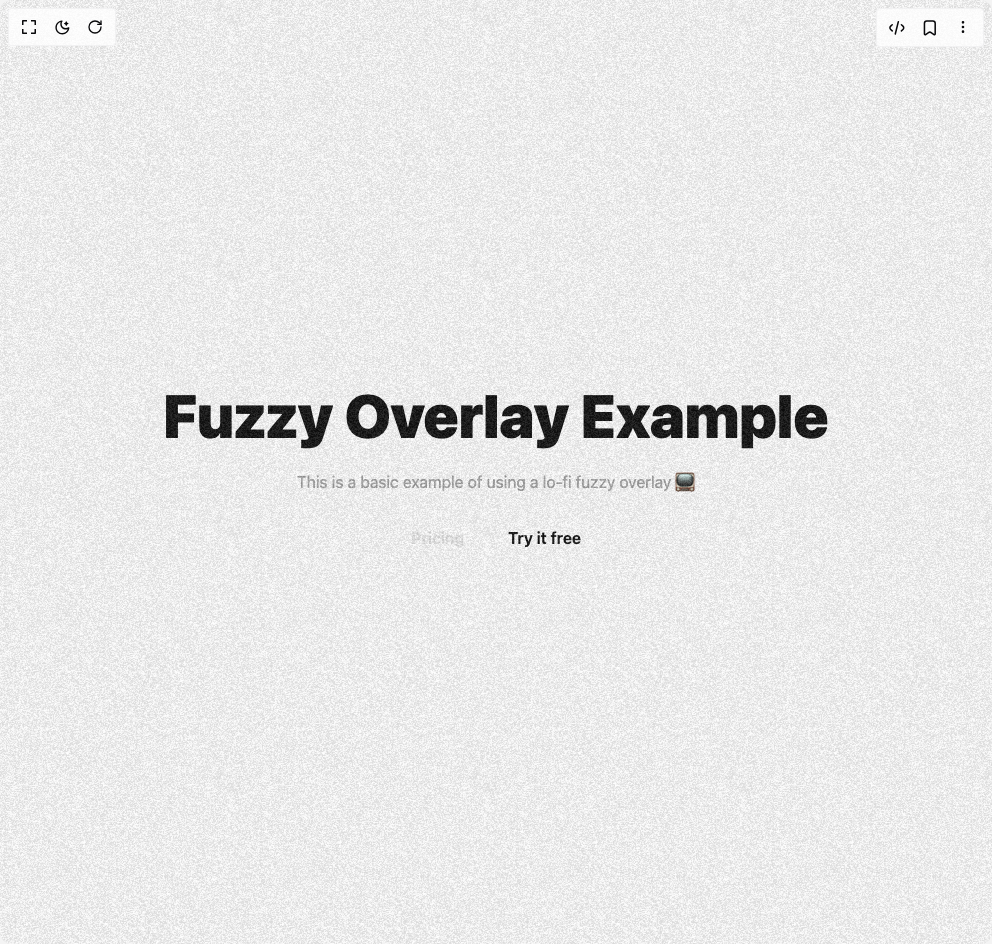

# Build Animated Fuzzy Overlay Effect in BuilderStudio

> Build this component in our Agentic IDE: [BuilderStudio](https://builderstudio.dev).
>
> Join the BuilderStudio community on [Discord](https://discord.gg/QdWeSGCqfe) and [Reddit](https://reddit.com/r/builderstudio).



## Component

- Author group: `uniquesonu`
- Component: `animated-fuzzy-overlay-effect`
- Variant: `default`
- Rendered HTML snapshot: [`rendered.html`](rendered.html)

## BuilderStudio prompt

You are implementing a React component based on a component reference.

## Component identity

- Author: uniquesonu
- Component slug: animated-fuzzy-overlay-effect
- Demo slug: default
- Title: animated-fuzzy-overlay-effect
- Description: 

## Goal

Recreate this component in a React + TypeScript + Tailwind CSS project. Preserve the visual layout, spacing, colors, border radius, shadows, interaction behavior, animation behavior, responsive behavior, and dark mode behavior shown in the rendered demo.

## Implementation requirements

- Use React and TypeScript.
- Use Tailwind CSS classes whenever possible.
- Keep the component self-contained unless the source files require helper components.
- If the source uses CSS variables, custom CSS, animations, or keyframes, include them.
- If the source uses external packages, list and use the required packages.
- Preserve accessibility attributes, button semantics, links, keyboard behavior, and ARIA attributes when visible in the source.
- Do not replace the component with a simplified placeholder.
- Return complete production-ready code.

## Dependencies

No reference metadata available.

## Rendered DOM snapshot

This is the rendered demo HTML extracted from the live preview. Use it to verify structure, class names, visible content, and layout.

```html
<div id="root"><div class="w-screen min-h-screen flex justify-center items-center"><div class="w-screen min-h-screen flex justify-center items-center"><div class="relative overflow-hidden w-full"><div class="relative grid h-screen w-full place-content-center space-y-6 bg-background p-8"><p class="text-center text-6xl font-black text-foreground">Fuzzy Overlay Example</p><p class="text-center text-neutral-400">This is a basic example of using a lo-fi fuzzy overlay 📺</p><div class="flex items-center justify-center gap-3"><button class="text-neutral-20 w-fit px-4 py-2 font-semibold text-neutral-200 transition-colors hover:bg-neutral-800">Pricing</button><button class="w-fit bg-background px-4 py-2 font-semibold text-foreground transition-colors hover:bg-neutral-500">Try it free</button></div></div><div class="pointer-events-none absolute -inset-[100%] opacity-[15%]" style="background-image: url(&quot;https://www.hover.dev/noise.png&quot;); transform: translateX(-0.3%) translateY(-0.3%);"></div></div></div></div></div>
```

## Reference source files

No reference source files were available.
