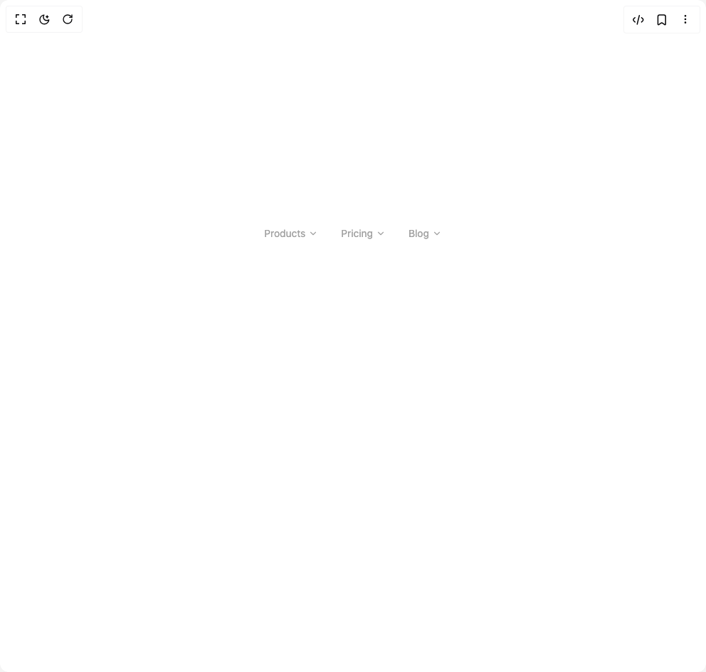

# Build Animated Shifting Tab Component in BuilderStudio

> Build this component in our Agentic IDE: [BuilderStudio](https://builderstudio.dev).
>
> Join the BuilderStudio community on [Discord](https://discord.gg/QdWeSGCqfe) and [Reddit](https://reddit.com/r/builderstudio).



## Component

- Author group: `uniquesonu`
- Component: `animated-shifting-tab-component`
- Variant: `default`
- Rendered HTML snapshot: [`rendered.html`](rendered.html)

## BuilderStudio prompt

You are implementing a React component based on a component reference.

## Component identity

- Author: uniquesonu
- Component slug: animated-shifting-tab-component
- Demo slug: default
- Title: animated-shifting-tab-component
- Description: 

## Goal

Recreate this component in a React + TypeScript + Tailwind CSS project. Preserve the visual layout, spacing, colors, border radius, shadows, interaction behavior, animation behavior, responsive behavior, and dark mode behavior shown in the rendered demo.

## Implementation requirements

- Use React and TypeScript.
- Use Tailwind CSS classes whenever possible.
- Keep the component self-contained unless the source files require helper components.
- If the source uses CSS variables, custom CSS, animations, or keyframes, include them.
- If the source uses external packages, list and use the required packages.
- Preserve accessibility attributes, button semantics, links, keyboard behavior, and ARIA attributes when visible in the source.
- Do not replace the component with a simplified placeholder.
- Return complete production-ready code.

## Dependencies

No reference metadata available.

## Rendered DOM snapshot

This is the rendered demo HTML extracted from the live preview. Use it to verify structure, class names, visible content, and layout.

```html
<div id="root"><div class="w-screen min-h-screen flex justify-center items-center"><div class="w-screen min-h-screen flex justify-center items-center"><div class="flex h-96 w-full justify-start bg-background p-8 text-foreground md:justify-center"><div class="relative flex h-fit gap-2"><button id="shift-tab-1" class="flex items-center gap-1 rounded-full px-3 py-1.5 text-sm transition-colors text-neutral-400"><span>Products</span><svg stroke="currentColor" fill="none" stroke-width="2" viewBox="0 0 24 24" stroke-linecap="round" stroke-linejoin="round" class="transition-transform " height="1em" width="1em" xmlns="http://www.w3.org/2000/svg"><polyline points="6 9 12 15 18 9"></polyline></svg></button><button id="shift-tab-2" class="flex items-center gap-1 rounded-full px-3 py-1.5 text-sm transition-colors text-neutral-400"><span>Pricing</span><svg stroke="currentColor" fill="none" stroke-width="2" viewBox="0 0 24 24" stroke-linecap="round" stroke-linejoin="round" class="transition-transform " height="1em" width="1em" xmlns="http://www.w3.org/2000/svg"><polyline points="6 9 12 15 18 9"></polyline></svg></button><button id="shift-tab-3" class="flex items-center gap-1 rounded-full px-3 py-1.5 text-sm transition-colors text-neutral-400"><span>Blog</span><svg stroke="currentColor" fill="none" stroke-width="2" viewBox="0 0 24 24" stroke-linecap="round" stroke-linejoin="round" class="transition-transform " height="1em" width="1em" xmlns="http://www.w3.org/2000/svg"><polyline points="6 9 12 15 18 9"></polyline></svg></button></div></div></div></div></div>
```

## Reference source files

No reference source files were available.
