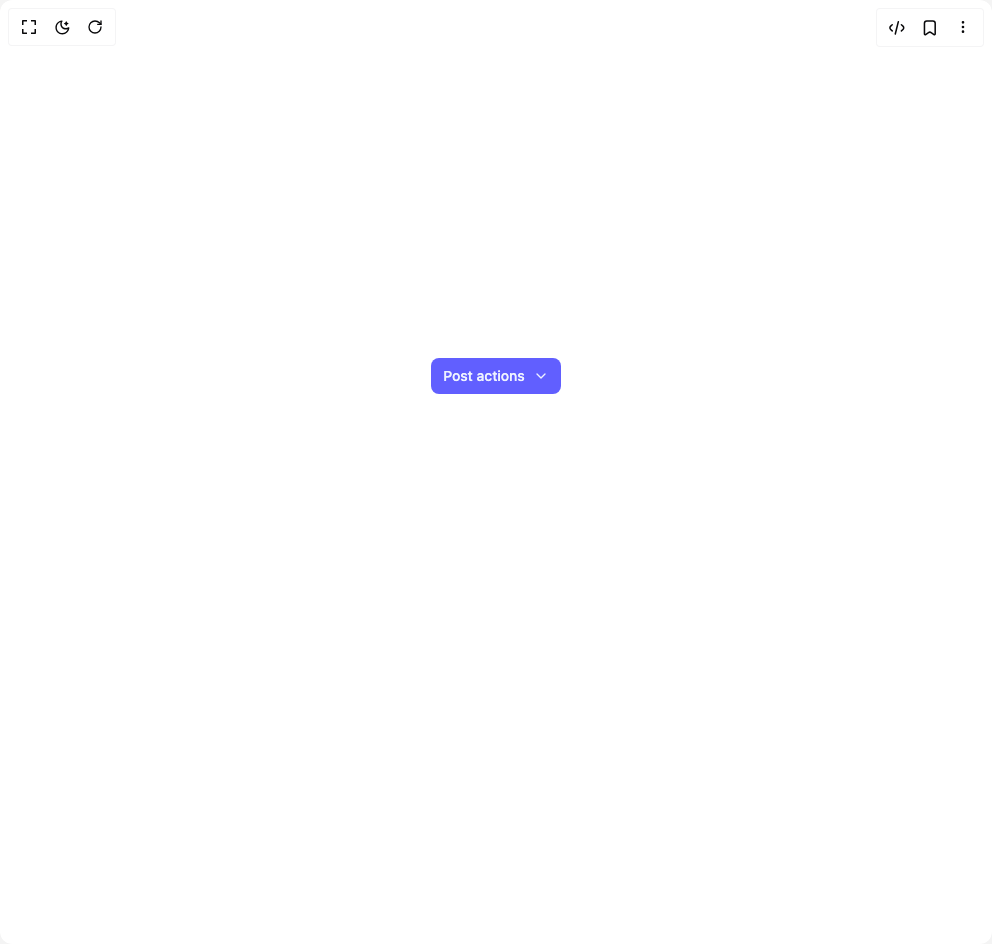

# Build Animated Staggered Dropdown in BuilderStudio

> Build this component in our Agentic IDE: [BuilderStudio](https://builderstudio.dev).
>
> Join the BuilderStudio community on [Discord](https://discord.gg/QdWeSGCqfe) and [Reddit](https://reddit.com/r/builderstudio).



## Component

- Author group: `uniquesonu`
- Component: `animated-staggered-dropdown`
- Variant: `default`
- Rendered HTML snapshot: [`rendered.html`](rendered.html)

## BuilderStudio prompt

You are implementing a React component based on a component reference.

## Component identity

- Author: uniquesonu
- Component slug: animated-staggered-dropdown
- Demo slug: default
- Title: animated-staggered-dropdown
- Description: 

## Goal

Recreate this component in a React + TypeScript + Tailwind CSS project. Preserve the visual layout, spacing, colors, border radius, shadows, interaction behavior, animation behavior, responsive behavior, and dark mode behavior shown in the rendered demo.

## Implementation requirements

- Use React and TypeScript.
- Use Tailwind CSS classes whenever possible.
- Keep the component self-contained unless the source files require helper components.
- If the source uses CSS variables, custom CSS, animations, or keyframes, include them.
- If the source uses external packages, list and use the required packages.
- Preserve accessibility attributes, button semantics, links, keyboard behavior, and ARIA attributes when visible in the source.
- Do not replace the component with a simplified placeholder.
- Return complete production-ready code.

## Dependencies

No reference metadata available.

## Rendered DOM snapshot

This is the rendered demo HTML extracted from the live preview. Use it to verify structure, class names, visible content, and layout.

```html
<div id="root"><div class="w-screen min-h-screen flex justify-center items-center"><div class="w-screen min-h-screen flex justify-center items-center"><div class="p-8 pb-56 flex items-center justify-center bg-background"><div class="relative"><button class="flex items-center gap-2 px-3 py-2 rounded-md text-indigo-50 bg-indigo-500 hover:bg-indigo-500 transition-colors"><span class="font-medium text-sm">Post actions</span><span style="transform: none;"><svg stroke="currentColor" fill="none" stroke-width="2" viewBox="0 0 24 24" stroke-linecap="round" stroke-linejoin="round" height="1em" width="1em" xmlns="http://www.w3.org/2000/svg"><polyline points="6 9 12 15 18 9"></polyline></svg></span></button><ul class="flex flex-col gap-2 p-2 rounded-lg bg-white shadow-xl absolute top-[120%] left-[50%] w-48 overflow-hidden" style="transform: translateX(-50%) scaleY(0); transform-origin: 50% top 0px;"><li class="flex items-center gap-2 w-full p-2 text-xs font-medium whitespace-nowrap rounded-md hover:bg-indigo-100 text-slate-700 hover:text-indigo-500 transition-colors cursor-pointer" style="opacity: 0; transform: translateY(-15px);"><span style="transform: translateY(-7px) scale(0);"><svg stroke="currentColor" fill="none" stroke-width="2" viewBox="0 0 24 24" stroke-linecap="round" stroke-linejoin="round" height="1em" width="1em" xmlns="http://www.w3.org/2000/svg"><path d="M11 4H4a2 2 0 0 0-2 2v14a2 2 0 0 0 2 2h14a2 2 0 0 0 2-2v-7"></path><path d="M18.5 2.5a2.121 2.121 0 0 1 3 3L12 15l-4 1 1-4 9.5-9.5z"></path></svg></span><span>Edit</span></li><li class="flex items-center gap-2 w-full p-2 text-xs font-medium whitespace-nowrap rounded-md hover:bg-indigo-100 text-slate-700 hover:text-indigo-500 transition-colors cursor-pointer" style="opacity: 0; transform: translateY(-15px);"><span style="transform: translateY(-7px) scale(0);"><svg stroke="currentColor" fill="none" stroke-width="2" viewBox="0 0 24 24" stroke-linecap="round" stroke-linejoin="round" height="1em" width="1em" xmlns="http://www.w3.org/2000/svg"><rect x="3" y="3" width="18" height="18" rx="2" ry="2"></rect><line x1="12" y1="8" x2="12" y2="16"></line><line x1="8" y1="12" x2="16" y2="12"></line></svg></span><span>Duplicate</span></li><li class="flex items-center gap-2 w-full p-2 text-xs font-medium whitespace-nowrap rounded-md hover:bg-indigo-100 text-slate-700 hover:text-indigo-500 transition-colors cursor-pointer" style="opacity: 0; transform: translateY(-15px);"><span style="transform: translateY(-7px) scale(0);"><svg stroke="currentColor" fill="none" stroke-width="2" viewBox="0 0 24 24" stroke-linecap="round" stroke-linejoin="round" height="1em" width="1em" xmlns="http://www.w3.org/2000/svg"><path d="M4 12v8a2 2 0 0 0 2 2h12a2 2 0 0 0 2-2v-8"></path><polyline points="16 6 12 2 8 6"></polyline><line x1="12" y1="2" x2="12" y2="15"></line></svg></span><span>Share</span></li><li class="flex items-center gap-2 w-full p-2 text-xs font-medium whitespace-nowrap rounded-md hover:bg-indigo-100 text-slate-700 hover:text-indigo-500 transition-colors cursor-pointer" style="opacity: 0; transform: translateY(-15px);"><span style="transform: translateY(-7px) scale(0);"><svg stroke="currentColor" fill="none" stroke-width="2" viewBox="0 0 24 24" stroke-linecap="round" stroke-linejoin="round" height="1em" width="1em" xmlns="http://www.w3.org/2000/svg"><polyline points="3 6 5 6 21 6"></polyline><path d="M19 6v14a2 2 0 0 1-2 2H7a2 2 0 0 1-2-2V6m3 0V4a2 2 0 0 1 2-2h4a2 2 0 0 1 2 2v2"></path></svg></span><span>Remove</span></li></ul></div></div></div></div></div>
```

## Reference source files

No reference source files were available.
