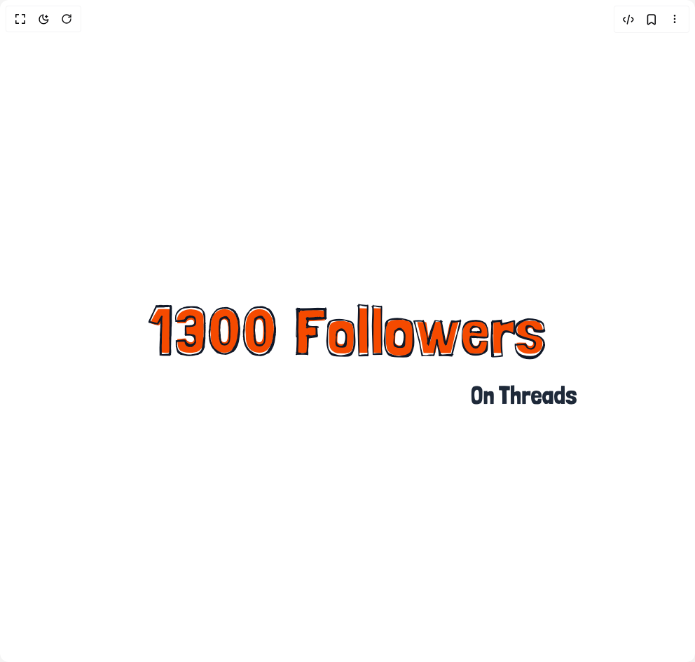

# Build Animated Text With Staggered Effect in BuilderStudio

> Build this component in our Agentic IDE: [BuilderStudio](https://builderstudio.dev).
>
> Join the BuilderStudio community on [Discord](https://discord.gg/QdWeSGCqfe) and [Reddit](https://reddit.com/r/builderstudio).



## Component

- Author group: `uniquesonu`
- Component: `animated-text-with-staggered-effect`
- Variant: `default`
- Rendered HTML snapshot: [`rendered.html`](rendered.html)

## BuilderStudio prompt

You are implementing a React component based on a component reference.

## Component identity

- Author: uniquesonu
- Component slug: animated-text-with-staggered-effect
- Demo slug: default
- Title: animated-text-with-staggered-effect
- Description: 

## Goal

Recreate this component in a React + TypeScript + Tailwind CSS project. Preserve the visual layout, spacing, colors, border radius, shadows, interaction behavior, animation behavior, responsive behavior, and dark mode behavior shown in the rendered demo.

## Implementation requirements

- Use React and TypeScript.
- Use Tailwind CSS classes whenever possible.
- Keep the component self-contained unless the source files require helper components.
- If the source uses CSS variables, custom CSS, animations, or keyframes, include them.
- If the source uses external packages, list and use the required packages.
- Preserve accessibility attributes, button semantics, links, keyboard behavior, and ARIA attributes when visible in the source.
- Do not replace the component with a simplified placeholder.
- Return complete production-ready code.

## Dependencies

No reference metadata available.

## Rendered DOM snapshot

This is the rendered demo HTML extracted from the live preview. Use it to verify structure, class names, visible content, and layout.

```html
<div id="root"><div class="w-screen min-h-screen flex justify-center items-center"><div class="w-screen min-h-screen flex justify-center items-center"><div class="flex min-h-screen items-center justify-center bg-black text-white"><link href="https://fonts.googleapis.com/css2?family=Londrina+Solid:wght@400&amp;family=Londrina+Sketch&amp;display=swap" rel="stylesheet"><style>
    @keyframes fontSkew {
      0% { transform: skew(6deg, 0deg); }
      20% { transform: skew(-4deg, 0deg); }
      40% { transform: skew(8deg, 0deg); }
      60% { transform: skew(-6deg, 0deg); }
      80% { transform: skew(2deg, 0deg); }
      100% { transform: skew(-10deg, 0deg); }
    }
    @keyframes fontScale {
      0% { transform: scale(1); }
      20% { transform: scale(1.1); }
      40% { transform: scale(0.9); }
      60% { transform: scale(1.05); }
      80% { transform: scale(0.9); }
      100% { transform: scale(1.2); }
    }
  </style><div class="relative w-fit-content text-6xl sm:text-8xl lg:text-[15vmin]"><div class="absolute left-0 top-0 flex -translate-x-1/2 -translate-y-1/2 font-['Londrina_Solid'] text-orange-600 dark:text-orange-400"><span class="m-0 [animation:fontSkew_2000ms_steps(1,end)_infinite,fontScale_1000ms_steps(1,end)_infinite]" style="animation-delay: 200ms;">1</span><span class="m-0 [animation:fontSkew_2000ms_steps(1,end)_infinite,fontScale_1000ms_steps(1,end)_infinite]" style="animation-delay: 200ms;">3</span><span class="m-0 [animation:fontSkew_2000ms_steps(1,end)_infinite,fontScale_1000ms_steps(1,end)_infinite]" style="animation-delay: -50ms;">0</span><span class="m-0 [animation:fontSkew_2000ms_steps(1,end)_infinite,fontScale_1000ms_steps(1,end)_infinite]" style="animation-delay: 200ms;">0</span><span class="mx-2 sm:mx-3 lg:mx-[1.5vmin]"></span><span class="m-0 [animation:fontSkew_2000ms_steps(1,end)_infinite,fontScale_1000ms_steps(1,end)_infinite]" style="animation-delay: -50ms;">F</span><span class="m-0 [animation:fontSkew_2000ms_steps(1,end)_infinite,fontScale_1000ms_steps(1,end)_infinite]" style="animation-delay: -800ms;">o</span><span class="m-0 [animation:fontSkew_2000ms_steps(1,end)_infinite,fontScale_1000ms_steps(1,end)_infinite]" style="animation-delay: 200ms;">l</span><span class="m-0 [animation:fontSkew_2000ms_steps(1,end)_infinite,fontScale_1000ms_steps(1,end)_infinite]" style="animation-delay: -50ms;">l</span><span class="m-0 [animation:fontSkew_2000ms_steps(1,end)_infinite,fontScale_1000ms_steps(1,end)_infinite]" style="animation-delay: -300ms;">o</span><span class="m-0 [animation:fontSkew_2000ms_steps(1,end)_infinite,fontScale_1000ms_steps(1,end)_infinite]" style="animation-delay: 200ms;">w</span><span class="m-0 [animation:fontSkew_2000ms_steps(1,end)_infinite,fontScale_1000ms_steps(1,end)_infinite]" style="animation-delay: -50ms;">e</span><span class="m-0 [animation:fontSkew_2000ms_steps(1,end)_infinite,fontScale_1000ms_steps(1,end)_infinite]" style="animation-delay: 200ms;">r</span><span class="m-0 [animation:fontSkew_2000ms_steps(1,end)_infinite,fontScale_1000ms_steps(1,end)_infinite]" style="animation-delay: -800ms;">s</span></div><div class="absolute left-0 top-0 flex -translate-x-1/2 -translate-y-1/2 font-['Londrina_Sketch'] text-gray-900 dark:text-gray-100"><span class="m-0 [animation:fontSkew_2000ms_steps(1,end)_infinite,fontScale_1000ms_steps(1,end)_infinite]" style="animation-delay: 0ms;">1</span><span class="m-0 [animation:fontSkew_2000ms_steps(1,end)_infinite,fontScale_1000ms_steps(1,end)_infinite]" style="animation-delay: 0ms;">3</span><span class="m-0 [animation:fontSkew_2000ms_steps(1,end)_infinite,fontScale_1000ms_steps(1,end)_infinite]" style="animation-delay: -250ms;">0</span><span class="m-0 [animation:fontSkew_2000ms_steps(1,end)_infinite,fontScale_1000ms_steps(1,end)_infinite]" style="animation-delay: 0ms;">0</span><span class="mx-2 sm:mx-3 lg:mx-[1.5vmin]"></span><span class="m-0 [animation:fontSkew_2000ms_steps(1,end)_infinite,fontScale_1000ms_steps(1,end)_infinite]" style="animation-delay: -250ms;">F</span><span class="m-0 [animation:fontSkew_2000ms_steps(1,end)_infinite,fontScale_1000ms_steps(1,end)_infinite]" style="animation-delay: -1000ms;">o</span><span class="m-0 [animation:fontSkew_2000ms_steps(1,end)_infinite,fontScale_1000ms_steps(1,end)_infinite]" style="animation-delay: 0ms;">l</span><span class="m-0 [animation:fontSkew_2000ms_steps(1,end)_infinite,fontScale_1000ms_steps(1,end)_infinite]" style="animation-delay: -250ms;">l</span><span class="m-0 [animation:fontSkew_2000ms_steps(1,end)_infinite,fontScale_1000ms_steps(1,end)_infinite]" style="animation-delay: -500ms;">o</span><span class="m-0 [animation:fontSkew_2000ms_steps(1,end)_infinite,fontScale_1000ms_steps(1,end)_infinite]" style="animation-delay: 0ms;">w</span><span class="m-0 [animation:fontSkew_2000ms_steps(1,end)_infinite,fontScale_1000ms_steps(1,end)_infinite]" style="animation-delay: -250ms;">e</span><span class="m-0 [animation:fontSkew_2000ms_steps(1,end)_infinite,fontScale_1000ms_steps(1,end)_infinite]" style="animation-delay: 0ms;">r</span><span class="m-0 [animation:fontSkew_2000ms_steps(1,end)_infinite,fontScale_1000ms_steps(1,end)_infinite]" style="animation-delay: -1000ms;">s</span></div><div class="font-['Londrina_Solid'] absolute text-3xl sm:text-4xl lg:text-[8vmin] text-gray-800 dark:text-gray-200 whitespace-nowrap 
        transform 
        translate-x-[7rem] translate-y-[2.75rem] 
        sm:translate-x-[11rem] sm:translate-y-[4.5rem] 
        lg:translate-x-0 lg:translate-y-0 lg:[transform:translate(27vmin,11vmin)]">On Threads</div></div></div></div></div></div>
```

## Reference source files

No reference source files were available.
