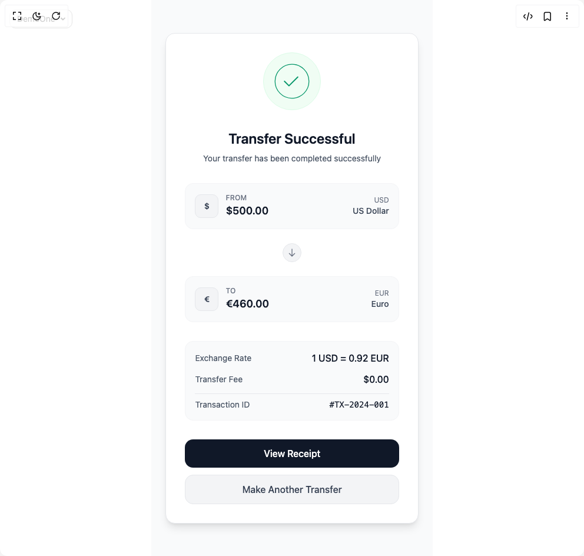

# Build Currency Transfer Animation in BuilderStudio

> Build this component in our Agentic IDE: [BuilderStudio](https://builderstudio.dev).
>
> Join the BuilderStudio community on [Discord](https://discord.gg/QdWeSGCqfe) and [Reddit](https://reddit.com/r/builderstudio).



## Component

- Author group: `uniquesonu`
- Component: `currency-transfer-animation`
- Variant: `default`
- Rendered HTML snapshot: [`rendered.html`](rendered.html)

## BuilderStudio prompt

You are implementing a React component based on a component reference.

## Component identity

- Author: uniquesonu
- Component slug: currency-transfer-animation
- Demo slug: default
- Title: currency-transfer-animation
- Description: 

## Goal

Recreate this component in a React + TypeScript + Tailwind CSS project. Preserve the visual layout, spacing, colors, border radius, shadows, interaction behavior, animation behavior, responsive behavior, and dark mode behavior shown in the rendered demo.

## Implementation requirements

- Use React and TypeScript.
- Use Tailwind CSS classes whenever possible.
- Keep the component self-contained unless the source files require helper components.
- If the source uses CSS variables, custom CSS, animations, or keyframes, include them.
- If the source uses external packages, list and use the required packages.
- Preserve accessibility attributes, button semantics, links, keyboard behavior, and ARIA attributes when visible in the source.
- Do not replace the component with a simplified placeholder.
- Return complete production-ready code.

## Dependencies

No reference metadata available.

## Rendered DOM snapshot

This is the rendered demo HTML extracted from the live preview. Use it to verify structure, class names, visible content, and layout.

```html
<div id="root"><div class="fixed top-4 left-4 z-10"><select class="appearance-none h-8 max-w-[200px] text-sm leading-tight rounded-lg pl-3 pr-7 py-0 border bg-background focus:outline-none focus:ring-0"><option value="named_DemoOne_DemoOne">DemoOne</option></select><div class="absolute top-1/2 transform -translate-y-1/2 right-2 pointer-events-none"><svg class="w-4 h-4 fill-current" viewBox="0 0 20 20"><path d="M5.516 7.548c.436-.446 1.043-.48 1.576 0L10 10.405l2.908-2.857c.533-.48 1.14-.446 1.576 0 .436.445.408 1.197 0 1.615l-3.734 3.705c-.533.534-1.39.534-1.923 0l-3.734-3.705c-.408-.418-.436-1.17 0-1.615z"></path></svg></div></div><div class="w-screen min-h-screen flex justify-center items-center"><div class="min-h-screen bg-gray-50 flex items-center justify-center p-6"><div class="w-full max-w-md mx-auto transition-all duration-700 ease-out" style="transform: translateY(0px); opacity: 1;"><div class="bg-white rounded-2xl border border-gray-200 shadow-lg p-8"><div class="space-y-8"><div class="flex justify-center"><div class="bg-green-50 rounded-full p-4 border border-green-100"><div class="relative "><svg width="64" height="64" viewBox="0 0 100 100" class="transform transition-all duration-500 ease-out" style="transform: scale(1); opacity: 1;"><circle cx="50" cy="50" r="45" stroke="#059669" stroke-width="2" fill="none" style="stroke-dasharray: 283; stroke-dashoffset: 0; transition: stroke-dashoffset 1s ease-out 0.3s; stroke-linecap: round;"></circle><path d="M30 50L42 62L70 34" stroke="#059669" stroke-width="3" fill="none" style="stroke-dasharray: 50; stroke-dashoffset: 0; transition: stroke-dashoffset 0.6s ease-out 1s; stroke-linecap: round; stroke-linejoin: round;"></path></svg></div></div></div><div class="text-center transition-all duration-500 ease-out delay-1000" style="transform: translateY(0px); opacity: 1;"><h1 class="text-2xl font-semibold text-gray-900 mb-2">Transfer Successful</h1><p class="text-gray-600 text-sm">Your transfer has been completed successfully</p></div><div class="space-y-4 transition-all duration-500 ease-out delay-1200" style="transform: translateY(0px); opacity: 1;"><div class="bg-gray-50 rounded-xl p-4 border border-gray-100"><div class="flex items-center space-x-3"><div class="flex items-center justify-center w-10 h-10 rounded-lg bg-gray-100 border border-gray-200 transition-all duration-500 ease-out" style="transform: translateY(0px) scale(1); opacity: 1;"><span class="text-gray-700 font-semibold text-sm">$</span></div><div class="flex-1"><div class="flex items-center justify-between"><div><p class="text-gray-500 text-xs font-medium uppercase tracking-wide">From</p><p class="text-gray-900 font-semibold text-lg">$500.00</p></div><div class="text-right"><p class="text-gray-500 text-xs">USD</p><p class="text-gray-700 text-sm font-medium">US Dollar</p></div></div></div></div></div><div class="flex justify-center py-2"><div class="w-8 h-8 rounded-full bg-gray-100 border border-gray-200 flex items-center justify-center transition-all duration-500 ease-out delay-1600" style="transform: scale(1); opacity: 1;"><svg class="w-4 h-4 text-gray-500" fill="none" stroke="currentColor" viewBox="0 0 24 24"><path stroke-linecap="round" stroke-linejoin="round" stroke-width="2" d="M19 14l-7 7m0 0l-7-7m7 7V3"></path></svg></div></div><div class="bg-gray-50 rounded-xl p-4 border border-gray-100"><div class="flex items-center space-x-3"><div class="flex items-center justify-center w-10 h-10 rounded-lg bg-gray-100 border border-gray-200 transition-all duration-500 ease-out" style="transform: translateY(0px) scale(1); opacity: 1;"><span class="text-gray-700 font-semibold text-sm">€</span></div><div class="flex-1"><div class="flex items-center justify-between"><div><p class="text-gray-500 text-xs font-medium uppercase tracking-wide">To</p><p class="text-gray-900 font-semibold text-lg">€460.00</p></div><div class="text-right"><p class="text-gray-500 text-xs">EUR</p><p class="text-gray-700 text-sm font-medium">Euro</p></div></div></div></div></div></div><div class="space-y-4 transition-all duration-500 ease-out delay-2000" style="transform: translateY(0px); opacity: 1;"><div class="bg-gray-50 rounded-xl p-4 border border-gray-100"><div class="space-y-3"><div class="flex justify-between items-center"><span class="text-gray-600 text-sm">Exchange Rate</span><span class="text-gray-900 font-medium">1 USD = 0.92 EUR</span></div><div class="flex justify-between items-center"><span class="text-gray-600 text-sm">Transfer Fee</span><span class="text-gray-900 font-medium">$0.00</span></div><div class="border-t border-gray-200 pt-2"><div class="flex justify-between items-center"><span class="text-gray-600 text-sm">Transaction ID</span><span class="text-gray-900 font-mono text-sm">#TX-2024-001</span></div></div></div></div></div><div class="space-y-3 transition-all duration-500 ease-out delay-2200" style="transform: translateY(0px); opacity: 1;"><button class="w-full bg-gray-900 hover:bg-gray-800 text-white font-medium py-3 px-6 rounded-xl transition-colors duration-200">View Receipt</button><button class="w-full bg-gray-100 hover:bg-gray-200 text-gray-700 font-medium py-3 px-6 rounded-xl transition-colors duration-200 border border-gray-200">Make Another Transfer</button></div></div></div></div></div></div></div>
```

## Reference source files

No reference source files were available.
