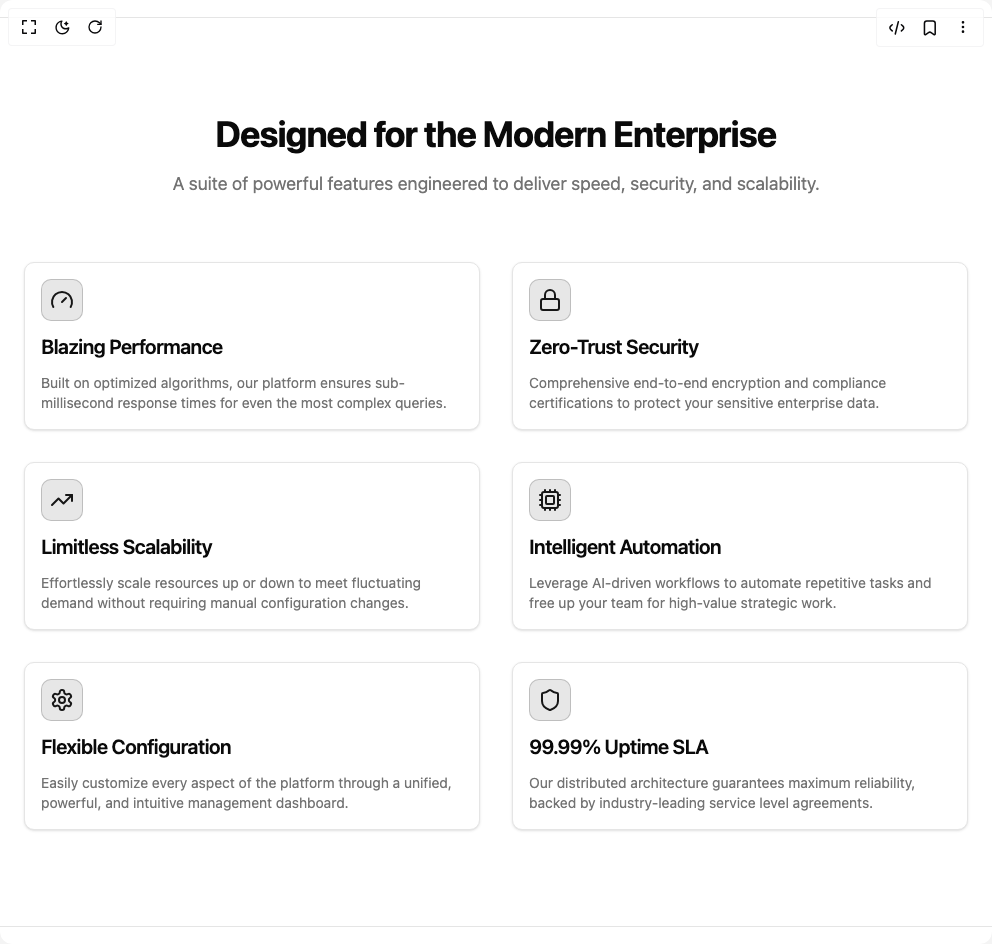

# Build Feature Grid Enterprise Grade in BuilderStudio

> Build this component in our Agentic IDE: [BuilderStudio](https://builderstudio.dev).
>
> Join the BuilderStudio community on [Discord](https://discord.gg/QdWeSGCqfe) and [Reddit](https://reddit.com/r/builderstudio).



## Component

- Author group: `uniquesonu`
- Component: `feature-grid-enterprise-grade`
- Variant: `default`
- Rendered HTML snapshot: [`rendered.html`](rendered.html)

## BuilderStudio prompt

You are implementing a React component based on a component reference.

## Component identity

- Author: uniquesonu
- Component slug: feature-grid-enterprise-grade
- Demo slug: default
- Title: feature-grid-enterprise-grade
- Description: 

## Goal

Recreate this component in a React + TypeScript + Tailwind CSS project. Preserve the visual layout, spacing, colors, border radius, shadows, interaction behavior, animation behavior, responsive behavior, and dark mode behavior shown in the rendered demo.

## Implementation requirements

- Use React and TypeScript.
- Use Tailwind CSS classes whenever possible.
- Keep the component self-contained unless the source files require helper components.
- If the source uses CSS variables, custom CSS, animations, or keyframes, include them.
- If the source uses external packages, list and use the required packages.
- Preserve accessibility attributes, button semantics, links, keyboard behavior, and ARIA attributes when visible in the source.
- Do not replace the component with a simplified placeholder.
- Return complete production-ready code.

## Dependencies

No reference metadata available.

## Rendered DOM snapshot

This is the rendered demo HTML extracted from the live preview. Use it to verify structure, class names, visible content, and layout.

```html
<div id="root"><div class="w-screen min-h-screen flex justify-center items-center"><div class="w-screen min-h-screen flex justify-center items-center"><div class="bg-background"><section class="py-16 sm:py-24 bg-background text-foreground border-t border-b" role="region" aria-label="Features: Designed for the Modern Enterprise"><div class="max-w-7xl mx-auto px-4 sm:px-6 lg:px-8"><div class="text-center max-w-3xl mx-auto mb-12 sm:mb-16"><h2 class="text-3xl sm:text-4xl font-bold tracking-tight text-foreground">Designed for the Modern Enterprise</h2><p class="mt-4 text-lg text-muted-foreground">A suite of powerful features engineered to deliver speed, security, and scalability.</p></div><div class="grid gap-6 sm:gap-8 md:grid-cols-2 lg:grid-cols-3" role="list"><div class="rounded-lg border bg-card text-card-foreground shadow-sm flex flex-col h-full p-4 transition-all duration-300 hover:shadow-xl hover:scale-[1.01] hover:border-primary/50 focus-within:ring-2 focus-within:ring-primary focus-within:ring-offset-2" role="listitem"><div class="flex flex-col space-y-1.5 p-0 pb-3"><div class="mb-3 p-2 w-fit rounded-lg bg-primary/10 text-primary border border-primary/20 transition-colors duration-200"><svg xmlns="http://www.w3.org/2000/svg" width="24" height="24" viewBox="0 0 24 24" fill="none" stroke="currentColor" stroke-width="2" stroke-linecap="round" stroke-linejoin="round" class="lucide lucide-gauge h-6 w-6" aria-hidden="true"><path d="m12 14 4-4"></path><path d="M3.34 19a10 10 0 1 1 17.32 0"></path></svg></div><h3 class="tracking-tight text-xl font-semibold text-foreground">Blazing Performance</h3></div><div class="p-0 flex-grow"><p class="text-sm text-muted-foreground">Built on optimized algorithms, our platform ensures sub-millisecond response times for even the most complex queries.</p></div></div><div class="rounded-lg border bg-card text-card-foreground shadow-sm flex flex-col h-full p-4 transition-all duration-300 hover:shadow-xl hover:scale-[1.01] hover:border-primary/50 focus-within:ring-2 focus-within:ring-primary focus-within:ring-offset-2" role="listitem"><div class="flex flex-col space-y-1.5 p-0 pb-3"><div class="mb-3 p-2 w-fit rounded-lg bg-primary/10 text-primary border border-primary/20 transition-colors duration-200"><svg xmlns="http://www.w3.org/2000/svg" width="24" height="24" viewBox="0 0 24 24" fill="none" stroke="currentColor" stroke-width="2" stroke-linecap="round" stroke-linejoin="round" class="lucide lucide-lock h-6 w-6" aria-hidden="true"><rect width="18" height="11" x="3" y="11" rx="2" ry="2"></rect><path d="M7 11V7a5 5 0 0 1 10 0v4"></path></svg></div><h3 class="tracking-tight text-xl font-semibold text-foreground">Zero-Trust Security</h3></div><div class="p-0 flex-grow"><p class="text-sm text-muted-foreground">Comprehensive end-to-end encryption and compliance certifications to protect your sensitive enterprise data.</p></div></div><div class="rounded-lg border bg-card text-card-foreground shadow-sm flex flex-col h-full p-4 transition-all duration-300 hover:shadow-xl hover:scale-[1.01] hover:border-primary/50 focus-within:ring-2 focus-within:ring-primary focus-within:ring-offset-2" role="listitem"><div class="flex flex-col space-y-1.5 p-0 pb-3"><div class="mb-3 p-2 w-fit rounded-lg bg-primary/10 text-primary border border-primary/20 transition-colors duration-200"><svg xmlns="http://www.w3.org/2000/svg" width="24" height="24" viewBox="0 0 24 24" fill="none" stroke="currentColor" stroke-width="2" stroke-linecap="round" stroke-linejoin="round" class="lucide lucide-trending-up h-6 w-6" aria-hidden="true"><polyline points="22 7 13.5 15.5 8.5 10.5 2 17"></polyline><polyline points="16 7 22 7 22 13"></polyline></svg></div><h3 class="tracking-tight text-xl font-semibold text-foreground">Limitless Scalability</h3></div><div class="p-0 flex-grow"><p class="text-sm text-muted-foreground">Effortlessly scale resources up or down to meet fluctuating demand without requiring manual configuration changes.</p></div></div><div class="rounded-lg border bg-card text-card-foreground shadow-sm flex flex-col h-full p-4 transition-all duration-300 hover:shadow-xl hover:scale-[1.01] hover:border-primary/50 focus-within:ring-2 focus-within:ring-primary focus-within:ring-offset-2" role="listitem"><div class="flex flex-col space-y-1.5 p-0 pb-3"><div class="mb-3 p-2 w-fit rounded-lg bg-primary/10 text-primary border border-primary/20 transition-colors duration-200"><svg xmlns="http://www.w3.org/2000/svg" width="24" height="24" viewBox="0 0 24 24" fill="none" stroke="currentColor" stroke-width="2" stroke-linecap="round" stroke-linejoin="round" class="lucide lucide-cpu h-6 w-6" aria-hidden="true"><path d="M12 20v2"></path><path d="M12 2v2"></path><path d="M17 20v2"></path><path d="M17 2v2"></path><path d="M2 12h2"></path><path d="M2 17h2"></path><path d="M2 7h2"></path><path d="M20 12h2"></path><path d="M20 17h2"></path><path d="M20 7h2"></path><path d="M7 20v2"></path><path d="M7 2v2"></path><rect x="4" y="4" width="16" height="16" rx="2"></rect><rect x="8" y="8" width="8" height="8" rx="1"></rect></svg></div><h3 class="tracking-tight text-xl font-semibold text-foreground">Intelligent Automation</h3></div><div class="p-0 flex-grow"><p class="text-sm text-muted-foreground">Leverage AI-driven workflows to automate repetitive tasks and free up your team for high-value strategic work.</p></div></div><div class="rounded-lg border bg-card text-card-foreground shadow-sm flex flex-col h-full p-4 transition-all duration-300 hover:shadow-xl hover:scale-[1.01] hover:border-primary/50 focus-within:ring-2 focus-within:ring-primary focus-within:ring-offset-2" role="listitem"><div class="flex flex-col space-y-1.5 p-0 pb-3"><div class="mb-3 p-2 w-fit rounded-lg bg-primary/10 text-primary border border-primary/20 transition-colors duration-200"><svg xmlns="http://www.w3.org/2000/svg" width="24" height="24" viewBox="0 0 24 24" fill="none" stroke="currentColor" stroke-width="2" stroke-linecap="round" stroke-linejoin="round" class="lucide lucide-settings h-6 w-6" aria-hidden="true"><path d="M12.22 2h-.44a2 2 0 0 0-2 2v.18a2 2 0 0 1-1 1.73l-.43.25a2 2 0 0 1-2 0l-.15-.08a2 2 0 0 0-2.73.73l-.22.38a2 2 0 0 0 .73 2.73l.15.1a2 2 0 0 1 1 1.72v.51a2 2 0 0 1-1 1.74l-.15.09a2 2 0 0 0-.73 2.73l.22.38a2 2 0 0 0 2.73.73l.15-.08a2 2 0 0 1 2 0l.43.25a2 2 0 0 1 1 1.73V20a2 2 0 0 0 2 2h.44a2 2 0 0 0 2-2v-.18a2 2 0 0 1 1-1.73l.43-.25a2 2 0 0 1 2 0l.15.08a2 2 0 0 0 2.73-.73l.22-.39a2 2 0 0 0-.73-2.73l-.15-.08a2 2 0 0 1-1-1.74v-.5a2 2 0 0 1 1-1.74l.15-.09a2 2 0 0 0 .73-2.73l-.22-.38a2 2 0 0 0-2.73-.73l-.15.08a2 2 0 0 1-2 0l-.43-.25a2 2 0 0 1-1-1.73V4a2 2 0 0 0-2-2z"></path><circle cx="12" cy="12" r="3"></circle></svg></div><h3 class="tracking-tight text-xl font-semibold text-foreground">Flexible Configuration</h3></div><div class="p-0 flex-grow"><p class="text-sm text-muted-foreground">Easily customize every aspect of the platform through a unified, powerful, and intuitive management dashboard.</p></div></div><div class="rounded-lg border bg-card text-card-foreground shadow-sm flex flex-col h-full p-4 transition-all duration-300 hover:shadow-xl hover:scale-[1.01] hover:border-primary/50 focus-within:ring-2 focus-within:ring-primary focus-within:ring-offset-2" role="listitem"><div class="flex flex-col space-y-1.5 p-0 pb-3"><div class="mb-3 p-2 w-fit rounded-lg bg-primary/10 text-primary border border-primary/20 transition-colors duration-200"><svg xmlns="http://www.w3.org/2000/svg" width="24" height="24" viewBox="0 0 24 24" fill="none" stroke="currentColor" stroke-width="2" stroke-linecap="round" stroke-linejoin="round" class="lucide lucide-shield h-6 w-6" aria-hidden="true"><path d="M20 13c0 5-3.5 7.5-7.66 8.95a1 1 0 0 1-.67-.01C7.5 20.5 4 18 4 13V6a1 1 0 0 1 1-1c2 0 4.5-1.2 6.24-2.72a1.17 1.17 0 0 1 1.52 0C14.51 3.81 17 5 19 5a1 1 0 0 1 1 1z"></path></svg></div><h3 class="tracking-tight text-xl font-semibold text-foreground">99.99% Uptime SLA</h3></div><div class="p-0 flex-grow"><p class="text-sm text-muted-foreground">Our distributed architecture guarantees maximum reliability, backed by industry-leading service level agreements.</p></div></div></div></div></section></div></div></div></div>
```

## Reference source files

No reference source files were available.
