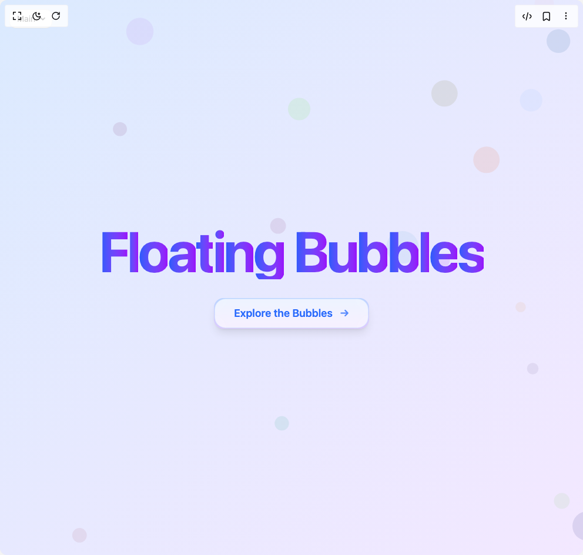

# Build Floating Bubbles Background in BuilderStudio

> Build this component in our Agentic IDE: [BuilderStudio](https://builderstudio.dev).
>
> Join the BuilderStudio community on [Discord](https://discord.gg/QdWeSGCqfe) and [Reddit](https://reddit.com/r/builderstudio).



## Component

- Author group: `uniquesonu`
- Component: `floating-bubbles-background`
- Variant: `default`
- Rendered HTML snapshot: [`rendered.html`](rendered.html)

## BuilderStudio prompt

You are implementing a React component based on a component reference.

## Component identity

- Author: uniquesonu
- Component slug: floating-bubbles-background
- Demo slug: default
- Title: floating-bubbles-background
- Description: 

## Goal

Recreate this component in a React + TypeScript + Tailwind CSS project. Preserve the visual layout, spacing, colors, border radius, shadows, interaction behavior, animation behavior, responsive behavior, and dark mode behavior shown in the rendered demo.

## Implementation requirements

- Use React and TypeScript.
- Use Tailwind CSS classes whenever possible.
- Keep the component self-contained unless the source files require helper components.
- If the source uses CSS variables, custom CSS, animations, or keyframes, include them.
- If the source uses external packages, list and use the required packages.
- Preserve accessibility attributes, button semantics, links, keyboard behavior, and ARIA attributes when visible in the source.
- Do not replace the component with a simplified placeholder.
- Return complete production-ready code.

## Dependencies

No reference metadata available.

## Rendered DOM snapshot

This is the rendered demo HTML extracted from the live preview. Use it to verify structure, class names, visible content, and layout.

```html
<div id="root"><div class="fixed top-4 left-4 z-10"><select class="appearance-none h-8 max-w-[200px] text-sm leading-tight rounded-lg pl-3 pr-7 py-0 border bg-background focus:outline-none focus:ring-0"><option value="named_Main_Main">Main</option></select><div class="absolute top-1/2 transform -translate-y-1/2 right-2 pointer-events-none"><svg class="w-4 h-4 fill-current" viewBox="0 0 20 20"><path d="M5.516 7.548c.436-.446 1.043-.48 1.576 0L10 10.405l2.908-2.857c.533-.48 1.14-.446 1.576 0 .436.445.408 1.197 0 1.615l-3.734 3.705c-.533.534-1.39.534-1.923 0l-3.734-3.705c-.408-.418-.436-1.17 0-1.615z"></path></svg></div></div><div class="w-screen min-h-screen flex justify-center items-center"><div class="relative min-h-screen w-full flex items-center justify-center overflow-hidden bg-gradient-to-br from-blue-100 to-purple-100 dark:from-blue-900 dark:to-purple-900"><div class="absolute inset-0 pointer-events-none"><svg class="w-full h-full"><title>Floating Bubbles</title><circle cx="914.533288460102" cy="2.051571700203459" r="16.59743428078212" fill="rgba(86.30548069845055,174.8204436738816,213.91935582164132,0.3)" opacity="0.5092256046948023" style="transform: translateX(773.941px) translateY(-37.8897px) scale(1.09539); transform-origin: 50% 50%; transform-box: fill-box;"></circle><circle cx="385.4695235053933" cy="867.9386024257071" r="20.305284820441663" fill="rgba(0.34810406300452845,153.11228693616536,242.39715094958663,0.3)" opacity="0.33298877166816965" style="transform: translateX(211.873px) translateY(451.241px) scale(1.18351); transform-origin: 50% 50%; transform-box: fill-box;"></circle><circle cx="739.5013925448912" cy="496.31117343094945" r="20.565838958211987" fill="rgba(182.87742560675838,100.35688471120413,159.23713755424214,0.3)" opacity="0.36774136555613945" style="transform: translateX(365.368px) translateY(232.535px) scale(1.16613); transform-origin: 50% 50%; transform-box: fill-box;"></circle><circle cx="345.00175609703325" cy="724.609984113" r="8.91375711537491" fill="rgba(158.28369697816527,216.8251695950811,57.06093090312751,0.3)" opacity="0.3132516943034716" style="transform: translateX(194.245px) translateY(453.981px) scale(1.19337); transform-origin: 50% 50%; transform-box: fill-box;"></circle><circle cx="581.8741824358735" cy="709.9654430349696" r="10.021830593738098" fill="rgba(253.58457627541785,104.50887322969803,73.2890954471917,0.3)" opacity="0.3025805644574575" style="transform: translateX(375.992px) translateY(473.082px) scale(1.19871); transform-origin: 50% 50%; transform-box: fill-box;"></circle><circle cx="90.34123898068495" cy="584.81445967249" r="10.365126704964826" fill="rgba(163.39870976827217,61.48783251865347,86.4228586811822,0.3)" opacity="0.31598929403116927" style="transform: translateX(44.6913px) translateY(323.679px) scale(1.19201); transform-origin: 50% 50%; transform-box: fill-box;"></circle><circle cx="811.1756605923368" cy="193.02077361136048" r="5.361638359048088" fill="rgba(51.99484864169001,84.31157487043737,10.215006332162167,0.3)" opacity="0.3069006092962809" style="transform: translateX(518.278px) translateY(119.805px) scale(1.19655); transform-origin: 50% 50%; transform-box: fill-box;"></circle><circle cx="99.67302943164503" cy="131.91614397445167" r="11.203215003244729" fill="rgba(159.27089850614712,110.38240889497457,154.95534566230583,0.3)" opacity="0.5619226561277173" style="transform: translateX(103.948px) translateY(87.2651px) scale(1.06904); transform-origin: 50% 50%; transform-box: fill-box;"></circle><circle cx="568.3415579282157" cy="389.71213912161164" r="8.278876700654557" fill="rgba(104.26897844908015,85.69336184396384,134.6992943616486,0.3)" opacity="0.3355852013337426" style="transform: translateX(335.904px) translateY(235.694px) scale(1.18221); transform-origin: 50% 50%; transform-box: fill-box;"></circle><circle cx="159.9784386961427" cy="27.122547931905494" r="19.522953370586208" fill="rgba(172.452268931254,81.73706647613996,234.044603981317,0.3)" opacity="0.3150106712593697" style="transform: translateX(77.5788px) translateY(26.2001px) scale(1.19249); transform-origin: 50% 50%; transform-box: fill-box;"></circle><circle cx="912.4336473138186" cy="366.35241124528164" r="12.920911177013998" fill="rgba(233.96760928546576,128.9536495257595,112.48527700404735,0.3)" opacity="0.356144947593566" style="transform: translateX(701.338px) translateY(234.543px) scale(1.17193); transform-origin: 50% 50%; transform-box: fill-box;"></circle><circle cx="205.4929879517755" cy="777.0614916468336" r="15.244543230463963" fill="rgba(230.02931471652096,221.5147539394999,32.4114294643411,0.3)" opacity="0.3110632776399143" style="transform: translateX(153.011px) translateY(564.193px) scale(1.19447); transform-origin: 50% 50%; transform-box: fill-box;"></circle><circle cx="712.2787051376092" cy="723.3669534729374" r="13.200685043029225" fill="rgba(24.844660453752653,160.8190082997035,20.864785430357134,0.3)" opacity="0.301165266323369" style="transform: translateX(456.535px) translateY(495.81px) scale(1.19942); transform-origin: 50% 50%; transform-box: fill-box;"></circle><circle cx="685.0325149335138" cy="825.2727781698543" r="7.312233010791028" fill="rgba(137.6894634646166,177.28048358179507,213.60178917529765,0.3)" opacity="0.33593758404022084" style="transform: translateX(347.777px) translateY(466.708px) scale(1.18203); transform-origin: 50% 50%; transform-box: fill-box;"></circle><circle cx="513.6039594643491" cy="110.76032861476558" r="19.12964367190098" fill="rgba(116.77573221760437,110.18455075476062,24.030947521934316,0.3)" opacity="0.3597759516094811" style="transform: translateX(240.931px) translateY(47.8435px) scale(1.17011); transform-origin: 50% 50%; transform-box: fill-box;"></circle><circle cx="386.3958724012103" cy="927.4377101988259" r="5.325295129924454" fill="rgba(16.674902697398366,1.0370685576883671,159.70103200748215,0.3)" opacity="0.3896432579611428" style="transform: translateX(295.209px) translateY(709.848px) scale(1.15518); transform-origin: 50% 50%; transform-box: fill-box;"></circle><circle cx="60.243733770343795" cy="788.3245884753487" r="5.7597525843779" fill="rgba(98.59875664950893,163.28844125845706,100.38657437744273,0.3)" opacity="0.484632617153693" style="transform: translateX(12.7315px) translateY(675.647px) scale(1.10768); transform-origin: 50% 50%; transform-box: fill-box;"></circle><circle cx="447.46969318939324" cy="286.87898414655706" r="23.53999585879365" fill="rgba(97.5528287150908,171.1650439456924,213.77417431888483,0.3)" opacity="0.35096487613627686" style="transform: translateX(235.698px) translateY(132.787px) scale(1.17452); transform-origin: 50% 50%; transform-box: fill-box;"></circle><circle cx="108.61718474413408" cy="932.1246140711252" r="6.863552992807342" fill="rgba(29.408439956291517,16.029393636222974,155.61242932972957,0.3)" opacity="0.5348508363706059" style="transform: translateX(129.968px) translateY(775.716px) scale(1.08257); transform-origin: 50% 50%; transform-box: fill-box;"></circle><circle cx="490.65519565004456" cy="749.5997328468452" r="14.991050262132422" fill="rgba(43.2747389507281,117.57389268068006,213.66759294363337,0.3)" opacity="0.3453984956839122" style="transform: translateX(243.177px) translateY(407.12px) scale(1.1773); transform-origin: 50% 50%; transform-box: fill-box;"></circle><circle cx="581.7040190269124" cy="119.02568042499924" r="16.20729708165025" fill="rgba(134.77250289566072,186.6995859262834,253.61850747495032,0.3)" opacity="0.33611431672470643" style="transform: translateX(319.83px) translateY(51.2095px) scale(1.18194); transform-origin: 50% 50%; transform-box: fill-box;"></circle><circle cx="773.425011124006" cy="171.6873102412471" r="9.624591653984638" fill="rgba(56.4887174074098,250.46875858933174,252.6744873996935,0.3)" opacity="0.34309191746870055" style="transform: translateX(578.931px) translateY(102.669px) scale(1.17845); transform-origin: 50% 50%; transform-box: fill-box;"></circle><circle cx="811.7777538213195" cy="359.5180635097047" r="6.263588674732674" fill="rgba(2.910774463765789,162.07249993555206,224.06472818696574,0.3)" opacity="0.6826197567745111" style="transform: translateX(850.468px) translateY(314.955px) scale(1.00869); transform-origin: 50% 50%; transform-box: fill-box;"></circle><circle cx="291.15596628562565" cy="264.4735397877553" r="11.350970817318633" fill="rgba(124.49559118601132,34.29389026192715,98.68840299764013,0.3)" opacity="0.3377210502396338" style="transform: translateX(180.758px) translateY(118.9px) scale(1.18114); transform-origin: 50% 50%; transform-box: fill-box;"></circle><circle cx="505.4797552513845" cy="311.7410370415662" r="9.42142123822163" fill="rgba(158.91759069152488,5.855261972012372,245.56739945764122,0.3)" opacity="0.36751520646503194" style="transform: translateX(246.988px) translateY(130.38px) scale(1.16624); transform-origin: 50% 50%; transform-box: fill-box;"></circle><circle cx="707.2149676867856" cy="537.6236776159508" r="17.13026344827442" fill="rgba(124.77203747190065,59.31483736997731,70.04597430279222,0.3)" opacity="0.3177686189184897" style="transform: translateX(391.47px) translateY(289.652px) scale(1.19112); transform-origin: 50% 50%; transform-box: fill-box;"></circle><circle cx="793.1102272545027" cy="124.800443813439" r="11.212723333523403" fill="rgba(147.2757340918823,71.2297016425623,141.8808174881867,0.3)" opacity="0.32434484224068" style="transform: translateX(441.394px) translateY(52.9516px) scale(1.18783); transform-origin: 50% 50%; transform-box: fill-box;"></circle><circle cx="580.6906292040529" cy="337.0933873395804" r="7.46795674872012" fill="rgba(227.23983340940805,164.71472033999936,85.14103810985787,0.3)" opacity="0.356144947593566" style="transform: translateX(303.41px) translateY(184.089px) scale(1.17193); transform-origin: 50% 50%; transform-box: fill-box;"></circle><circle cx="599.0418005437602" cy="529.4262156068729" r="11.327409483181796" fill="rgba(119.7826035650808,207.3392838778058,86.6371751889078,0.3)" opacity="0.3306405502487905" style="transform: translateX(354.598px) translateY(320.517px) scale(1.18468); transform-origin: 50% 50%; transform-box: fill-box;"></circle><circle cx="258.0582700308327" cy="383.6330690298532" r="11.000988563687457" fill="rgba(80.09104162605637,184.3635361287581,165.06678383106043,0.3)" opacity="0.47821233771974214" style="transform: translateX(220.227px) translateY(334.604px) scale(1.11089); transform-origin: 50% 50%; transform-box: fill-box;"></circle><circle cx="654.5982373648809" cy="796.5972559562089" r="12.031031149030948" fill="rgba(127.43526074120048,235.33460290187676,176.0814894584782,0.3)" opacity="0.3465697840903886" style="transform: translateX(329.953px) translateY(430.098px) scale(1.17672); transform-origin: 50% 50%; transform-box: fill-box;"></circle><circle cx="579.0351337893646" cy="939.893774307694" r="23.59574434763527" fill="rgba(86.86471731637656,102.84163326912797,163.98963725347556,0.3)" opacity="0.38989241280360143" style="transform: translateX(432.601px) translateY(681.499px) scale(1.15505); transform-origin: 50% 50%; transform-box: fill-box;"></circle><circle cx="547.8099356862252" cy="245.07511223393283" r="11.021926179474729" fill="rgba(87.60383832308568,227.1888352927182,201.41891578751338,0.3)" opacity="0.6053322916734032" style="transform: translateX(554.643px) translateY(243.261px) scale(1.04733); transform-origin: 50% 50%; transform-box: fill-box;"></circle><circle cx="851.8842533016215" cy="284.22752595806503" r="11.38950259819815" fill="rgba(251.51397295857473,240.41521866845773,125.82074961518627,0.3)" opacity="0.3688762443955056" style="transform: translateX(382.608px) translateY(120.006px) scale(1.16556); transform-origin: 50% 50%; transform-box: fill-box;"></circle><circle cx="489.343752210616" cy="50.793145566194205" r="18.68881195648219" fill="rgba(83.19450401614164,132.35302744116595,180.8673312076474,0.3)" opacity="0.5339836017112247" style="transform: translateX(458.727px) translateY(18.9771px) scale(1.08301); transform-origin: 50% 50%; transform-box: fill-box;"></circle><circle cx="145.35698814819796" cy="849.35967154612" r="22.11247616523928" fill="rgba(22.05324528570903,128.19330196962213,8.127654375362049,0.3)" opacity="0.37465055786306034" style="transform: translateX(70.2368px) translateY(417.777px) scale(1.16267); transform-origin: 50% 50%; transform-box: fill-box;"></circle><circle cx="558.5524794734829" cy="2.759931841027276" r="13.6244869812008" fill="rgba(239.42726965355553,177.95253553766833,197.2206042813126,0.3)" opacity="0.3003974200808443" style="transform: translateX(365.197px) translateY(3.36434px) scale(1.1998); transform-origin: 50% 50%; transform-box: fill-box;"></circle><circle cx="832.2548773453539" cy="621.1020946639622" r="20.41955036308796" fill="rgba(177.2065274670842,22.78118187439152,233.88336200803124,0.3)" opacity="0.38544198054587464" style="transform: translateX(612.796px) translateY(432.701px) scale(1.15728); transform-origin: 50% 50%; transform-box: fill-box;"></circle><circle cx="65.59068075272661" cy="566.5695448858496" r="7.793356356892569" fill="rgba(223.70089359827676,15.551028088035205,222.4306613862517,0.3)" opacity="0.3803446579375304" style="transform: translateX(15.103px) translateY(448.654px) scale(1.15983); transform-origin: 50% 50%; transform-box: fill-box;"></circle><circle cx="219.11634262989026" cy="785.305774098721" r="12.379421572768072" fill="rgba(207.6235272050594,32.27751082219638,104.29215736464656,0.3)" opacity="0.42532799496548246" style="transform: translateX(179.672px) translateY(588.954px) scale(1.13734); transform-origin: 50% 50%; transform-box: fill-box;"></circle><circle cx="971.271948274524" cy="417.06247642703374" r="16.439213403204338" fill="rgba(211.36969866326478,38.02358353165315,222.25751167407262,0.3)" opacity="0.33629140955163167" style="transform: translateX(538.851px) translateY(234.307px) scale(1.18185); transform-origin: 50% 50%; transform-box: fill-box;"></circle><circle cx="471.4891887865708" cy="147.3520690070419" r="19.363092244012098" fill="rgba(237.9152420868015,98.43005545330011,32.48727074683753,0.3)" opacity="0.3704764065449126" style="transform: translateX(354.082px) translateY(123.747px) scale(1.16476); transform-origin: 50% 50%; transform-box: fill-box;"></circle><circle cx="207.0073813956199" cy="752.8290096502215" r="15.590838408528754" fill="rgba(3.4760772298707856,86.42448399824191,84.9517985549756,0.3)" opacity="0.6480146580026485" style="transform: translateX(246.606px) translateY(685.932px) scale(1.02599); transform-origin: 50% 50%; transform-box: fill-box;"></circle><circle cx="744.1199395979091" cy="88.39374840316191" r="15.523964923146355" fill="rgba(251.45690372311873,244.8750176910255,158.0695483785222,0.3)" opacity="0.32852636942407115" style="transform: translateX(529.625px) translateY(42.5478px) scale(1.18574); transform-origin: 50% 50%; transform-box: fill-box;"></circle><circle cx="893.4806858198459" cy="248.13924348552277" r="10.635345095601508" fill="rgba(184.34615945852352,158.93320359975476,135.06437962021428,0.3)" opacity="0.3471598753123544" style="transform: translateX(485.502px) translateY(152.999px) scale(1.17642); transform-origin: 50% 50%; transform-box: fill-box;"></circle><circle cx="768.4537376680886" cy="482.3576231429762" r="23.644871619466443" fill="rgba(125.34567306374994,186.3974119544857,220.69396267287877,0.3)" opacity="0.3375410963897593" style="transform: translateX(397.441px) translateY(283.513px) scale(1.18123); transform-origin: 50% 50%; transform-box: fill-box;"></circle><circle cx="904.6295534698877" cy="375.77351283381273" r="13.521776000275974" fill="rgba(23.85468881227485,202.15253078340663,179.51787028345953,0.3)" opacity="0.3465697840903885" style="transform: translateX(678.861px) translateY(253.425px) scale(1.17672); transform-origin: 50% 50%; transform-box: fill-box;"></circle><circle cx="663.5403271462189" cy="582.2389690403327" r="20.943723568484817" fill="rgba(10.634135440838332,21.41265151011989,109.98494285445273,0.3)" opacity="0.34309191746870055" style="transform: translateX(332.895px) translateY(310.303px) scale(1.17845); transform-origin: 50% 50%; transform-box: fill-box;"></circle><circle cx="600.0522002633832" cy="727.1002494251632" r="6.147691277976737" fill="rgba(119.0880929953981,249.34096348652068,155.46607107214047,0.3)" opacity="0.5255723742884584" style="transform: translateX(555.795px) translateY(636.709px) scale(1.08721); transform-origin: 50% 50%; transform-box: fill-box;"></circle><circle cx="317.250022237245" cy="126.33743611356485" r="16.217336014996455" fill="rgba(99.3779190204697,231.92391738640288,38.49926450301166,0.3)" opacity="0.3453984956839122" style="transform: translateX(190.465px) translateY(58.7382px) scale(1.1773); transform-origin: 50% 50%; transform-box: fill-box;"></circle></svg></div><div class="relative z-10 container mx-auto px-4 md:px-6 text-center"><div class="max-w-4xl mx-auto" style="opacity: 1;"><h1 class="text-5xl sm:text-7xl md:text-8xl font-bold mb-8 tracking-tighter"><span class="inline-block mr-4 last:mr-0"><span class="inline-block text-transparent bg-clip-text 
                               bg-gradient-to-r from-blue-600 to-purple-600 
                               dark:from-blue-300 dark:to-purple-300" style="opacity: 1; transform: none;">F</span><span class="inline-block text-transparent bg-clip-text 
                               bg-gradient-to-r from-blue-600 to-purple-600 
                               dark:from-blue-300 dark:to-purple-300" style="opacity: 1; transform: none;">l</span><span class="inline-block text-transparent bg-clip-text 
                               bg-gradient-to-r from-blue-600 to-purple-600 
                               dark:from-blue-300 dark:to-purple-300" style="opacity: 1; transform: none;">o</span><span class="inline-block text-transparent bg-clip-text 
                               bg-gradient-to-r from-blue-600 to-purple-600 
                               dark:from-blue-300 dark:to-purple-300" style="opacity: 1; transform: none;">a</span><span class="inline-block text-transparent bg-clip-text 
                               bg-gradient-to-r from-blue-600 to-purple-600 
                               dark:from-blue-300 dark:to-purple-300" style="opacity: 1; transform: none;">t</span><span class="inline-block text-transparent bg-clip-text 
                               bg-gradient-to-r from-blue-600 to-purple-600 
                               dark:from-blue-300 dark:to-purple-300" style="opacity: 1; transform: none;">i</span><span class="inline-block text-transparent bg-clip-text 
                               bg-gradient-to-r from-blue-600 to-purple-600 
                               dark:from-blue-300 dark:to-purple-300" style="opacity: 1; transform: none;">n</span><span class="inline-block text-transparent bg-clip-text 
                               bg-gradient-to-r from-blue-600 to-purple-600 
                               dark:from-blue-300 dark:to-purple-300" style="opacity: 1; transform: none;">g</span></span><span class="inline-block mr-4 last:mr-0"><span class="inline-block text-transparent bg-clip-text 
                               bg-gradient-to-r from-blue-600 to-purple-600 
                               dark:from-blue-300 dark:to-purple-300" style="opacity: 1; transform: none;">B</span><span class="inline-block text-transparent bg-clip-text 
                               bg-gradient-to-r from-blue-600 to-purple-600 
                               dark:from-blue-300 dark:to-purple-300" style="opacity: 1; transform: none;">u</span><span class="inline-block text-transparent bg-clip-text 
                               bg-gradient-to-r from-blue-600 to-purple-600 
                               dark:from-blue-300 dark:to-purple-300" style="opacity: 1; transform: none;">b</span><span class="inline-block text-transparent bg-clip-text 
                               bg-gradient-to-r from-blue-600 to-purple-600 
                               dark:from-blue-300 dark:to-purple-300" style="opacity: 1; transform: none;">b</span><span class="inline-block text-transparent bg-clip-text 
                               bg-gradient-to-r from-blue-600 to-purple-600 
                               dark:from-blue-300 dark:to-purple-300" style="opacity: 1; transform: none;">l</span><span class="inline-block text-transparent bg-clip-text 
                               bg-gradient-to-r from-blue-600 to-purple-600 
                               dark:from-blue-300 dark:to-purple-300" style="opacity: 1; transform: none;">e</span><span class="inline-block text-transparent bg-clip-text 
                               bg-gradient-to-r from-blue-600 to-purple-600 
                               dark:from-blue-300 dark:to-purple-300" style="opacity: 1; transform: none;">s</span></span></h1><div class="inline-block group relative bg-gradient-to-b from-blue-400/30 to-purple-400/30 
                       dark:from-blue-600/30 dark:to-purple-600/30 p-px rounded-2xl backdrop-blur-lg 
                       overflow-hidden shadow-lg hover:shadow-xl transition-shadow duration-300"><button class="inline-flex items-center justify-center whitespace-nowrap outline-offset-2 focus-visible:outline-2 focus-visible:outline-ring/70 disabled:pointer-events-none disabled:opacity-50 [&amp;_svg]:pointer-events-none [&amp;_svg]:shrink-0 hover:text-accent-foreground h-9 rounded-[1.15rem] px-8 py-6 text-lg font-semibold backdrop-blur-md bg-white/80 hover:bg-white/90 dark:bg-black/80 dark:hover:bg-black/90 text-blue-600 dark:text-blue-300 transition-all duration-300 group-hover:-translate-y-0.5 border border-blue-200/50 dark:border-blue-700/50 hover:shadow-md dark:hover:shadow-blue-900/30"><span class="opacity-90 group-hover:opacity-100 transition-opacity">Explore the Bubbles</span><span class="ml-3 opacity-70 group-hover:opacity-100 group-hover:translate-x-1.5 
                           transition-all duration-300">→</span></button></div></div></div></div></div></div>
```

## Reference source files

No reference source files were available.
