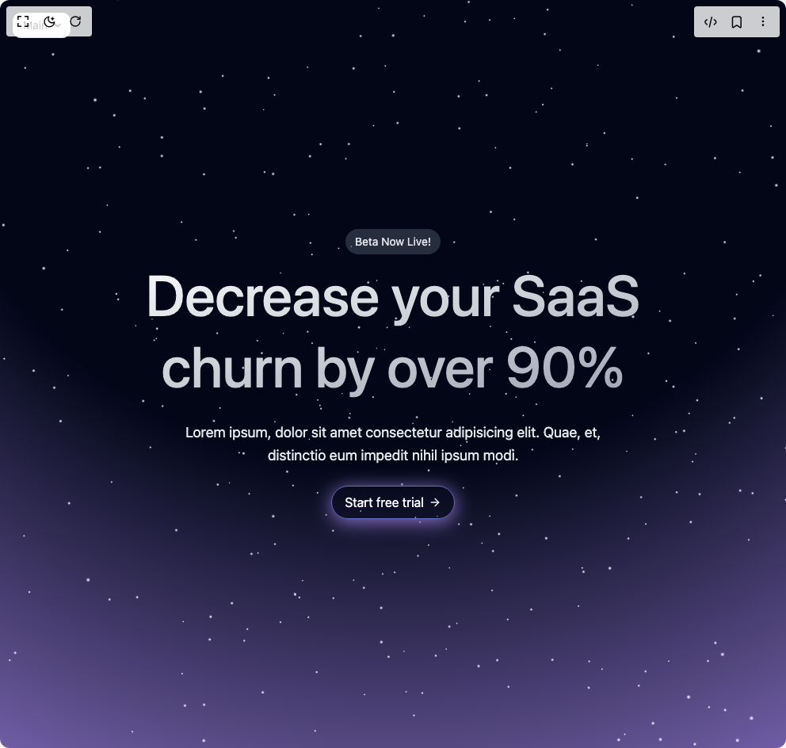

# Build Futurastic Hero Section in BuilderStudio

> Build this component in our Agentic IDE: [BuilderStudio](https://builderstudio.dev).
>
> Join the BuilderStudio community on [Discord](https://discord.gg/QdWeSGCqfe) and [Reddit](https://reddit.com/r/builderstudio).



## Component

- Author group: `uniquesonu`
- Component: `futurastic-hero-section`
- Variant: `default`
- Rendered HTML snapshot: [`rendered.html`](rendered.html)

## BuilderStudio prompt

You are implementing a React component based on a component reference.

## Component identity

- Author: uniquesonu
- Component slug: futurastic-hero-section
- Demo slug: default
- Title: futurastic-hero-section
- Description: 

## Goal

Recreate this component in a React + TypeScript + Tailwind CSS project. Preserve the visual layout, spacing, colors, border radius, shadows, interaction behavior, animation behavior, responsive behavior, and dark mode behavior shown in the rendered demo.

## Implementation requirements

- Use React and TypeScript.
- Use Tailwind CSS classes whenever possible.
- Keep the component self-contained unless the source files require helper components.
- If the source uses CSS variables, custom CSS, animations, or keyframes, include them.
- If the source uses external packages, list and use the required packages.
- Preserve accessibility attributes, button semantics, links, keyboard behavior, and ARIA attributes when visible in the source.
- Do not replace the component with a simplified placeholder.
- Return complete production-ready code.

## Dependencies

No reference metadata available.

## Rendered DOM snapshot

This is the rendered demo HTML extracted from the live preview. Use it to verify structure, class names, visible content, and layout.

```html
<div id="root"><div class="fixed top-4 left-4 z-10"><select class="appearance-none h-8 max-w-[200px] text-sm leading-tight rounded-lg pl-3 pr-7 py-0 border bg-background focus:outline-none focus:ring-0"><option value="named_Main_Main">Main</option></select><div class="absolute top-1/2 transform -translate-y-1/2 right-2 pointer-events-none"><svg class="w-4 h-4 fill-current" viewBox="0 0 20 20"><path d="M5.516 7.548c.436-.446 1.043-.48 1.576 0L10 10.405l2.908-2.857c.533-.48 1.14-.446 1.576 0 .436.445.408 1.197 0 1.615l-3.734 3.705c-.533.534-1.39.534-1.923 0l-3.734-3.705c-.408-.418-.436-1.17 0-1.615z"></path></svg></div></div><div class="w-screen min-h-screen flex justify-center items-center"><div class="w-full"><section class="relative grid min-h-screen place-content-center overflow-hidden bg-gray-950 px-4 py-24 text-gray-200" style="background-image: radial-gradient(125% 125% at 50% 0%, rgb(2, 6, 23) 50%, rgb(127, 114, 201));"><div class="relative z-10 flex flex-col items-center"><span class="mb-1.5 inline-block rounded-full bg-gray-600/50 px-3 py-1.5 text-sm">Beta Now Live!</span><h1 class="max-w-3xl bg-gradient-to-br from-white to-gray-400 bg-clip-text text-center text-3xl font-medium leading-tight text-transparent sm:text-5xl sm:leading-tight md:text-7xl md:leading-tight">Decrease your SaaS churn by over 90%</h1><p class="my-6 max-w-xl text-center text-base leading-relaxed md:text-lg md:leading-relaxed">Lorem ipsum, dolor sit amet consectetur adipisicing elit. Quae, et, distinctio eum impedit nihil ipsum modi.</p><button class="group relative flex w-fit items-center gap-1.5 rounded-full bg-gray-950/10 px-4 py-2 text-gray-50 transition-colors hover:bg-gray-950/50" tabindex="0" style="border: 1px solid rgb(127, 114, 201); box-shadow: rgb(127, 114, 201) 0px 4px 24px;">Start free trial<svg stroke="currentColor" fill="none" stroke-width="2" viewBox="0 0 24 24" stroke-linecap="round" stroke-linejoin="round" class="transition-transform group-hover:-rotate-45 group-active:-rotate-12" height="1em" width="1em" xmlns="http://www.w3.org/2000/svg"><line x1="5" y1="12" x2="19" y2="12"></line><polyline points="12 5 19 12 12 19"></polyline></svg></button></div><div class="absolute inset-0 z-0"><div style="position: relative; width: 100%; height: 100%; overflow: hidden; pointer-events: auto;"><div style="width: 100%; height: 100%;"><canvas data-engine="three.js r177" width="992" height="944" style="display: block; width: 992px; height: 944px;"></canvas></div></div></div></section></div></div></div>
```

## Reference source files

No reference source files were available.
