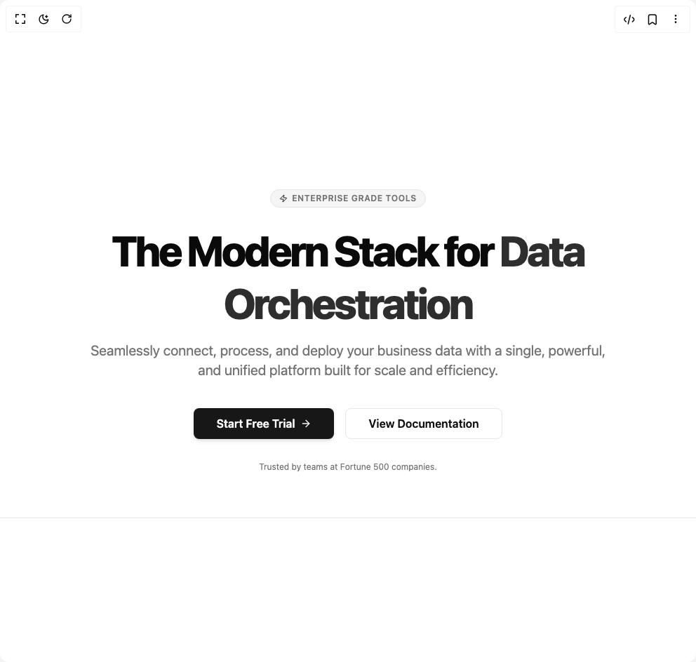

# Build Hero Section Enterprise Ready Landing Page Hero With Dual Ctas in BuilderStudio

> Build this component in our Agentic IDE: [BuilderStudio](https://builderstudio.dev).
>
> Join the BuilderStudio community on [Discord](https://discord.gg/QdWeSGCqfe) and [Reddit](https://reddit.com/r/builderstudio).



## Component

- Author group: `uniquesonu`
- Component: `hero-section-enterprise-ready-landing-page-hero-with-dual-ctas`
- Variant: `default`
- Rendered HTML snapshot: [`rendered.html`](rendered.html)

## BuilderStudio prompt

You are implementing a React component based on a component reference.

## Component identity

- Author: uniquesonu
- Component slug: hero-section-enterprise-ready-landing-page-hero-with-dual-ctas
- Demo slug: default
- Title: hero-section-enterprise-ready-landing-page-hero-with-dual-ctas
- Description: 

## Goal

Recreate this component in a React + TypeScript + Tailwind CSS project. Preserve the visual layout, spacing, colors, border radius, shadows, interaction behavior, animation behavior, responsive behavior, and dark mode behavior shown in the rendered demo.

## Implementation requirements

- Use React and TypeScript.
- Use Tailwind CSS classes whenever possible.
- Keep the component self-contained unless the source files require helper components.
- If the source uses CSS variables, custom CSS, animations, or keyframes, include them.
- If the source uses external packages, list and use the required packages.
- Preserve accessibility attributes, button semantics, links, keyboard behavior, and ARIA attributes when visible in the source.
- Do not replace the component with a simplified placeholder.
- Return complete production-ready code.

## Dependencies

No reference metadata available.

## Rendered DOM snapshot

This is the rendered demo HTML extracted from the live preview. Use it to verify structure, class names, visible content, and layout.

```html
<div id="root"><div class="w-screen min-h-screen flex justify-center items-center"><div class="w-screen min-h-screen flex justify-center items-center"><section class="flex flex-col items-center justify-center min-h-[50vh] text-center p-4 sm:p-8 md:p-16 bg-background text-foreground border-b" role="region" aria-label="Product Hero Section"><div class="max-w-4xl mx-auto"><div class="inline-flex items-center rounded-full border px-3 py-1 text-xs font-semibold uppercase tracking-wider mb-6 text-muted-foreground bg-muted hover:bg-muted/70 transition-colors duration-150"><svg xmlns="http://www.w3.org/2000/svg" width="24" height="24" viewBox="0 0 24 24" fill="none" stroke="currentColor" stroke-width="2" stroke-linecap="round" stroke-linejoin="round" class="lucide lucide-zap h-3 w-3 mr-1.5 text-primary" aria-hidden="true"><path d="M4 14a1 1 0 0 1-.78-1.63l9.9-10.2a.5.5 0 0 1 .86.46l-1.92 6.02A1 1 0 0 0 13 10h7a1 1 0 0 1 .78 1.63l-9.9 10.2a.5.5 0 0 1-.86-.46l1.92-6.02A1 1 0 0 0 11 14z"></path></svg>Enterprise Grade Tools</div><h1 class="text-4xl sm:text-5xl md:text-6xl font-extrabold leading-tight tracking-tighter mb-4 text-foreground">The Modern Stack for  <span class="text-primary/90 dark:text-primary">Data Orchestration</span></h1><p class="text-lg sm:text-xl text-muted-foreground max-w-3xl mx-auto mb-10 font-normal">Seamlessly connect, process, and deploy your business data with a single, powerful, and unified platform built for scale and efficiency.</p><div class="flex justify-center gap-3 sm:gap-4 flex-wrap"><button class="inline-flex items-center justify-center whitespace-nowrap ring-offset-background focus-visible:outline-none disabled:pointer-events-none disabled:opacity-50 bg-primary text-primary-foreground hover:bg-primary/90 h-11 rounded-md px-8 text-base font-semibold transition-shadow duration-200 shadow-md hover:shadow-lg focus-visible:ring-2 focus-visible:ring-primary focus-visible:ring-offset-2" aria-label="Start Free Trial">Start Free Trial<svg xmlns="http://www.w3.org/2000/svg" width="24" height="24" viewBox="0 0 24 24" fill="none" stroke="currentColor" stroke-width="2" stroke-linecap="round" stroke-linejoin="round" class="lucide lucide-arrow-right ml-2 h-4 w-4" aria-hidden="true"><path d="M5 12h14"></path><path d="m12 5 7 7-7 7"></path></svg></button><button class="inline-flex items-center justify-center whitespace-nowrap ring-offset-background focus-visible:outline-none disabled:pointer-events-none disabled:opacity-50 border bg-background h-11 rounded-md px-8 text-base font-semibold transition-colors duration-150 hover:bg-accent hover:text-accent-foreground border-border focus-visible:ring-2 focus-visible:ring-ring focus-visible:ring-offset-2" aria-label="View Documentation">View Documentation</button></div><p class="mt-8 text-xs text-muted-foreground">Trusted by teams at Fortune 500 companies.</p></div></section></div></div></div>
```

## Reference source files

No reference source files were available.
