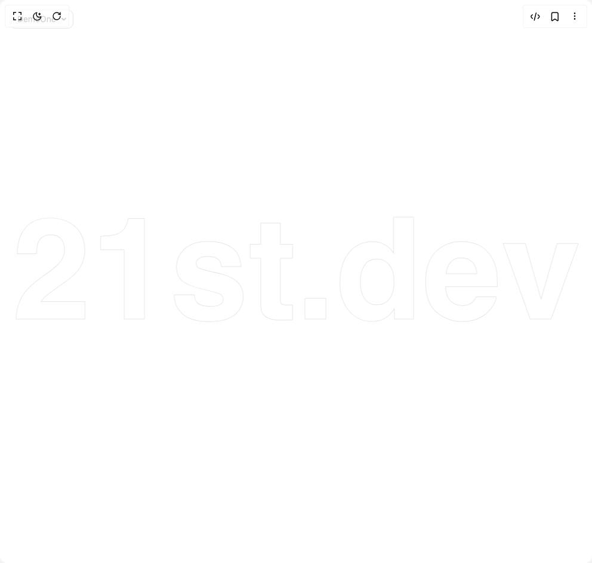

# Build Hover Text Effect in BuilderStudio

> Build this component in our Agentic IDE: [BuilderStudio](https://builderstudio.dev).
>
> Join the BuilderStudio community on [Discord](https://discord.gg/QdWeSGCqfe) and [Reddit](https://reddit.com/r/builderstudio).



## Component

- Author group: `uniquesonu`
- Component: `hover-text-effect`
- Variant: `default`
- Rendered HTML snapshot: [`rendered.html`](rendered.html)

## BuilderStudio prompt

You are implementing a React component based on a component reference.

## Component identity

- Author: uniquesonu
- Component slug: hover-text-effect
- Demo slug: default
- Title: hover-text-effect
- Description: 

## Goal

Recreate this component in a React + TypeScript + Tailwind CSS project. Preserve the visual layout, spacing, colors, border radius, shadows, interaction behavior, animation behavior, responsive behavior, and dark mode behavior shown in the rendered demo.

## Implementation requirements

- Use React and TypeScript.
- Use Tailwind CSS classes whenever possible.
- Keep the component self-contained unless the source files require helper components.
- If the source uses CSS variables, custom CSS, animations, or keyframes, include them.
- If the source uses external packages, list and use the required packages.
- Preserve accessibility attributes, button semantics, links, keyboard behavior, and ARIA attributes when visible in the source.
- Do not replace the component with a simplified placeholder.
- Return complete production-ready code.

## Dependencies

No reference metadata available.

## Rendered DOM snapshot

This is the rendered demo HTML extracted from the live preview. Use it to verify structure, class names, visible content, and layout.

```html
<div id="root"><div class="fixed top-4 left-4 z-10"><select class="appearance-none h-8 max-w-[200px] text-sm leading-tight rounded-lg pl-3 pr-7 py-0 border bg-background focus:outline-none focus:ring-0"><option value="named_DemoOne_DemoOne">DemoOne</option></select><div class="absolute top-1/2 transform -translate-y-1/2 right-2 pointer-events-none"><svg class="w-4 h-4 fill-current" viewBox="0 0 20 20"><path d="M5.516 7.548c.436-.446 1.043-.48 1.576 0L10 10.405l2.908-2.857c.533-.48 1.14-.446 1.576 0 .436.445.408 1.197 0 1.615l-3.734 3.705c-.533.534-1.39.534-1.923 0l-3.734-3.705c-.408-.418-.436-1.17 0-1.615z"></path></svg></div></div><div class="w-screen min-h-screen flex justify-center items-center"><div class="h-[40rem] flex items-center justify-center"><svg width="100%" height="100%" viewBox="0 0 300 100" xmlns="http://www.w3.org/2000/svg" class="select-none"><defs><linearGradient id="textGradient" gradientUnits="userSpaceOnUse" cx="50%" cy="50%" r="25%"></linearGradient><radialGradient id="revealMask" gradientUnits="userSpaceOnUse" r="20%" cx="0%" cy="-23.75%"><stop offset="0%" stop-color="white"></stop><stop offset="100%" stop-color="black"></stop></radialGradient><mask id="textMask"><rect x="0" y="0" width="100%" height="100%" fill="url(#revealMask)"></rect></mask></defs><text x="50%" y="50%" text-anchor="middle" dominant-baseline="middle" stroke-width="0.3" class="fill-transparent stroke-neutral-200 font-[helvetica] text-7xl font-bold dark:stroke-neutral-800" style="opacity: 0;">BuilderStudio</text><text x="50%" y="50%" text-anchor="middle" dominant-baseline="middle" stroke-width="0.3" class="fill-transparent stroke-neutral-200 font-[helvetica] text-7xl font-bold dark:stroke-neutral-800" stroke-dashoffset="0" stroke-dasharray="1000">BuilderStudio</text><text x="50%" y="50%" text-anchor="middle" dominant-baseline="middle" stroke="url(#textGradient)" stroke-width="0.3" mask="url(#textMask)" class="fill-transparent font-[helvetica] text-7xl font-bold">BuilderStudio</text></svg></div></div></div>
```

## Reference source files

No reference source files were available.
