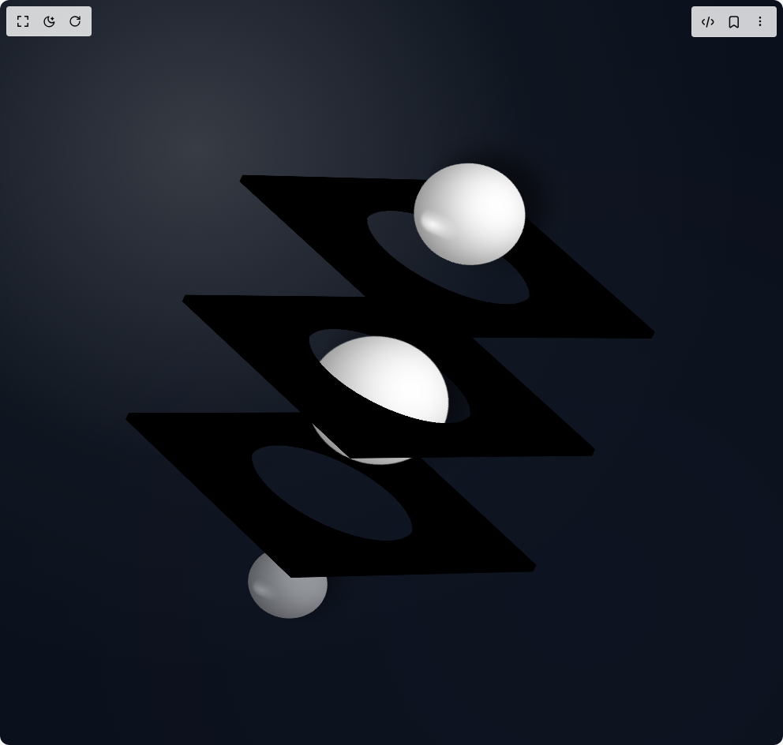

# Build Liquid Glass Boxes in BuilderStudio

> Build this component in our Agentic IDE: [BuilderStudio](https://builderstudio.dev).
>
> Join the BuilderStudio community on [Discord](https://discord.gg/QdWeSGCqfe) and [Reddit](https://reddit.com/r/builderstudio).



## Component

- Author group: `uniquesonu`
- Component: `liquid-glass-boxes`
- Variant: `default`
- Rendered HTML snapshot: [`rendered.html`](rendered.html)

## BuilderStudio prompt

You are implementing a React component based on a component reference.

## Component identity

- Author: uniquesonu
- Component slug: liquid-glass-boxes
- Demo slug: default
- Title: liquid-glass-boxes
- Description: 

## Goal

Recreate this component in a React + TypeScript + Tailwind CSS project. Preserve the visual layout, spacing, colors, border radius, shadows, interaction behavior, animation behavior, responsive behavior, and dark mode behavior shown in the rendered demo.

## Implementation requirements

- Use React and TypeScript.
- Use Tailwind CSS classes whenever possible.
- Keep the component self-contained unless the source files require helper components.
- If the source uses CSS variables, custom CSS, animations, or keyframes, include them.
- If the source uses external packages, list and use the required packages.
- Preserve accessibility attributes, button semantics, links, keyboard behavior, and ARIA attributes when visible in the source.
- Do not replace the component with a simplified placeholder.
- Return complete production-ready code.

## Dependencies

No reference metadata available.

## Rendered DOM snapshot

This is the rendered demo HTML extracted from the live preview. Use it to verify structure, class names, visible content, and layout.

```html
<div id="root"><div class="w-screen min-h-screen flex justify-center items-center"><div class="w-screen min-h-screen flex justify-center items-center"><div class="w-full h-screen bg-gray-900 overflow-hidden relative flex items-center justify-center" style="transform-style: preserve-3d; perspective: 10000px; perspective-origin: 15% 51%;"><div class="fixed inset-0 -z-10" style="background: radial-gradient(120% 120% at 25% 20%, rgba(255, 255, 255, 0.18), rgba(255, 255, 255, 0.02) 35%, rgba(0, 0, 0, 0) 60%), radial-gradient(120% 120% at 75% 80%, rgba(0, 0, 0, 0.2), rgba(0, 0, 0, 0.3) 60%);"></div><svg class="hidden"><defs><filter id="wave-distort" x="0%" y="0%" width="100%" height="100%"><feTurbulence type="fractalNoise" baseFrequency="0.0038 0.0038" numOctaves="1" seed="2" result="roughNoise"></feTurbulence><feGaussianBlur in="roughNoise" stdDeviation="8.5" result="softNoise"></feGaussianBlur><feComposite operator="arithmetic" k1="0" k2="1" k3="2" k4="0" in="softNoise" result="mergedMap"></feComposite><feDisplacementMap in="SourceGraphic" in2="mergedMap" scale="-42" xChannelSelector="G" yChannelSelector="G"></feDisplacementMap></filter></defs></svg><div class="w-full h-full flex items-center justify-center tunnel-scene" style="--tc: 3; --count: 4; --duration: 5s; --step: calc(5s / 4); --w: 450px; --h: 350px; --d: 10px; --hd: 5px; --hole: 40%; --circle-size: 150px; transform-style: preserve-3d;"><div class="absolute tunnel-box" style="--i: 1; width: var(--w); height: var(--h); transform-style: preserve-3d;"><div class="absolute bg-black bg-opacity-60 glass-front" style="backdrop-filter: url(&quot;#wave-distort&quot;); width: var(--w); height: var(--h); mask: radial-gradient(circle at 50% 50%, transparent var(--hole), white var(--hole));"></div><div class="absolute bg-black bg-opacity-60 glass-back" style="backdrop-filter: url(&quot;#wave-distort&quot;); width: var(--w); height: var(--h); mask: radial-gradient(circle at 50% 50%, transparent var(--hole), white var(--hole));"></div><div class="absolute bg-black bg-opacity-60 glass-left" style="backdrop-filter: url(&quot;#wave-distort&quot;); width: var(--d); height: var(--h);"></div><div class="absolute bg-black bg-opacity-60 glass-right" style="backdrop-filter: url(&quot;#wave-distort&quot;); width: var(--d); height: var(--h);"></div><div class="absolute bg-black bg-opacity-60 glass-top" style="backdrop-filter: url(&quot;#wave-distort&quot;); width: var(--w); height: var(--d);"></div><div class="absolute bg-black bg-opacity-60 glass-bottom" style="backdrop-filter: url(&quot;#wave-distort&quot;); width: var(--w); height: var(--d);"></div></div><div class="absolute tunnel-box" style="--i: 2; width: var(--w); height: var(--h); transform-style: preserve-3d;"><div class="absolute bg-black bg-opacity-60 glass-front" style="backdrop-filter: url(&quot;#wave-distort&quot;); width: var(--w); height: var(--h); mask: radial-gradient(circle at 50% 50%, transparent var(--hole), white var(--hole));"></div><div class="absolute bg-black bg-opacity-60 glass-back" style="backdrop-filter: url(&quot;#wave-distort&quot;); width: var(--w); height: var(--h); mask: radial-gradient(circle at 50% 50%, transparent var(--hole), white var(--hole));"></div><div class="absolute bg-black bg-opacity-60 glass-left" style="backdrop-filter: url(&quot;#wave-distort&quot;); width: var(--d); height: var(--h);"></div><div class="absolute bg-black bg-opacity-60 glass-right" style="backdrop-filter: url(&quot;#wave-distort&quot;); width: var(--d); height: var(--h);"></div><div class="absolute bg-black bg-opacity-60 glass-top" style="backdrop-filter: url(&quot;#wave-distort&quot;); width: var(--w); height: var(--d);"></div><div class="absolute bg-black bg-opacity-60 glass-bottom" style="backdrop-filter: url(&quot;#wave-distort&quot;); width: var(--w); height: var(--d);"></div></div><div class="absolute tunnel-box" style="--i: 3; width: var(--w); height: var(--h); transform-style: preserve-3d;"><div class="absolute bg-black bg-opacity-60 glass-front" style="backdrop-filter: url(&quot;#wave-distort&quot;); width: var(--w); height: var(--h); mask: radial-gradient(circle at 50% 50%, transparent var(--hole), white var(--hole));"></div><div class="absolute bg-black bg-opacity-60 glass-back" style="backdrop-filter: url(&quot;#wave-distort&quot;); width: var(--w); height: var(--h); mask: radial-gradient(circle at 50% 50%, transparent var(--hole), white var(--hole));"></div><div class="absolute bg-black bg-opacity-60 glass-left" style="backdrop-filter: url(&quot;#wave-distort&quot;); width: var(--d); height: var(--h);"></div><div class="absolute bg-black bg-opacity-60 glass-right" style="backdrop-filter: url(&quot;#wave-distort&quot;); width: var(--d); height: var(--h);"></div><div class="absolute bg-black bg-opacity-60 glass-top" style="backdrop-filter: url(&quot;#wave-distort&quot;); width: var(--w); height: var(--d);"></div><div class="absolute bg-black bg-opacity-60 glass-bottom" style="backdrop-filter: url(&quot;#wave-distort&quot;); width: var(--w); height: var(--d);"></div></div><div class="absolute tunnel-circle opacity-0 bg-white rounded-full circle-active" style="--j: 1; width: var(--circle-size); height: var(--circle-size); box-shadow: rgba(0, 0, 0, 0.38) 28px 28px 58px inset, rgba(255, 255, 255, 0.9) -28px -28px 54px inset, rgba(0, 0, 0, 0.2) 0px 0px 22px inset, rgba(255, 255, 255, 0.55) 0px 1px 2px inset, rgba(0, 0, 0, 0.55) 18px 26px 36px;"><div class="absolute rounded-full" style="inset: 18% 46% 56% 12%; background: radial-gradient(80% 70% at 30% 30%, rgba(255, 255, 255, 0.95), rgba(255, 255, 255, 0.35) 40%, rgba(255, 255, 255, 0) 75%); filter: blur(1.5px); mix-blend-mode: screen;"></div></div><div class="absolute tunnel-circle opacity-0 bg-white rounded-full circle-active" style="--j: 2; width: var(--circle-size); height: var(--circle-size); box-shadow: rgba(0, 0, 0, 0.38) 28px 28px 58px inset, rgba(255, 255, 255, 0.9) -28px -28px 54px inset, rgba(0, 0, 0, 0.2) 0px 0px 22px inset, rgba(255, 255, 255, 0.55) 0px 1px 2px inset, rgba(0, 0, 0, 0.55) 18px 26px 36px;"><div class="absolute rounded-full" style="inset: 18% 46% 56% 12%; background: radial-gradient(80% 70% at 30% 30%, rgba(255, 255, 255, 0.95), rgba(255, 255, 255, 0.35) 40%, rgba(255, 255, 255, 0) 75%); filter: blur(1.5px); mix-blend-mode: screen;"></div></div><div class="absolute tunnel-circle opacity-0 bg-white rounded-full circle-active" style="--j: 3; width: var(--circle-size); height: var(--circle-size); box-shadow: rgba(0, 0, 0, 0.38) 28px 28px 58px inset, rgba(255, 255, 255, 0.9) -28px -28px 54px inset, rgba(0, 0, 0, 0.2) 0px 0px 22px inset, rgba(255, 255, 255, 0.55) 0px 1px 2px inset, rgba(0, 0, 0, 0.55) 18px 26px 36px;"><div class="absolute rounded-full" style="inset: 18% 46% 56% 12%; background: radial-gradient(80% 70% at 30% 30%, rgba(255, 255, 255, 0.95), rgba(255, 255, 255, 0.35) 40%, rgba(255, 255, 255, 0) 75%); filter: blur(1.5px); mix-blend-mode: screen;"></div></div><div class="absolute tunnel-circle opacity-0 bg-white rounded-full circle-active" style="--j: 4; width: var(--circle-size); height: var(--circle-size); box-shadow: rgba(0, 0, 0, 0.38) 28px 28px 58px inset, rgba(255, 255, 255, 0.9) -28px -28px 54px inset, rgba(0, 0, 0, 0.2) 0px 0px 22px inset, rgba(255, 255, 255, 0.55) 0px 1px 2px inset, rgba(0, 0, 0, 0.55) 18px 26px 36px;"><div class="absolute rounded-full" style="inset: 18% 46% 56% 12%; background: radial-gradient(80% 70% at 30% 30%, rgba(255, 255, 255, 0.95), rgba(255, 255, 255, 0.35) 40%, rgba(255, 255, 255, 0) 75%); filter: blur(1.5px); mix-blend-mode: screen;"></div></div></div><style>
        @property --Ctz {
          syntax: "<length>";
          inherits: false;
          initial-value: -415px;
        }
        @property --scale {
          syntax: "<number>";
          inherits: false;
          initial-value: 1;
        }
        @property --space {
          syntax: "<length>";
          inherits: false;
          initial-value: 0px;
        }
        @property --rtY {
          syntax: "<angle>";
          inherits: false;
          initial-value: 0deg;
        }
        @property --rtX {
          syntax: "<angle>";
          inherits: false;
          initial-value: 0deg;
        }
        
        .tunnel-scene {
          transform: rotateY(var(--rtY)) rotateX(var(--rtX));
          animation: angle 1s ease-in-out forwards;
        }
        
        .tunnel-box {
          transform: translateZ(calc((var(--i) - (var(--tc) + 1) / 2) * var(--space)));
          animation: space 1s 0.8s ease-in-out forwards;
          will-change: transform;
        }
        
        .glass-back {
          transform: translateZ(calc(-1 * var(--d))) rotateY(180deg);
        }
        
        .glass-left {
          transform: translateZ(calc(-1 * var(--hd))) translateX(calc(-1 * var(--hd))) rotateY(90deg);
        }
        
        .glass-right {
          right: 0;
          transform: translateZ(calc(-1 * var(--hd))) translateX(var(--hd)) rotateY(90deg);
        }
        
        .glass-top {
          transform: translateZ(calc(-1 * var(--hd))) translateY(calc(-1 * var(--hd))) rotateX(90deg);
        }
        
        .glass-bottom {
          bottom: 0;
          transform: translateZ(calc(-1 * var(--hd))) translateY(var(--hd)) rotateX(90deg);
        }
        
        .circle-active {
          transform: translateZ(var(--Ctz)) rotate(45deg) rotateY(1deg) rotateX(88deg) scale(var(--scale));
          animation: move var(--duration) linear infinite, fade var(--duration) linear infinite;
          animation-delay: calc((var(--j) - 1) * var(--step));
          will-change: transform, opacity;
        }
        
        @keyframes angle {
          0% {
            --rtY: 0deg;
            --rtX: 0deg;
          }
          100% {
            --rtY: 45deg;
            --rtX: 56deg;
          }
        }
        
        @keyframes space {
          0% {
            --space: 0px;
          }
          100% {
            --space: 180px;
          }
        }
        
        @keyframes move {
          0% {
            --Ctz: -515px;
          }
          100% {
            --Ctz: 615px;
          }
        }
        
        @keyframes fade {
          0%, 75%, 100% {
            opacity: 0;
          }
          0%, 85%, 100% {
            --scale: 0.2;
          }
          35%, 60% {
            --scale: 1.2;
          }
          30%, 75% {
            opacity: 1;
          }
        }
      </style></div></div></div></div>
```

## Reference source files

No reference source files were available.
