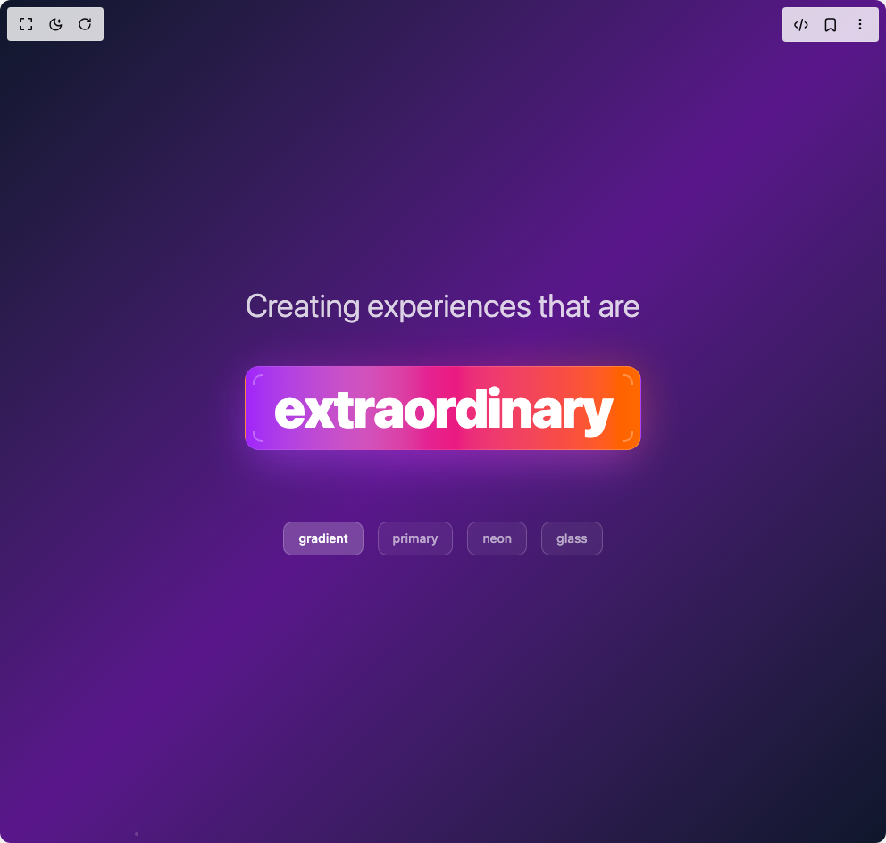

# Build Modern Animated Multi Words in BuilderStudio

> Build this component in our Agentic IDE: [BuilderStudio](https://builderstudio.dev).
>
> Join the BuilderStudio community on [Discord](https://discord.gg/QdWeSGCqfe) and [Reddit](https://reddit.com/r/builderstudio).



## Component

- Author group: `uniquesonu`
- Component: `modern-animated-multi-words`
- Variant: `default`
- Rendered HTML snapshot: [`rendered.html`](rendered.html)

## BuilderStudio prompt

You are implementing a React component based on a component reference.

## Component identity

- Author: uniquesonu
- Component slug: modern-animated-multi-words
- Demo slug: default
- Title: modern-animated-multi-words
- Description: 

## Goal

Recreate this component in a React + TypeScript + Tailwind CSS project. Preserve the visual layout, spacing, colors, border radius, shadows, interaction behavior, animation behavior, responsive behavior, and dark mode behavior shown in the rendered demo.

## Implementation requirements

- Use React and TypeScript.
- Use Tailwind CSS classes whenever possible.
- Keep the component self-contained unless the source files require helper components.
- If the source uses CSS variables, custom CSS, animations, or keyframes, include them.
- If the source uses external packages, list and use the required packages.
- Preserve accessibility attributes, button semantics, links, keyboard behavior, and ARIA attributes when visible in the source.
- Do not replace the component with a simplified placeholder.
- Return complete production-ready code.

## Dependencies

No reference metadata available.

## Rendered DOM snapshot

This is the rendered demo HTML extracted from the live preview. Use it to verify structure, class names, visible content, and layout.

```html
<div id="root"><div class="w-screen min-h-screen flex justify-center items-center"><div class="w-screen min-h-screen flex justify-center items-center"><div class="min-h-screen w-full bg-gradient-to-br from-slate-900 via-purple-900 to-slate-900 flex items-center justify-center p-8"><div class="absolute inset-0 overflow-hidden"><div class="absolute w-1 h-1 bg-white/20 rounded-full" style="left: 27.7691%; top: 119.445%; transform: translateY(-95.9404px);"></div><div class="absolute w-1 h-1 bg-white/20 rounded-full" style="left: 74.7551%; top: 172.331%; transform: translateY(-13.9835px);"></div><div class="absolute w-1 h-1 bg-white/20 rounded-full" style="left: 42.1828%; top: 145.478%; transform: translateY(-77.4022px);"></div><div class="absolute w-1 h-1 bg-white/20 rounded-full" style="left: 84.0055%; top: 109.534%; transform: translateY(-74.6042px);"></div><div class="absolute w-1 h-1 bg-white/20 rounded-full" style="left: 98.7543%; top: 137.216%; transform: translateY(-98.4989px);"></div><div class="absolute w-1 h-1 bg-white/20 rounded-full" style="left: 12.6556%; top: 160.343%; transform: translateY(-27.0944px);"></div><div class="absolute w-1 h-1 bg-white/20 rounded-full" style="left: 18.9487%; top: 192.269%; transform: translateY(-83.627px);"></div><div class="absolute w-1 h-1 bg-white/20 rounded-full" style="left: 8.56821%; top: 198.432%; transform: translateY(-99.4314px);"></div><div class="absolute w-1 h-1 bg-white/20 rounded-full" style="left: 53.9675%; top: 159.56%; transform: translateY(-78.4553px);"></div><div class="absolute w-1 h-1 bg-white/20 rounded-full" style="left: 55.8598%; top: 176.663%; transform: translateY(-78.9453px);"></div><div class="absolute w-1 h-1 bg-white/20 rounded-full" style="left: 89.3287%; top: 157.008%; transform: translateY(-8.50436px);"></div><div class="absolute w-1 h-1 bg-white/20 rounded-full" style="left: 83.1979%; top: 132.784%; transform: translateY(-77.152px);"></div><div class="absolute w-1 h-1 bg-white/20 rounded-full" style="left: 19.4742%; top: 169.274%; transform: translateY(-93.1463px);"></div><div class="absolute w-1 h-1 bg-white/20 rounded-full" style="left: 93.4179%; top: 108.482%; transform: translateY(-20.0261px);"></div><div class="absolute w-1 h-1 bg-white/20 rounded-full" style="left: 1.26685%; top: 147.581%; transform: translateY(-83.2904px);"></div><div class="absolute w-1 h-1 bg-white/20 rounded-full" style="left: 83.5712%; top: 152.006%; transform: translateY(-17.333px);"></div><div class="absolute w-1 h-1 bg-white/20 rounded-full" style="left: 36.1922%; top: 158.536%; transform: translateY(-37.5564px);"></div><div class="absolute w-1 h-1 bg-white/20 rounded-full" style="left: 87.5092%; top: 179.029%; transform: translateY(-99.5596px);"></div><div class="absolute w-1 h-1 bg-white/20 rounded-full" style="left: 18.3858%; top: 179.767%; transform: translateY(-55.3741px);"></div><div class="absolute w-1 h-1 bg-white/20 rounded-full" style="left: 13.4012%; top: 116.715%; transform: translateY(-5.21815px);"></div><div class="absolute w-1 h-1 bg-white/20 rounded-full" style="left: 44.8954%; top: 146.931%; transform: translateY(-93.5733px);"></div><div class="absolute w-1 h-1 bg-white/20 rounded-full" style="left: 78.0815%; top: 122.396%; transform: translateY(-99.8604px);"></div><div class="absolute w-1 h-1 bg-white/20 rounded-full" style="left: 91.0861%; top: 198.277%; transform: translateY(-96.2171px);"></div><div class="absolute w-1 h-1 bg-white/20 rounded-full" style="left: 59.3807%; top: 157.227%; transform: translateY(-89.2745px);"></div><div class="absolute w-1 h-1 bg-white/20 rounded-full" style="left: 96.7773%; top: 156.436%; transform: translateY(-9.65653px);"></div><div class="absolute w-1 h-1 bg-white/20 rounded-full" style="left: 73.8136%; top: 185.321%; transform: translateY(-77.4022px);"></div><div class="absolute w-1 h-1 bg-white/20 rounded-full" style="left: 75.9328%; top: 179.481%; transform: translateY(-57.4097px);"></div><div class="absolute w-1 h-1 bg-white/20 rounded-full" style="left: 76.8226%; top: 113.087%; transform: translateY(-78.209px);"></div><div class="absolute w-1 h-1 bg-white/20 rounded-full" style="left: 21.8687%; top: 153.99%; transform: translateY(-90.7492px);"></div><div class="absolute w-1 h-1 bg-white/20 rounded-full" style="left: 57.2165%; top: 135.779%; transform: translateY(-22.7854px);"></div><div class="absolute w-1 h-1 bg-white/20 rounded-full" style="left: 12.7355%; top: 118.268%; transform: translateY(-12.7921px);"></div><div class="absolute w-1 h-1 bg-white/20 rounded-full" style="left: 73.396%; top: 171.043%; transform: translateY(-90.7492px);"></div><div class="absolute w-1 h-1 bg-white/20 rounded-full" style="left: 27.5188%; top: 157.829%; transform: translateY(-34.6595px);"></div><div class="absolute w-1 h-1 bg-white/20 rounded-full" style="left: 76.1693%; top: 116.75%; transform: translateY(-93.0278px);"></div><div class="absolute w-1 h-1 bg-white/20 rounded-full" style="left: 93.4076%; top: 183.301%; transform: translateY(-99.9574px);"></div><div class="absolute w-1 h-1 bg-white/20 rounded-full" style="left: 96.8141%; top: 147.525%; transform: translateY(-94.5347px);"></div><div class="absolute w-1 h-1 bg-white/20 rounded-full" style="left: 14.2561%; top: 149.702%; transform: translateY(-88.5531px);"></div><div class="absolute w-1 h-1 bg-white/20 rounded-full" style="left: 48.4011%; top: 165.186%; transform: translateY(-98.2748px);"></div><div class="absolute w-1 h-1 bg-white/20 rounded-full" style="left: 24.7454%; top: 111.715%; transform: translateY(-99.4064px);"></div><div class="absolute w-1 h-1 bg-white/20 rounded-full" style="left: 0.329171%; top: 101.452%; transform: translateY(-99.3679px);"></div><div class="absolute w-1 h-1 bg-white/20 rounded-full" style="left: 7.14895%; top: 171.465%; transform: translateY(-83.7943px);"></div><div class="absolute w-1 h-1 bg-white/20 rounded-full" style="left: 11.6291%; top: 117.177%; transform: translateY(-55.0096px);"></div><div class="absolute w-1 h-1 bg-white/20 rounded-full" style="left: 51.344%; top: 194.325%; transform: translateY(-82.8946px);"></div><div class="absolute w-1 h-1 bg-white/20 rounded-full" style="left: 31.9263%; top: 141.969%; transform: translateY(-43.0983px);"></div><div class="absolute w-1 h-1 bg-white/20 rounded-full" style="left: 52.1518%; top: 130.747%; transform: translateY(-95.9091px);"></div><div class="absolute w-1 h-1 bg-white/20 rounded-full" style="left: 15.2176%; top: 104.57%; transform: translateY(-53.6227px);"></div><div class="absolute w-1 h-1 bg-white/20 rounded-full" style="left: 23.4338%; top: 196.95%; transform: translateY(-98.4393px);"></div><div class="absolute w-1 h-1 bg-white/20 rounded-full" style="left: 19.2762%; top: 184.934%; transform: translateY(-26.634px);"></div><div class="absolute w-1 h-1 bg-white/20 rounded-full" style="left: 21.844%; top: 191.033%; transform: translateY(-46.2312px);"></div><div class="absolute w-1 h-1 bg-white/20 rounded-full" style="left: 76.7984%; top: 128.62%; transform: translateY(-93.6877px);"></div></div><div class="text-center space-y-8 relative z-10"><h1 class="text-2xl md:text-4xl font-light text-white/80 mb-12" style="opacity: 1; transform: none;">Creating experiences that are</h1><div class="relative inline-flex items-center justify-center"><div class="absolute inset-0 rounded-2xl blur-xl before:bg-gradient-to-r before:from-purple-600/30 before:via-pink-600/30 before:to-orange-500/30 before:absolute before:inset-0 before:rounded-2xl before:animate-pulse" style="background: linear-gradient(45deg, rgba(147, 51, 234, 0.3), rgba(219, 39, 119, 0.3), rgba(249, 115, 22, 0.3)); opacity: 0.8; transform: none;"></div><div class="relative px-8 py-4 rounded-2xl backdrop-blur-sm transform-gpu transition-all duration-300 hover:scale-105 hover:shadow-3xl bg-gradient-to-r from-purple-600 via-pink-600 to-orange-500 text-white shadow-2xl shadow-purple-500/40 border border-white/20" style="transform: none; transform-origin: 50% 50% 0px;"><div class="absolute inset-0 rounded-2xl overflow-hidden"><div class="absolute inset-0 bg-gradient-to-r from-transparent via-white/20 to-transparent w-full h-full" style="transform: translateX(-24.2%);"></div></div><div class="relative z-10"><div class="text-4xl md:text-6xl lg:text-7xl font-black tracking-tight text-center whitespace-nowrap" style="opacity: 0; filter: blur(8px); transform: translateY(6.70098e-05px) scale(1);"><span class="inline-block" style="opacity: 1; filter: blur(0px); transform: none;">e</span><span class="inline-block" style="opacity: 1; filter: blur(0px); transform: none;">x</span><span class="inline-block" style="opacity: 1; filter: blur(0px); transform: none;">t</span><span class="inline-block" style="opacity: 1; filter: blur(0px); transform: none;">r</span><span class="inline-block" style="opacity: 1; filter: blur(0px); transform: none;">a</span><span class="inline-block" style="opacity: 1; filter: blur(0px); transform: none;">o</span><span class="inline-block" style="opacity: 1; filter: blur(0px); transform: none;">r</span><span class="inline-block" style="opacity: 1; filter: blur(0px); transform: none;">d</span><span class="inline-block" style="opacity: 1; filter: blur(0px); transform: none;">i</span><span class="inline-block" style="opacity: 1; filter: blur(0px); transform: none;">n</span><span class="inline-block" style="opacity: 0; filter: blur(4px); transform: translateY(0.001113px);">a</span><span class="inline-block" style="opacity: 0; filter: blur(4px); transform: translateY(0.118389px);">r</span><span class="inline-block" style="opacity: 0; filter: blur(4px); transform: translateY(0.399732px);">y</span></div></div><div class="absolute top-2 left-2 w-3 h-3 border-t-2 border-l-2 border-white/30 rounded-tl-lg"></div><div class="absolute top-2 right-2 w-3 h-3 border-t-2 border-r-2 border-white/30 rounded-tr-lg"></div><div class="absolute bottom-2 left-2 w-3 h-3 border-b-2 border-l-2 border-white/30 rounded-bl-lg"></div><div class="absolute bottom-2 right-2 w-3 h-3 border-b-2 border-r-2 border-white/30 rounded-br-lg"></div></div></div><div class="flex justify-center gap-4 mt-12" style="opacity: 1; transform: none;"><button class="px-4 py-2 rounded-lg text-sm font-medium transition-all duration-300 border border-white/20 backdrop-blur-sm bg-white/20 text-white">gradient</button><button class="px-4 py-2 rounded-lg text-sm font-medium transition-all duration-300 border border-white/20 backdrop-blur-sm bg-white/5 text-white/60 hover:bg-white/10 hover:text-white/80">primary</button><button class="px-4 py-2 rounded-lg text-sm font-medium transition-all duration-300 border border-white/20 backdrop-blur-sm bg-white/5 text-white/60 hover:bg-white/10 hover:text-white/80">neon</button><button class="px-4 py-2 rounded-lg text-sm font-medium transition-all duration-300 border border-white/20 backdrop-blur-sm bg-white/5 text-white/60 hover:bg-white/10 hover:text-white/80">glass</button></div></div></div></div></div></div>
```

## Reference source files

No reference source files were available.
