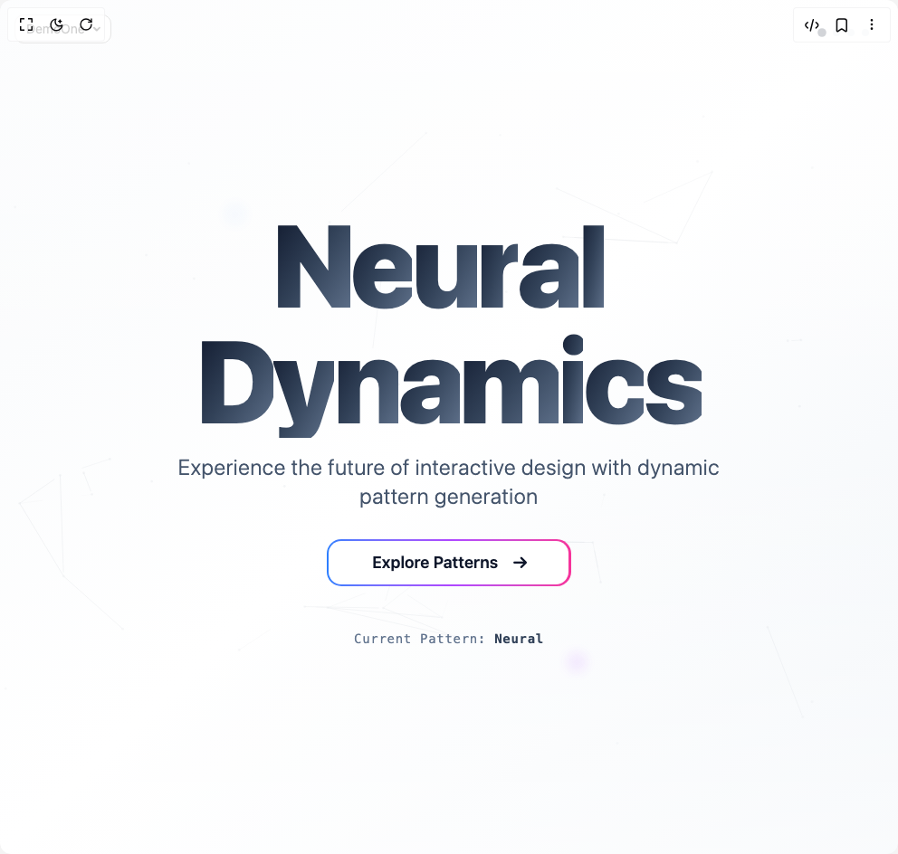

# Build Modern Background Paths in BuilderStudio

> Build this component in our Agentic IDE: [BuilderStudio](https://builderstudio.dev).
>
> Join the BuilderStudio community on [Discord](https://discord.gg/QdWeSGCqfe) and [Reddit](https://reddit.com/r/builderstudio).



## Component

- Author group: `uniquesonu`
- Component: `modern-background-paths`
- Variant: `default`
- Rendered HTML snapshot: [`rendered.html`](rendered.html)

## BuilderStudio prompt

You are implementing a React component based on a component reference.

## Component identity

- Author: uniquesonu
- Component slug: modern-background-paths
- Demo slug: default
- Title: modern-background-paths
- Description: 

## Goal

Recreate this component in a React + TypeScript + Tailwind CSS project. Preserve the visual layout, spacing, colors, border radius, shadows, interaction behavior, animation behavior, responsive behavior, and dark mode behavior shown in the rendered demo.

## Implementation requirements

- Use React and TypeScript.
- Use Tailwind CSS classes whenever possible.
- Keep the component self-contained unless the source files require helper components.
- If the source uses CSS variables, custom CSS, animations, or keyframes, include them.
- If the source uses external packages, list and use the required packages.
- Preserve accessibility attributes, button semantics, links, keyboard behavior, and ARIA attributes when visible in the source.
- Do not replace the component with a simplified placeholder.
- Return complete production-ready code.

## Dependencies

No reference metadata available.

## Rendered DOM snapshot

This is the rendered demo HTML extracted from the live preview. Use it to verify structure, class names, visible content, and layout.

```html
<div id="root"><div class="fixed top-4 left-4 z-10"><select class="appearance-none h-8 max-w-[200px] text-sm leading-tight rounded-lg pl-3 pr-7 py-0 border bg-background focus:outline-none focus:ring-0"><option value="named_DemoOne_DemoOne">DemoOne</option></select><div class="absolute top-1/2 transform -translate-y-1/2 right-2 pointer-events-none"><svg class="w-4 h-4 fill-current" viewBox="0 0 20 20"><path d="M5.516 7.548c.436-.446 1.043-.48 1.576 0L10 10.405l2.908-2.857c.533-.48 1.14-.446 1.576 0 .436.445.408 1.197 0 1.615l-3.734 3.705c-.533.534-1.39.534-1.923 0l-3.734-3.705c-.408-.418-.436-1.17 0-1.615z"></path></svg></div></div><div class="w-screen min-h-screen flex justify-center items-center"><div class="relative min-h-screen w-full flex items-center justify-center overflow-hidden bg-gradient-to-br from-slate-50 via-white to-slate-100 dark:from-slate-900 dark:via-slate-800 dark:to-slate-900"><div class="absolute inset-0 text-slate-600 dark:text-slate-400"><div style="opacity: 1;"><svg class="absolute inset-0 w-full h-full opacity-15" viewBox="0 0 800 600"><path d="M271.4590493237971,460.1490646014785 L341.41039911731684,461.347885738949" stroke="currentColor" stroke-width="0.5" fill="none" opacity="0.7464234879007563" pathLength="1" stroke-dashoffset="0px" stroke-dasharray="0.9330293598759454px 1px"></path><path d="M271.4590493237971,460.1490646014785 L291.7876558854297,461.0251800414148" stroke="currentColor" stroke-width="0.5" fill="none" opacity="0" pathLength="1" stroke-dashoffset="0px" stroke-dasharray="0px 1px"></path><path d="M213.0778466454208,498.7212323399421 L271.4590493237971,460.1490646014785" stroke="currentColor" stroke-width="0.5" fill="none" opacity="0.4061521281255409" pathLength="1" stroke-dashoffset="0px" stroke-dasharray="0.5076901601569261px 1px"></path><path d="M374.5582186599808,294.0910459289653 L329.6445845147321,249.6771290882257" stroke="currentColor" stroke-width="0.5" fill="none" opacity="0" pathLength="1" stroke-dashoffset="0px" stroke-dasharray="0px 1px"></path><path d="M374.5582186599808,294.0910459289653 L398.05208965355956,293.40491072817423" stroke="currentColor" stroke-width="0.5" fill="none" opacity="0" pathLength="1" stroke-dashoffset="0px" stroke-dasharray="0px 1px"></path><path d="M374.5582186599808,294.0910459289653 L417.9845666240719,401.1907814094427" stroke="currentColor" stroke-width="0.5" fill="none" opacity="0" pathLength="1" stroke-dashoffset="0px" stroke-dasharray="0px 1px"></path><path d="M374.5582186599808,294.0910459289653 L355.46540153687386,262.06346234393976" stroke="currentColor" stroke-width="0.5" fill="none" opacity="0.36751231139060114" pathLength="1" stroke-dashoffset="0px" stroke-dasharray="0.4593903892382514px 1px"></path><path d="M496.11962404353056,87.45321905593211 L451.07137393398125,179.5027363723456" stroke="currentColor" stroke-width="0.5" fill="none" opacity="0.016070575802586973" pathLength="1" stroke-dashoffset="0px" stroke-dasharray="0.020088219753233716px 1px"></path><path d="M339.39317984436326,170.18931074552754 L329.6445845147321,249.6771290882257" stroke="currentColor" stroke-width="0.5" fill="none" opacity="0.61871759777423" pathLength="1" stroke-dashoffset="0px" stroke-dasharray="0.7733969972177874px 1px"></path><path d="M339.39317984436326,170.18931074552754 L451.07137393398125,179.5027363723456" stroke="currentColor" stroke-width="0.5" fill="none" opacity="0" pathLength="1" stroke-dashoffset="0px" stroke-dasharray="0px 1px"></path><path d="M339.39317984436326,170.18931074552754 L293.8016865384558,117.38021413402538" stroke="currentColor" stroke-width="0.5" fill="none" opacity="0.06907350949477405" pathLength="1" stroke-dashoffset="0px" stroke-dasharray="0.08634188686846755px 1px"></path><path d="M56.66954289086288,433.00651959176975 L109.35781672477161,479.99554230423246" stroke="currentColor" stroke-width="0.5" fill="none" opacity="0.7890708916587755" pathLength="1" stroke-dashoffset="0px" stroke-dasharray="0.9863386145734694px 1px"></path><path d="M56.66954289086288,433.00651959176975 L74.63037010622004,340.9500647129271" stroke="currentColor" stroke-width="0.5" fill="none" opacity="0" pathLength="1" stroke-dashoffset="0px" stroke-dasharray="0px 1px"></path><path d="M56.66954289086288,433.00651959176975 L97.84865646968353,328.5469351017045" stroke="currentColor" stroke-width="0.5" fill="none" opacity="0" pathLength="1" stroke-dashoffset="0px" stroke-dasharray="0px 1px"></path><path d="M253.40145976371468,352.82678652518547 L271.4590493237971,460.1490646014785" stroke="currentColor" stroke-width="0.5" fill="none" opacity="0" pathLength="1" stroke-dashoffset="0px" stroke-dasharray="0px 1px"></path><path d="M253.40145976371468,352.82678652518547 L135.2945476237883,348.422398866752" stroke="currentColor" stroke-width="0.5" fill="none" opacity="0.043153198040090504" pathLength="1" stroke-dashoffset="0px" stroke-dasharray="0.05394149755011313px 1px"></path><path d="M528.1197475765813,402.888054349069 L417.9845666240719,401.1907814094427" stroke="currentColor" stroke-width="0.5" fill="none" opacity="0.7539693649159744" pathLength="1" stroke-dashoffset="0px" stroke-dasharray="0.942461706144968px 1px"></path><path d="M528.1197475765813,402.888054349069 L538.2910267104601,360.46946069133764" stroke="currentColor" stroke-width="0.5" fill="none" opacity="0" pathLength="1" stroke-dashoffset="0px" stroke-dasharray="0px 1px"></path><path d="M528.1197475765813,402.888054349069 L535.1903165792663,438.3580748223186" stroke="currentColor" stroke-width="0.5" fill="none" opacity="0.5305504576070235" pathLength="1" stroke-dashoffset="0px" stroke-dasharray="0.6631880720087793px 1px"></path><path d="M135.2945476237883,348.422398866752 L253.40145976371468,352.82678652518547" stroke="currentColor" stroke-width="0.5" fill="none" opacity="0" pathLength="1" stroke-dashoffset="0px" stroke-dasharray="0px 1px"></path><path d="M135.2945476237883,348.422398866752 L53.60352216548918,343.03117099248385" stroke="currentColor" stroke-width="0.5" fill="none" opacity="0" pathLength="1" stroke-dashoffset="0px" stroke-dasharray="0px 1px"></path><path d="M135.2945476237883,348.422398866752 L17.52687077490922,368.02934913577786" stroke="currentColor" stroke-width="0.5" fill="none" opacity="0" pathLength="1" stroke-dashoffset="0px" stroke-dasharray="0px 1px"></path><path d="M329.6445845147321,249.6771290882257 L374.5582186599808,294.0910459289653" stroke="currentColor" stroke-width="0.5" fill="none" opacity="0.16648926932830366" pathLength="1" stroke-dashoffset="0px" stroke-dasharray="0.20811158666037954px 1px"></path><path d="M329.6445845147321,249.6771290882257 L355.46540153687386,262.06346234393976" stroke="currentColor" stroke-width="0.5" fill="none" opacity="0" pathLength="1" stroke-dashoffset="0px" stroke-dasharray="0px 1px"></path><path d="M109.35781672477161,479.99554230423246 L213.0778466454208,498.7212323399421" stroke="currentColor" stroke-width="0.5" fill="none" opacity="0" pathLength="1" stroke-dashoffset="0px" stroke-dasharray="0px 1px"></path><path d="M713.6794319683245,222.51228896643985 L701.7873398259105,223.19229369446396" stroke="currentColor" stroke-width="0.5" fill="none" opacity="0.5978678211802617" pathLength="1" stroke-dashoffset="0px" stroke-dasharray="0.7473347764753271px 1px"></path><path d="M53.60352216548918,343.03117099248385 L56.66954289086288,433.00651959176975" stroke="currentColor" stroke-width="0.5" fill="none" opacity="0.7763828180031851" pathLength="1" stroke-dashoffset="0px" stroke-dasharray="0.9704785225039814px 1px"></path><path d="M53.60352216548918,343.03117099248385 L97.84865646968353,328.5469351017045" stroke="currentColor" stroke-width="0.5" fill="none" opacity="0" pathLength="1" stroke-dashoffset="0px" stroke-dasharray="0px 1px"></path><path d="M602.9734374007683,136.0704628370271 L496.11962404353056,87.45321905593211" stroke="currentColor" stroke-width="0.5" fill="none" opacity="0.7935017781564966" pathLength="1" stroke-dashoffset="0px" stroke-dasharray="0.9918772226956207px 1px"></path><path d="M602.9734374007683,136.0704628370271 L551.1300586484616,109.94592478377514" stroke="currentColor" stroke-width="0.5" fill="none" opacity="0" pathLength="1" stroke-dashoffset="0px" stroke-dasharray="0px 1px"></path><path d="M602.9734374007683,136.0704628370271 L621.4319711278142,63.24886348358938" stroke="currentColor" stroke-width="0.5" fill="none" opacity="0" pathLength="1" stroke-dashoffset="0px" stroke-dasharray="0px 1px"></path><path d="M602.9734374007683,136.0704628370271 L634.4436401245578,72.60841776887408" stroke="currentColor" stroke-width="0.5" fill="none" opacity="0.7853451406816021" pathLength="1" stroke-dashoffset="0px" stroke-dasharray="0.9816814258520026px 1px"></path><path d="M602.9734374007683,136.0704628370271 L501.75756790259175,130.5106308392376" stroke="currentColor" stroke-width="0.5" fill="none" opacity="0.733339618309401" pathLength="1" stroke-dashoffset="0px" stroke-dasharray="0.9166745228867512px 1px"></path><path d="M379.6606746771229,37.940490741331324 L293.8016865384558,117.38021413402538" stroke="currentColor" stroke-width="0.5" fill="none" opacity="0.7175859842216596" pathLength="1" stroke-dashoffset="0px" stroke-dasharray="0.8969824802770745px 1px"></path><path d="M379.6606746771229,37.940490741331324 L445.6202735681713,39.79907682132377" stroke="currentColor" stroke-width="0.5" fill="none" opacity="0" pathLength="1" stroke-dashoffset="0px" stroke-dasharray="0px 1px"></path><path d="M551.1300586484616,109.94592478377514 L496.11962404353056,87.45321905593211" stroke="currentColor" stroke-width="0.5" fill="none" opacity="0" pathLength="1" stroke-dashoffset="0px" stroke-dasharray="0px 1px"></path><path d="M551.1300586484616,109.94592478377514 L602.9734374007683,136.0704628370271" stroke="currentColor" stroke-width="0.5" fill="none" opacity="0" pathLength="1" stroke-dashoffset="0px" stroke-dasharray="0px 1px"></path><path d="M551.1300586484616,109.94592478377514 L621.4319711278142,63.24886348358938" stroke="currentColor" stroke-width="0.5" fill="none" opacity="0" pathLength="1" stroke-dashoffset="0px" stroke-dasharray="0px 1px"></path><path d="M81.95701638003818,360.01012799111123 L135.2945476237883,348.422398866752" stroke="currentColor" stroke-width="0.5" fill="none" opacity="0.002189699443988502" pathLength="1" stroke-dashoffset="0px" stroke-dasharray="0.0027371243049856275px 1px"></path><path d="M81.95701638003818,360.01012799111123 L17.52687077490922,368.02934913577786" stroke="currentColor" stroke-width="0.5" fill="none" opacity="0.10768380130175502" pathLength="1" stroke-dashoffset="0px" stroke-dasharray="0.13460475162719376px 1px"></path><path d="M81.95701638003818,360.01012799111123 L97.84865646968353,328.5469351017045" stroke="currentColor" stroke-width="0.5" fill="none" opacity="0" pathLength="1" stroke-dashoffset="0px" stroke-dasharray="0px 1px"></path><path d="M626.5974795944867,23.18706354635347 L602.9734374007683,136.0704628370271" stroke="currentColor" stroke-width="0.5" fill="none" opacity="0" pathLength="1" stroke-dashoffset="0px" stroke-dasharray="0px 1px"></path><path d="M626.5974795944867,23.18706354635347 L723.608485514188,68.88621218999096" stroke="currentColor" stroke-width="0.5" fill="none" opacity="0" pathLength="1" stroke-dashoffset="0px" stroke-dasharray="0px 1px"></path><path d="M626.5974795944867,23.18706354635347 L621.4319711278142,63.24886348358938" stroke="currentColor" stroke-width="0.5" fill="none" opacity="0.00006286993157118559" pathLength="1" stroke-dashoffset="0px" stroke-dasharray="0.00007858741446398199px 1px"></path><path d="M626.5974795944867,23.18706354635347 L634.4436401245578,72.60841776887408" stroke="currentColor" stroke-width="0.5" fill="none" opacity="0" pathLength="1" stroke-dashoffset="0px" stroke-dasharray="0px 1px"></path><path d="M398.05208965355956,293.40491072817423 L329.6445845147321,249.6771290882257" stroke="currentColor" stroke-width="0.5" fill="none" opacity="0.43015033921692525" pathLength="1" stroke-dashoffset="0px" stroke-dasharray="0.5376879240211565px 1px"></path><path d="M398.05208965355956,293.40491072817423 L355.46540153687386,262.06346234393976" stroke="currentColor" stroke-width="0.5" fill="none" opacity="0" pathLength="1" stroke-dashoffset="0px" stroke-dasharray="0px 1px"></path><path d="M723.608485514188,68.88621218999096 L626.5974795944867,23.18706354635347" stroke="currentColor" stroke-width="0.5" fill="none" opacity="0" pathLength="1" stroke-dashoffset="0px" stroke-dasharray="0px 1px"></path><path d="M451.07137393398125,179.5027363723456 L501.75756790259175,130.5106308392376" stroke="currentColor" stroke-width="0.5" fill="none" opacity="0.04258753869216889" pathLength="1" stroke-dashoffset="0px" stroke-dasharray="0.053234423365211114px 1px"></path><path d="M417.9845666240719,401.1907814094427 L374.5582186599808,294.0910459289653" stroke="currentColor" stroke-width="0.5" fill="none" opacity="0.008779508504085242" pathLength="1" stroke-dashoffset="0px" stroke-dasharray="0.010974385630106553px 1px"></path><path d="M417.9845666240719,401.1907814094427 L528.1197475765813,402.888054349069" stroke="currentColor" stroke-width="0.5" fill="none" opacity="0.755130132031627" pathLength="1" stroke-dashoffset="0px" stroke-dasharray="0.9439126650395337px 1px"></path><path d="M417.9845666240719,401.1907814094427 L347.73267193326063,439.6035479977614" stroke="currentColor" stroke-width="0.5" fill="none" opacity="0" pathLength="1" stroke-dashoffset="0px" stroke-dasharray="0px 1px"></path><path d="M621.4319711278142,63.24886348358938 L551.1300586484616,109.94592478377514" stroke="currentColor" stroke-width="0.5" fill="none" opacity="0" pathLength="1" stroke-dashoffset="0px" stroke-dasharray="0px 1px"></path><path d="M621.4319711278142,63.24886348358938 L626.5974795944867,23.18706354635347" stroke="currentColor" stroke-width="0.5" fill="none" opacity="0" pathLength="1" stroke-dashoffset="0px" stroke-dasharray="0px 1px"></path><path d="M621.4319711278142,63.24886348358938 L723.608485514188,68.88621218999096" stroke="currentColor" stroke-width="0.5" fill="none" opacity="0" pathLength="1" stroke-dashoffset="0px" stroke-dasharray="0px 1px"></path><path d="M17.52687077490922,368.02934913577786 L56.66954289086288,433.00651959176975" stroke="currentColor" stroke-width="0.5" fill="none" opacity="0.7999109568307177" pathLength="1" stroke-dashoffset="0px" stroke-dasharray="0.999888696038397px 1px"></path><path d="M17.52687077490922,368.02934913577786 L53.60352216548918,343.03117099248385" stroke="currentColor" stroke-width="0.5" fill="none" opacity="0.6752196550136432" pathLength="1" stroke-dashoffset="0px" stroke-dasharray="0.844024568767054px 1px"></path><path d="M17.52687077490922,368.02934913577786 L81.95701638003818,360.01012799111123" stroke="currentColor" stroke-width="0.5" fill="none" opacity="0.23758998757693917" pathLength="1" stroke-dashoffset="0px" stroke-dasharray="0.29698748447117396px 1px"></path><path d="M683.8291332117188,478.3858220036875 L715.0670002520909,558.4170802403765" stroke="currentColor" stroke-width="0.5" fill="none" opacity="0.7901018833043054" pathLength="1" stroke-dashoffset="0px" stroke-dasharray="0.9876273541303817px 1px"></path><path d="M538.2910267104601,360.46946069133764 L528.1197475765813,402.888054349069" stroke="currentColor" stroke-width="0.5" fill="none" opacity="0.19085748686920853" pathLength="1" stroke-dashoffset="0px" stroke-dasharray="0.23857185858651064px 1px"></path><path d="M341.41039911731684,461.347885738949 L404.83195931778937,486.90827877983355" stroke="currentColor" stroke-width="0.5" fill="none" opacity="0.7929010613588616" pathLength="1" stroke-dashoffset="0px" stroke-dasharray="0.991126326698577px 1px"></path><path d="M341.41039911731684,461.347885738949 L417.9845666240719,401.1907814094427" stroke="currentColor" stroke-width="0.5" fill="none" opacity="0.5193559183506296" pathLength="1" stroke-dashoffset="0px" stroke-dasharray="0.6491948979382869px 1px"></path><path d="M341.41039911731684,461.347885738949 L347.73267193326063,439.6035479977614" stroke="currentColor" stroke-width="0.5" fill="none" opacity="0.0008375207660719753" pathLength="1" stroke-dashoffset="0px" stroke-dasharray="0.001046900957589969px 1px"></path><path d="M341.41039911731684,461.347885738949 L291.7876558854297,461.0251800414148" stroke="currentColor" stroke-width="0.5" fill="none" opacity="0" pathLength="1" stroke-dashoffset="0px" stroke-dasharray="0px 1px"></path><path d="M341.41039911731684,461.347885738949 L393.69315202604975,469.8387580398709" stroke="currentColor" stroke-width="0.5" fill="none" opacity="0" pathLength="1" stroke-dashoffset="0px" stroke-dasharray="0px 1px"></path><path d="M347.73267193326063,439.6035479977614 L404.83195931778937,486.90827877983355" stroke="currentColor" stroke-width="0.5" fill="none" opacity="0.001435276190750301" pathLength="1" stroke-dashoffset="0px" stroke-dasharray="0.001794095238437876px 1px"></path><path d="M347.73267193326063,439.6035479977614 L417.9845666240719,401.1907814094427" stroke="currentColor" stroke-width="0.5" fill="none" opacity="0.7599170003784821" pathLength="1" stroke-dashoffset="0px" stroke-dasharray="0.9498962504731026px 1px"></path><path d="M347.73267193326063,439.6035479977614 L341.41039911731684,461.347885738949" stroke="currentColor" stroke-width="0.5" fill="none" opacity="0.5416437434731052" pathLength="1" stroke-dashoffset="0px" stroke-dasharray="0.6770546793413814px 1px"></path><path d="M347.73267193326063,439.6035479977614 L291.7876558854297,461.0251800414148" stroke="currentColor" stroke-width="0.5" fill="none" opacity="0" pathLength="1" stroke-dashoffset="0px" stroke-dasharray="0px 1px"></path><path d="M347.73267193326063,439.6035479977614 L393.69315202604975,469.8387580398709" stroke="currentColor" stroke-width="0.5" fill="none" opacity="0" pathLength="1" stroke-dashoffset="0px" stroke-dasharray="0px 1px"></path><path d="M74.63037010622004,340.9500647129271 L53.60352216548918,343.03117099248385" stroke="currentColor" stroke-width="0.5" fill="none" opacity="0" pathLength="1" stroke-dashoffset="0px" stroke-dasharray="0px 1px"></path><path d="M74.63037010622004,340.9500647129271 L81.95701638003818,360.01012799111123" stroke="currentColor" stroke-width="0.5" fill="none" opacity="0.7029036403400823" pathLength="1" stroke-dashoffset="0px" stroke-dasharray="0.8786295504251029px 1px"></path><path d="M74.63037010622004,340.9500647129271 L17.52687077490922,368.02934913577786" stroke="currentColor" stroke-width="0.5" fill="none" opacity="0" pathLength="1" stroke-dashoffset="0px" stroke-dasharray="0px 1px"></path><path d="M74.63037010622004,340.9500647129271 L97.84865646968353,328.5469351017045" stroke="currentColor" stroke-width="0.5" fill="none" opacity="0" pathLength="1" stroke-dashoffset="0px" stroke-dasharray="0px 1px"></path><path d="M715.0670002520909,558.4170802403765 L683.8291332117188,478.3858220036875" stroke="currentColor" stroke-width="0.5" fill="none" opacity="0" pathLength="1" stroke-dashoffset="0px" stroke-dasharray="0px 1px"></path><path d="M634.4436401245578,72.60841776887408 L602.9734374007683,136.0704628370271" stroke="currentColor" stroke-width="0.5" fill="none" opacity="0" pathLength="1" stroke-dashoffset="0px" stroke-dasharray="0px 1px"></path><path d="M634.4436401245578,72.60841776887408 L551.1300586484616,109.94592478377514" stroke="currentColor" stroke-width="0.5" fill="none" opacity="0.6055764584569261" pathLength="1" stroke-dashoffset="0px" stroke-dasharray="0.7569705730711576px 1px"></path><path d="M634.4436401245578,72.60841776887408 L723.608485514188,68.88621218999096" stroke="currentColor" stroke-width="0.5" fill="none" opacity="0" pathLength="1" stroke-dashoffset="0px" stroke-dasharray="0px 1px"></path><path d="M535.1903165792663,438.3580748223186 L528.1197475765813,402.888054349069" stroke="currentColor" stroke-width="0.5" fill="none" opacity="0.6548941957065836" pathLength="1" stroke-dashoffset="0px" stroke-dasharray="0.8186177446332294px 1px"></path><path d="M445.6202735681713,39.79907682132377 L496.11962404353056,87.45321905593211" stroke="currentColor" stroke-width="0.5" fill="none" opacity="0" pathLength="1" stroke-dashoffset="0px" stroke-dasharray="0px 1px"></path><path d="M445.6202735681713,39.79907682132377 L501.75756790259175,130.5106308392376" stroke="currentColor" stroke-width="0.5" fill="none" opacity="0" pathLength="1" stroke-dashoffset="0px" stroke-dasharray="0px 1px"></path><path d="M701.7873398259105,223.19229369446396 L713.6794319683245,222.51228896643985" stroke="currentColor" stroke-width="0.5" fill="none" opacity="0" pathLength="1" stroke-dashoffset="0px" stroke-dasharray="0px 1px"></path><path d="M723.4480234222574,544.9249058332338 L715.0670002520909,558.4170802403765" stroke="currentColor" stroke-width="0.5" fill="none" opacity="0" pathLength="1" stroke-dashoffset="0px" stroke-dasharray="0px 1px"></path><path d="M291.7876558854297,461.0251800414148 L271.4590493237971,460.1490646014785" stroke="currentColor" stroke-width="0.5" fill="none" opacity="0.4231330517912284" pathLength="1" stroke-dashoffset="0px" stroke-dasharray="0.5289163147390354px 1px"></path><path d="M291.7876558854297,461.0251800414148 L213.0778466454208,498.7212323399421" stroke="currentColor" stroke-width="0.5" fill="none" opacity="0" pathLength="1" stroke-dashoffset="0px" stroke-dasharray="0px 1px"></path><path d="M291.7876558854297,461.0251800414148 L404.83195931778937,486.90827877983355" stroke="currentColor" stroke-width="0.5" fill="none" opacity="0.7709362472640351" pathLength="1" stroke-dashoffset="0px" stroke-dasharray="0.9636703090800438px 1px"></path><path d="M291.7876558854297,461.0251800414148 L347.73267193326063,439.6035479977614" stroke="currentColor" stroke-width="0.5" fill="none" opacity="0.45811729675624524" pathLength="1" stroke-dashoffset="0px" stroke-dasharray="0.5726466209453065px 1px"></path><path d="M291.7876558854297,461.0251800414148 L393.69315202604975,469.8387580398709" stroke="currentColor" stroke-width="0.5" fill="none" opacity="0.7813057142542675" pathLength="1" stroke-dashoffset="0px" stroke-dasharray="0.9766321428178344px 1px"></path><path d="M393.69315202604975,469.8387580398709 L417.9845666240719,401.1907814094427" stroke="currentColor" stroke-width="0.5" fill="none" opacity="0.16843779229093345" pathLength="1" stroke-dashoffset="0px" stroke-dasharray="0.2105472403636668px 1px"></path><path d="M393.69315202604975,469.8387580398709 L341.41039911731684,461.347885738949" stroke="currentColor" stroke-width="0.5" fill="none" opacity="0.33145450844895097" pathLength="1" stroke-dashoffset="0px" stroke-dasharray="0.4143181355611887px 1px"></path><path d="M393.69315202604975,469.8387580398709 L347.73267193326063,439.6035479977614" stroke="currentColor" stroke-width="0.5" fill="none" opacity="0.5597025182330981" pathLength="1" stroke-dashoffset="0px" stroke-dasharray="0.6996281477913726px 1px"></path><path d="M393.69315202604975,469.8387580398709 L291.7876558854297,461.0251800414148" stroke="currentColor" stroke-width="0.5" fill="none" opacity="0" pathLength="1" stroke-dashoffset="0px" stroke-dasharray="0px 1px"></path><path d="M712.3142754732821,281.6021481161294 L713.6794319683245,222.51228896643985" stroke="currentColor" stroke-width="0.5" fill="none" opacity="0" pathLength="1" stroke-dashoffset="0px" stroke-dasharray="0px 1px"></path><path d="M172.9128525118683,167.71463389657777 L168.2940307017531,65.12397588445403" stroke="currentColor" stroke-width="0.5" fill="none" opacity="0" pathLength="1" stroke-dashoffset="0px" stroke-dasharray="0px 1px"></path><path d="M501.75756790259175,130.5106308392376 L602.9734374007683,136.0704628370271" stroke="currentColor" stroke-width="0.5" fill="none" opacity="0.7473551720613614" pathLength="1" stroke-dashoffset="0px" stroke-dasharray="0.9341939650767017px 1px"></path><path d="M97.84865646968353,328.5469351017045 L53.60352216548918,343.03117099248385" stroke="currentColor" stroke-width="0.5" fill="none" opacity="0.473166975309141" pathLength="1" stroke-dashoffset="0px" stroke-dasharray="0.5914587191364262px 1px"></path><path d="M97.84865646968353,328.5469351017045 L81.95701638003818,360.01012799111123" stroke="currentColor" stroke-width="0.5" fill="none" opacity="0" pathLength="1" stroke-dashoffset="0px" stroke-dasharray="0px 1px"></path><circle cx="271.4590493237971" cy="460.1490646014785" r="2" fill="currentColor" opacity="0.302416968945181" style="transform: scale(0.504028); transform-origin: 50% 50%; transform-box: fill-box;"></circle><circle cx="213.0778466454208" cy="498.7212323399421" r="2" fill="currentColor" opacity="0.302416968945181" style="transform: scale(0.504028); transform-origin: 50% 50%; transform-box: fill-box;"></circle><circle cx="374.5582186599808" cy="294.0910459289653" r="2" fill="currentColor" opacity="0.302416968945181" style="transform: scale(0.504028); transform-origin: 50% 50%; transform-box: fill-box;"></circle><circle cx="168.2940307017531" cy="65.12397588445403" r="2" fill="currentColor" opacity="0.302416968945181" style="transform: scale(0.504028); transform-origin: 50% 50%; transform-box: fill-box;"></circle><circle cx="496.11962404353056" cy="87.45321905593211" r="2" fill="currentColor" opacity="0.302416968945181" style="transform: scale(0.504028); transform-origin: 50% 50%; transform-box: fill-box;"></circle><circle cx="339.39317984436326" cy="170.18931074552754" r="2" fill="currentColor" opacity="0.302416968945181" style="transform: scale(0.504028); transform-origin: 50% 50%; transform-box: fill-box;"></circle><circle cx="56.66954289086288" cy="433.00651959176975" r="2" fill="currentColor" opacity="0.302416968945181" style="transform: scale(0.504028); transform-origin: 50% 50%; transform-box: fill-box;"></circle><circle cx="253.40145976371468" cy="352.82678652518547" r="2" fill="currentColor" opacity="0.302416968945181" style="transform: scale(0.504028); transform-origin: 50% 50%; transform-box: fill-box;"></circle><circle cx="404.83195931778937" cy="486.90827877983355" r="2" fill="currentColor" opacity="0.302416968945181" style="transform: scale(0.504028); transform-origin: 50% 50%; transform-box: fill-box;"></circle><circle cx="130.4103271935257" cy="146.74652722975884" r="2" fill="currentColor" opacity="0.302416968945181" style="transform: scale(0.504028); transform-origin: 50% 50%; transform-box: fill-box;"></circle><circle cx="528.1197475765813" cy="402.888054349069" r="2" fill="currentColor" opacity="0.302416968945181" style="transform: scale(0.504028); transform-origin: 50% 50%; transform-box: fill-box;"></circle><circle cx="135.2945476237883" cy="348.422398866752" r="2" fill="currentColor" opacity="0.302416968945181" style="transform: scale(0.504028); transform-origin: 50% 50%; transform-box: fill-box;"></circle><circle cx="329.6445845147321" cy="249.6771290882257" r="2" fill="currentColor" opacity="0.302416968945181" style="transform: scale(0.504028); transform-origin: 50% 50%; transform-box: fill-box;"></circle><circle cx="109.35781672477161" cy="479.99554230423246" r="2" fill="currentColor" opacity="0.302416968945181" style="transform: scale(0.504028); transform-origin: 50% 50%; transform-box: fill-box;"></circle><circle cx="713.6794319683245" cy="222.51228896643985" r="2" fill="currentColor" opacity="0.302416968945181" style="transform: scale(0.504028); transform-origin: 50% 50%; transform-box: fill-box;"></circle><circle cx="53.60352216548918" cy="343.03117099248385" r="2" fill="currentColor" opacity="0.302416968945181" style="transform: scale(0.504028); transform-origin: 50% 50%; transform-box: fill-box;"></circle><circle cx="602.9734374007683" cy="136.0704628370271" r="2" fill="currentColor" opacity="0.302416968945181" style="transform: scale(0.504028); transform-origin: 50% 50%; transform-box: fill-box;"></circle><circle cx="5.0062624731466165" cy="533.2339424720866" r="2" fill="currentColor" opacity="0.302416968945181" style="transform: scale(0.504028); transform-origin: 50% 50%; transform-box: fill-box;"></circle><circle cx="379.6606746771229" cy="37.940490741331324" r="2" fill="currentColor" opacity="0.302416968945181" style="transform: scale(0.504028); transform-origin: 50% 50%; transform-box: fill-box;"></circle><circle cx="551.1300586484616" cy="109.94592478377514" r="2" fill="currentColor" opacity="0.302416968945181" style="transform: scale(0.504028); transform-origin: 50% 50%; transform-box: fill-box;"></circle><circle cx="81.95701638003818" cy="360.01012799111123" r="2" fill="currentColor" opacity="0.302416968945181" style="transform: scale(0.504028); transform-origin: 50% 50%; transform-box: fill-box;"></circle><circle cx="626.5974795944867" cy="23.18706354635347" r="2" fill="currentColor" opacity="0.302416968945181" style="transform: scale(0.504028); transform-origin: 50% 50%; transform-box: fill-box;"></circle><circle cx="398.05208965355956" cy="293.40491072817423" r="2" fill="currentColor" opacity="0.302416968945181" style="transform: scale(0.504028); transform-origin: 50% 50%; transform-box: fill-box;"></circle><circle cx="723.608485514188" cy="68.88621218999096" r="2" fill="currentColor" opacity="0.302416968945181" style="transform: scale(0.504028); transform-origin: 50% 50%; transform-box: fill-box;"></circle><circle cx="451.07137393398125" cy="179.5027363723456" r="2" fill="currentColor" opacity="0.302416968945181" style="transform: scale(0.504028); transform-origin: 50% 50%; transform-box: fill-box;"></circle><circle cx="417.9845666240719" cy="401.1907814094427" r="2" fill="currentColor" opacity="0.302416968945181" style="transform: scale(0.504028); transform-origin: 50% 50%; transform-box: fill-box;"></circle><circle cx="550.0144521308388" cy="581.8706577338293" r="2" fill="currentColor" opacity="0.302416968945181" style="transform: scale(0.504028); transform-origin: 50% 50%; transform-box: fill-box;"></circle><circle cx="621.4319711278142" cy="63.24886348358938" r="2" fill="currentColor" opacity="0.302416968945181" style="transform: scale(0.504028); transform-origin: 50% 50%; transform-box: fill-box;"></circle><circle cx="17.52687077490922" cy="368.02934913577786" r="2" fill="currentColor" opacity="0.302416968945181" style="transform: scale(0.504028); transform-origin: 50% 50%; transform-box: fill-box;"></circle><circle cx="683.8291332117188" cy="478.3858220036875" r="2" fill="currentColor" opacity="0.302416968945181" style="transform: scale(0.504028); transform-origin: 50% 50%; transform-box: fill-box;"></circle><circle cx="13.436548783408231" cy="104.05397981443328" r="2" fill="currentColor" opacity="0.302416968945181" style="transform: scale(0.504028); transform-origin: 50% 50%; transform-box: fill-box;"></circle><circle cx="538.2910267104601" cy="360.46946069133764" r="2" fill="currentColor" opacity="0.302416968945181" style="transform: scale(0.504028); transform-origin: 50% 50%; transform-box: fill-box;"></circle><circle cx="341.41039911731684" cy="461.347885738949" r="2" fill="currentColor" opacity="0.302416968945181" style="transform: scale(0.504028); transform-origin: 50% 50%; transform-box: fill-box;"></circle><circle cx="347.73267193326063" cy="439.6035479977614" r="2" fill="currentColor" opacity="0.302416968945181" style="transform: scale(0.504028); transform-origin: 50% 50%; transform-box: fill-box;"></circle><circle cx="355.46540153687386" cy="262.06346234393976" r="2" fill="currentColor" opacity="0.302416968945181" style="transform: scale(0.504028); transform-origin: 50% 50%; transform-box: fill-box;"></circle><circle cx="74.63037010622004" cy="340.9500647129271" r="2" fill="currentColor" opacity="0.302416968945181" style="transform: scale(0.504028); transform-origin: 50% 50%; transform-box: fill-box;"></circle><circle cx="715.0670002520909" cy="558.4170802403765" r="2" fill="currentColor" opacity="0.302416968945181" style="transform: scale(0.504028); transform-origin: 50% 50%; transform-box: fill-box;"></circle><circle cx="634.4436401245578" cy="72.60841776887408" r="2" fill="currentColor" opacity="0.302416968945181" style="transform: scale(0.504028); transform-origin: 50% 50%; transform-box: fill-box;"></circle><circle cx="535.1903165792663" cy="438.3580748223186" r="2" fill="currentColor" opacity="0.302416968945181" style="transform: scale(0.504028); transform-origin: 50% 50%; transform-box: fill-box;"></circle><circle cx="237.6628174574087" cy="340.2839183756012" r="2" fill="currentColor" opacity="0.302416968945181" style="transform: scale(0.504028); transform-origin: 50% 50%; transform-box: fill-box;"></circle><circle cx="293.8016865384558" cy="117.38021413402538" r="2" fill="currentColor" opacity="0.302416968945181" style="transform: scale(0.504028); transform-origin: 50% 50%; transform-box: fill-box;"></circle><circle cx="445.6202735681713" cy="39.79907682132377" r="2" fill="currentColor" opacity="0.302416968945181" style="transform: scale(0.504028); transform-origin: 50% 50%; transform-box: fill-box;"></circle><circle cx="701.7873398259105" cy="223.19229369446396" r="2" fill="currentColor" opacity="0.302416968945181" style="transform: scale(0.504028); transform-origin: 50% 50%; transform-box: fill-box;"></circle><circle cx="723.4480234222574" cy="544.9249058332338" r="2" fill="currentColor" opacity="0.302416968945181" style="transform: scale(0.504028); transform-origin: 50% 50%; transform-box: fill-box;"></circle><circle cx="291.7876558854297" cy="461.0251800414148" r="2" fill="currentColor" opacity="0.302416968945181" style="transform: scale(0.504028); transform-origin: 50% 50%; transform-box: fill-box;"></circle><circle cx="393.69315202604975" cy="469.8387580398709" r="2" fill="currentColor" opacity="0.302416968945181" style="transform: scale(0.504028); transform-origin: 50% 50%; transform-box: fill-box;"></circle><circle cx="712.3142754732821" cy="281.6021481161294" r="2" fill="currentColor" opacity="0.302416968945181" style="transform: scale(0.504028); transform-origin: 50% 50%; transform-box: fill-box;"></circle><circle cx="172.9128525118683" cy="167.71463389657777" r="2" fill="currentColor" opacity="0.302416968945181" style="transform: scale(0.504028); transform-origin: 50% 50%; transform-box: fill-box;"></circle><circle cx="501.75756790259175" cy="130.5106308392376" r="2" fill="currentColor" opacity="0.302416968945181" style="transform: scale(0.504028); transform-origin: 50% 50%; transform-box: fill-box;"></circle><circle cx="97.84865646968353" cy="328.5469351017045" r="2" fill="currentColor" opacity="0.302416968945181" style="transform: scale(0.504028); transform-origin: 50% 50%; transform-box: fill-box;"></circle></svg></div></div><div class="absolute inset-0 bg-gradient-to-t from-white/60 via-transparent to-white/60 dark:from-slate-900/60 dark:via-transparent dark:to-slate-900/60"></div><div class="absolute top-8 right-8 flex gap-2 z-20"><div class="w-2 h-2 rounded-full transition-colors duration-300 bg-slate-800 dark:bg-white" style="opacity: 1; transform: scale(1.2);"></div><div class="w-2 h-2 rounded-full transition-colors duration-300 bg-slate-300 dark:bg-slate-600" style="opacity: 0.5; transform: none;"></div><div class="w-2 h-2 rounded-full transition-colors duration-300 bg-slate-300 dark:bg-slate-600" style="opacity: 0.5; transform: none;"></div><div class="w-2 h-2 rounded-full transition-colors duration-300 bg-slate-300 dark:bg-slate-600" style="opacity: 0.5; transform: none;"></div></div><div class="relative z-10 container mx-auto px-4 md:px-6 text-center"><div class="max-w-5xl mx-auto" style="opacity: 1; transform: none;"><div class="mb-8"><h1 class="text-6xl sm:text-8xl md:text-9xl font-black mb-4 tracking-tighter leading-none"><span class="inline-block mr-6 last:mr-0"><span class="inline-block text-transparent bg-clip-text 
                                          bg-gradient-to-br from-slate-900 via-slate-700 to-slate-500
                                          dark:from-white dark:via-slate-200 dark:to-slate-400
                                          hover:from-blue-600 hover:to-purple-600 dark:hover:from-blue-400 dark:hover:to-purple-400
                                          transition-all duration-700 cursor-default" style="opacity: 1; transform: none;">N</span><span class="inline-block text-transparent bg-clip-text 
                                          bg-gradient-to-br from-slate-900 via-slate-700 to-slate-500
                                          dark:from-white dark:via-slate-200 dark:to-slate-400
                                          hover:from-blue-600 hover:to-purple-600 dark:hover:from-blue-400 dark:hover:to-purple-400
                                          transition-all duration-700 cursor-default" style="opacity: 1; transform: none;">e</span><span class="inline-block text-transparent bg-clip-text 
                                          bg-gradient-to-br from-slate-900 via-slate-700 to-slate-500
                                          dark:from-white dark:via-slate-200 dark:to-slate-400
                                          hover:from-blue-600 hover:to-purple-600 dark:hover:from-blue-400 dark:hover:to-purple-400
                                          transition-all duration-700 cursor-default" style="opacity: 1; transform: none;">u</span><span class="inline-block text-transparent bg-clip-text 
                                          bg-gradient-to-br from-slate-900 via-slate-700 to-slate-500
                                          dark:from-white dark:via-slate-200 dark:to-slate-400
                                          hover:from-blue-600 hover:to-purple-600 dark:hover:from-blue-400 dark:hover:to-purple-400
                                          transition-all duration-700 cursor-default" style="opacity: 1; transform: none;">r</span><span class="inline-block text-transparent bg-clip-text 
                                          bg-gradient-to-br from-slate-900 via-slate-700 to-slate-500
                                          dark:from-white dark:via-slate-200 dark:to-slate-400
                                          hover:from-blue-600 hover:to-purple-600 dark:hover:from-blue-400 dark:hover:to-purple-400
                                          transition-all duration-700 cursor-default" style="opacity: 1; transform: none;">a</span><span class="inline-block text-transparent bg-clip-text 
                                          bg-gradient-to-br from-slate-900 via-slate-700 to-slate-500
                                          dark:from-white dark:via-slate-200 dark:to-slate-400
                                          hover:from-blue-600 hover:to-purple-600 dark:hover:from-blue-400 dark:hover:to-purple-400
                                          transition-all duration-700 cursor-default" style="opacity: 1; transform: none;">l</span></span><span class="inline-block mr-6 last:mr-0"><span class="inline-block text-transparent bg-clip-text 
                                          bg-gradient-to-br from-slate-900 via-slate-700 to-slate-500
                                          dark:from-white dark:via-slate-200 dark:to-slate-400
                                          hover:from-blue-600 hover:to-purple-600 dark:hover:from-blue-400 dark:hover:to-purple-400
                                          transition-all duration-700 cursor-default" style="opacity: 1; transform: none;">D</span><span class="inline-block text-transparent bg-clip-text 
                                          bg-gradient-to-br from-slate-900 via-slate-700 to-slate-500
                                          dark:from-white dark:via-slate-200 dark:to-slate-400
                                          hover:from-blue-600 hover:to-purple-600 dark:hover:from-blue-400 dark:hover:to-purple-400
                                          transition-all duration-700 cursor-default" style="opacity: 1; transform: none;">y</span><span class="inline-block text-transparent bg-clip-text 
                                          bg-gradient-to-br from-slate-900 via-slate-700 to-slate-500
                                          dark:from-white dark:via-slate-200 dark:to-slate-400
                                          hover:from-blue-600 hover:to-purple-600 dark:hover:from-blue-400 dark:hover:to-purple-400
                                          transition-all duration-700 cursor-default" style="opacity: 1; transform: none;">n</span><span class="inline-block text-transparent bg-clip-text 
                                          bg-gradient-to-br from-slate-900 via-slate-700 to-slate-500
                                          dark:from-white dark:via-slate-200 dark:to-slate-400
                                          hover:from-blue-600 hover:to-purple-600 dark:hover:from-blue-400 dark:hover:to-purple-400
                                          transition-all duration-700 cursor-default" style="opacity: 1; transform: none;">a</span><span class="inline-block text-transparent bg-clip-text 
                                          bg-gradient-to-br from-slate-900 via-slate-700 to-slate-500
                                          dark:from-white dark:via-slate-200 dark:to-slate-400
                                          hover:from-blue-600 hover:to-purple-600 dark:hover:from-blue-400 dark:hover:to-purple-400
                                          transition-all duration-700 cursor-default" style="opacity: 1; transform: none;">m</span><span class="inline-block text-transparent bg-clip-text 
                                          bg-gradient-to-br from-slate-900 via-slate-700 to-slate-500
                                          dark:from-white dark:via-slate-200 dark:to-slate-400
                                          hover:from-blue-600 hover:to-purple-600 dark:hover:from-blue-400 dark:hover:to-purple-400
                                          transition-all duration-700 cursor-default" style="opacity: 1; transform: none;">i</span><span class="inline-block text-transparent bg-clip-text 
                                          bg-gradient-to-br from-slate-900 via-slate-700 to-slate-500
                                          dark:from-white dark:via-slate-200 dark:to-slate-400
                                          hover:from-blue-600 hover:to-purple-600 dark:hover:from-blue-400 dark:hover:to-purple-400
                                          transition-all duration-700 cursor-default" style="opacity: 1; transform: none;">c</span><span class="inline-block text-transparent bg-clip-text 
                                          bg-gradient-to-br from-slate-900 via-slate-700 to-slate-500
                                          dark:from-white dark:via-slate-200 dark:to-slate-400
                                          hover:from-blue-600 hover:to-purple-600 dark:hover:from-blue-400 dark:hover:to-purple-400
                                          transition-all duration-700 cursor-default" style="opacity: 1; transform: none;">s</span></span></h1><p class="text-xl md:text-2xl text-slate-600 dark:text-slate-300 font-light tracking-wide max-w-2xl mx-auto" style="opacity: 1;">Experience the future of interactive design with dynamic pattern generation</p></div><div class="inline-block group" style="opacity: 1; transform: none;"><div class="relative p-[2px] bg-gradient-to-r from-blue-500 via-purple-500 to-pink-500 rounded-2xl group-hover:from-blue-600 group-hover:via-purple-600 group-hover:to-pink-600 transition-all duration-300"><button class="inline-flex items-center justify-center whitespace-nowrap outline-offset-2 focus-visible:outline-2 focus-visible:outline-ring/70 disabled:pointer-events-none disabled:opacity-50 [&amp;_svg]:pointer-events-none [&amp;_svg]:shrink-0 hover:text-accent-foreground h-10 relative rounded-[14px] px-12 py-6 text-lg font-semibold bg-white dark:bg-slate-900 hover:bg-slate-50 dark:hover:bg-slate-800 text-slate-900 dark:text-white transition-all duration-300 group-hover:-translate-y-1 group-hover:shadow-2xl border-0 backdrop-blur-sm"><span class="flex items-center gap-3"><span class="relative">Explore Patterns<span class="absolute -bottom-1 left-0 w-0 h-0.5 bg-gradient-to-r from-blue-500 to-purple-500 group-hover:w-full transition-all duration-300" style="width: 0px;"></span></span><span class="text-xl" style="transform: translateX(3.09109px);">→</span></span></button></div></div><div class="mt-12 text-sm text-slate-500 dark:text-slate-400 font-mono tracking-wider" style="opacity: 1;">Current Pattern: <span class="text-slate-700 dark:text-slate-200 font-semibold capitalize">neural</span></div></div></div><div class="absolute top-1/4 left-1/4 w-4 h-4 bg-blue-500/20 rounded-full blur-sm" style="transform: translateX(4.02776px) translateY(-8.05551px) scale(1.08056);"></div><div class="absolute top-3/4 right-1/3 w-6 h-6 bg-purple-500/20 rounded-full blur-sm" style="transform: translateX(-11.5446px) translateY(11.5446px) scale(0.846072);"></div></div></div></div>
```

## Reference source files

No reference source files were available.
