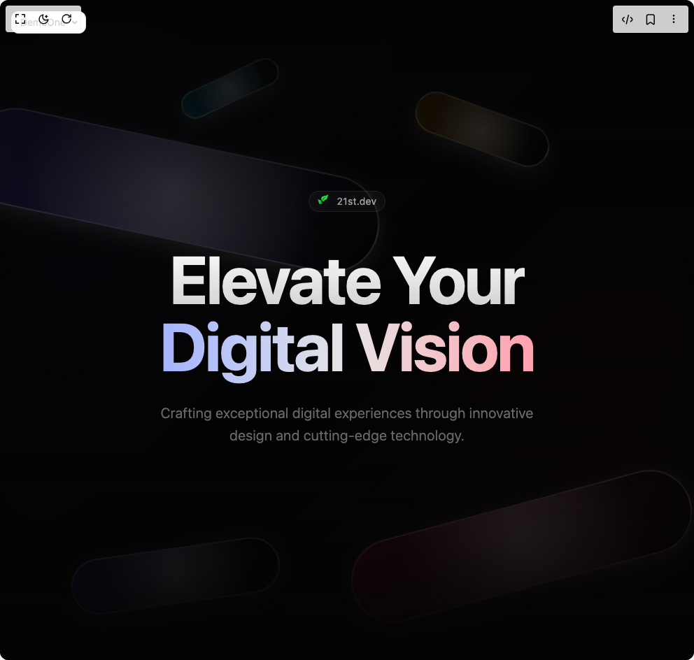

# Build Modern Hero Section in BuilderStudio

> Build this component in our Agentic IDE: [BuilderStudio](https://builderstudio.dev).
>
> Join the BuilderStudio community on [Discord](https://discord.gg/QdWeSGCqfe) and [Reddit](https://reddit.com/r/builderstudio).



## Component

- Author group: `uniquesonu`
- Component: `modern-hero-section`
- Variant: `default`
- Rendered HTML snapshot: [`rendered.html`](rendered.html)

## BuilderStudio prompt

You are implementing a React component based on a component reference.

## Component identity

- Author: uniquesonu
- Component slug: modern-hero-section
- Demo slug: default
- Title: modern-hero-section
- Description: 

## Goal

Recreate this component in a React + TypeScript + Tailwind CSS project. Preserve the visual layout, spacing, colors, border radius, shadows, interaction behavior, animation behavior, responsive behavior, and dark mode behavior shown in the rendered demo.

## Implementation requirements

- Use React and TypeScript.
- Use Tailwind CSS classes whenever possible.
- Keep the component self-contained unless the source files require helper components.
- If the source uses CSS variables, custom CSS, animations, or keyframes, include them.
- If the source uses external packages, list and use the required packages.
- Preserve accessibility attributes, button semantics, links, keyboard behavior, and ARIA attributes when visible in the source.
- Do not replace the component with a simplified placeholder.
- Return complete production-ready code.

## Dependencies

No reference metadata available.

## Rendered DOM snapshot

This is the rendered demo HTML extracted from the live preview. Use it to verify structure, class names, visible content, and layout.

```html
<div id="root"><div class="fixed top-4 left-4 z-10"><select class="appearance-none h-8 max-w-[200px] text-sm leading-tight rounded-lg pl-3 pr-7 py-0 border bg-background focus:outline-none focus:ring-0"><option value="named_DemoOne_DemoOne">DemoOne</option></select><div class="absolute top-1/2 transform -translate-y-1/2 right-2 pointer-events-none"><svg class="w-4 h-4 fill-current" viewBox="0 0 20 20"><path d="M5.516 7.548c.436-.446 1.043-.48 1.576 0L10 10.405l2.908-2.857c.533-.48 1.14-.446 1.576 0 .436.445.408 1.197 0 1.615l-3.734 3.705c-.533.534-1.39.534-1.923 0l-3.734-3.705c-.408-.418-.436-1.17 0-1.615z"></path></svg></div></div><div class="w-screen min-h-screen flex justify-center items-center"><div class="relative min-h-screen w-full flex items-center justify-center overflow-hidden bg-[#030303]"><div class="absolute inset-0 bg-gradient-to-br from-indigo-500/[0.05] via-transparent to-rose-500/[0.05] blur-3xl"></div><div class="absolute inset-0 overflow-hidden"><div class="absolute left-[-10%] md:left-[-5%] top-[15%] md:top-[20%]" style="opacity: 1; transform: rotate(12deg);"><div class="relative" style="width: 600px; height: 140px; transform: translateY(13.6324px);"><div class="absolute inset-0 rounded-full bg-gradient-to-r to-transparent from-indigo-500/[0.15] backdrop-blur-[2px] border-2 border-white/[0.15] shadow-[0_8px_32px_0_rgba(255,255,255,0.1)] after:absolute after:inset-0 after:rounded-full after:bg-[radial-gradient(circle_at_50%_50%,rgba(255,255,255,0.2),transparent_70%)]"></div></div></div><div class="absolute right-[-5%] md:right-[0%] top-[70%] md:top-[75%]" style="opacity: 1; transform: rotate(-15deg);"><div class="relative" style="width: 500px; height: 120px; transform: translateY(13.6324px);"><div class="absolute inset-0 rounded-full bg-gradient-to-r to-transparent from-rose-500/[0.15] backdrop-blur-[2px] border-2 border-white/[0.15] shadow-[0_8px_32px_0_rgba(255,255,255,0.1)] after:absolute after:inset-0 after:rounded-full after:bg-[radial-gradient(circle_at_50%_50%,rgba(255,255,255,0.2),transparent_70%)]"></div></div></div><div class="absolute left-[5%] md:left-[10%] bottom-[5%] md:bottom-[10%]" style="opacity: 1; transform: rotate(-8deg);"><div class="relative" style="width: 300px; height: 80px; transform: translateY(13.6324px);"><div class="absolute inset-0 rounded-full bg-gradient-to-r to-transparent from-violet-500/[0.15] backdrop-blur-[2px] border-2 border-white/[0.15] shadow-[0_8px_32px_0_rgba(255,255,255,0.1)] after:absolute after:inset-0 after:rounded-full after:bg-[radial-gradient(circle_at_50%_50%,rgba(255,255,255,0.2),transparent_70%)]"></div></div></div><div class="absolute right-[15%] md:right-[20%] top-[10%] md:top-[15%]" style="opacity: 1; transform: rotate(20deg);"><div class="relative" style="width: 200px; height: 60px; transform: translateY(13.6324px);"><div class="absolute inset-0 rounded-full bg-gradient-to-r to-transparent from-amber-500/[0.15] backdrop-blur-[2px] border-2 border-white/[0.15] shadow-[0_8px_32px_0_rgba(255,255,255,0.1)] after:absolute after:inset-0 after:rounded-full after:bg-[radial-gradient(circle_at_50%_50%,rgba(255,255,255,0.2),transparent_70%)]"></div></div></div><div class="absolute left-[20%] md:left-[25%] top-[5%] md:top-[10%]" style="opacity: 1; transform: rotate(-25deg);"><div class="relative" style="width: 150px; height: 40px; transform: translateY(13.6324px);"><div class="absolute inset-0 rounded-full bg-gradient-to-r to-transparent from-cyan-500/[0.15] backdrop-blur-[2px] border-2 border-white/[0.15] shadow-[0_8px_32px_0_rgba(255,255,255,0.1)] after:absolute after:inset-0 after:rounded-full after:bg-[radial-gradient(circle_at_50%_50%,rgba(255,255,255,0.2),transparent_70%)]"></div></div></div></div><div class="relative z-10 container mx-auto px-4 md:px-6"><div class="max-w-3xl mx-auto text-center"><div class="inline-flex items-center gap-2 px-3 py-1 rounded-full bg-white/[0.03] border border-white/[0.08] mb-8 md:mb-12" style="opacity: 1; transform: none;"><span class="text-sm text-white/60 tracking-wide">BuilderStudio</span></div><div style="opacity: 1; transform: none;"><h1 class="text-4xl sm:text-6xl md:text-8xl font-bold mb-6 md:mb-8 tracking-tight"><span class="bg-clip-text text-transparent bg-gradient-to-b from-white to-white/80">Elevate Your</span><br><span class="bg-clip-text text-transparent bg-gradient-to-r from-indigo-300 via-white/90 to-rose-300">Digital Vision</span></h1></div><div style="opacity: 1; transform: none;"><p class="text-base sm:text-lg md:text-xl text-white/40 mb-8 leading-relaxed font-light tracking-wide max-w-xl mx-auto px-4">Crafting exceptional digital experiences through innovative design and cutting-edge technology.</p></div></div></div><div class="absolute inset-0 bg-gradient-to-t from-[#030303] via-transparent to-[#030303]/80 pointer-events-none"></div></div></div></div>
```

## Reference source files

No reference source files were available.
