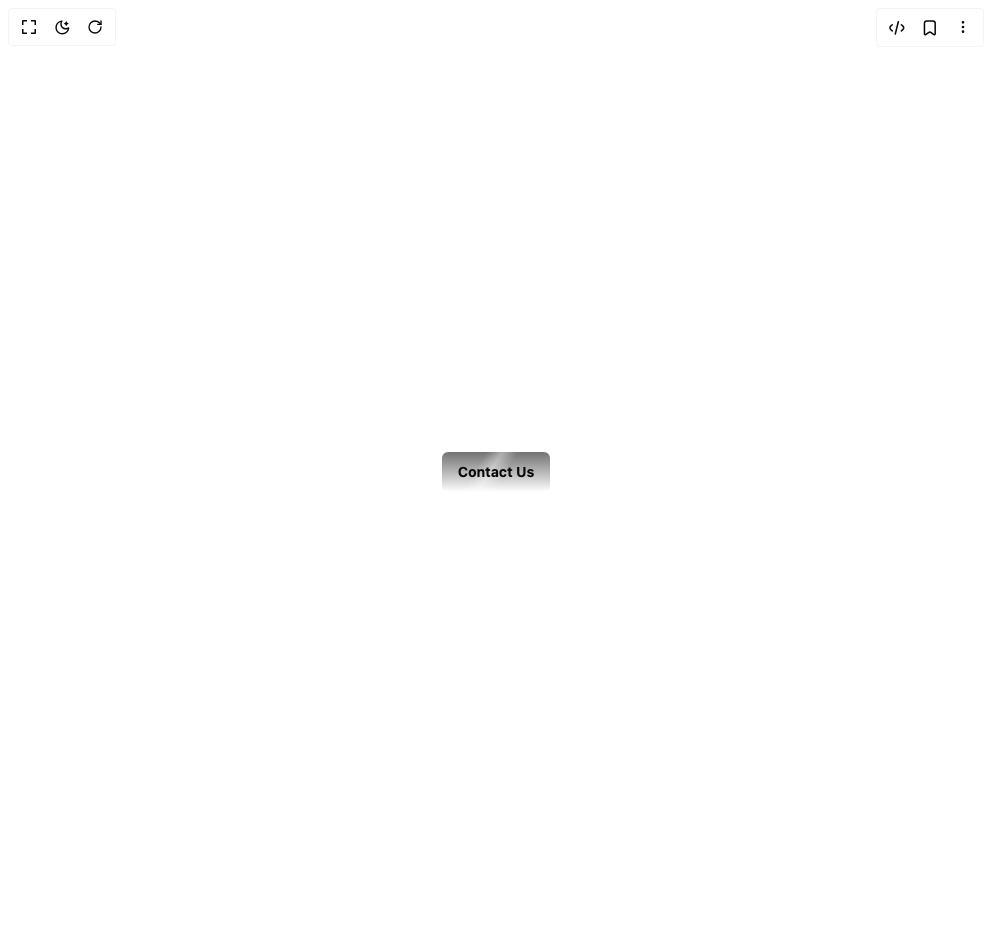

# Build Shimmer Button in BuilderStudio

> Build this component in our Agentic IDE: [BuilderStudio](https://builderstudio.dev).
>
> Join the BuilderStudio community on [Discord](https://discord.gg/QdWeSGCqfe) and [Reddit](https://reddit.com/r/builderstudio).



## Component

- Author group: `uniquesonu`
- Component: `shimmer-button`
- Variant: `default`
- Rendered HTML snapshot: [`rendered.html`](rendered.html)

## BuilderStudio prompt

You are implementing a React component based on a component reference.

## Component identity

- Author: uniquesonu
- Component slug: shimmer-button
- Demo slug: default
- Title: shimmer-button
- Description: 

## Goal

Recreate this component in a React + TypeScript + Tailwind CSS project. Preserve the visual layout, spacing, colors, border radius, shadows, interaction behavior, animation behavior, responsive behavior, and dark mode behavior shown in the rendered demo.

## Implementation requirements

- Use React and TypeScript.
- Use Tailwind CSS classes whenever possible.
- Keep the component self-contained unless the source files require helper components.
- If the source uses CSS variables, custom CSS, animations, or keyframes, include them.
- If the source uses external packages, list and use the required packages.
- Preserve accessibility attributes, button semantics, links, keyboard behavior, and ARIA attributes when visible in the source.
- Do not replace the component with a simplified placeholder.
- Return complete production-ready code.

## Dependencies

No reference metadata available.

## Rendered DOM snapshot

This is the rendered demo HTML extracted from the live preview. Use it to verify structure, class names, visible content, and layout.

```html
<div id="root"><div class="w-screen min-h-screen flex justify-center items-center"><div class="w-screen min-h-screen flex justify-center items-center"><div class="min-h-screen bg-background flex items-center justify-center p-8 w-full"><div class="relative z-10 flex flex-col items-center gap-8"><div class="text-center space-y-4"><button class="relative inline-flex items-center justify-center rounded-sm font-bold transition-all duration-200 ease-out select-none cursor-pointer overflow-hidden shadow-[inset_0_0_0.1rem_0_hsl(var(--muted-foreground)),0_0.3rem_0.1rem_-0.2rem_hsl(var(--muted-foreground)/0.6),0_0.3rem_0_0_hsl(var(--muted)/0.8),0_0.4rem_0_0.1rem_hsl(var(--background)/0.3),-0.4rem_0.4rem_0.2rem_0_hsl(var(--background)/0.4)] hover:translate-y-1.5 hover:text-primary-foreground hover:shadow-[inset_0_0_0.1rem_0_hsl(var(--muted-foreground)),0_0rem_0.1rem_-0.2rem_hsl(var(--muted-foreground)/0.6),0_0rem_0_0_hsl(var(--muted)/0.8),0_0.1rem_0_0.1rem_hsl(var(--background)/0.3),-0.1rem_0_0.2rem_0_hsl(var(--background)/0.4)] text-shadow-[0_-2px_1px_hsl(var(--background)/0.3),0_2px_1px_hsl(var(--primary-foreground)/0.3)] hover:text-shadow-[0_0_5px_hsl(var(--primary-foreground))] px-4 py-2.5 text-sm bg-gradient-to-b from-muted-foreground to-background hover:from-white hover:via-muted-foreground hover:to-muted dark:from-muted-foreground dark:to-background dark:hover:from-white dark:hover:via-muted-foreground dark:hover:to-muted focus-visible:outline-none focus-visible:ring-2 focus-visible:ring-ring focus-visible:ring-offset-2 disabled:pointer-events-none disabled:opacity-50"><div class="absolute inset-0 w-8 h-full bg-gradient-to-r from-transparent via-white/40 to-transparent skew-x-[-32deg] translate-x-8 transition-all duration-200 ease-out hover:w-4 hover:skew-x-0 hover:-translate-x-12 hover:opacity-0" aria-hidden="true"></div><span class="relative z-10">Contact Us</span><div class="absolute left-1/2 top-[12%] z-20 pointer-events-none opacity-0 transition-all duration-200 ease-out group-hover:opacity-100 hover:opacity-100" style="transform: translateX(0%); --shimmer-color: hsl(var(--primary-foreground));"><div class="absolute left-1/2 top-1/2 w-12 h-12 -translate-x-1/2 -translate-y-1/2" style="animation: 8s linear 0s infinite normal none running shimmer-spin;"><div class="absolute left-1/2 top-1/2 w-3 h-3 -translate-x-1/2 -translate-y-1/2 rounded-full blur-sm" style="background-color: var(--shimmer-color); animation: 4s linear 0s infinite reverse none running shimmer-spin;"></div><div class="absolute inset-0 rounded-full" style="background-image: ; background-position: 2% center; background-size: 45%; background-repeat: ; background-attachment: ; background-origin: ; background-clip: ; background-color: ; animation: 8s linear 0s infinite normal none running shimmer-flicker;"></div></div><div class="absolute left-1/2 top-1/2 w-12 h-12 -translate-x-1/2 -translate-y-1/2" style="animation: 8s linear -2.66667s infinite normal none running shimmer-spin;"><div class="absolute left-1/2 top-1/2 w-3 h-3 -translate-x-1/2 -translate-y-1/2 rounded-full blur-sm" style="background-color: var(--shimmer-color); animation: 4s linear 0s infinite reverse none running shimmer-spin;"></div><div class="absolute inset-0 rounded-full" style="background-image: ; background-position: 2% center; background-size: 45%; background-repeat: ; background-attachment: ; background-origin: ; background-clip: ; background-color: ; animation: 8s linear 0s infinite normal none running shimmer-flicker;"></div></div><div class="absolute left-1/2 top-1/2 w-12 h-12 -translate-x-1/2 -translate-y-1/2" style="animation: 8s linear -5.33333s infinite normal none running shimmer-spin;"><div class="absolute left-1/2 top-1/2 w-3 h-3 -translate-x-1/2 -translate-y-1/2 rounded-full blur-sm" style="background-color: var(--shimmer-color); animation: 4s linear 0s infinite reverse none running shimmer-spin;"></div><div class="absolute inset-0 rounded-full" style="background-image: ; background-position: 2% center; background-size: 45%; background-repeat: ; background-attachment: ; background-origin: ; background-clip: ; background-color: ; animation: 8s linear 0s infinite normal none running shimmer-flicker;"></div></div></div><style>
          @keyframes shimmer-spin {
            from { transform: rotate(0deg); }
            to { transform: rotate(360deg); }
          }
          
          @keyframes shimmer-flicker {
            0% { 
              background-size: 45%;
              background-position: 2%;
            }
            50% { 
              background-size: 42%;
              background-position: 0%;
            }
            100% { 
              background-size: 45%;
              background-position: 2%;
            }
          }
        </style></button></div></div></div></div></div></div>
```

## Reference source files

No reference source files were available.
