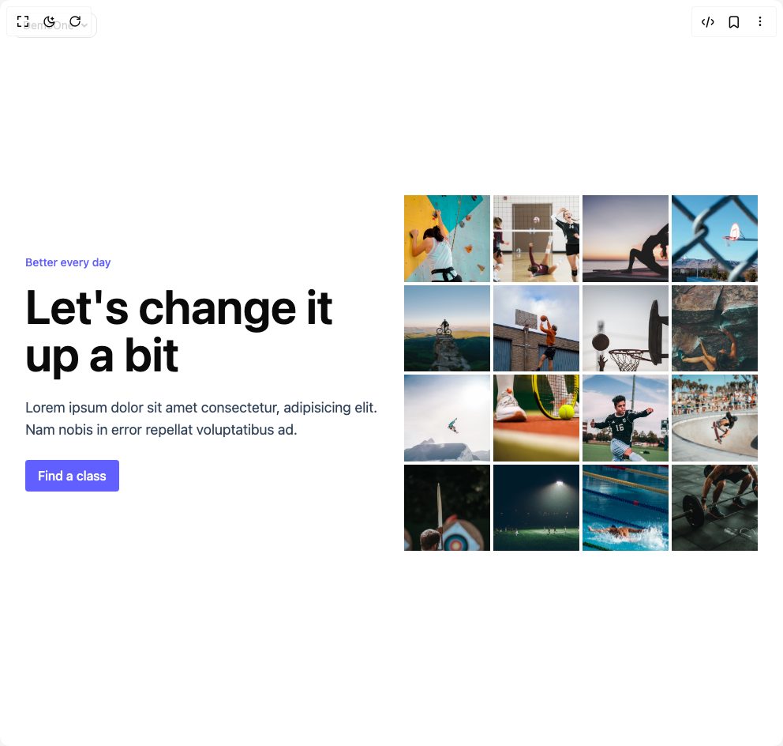

# Build Suffle Hero in BuilderStudio

> Build this component in our Agentic IDE: [BuilderStudio](https://builderstudio.dev).
>
> Join the BuilderStudio community on [Discord](https://discord.gg/QdWeSGCqfe) and [Reddit](https://reddit.com/r/builderstudio).



## Component

- Author group: `uniquesonu`
- Component: `suffle-hero`
- Variant: `default`
- Rendered HTML snapshot: [`rendered.html`](rendered.html)

## BuilderStudio prompt

You are implementing a React component based on a component reference.

## Component identity

- Author: uniquesonu
- Component slug: suffle-hero
- Demo slug: default
- Title: suffle-hero
- Description: 

## Goal

Recreate this component in a React + TypeScript + Tailwind CSS project. Preserve the visual layout, spacing, colors, border radius, shadows, interaction behavior, animation behavior, responsive behavior, and dark mode behavior shown in the rendered demo.

## Implementation requirements

- Use React and TypeScript.
- Use Tailwind CSS classes whenever possible.
- Keep the component self-contained unless the source files require helper components.
- If the source uses CSS variables, custom CSS, animations, or keyframes, include them.
- If the source uses external packages, list and use the required packages.
- Preserve accessibility attributes, button semantics, links, keyboard behavior, and ARIA attributes when visible in the source.
- Do not replace the component with a simplified placeholder.
- Return complete production-ready code.

## Dependencies

No reference metadata available.

## Rendered DOM snapshot

This is the rendered demo HTML extracted from the live preview. Use it to verify structure, class names, visible content, and layout.

```html
<div id="root"><div class="fixed top-4 left-4 z-10"><select class="appearance-none h-8 max-w-[200px] text-sm leading-tight rounded-lg pl-3 pr-7 py-0 border bg-background focus:outline-none focus:ring-0"><option value="named_DemoOne_DemoOne">DemoOne</option></select><div class="absolute top-1/2 transform -translate-y-1/2 right-2 pointer-events-none"><svg class="w-4 h-4 fill-current" viewBox="0 0 20 20"><path d="M5.516 7.548c.436-.446 1.043-.48 1.576 0L10 10.405l2.908-2.857c.533-.48 1.14-.446 1.576 0 .436.445.408 1.197 0 1.615l-3.734 3.705c-.533.534-1.39.534-1.923 0l-3.734-3.705c-.408-.418-.436-1.17 0-1.615z"></path></svg></div></div><div class="w-screen min-h-screen flex justify-center items-center"><section class="w-full px-8 py-12 grid grid-cols-1 md:grid-cols-2 items-center gap-8 max-w-6xl mx-auto"><div><span class="block mb-4 text-xs md:text-sm text-indigo-500 font-medium">Better every day</span><h3 class="text-4xl md:text-6xl font-semibold">Let's change it up a bit</h3><p class="text-base md:text-lg text-slate-700 my-4 md:my-6">Lorem ipsum dolor sit amet consectetur, adipisicing elit. Nam nobis in error repellat voluptatibus ad.</p><button class="bg-indigo-500 text-white font-medium py-2 px-4 rounded transition-all hover:bg-indigo-600 active:scale-95">Find a class</button></div><div class="grid grid-cols-4 grid-rows-4 h-[450px] gap-1"><div class="w-full h-full" style="background-image: url(&quot;https://images.unsplash.com/photo-1610768764270-790fbec18178?ixlib=rb-4.0.3&amp;ixid=MnwxMjA3fDB8MHxwaG90by1wYWdlfHx8fGVufDB8fHx8&amp;auto=format&amp;fit=crop&amp;w=687&amp;q=80&quot;); background-size: cover; transform: none; transform-origin: 50% 50% 0px;"></div><div class="w-full h-full" style="background-image: url(&quot;https://images.unsplash.com/photo-1547347298-4074fc3086f0?ixlib=rb-4.0.3&amp;ixid=MnwxMjA3fDB8MHxwaG90by1wYWdlfHx8fGVufDB8fHx8&amp;auto=format&amp;fit=crop&amp;w=1740&amp;q=80&quot;); background-size: cover; transform: none; transform-origin: 50% 50% 0px;"></div><div class="w-full h-full" style="background-image: url(&quot;https://images.unsplash.com/photo-1544367567-0f2fcb009e0b?ixlib=rb-4.0.3&amp;ixid=MnwxMjA3fDB8MHxwaG90by1wYWdlfHx8fGVufDB8fHx8&amp;auto=format&amp;fit=crop&amp;w=1820&amp;q=80&quot;); background-size: cover; transform: none; transform-origin: 50% 50% 0px;"></div><div class="w-full h-full" style="background-image: url(&quot;https://plus.unsplash.com/premium_photo-1671436824833-91c0741e89c9?ixlib=rb-4.0.3&amp;ixid=MnwxMjA3fDB8MHxwaG90by1wYWdlfHx8fGVufDB8fHx8&amp;auto=format&amp;fit=crop&amp;w=1740&amp;q=80&quot;); background-size: cover; transform: none; transform-origin: 50% 50% 0px;"></div><div class="w-full h-full" style="background-image: url(&quot;https://images.unsplash.com/photo-1533107862482-0e6974b06ec4?ixlib=rb-4.0.3&amp;ixid=MnwxMjA3fDB8MHxwaG90by1wYWdlfHx8fGVufDB8fHx8&amp;auto=format&amp;fit=crop&amp;w=882&amp;q=80&quot;); background-size: cover; transform: none; transform-origin: 50% 50% 0px;"></div><div class="w-full h-full" style="background-image: url(&quot;https://images.unsplash.com/photo-1606244864456-8bee63fce472?ixlib=rb-4.0.3&amp;ixid=MnwxMjA3fDB8MHxwaG90by1wYWdlfHx8fGVufDB8fHx8&amp;auto=format&amp;fit=crop&amp;w=681&amp;q=80&quot;); background-size: cover; transform: none; transform-origin: 50% 50% 0px;"></div><div class="w-full h-full" style="background-image: url(&quot;https://images.unsplash.com/photo-1629901925121-8a141c2a42f4?ixlib=rb-4.0.3&amp;ixid=MnwxMjA3fDB8MHxwaG90by1wYWdlfHx8fGVufDB8fHx8&amp;auto=format&amp;fit=crop&amp;w=687&amp;q=80&quot;); background-size: cover; transform: none; transform-origin: 50% 50% 0px;"></div><div class="w-full h-full" style="background-image: url(&quot;https://images.unsplash.com/photo-1507034589631-9433cc6bc453?ixlib=rb-4.0.3&amp;ixid=MnwxMjA3fDB8MHxwaG90by1wYWdlfHx8fGVufDB8fHx8&amp;auto=format&amp;fit=crop&amp;w=684&amp;q=80&quot;); background-size: cover; transform: none; transform-origin: 50% 50% 0px;"></div><div class="w-full h-full" style="background-image: url(&quot;https://images.unsplash.com/photo-1580238053495-b9720401fd45?ixlib=rb-4.0.3&amp;ixid=MnwxMjA3fDB8MHxwaG90by1wYWdlfHx8fGVufDB8fHx8&amp;auto=format&amp;fit=crop&amp;w=687&amp;q=80&quot;); background-size: cover; transform: none; transform-origin: 50% 50% 0px;"></div><div class="w-full h-full" style="background-image: url(&quot;https://images.unsplash.com/photo-1599586120429-48281b6f0ece?ixlib=rb-4.0.3&amp;ixid=MnwxMjA3fDB8MHxwaG90by1wYWdlfHx8fGVufDB8fHx8&amp;auto=format&amp;fit=crop&amp;w=1740&amp;q=80&quot;); background-size: cover; transform: none; transform-origin: 50% 50% 0px;"></div><div class="w-full h-full" style="background-image: url(&quot;https://images.unsplash.com/photo-1517466787929-bc90951d0974?ixlib=rb-4.0.3&amp;ixid=MnwxMjA3fDB8MHxwaG90by1wYWdlfHx8fGVufDB8fHx8&amp;auto=format&amp;fit=crop&amp;w=686&amp;q=80&quot;); background-size: cover; transform: none; transform-origin: 50% 50% 0px;"></div><div class="w-full h-full" style="background-image: url(&quot;https://images.unsplash.com/photo-1569074187119-c87815b476da?ixlib=rb-4.0.3&amp;ixid=MnwxMjA3fDB8MHxwaG90by1wYWdlfHx8fGVufDB8fHx8&amp;auto=format&amp;fit=crop&amp;w=1325&amp;q=80&quot;); background-size: cover; transform: none; transform-origin: 50% 50% 0px;"></div><div class="w-full h-full" style="background-image: url(&quot;https://images.unsplash.com/photo-1510925758641-869d353cecc7?ixlib=rb-4.0.3&amp;ixid=MnwxMjA3fDB8MHxwaG90by1wYWdlfHx8fGVufDB8fHx8&amp;auto=format&amp;fit=crop&amp;w=687&amp;q=80&quot;); background-size: cover; transform: none; transform-origin: 50% 50% 0px;"></div><div class="w-full h-full" style="background-image: url(&quot;https://images.unsplash.com/photo-1431324155629-1a6deb1dec8d?ixlib=rb-4.0.3&amp;ixid=MnwxMjA3fDB8MHxwaG90by1wYWdlfHx8fGVufDB8fHx8&amp;auto=format&amp;fit=crop&amp;w=1740&amp;q=80&quot;); background-size: cover; transform: none; transform-origin: 50% 50% 0px;"></div><div class="w-full h-full" style="background-image: url(&quot;https://images.unsplash.com/photo-1560089000-7433a4ebbd64?ixlib=rb-4.0.3&amp;ixid=MnwxMjA3fDB8MHxwaG90by1wYWdlfHx8fGVufDB8fHx8&amp;auto=format&amp;fit=crop&amp;w=870&amp;q=80&quot;); background-size: cover; transform: none; transform-origin: 50% 50% 0px;"></div><div class="w-full h-full" style="background-image: url(&quot;https://images.unsplash.com/photo-1556817411-31ae72fa3ea0?ixlib=rb-4.0.3&amp;ixid=MnwxMjA3fDB8MHxwaG90by1wYWdlfHx8fGVufDB8fHx8&amp;auto=format&amp;fit=crop&amp;w=1740&amp;q=80&quot;); background-size: cover; transform: none; transform-origin: 50% 50% 0px;"></div></div></section></div></div>
```

## Reference source files

No reference source files were available.
