# Untitledui Components

15 components are available in this author group.

> Build any component in [BuilderStudio](https://builderstudio.dev), then share improvements with the community on [Discord](https://discord.gg/QdWeSGCqfe) or [Reddit](https://reddit.com/r/builderstudio).

| Preview | Component | Variant |
| --- | --- | --- |
|  | [Button 1](button-1/default/README.md) | `default` |
| [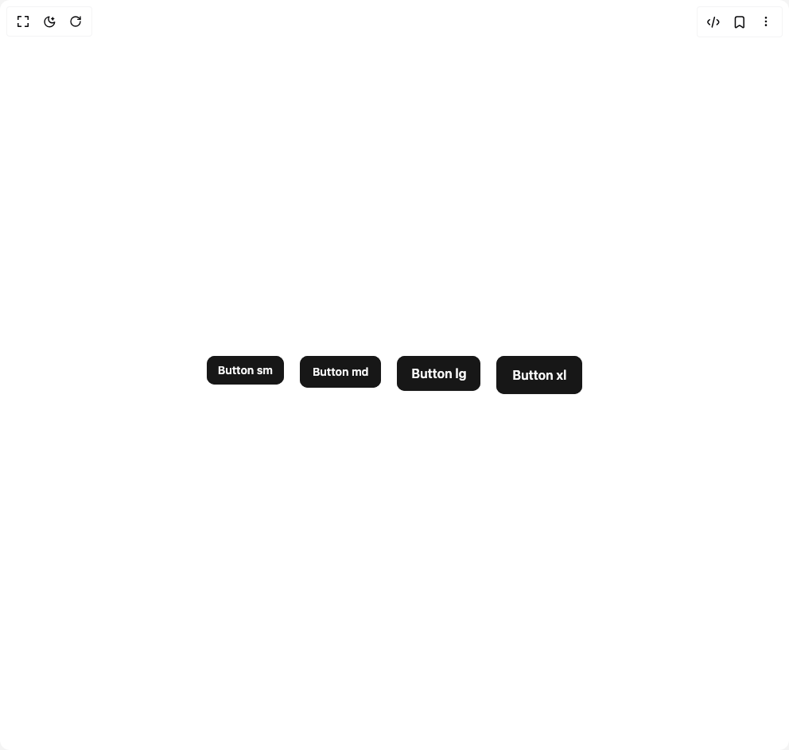](button-1/disabled-buttons/README.md) | [Button 1](button-1/disabled-buttons/README.md) | `disabled-buttons` |
| [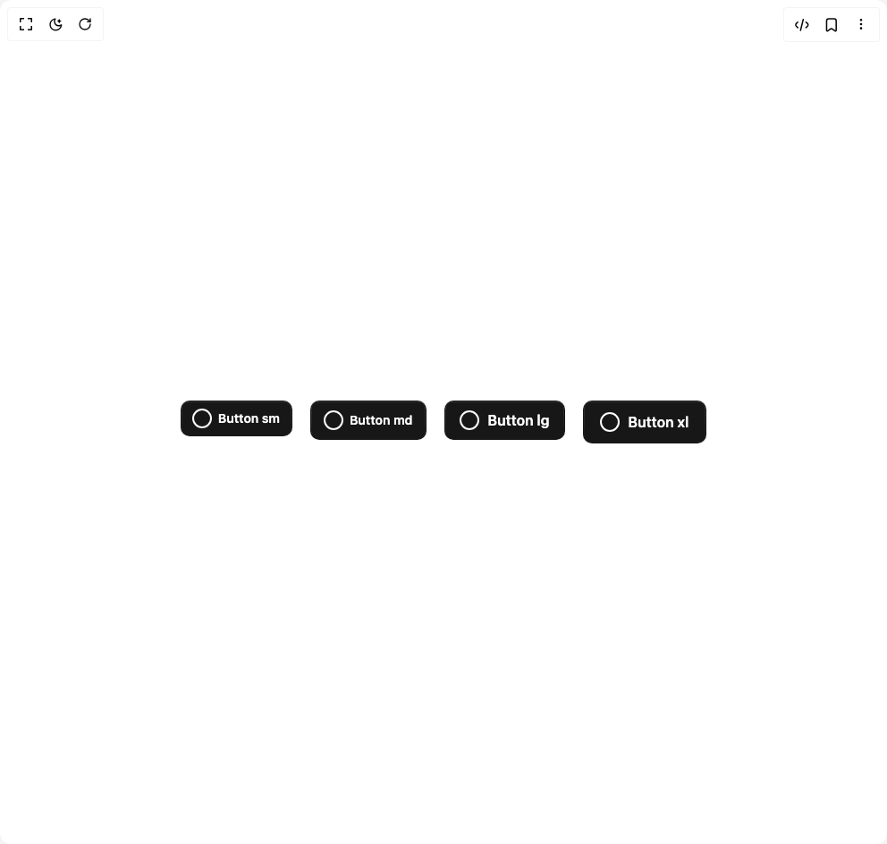](button-1/icon-leading-buttons/README.md) | [Button 1](button-1/icon-leading-buttons/README.md) | `icon-leading-buttons` |
| [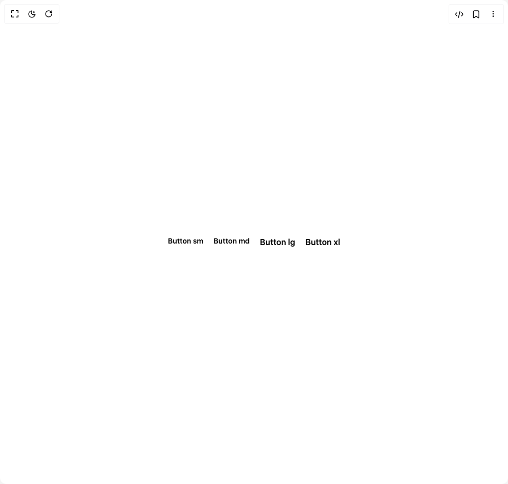](button-1/link-color-buttons/README.md) | [Button 1](button-1/link-color-buttons/README.md) | `link-color-buttons` |
|  | [Button 1](button-1/loading-buttons/README.md) | `loading-buttons` |
| [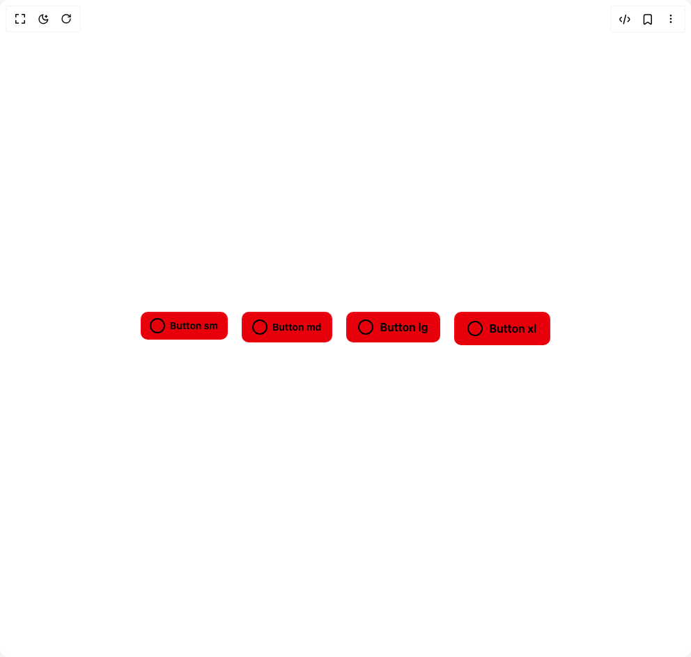](button-1/primary-buttons-destructive/README.md) | [Button 1](button-1/primary-buttons-destructive/README.md) | `primary-buttons-destructive` |
| [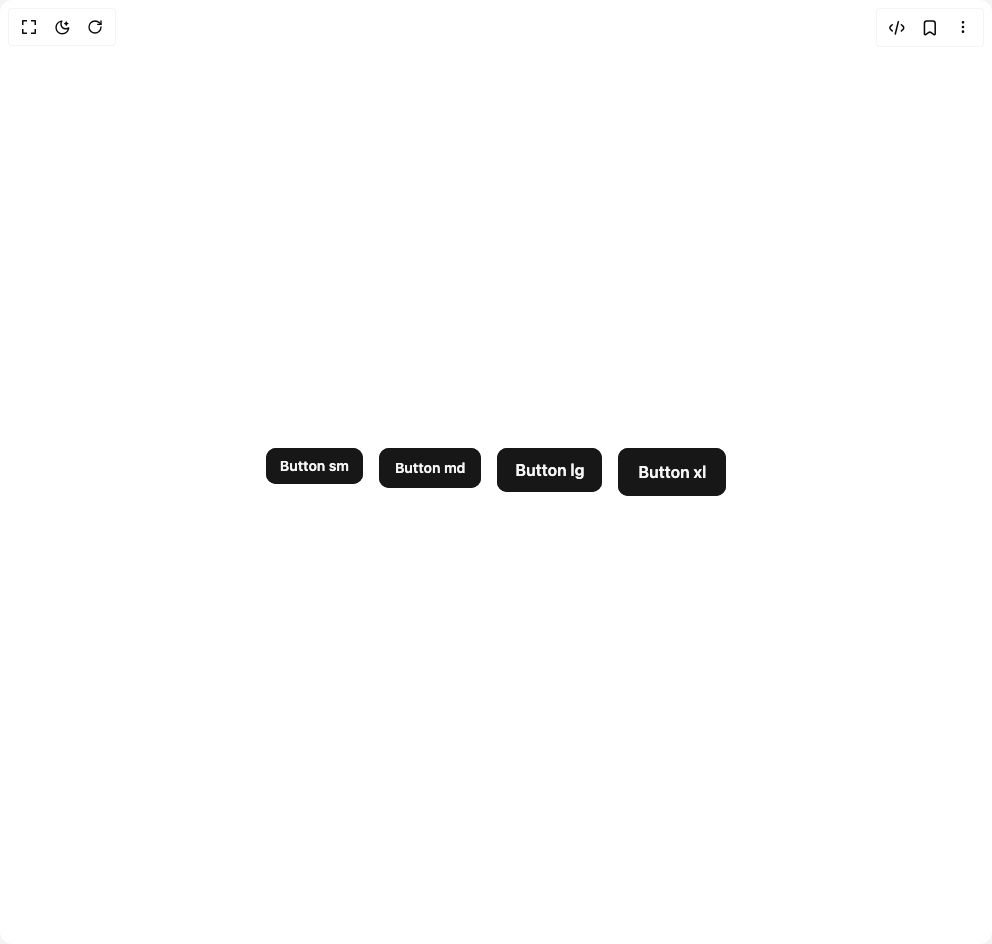](button-1/secondary-buttons/README.md) | [Button 1](button-1/secondary-buttons/README.md) | `secondary-buttons` |
| [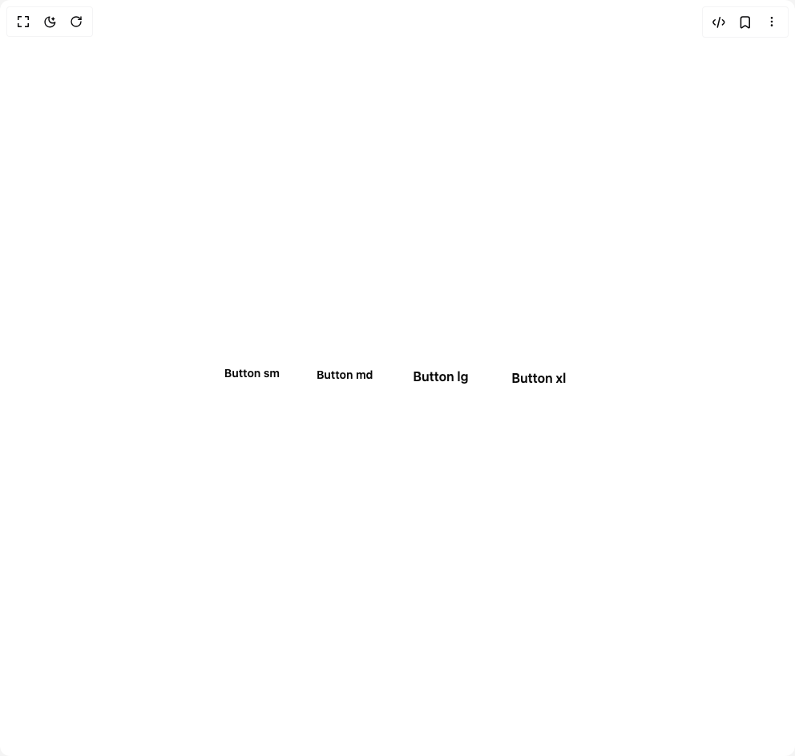](button-1/tertiary-buttons/README.md) | [Button 1](button-1/tertiary-buttons/README.md) | `tertiary-buttons` |
| [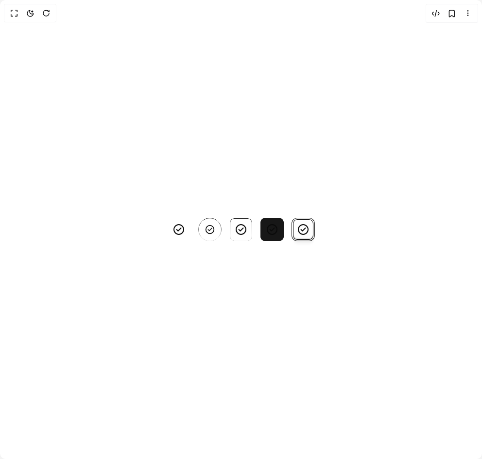](featured-icons/default/README.md) | [Featured Icons](featured-icons/default/README.md) | `default` |
| [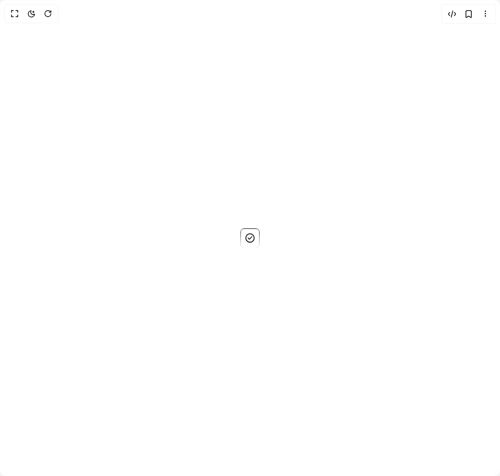](featured-icons/featured-icons-dark/README.md) | [Featured Icons](featured-icons/featured-icons-dark/README.md) | `featured-icons-dark` |
| [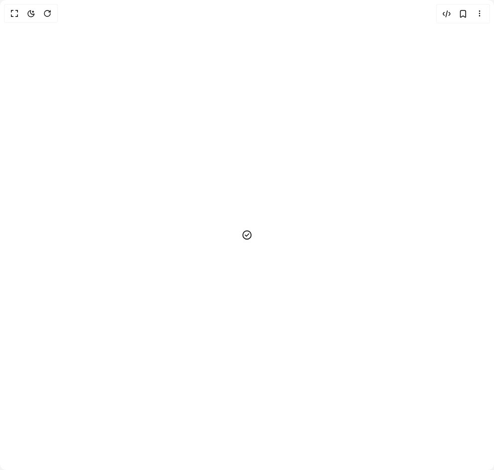](featured-icons/featured-icons-examples/README.md) | [Featured Icons](featured-icons/featured-icons-examples/README.md) | `featured-icons-examples` |
|  | [Featured Icons](featured-icons/featured-icons-gradient/README.md) | `featured-icons-gradient` |
| [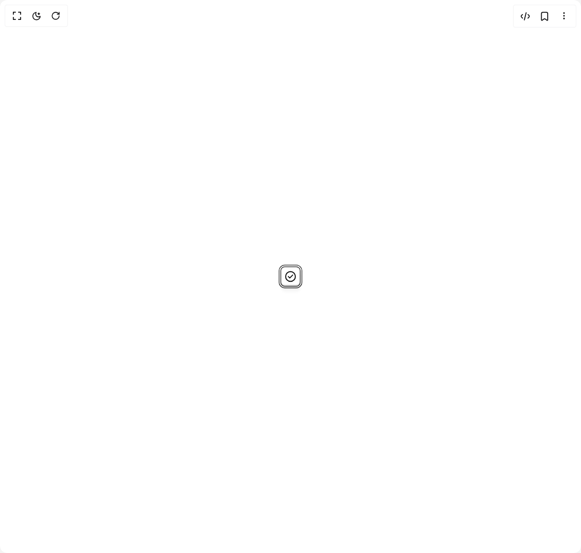](featured-icons/featured-icons-modern/README.md) | [Featured Icons](featured-icons/featured-icons-modern/README.md) | `featured-icons-modern` |
|  | [Featured Icons](featured-icons/featured-icons-outline/README.md) | `featured-icons-outline` |
| [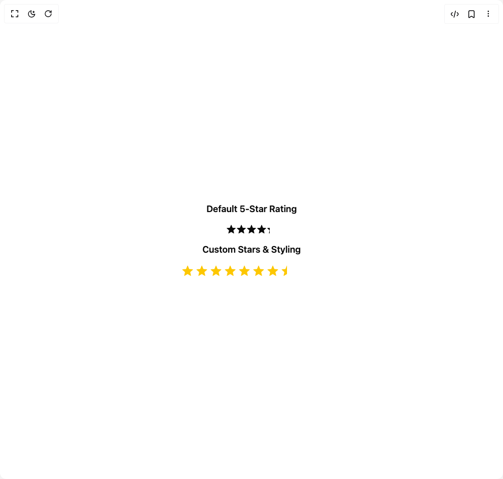](rating-badge/default/README.md) | [Rating Badge](rating-badge/default/README.md) | `default` |
