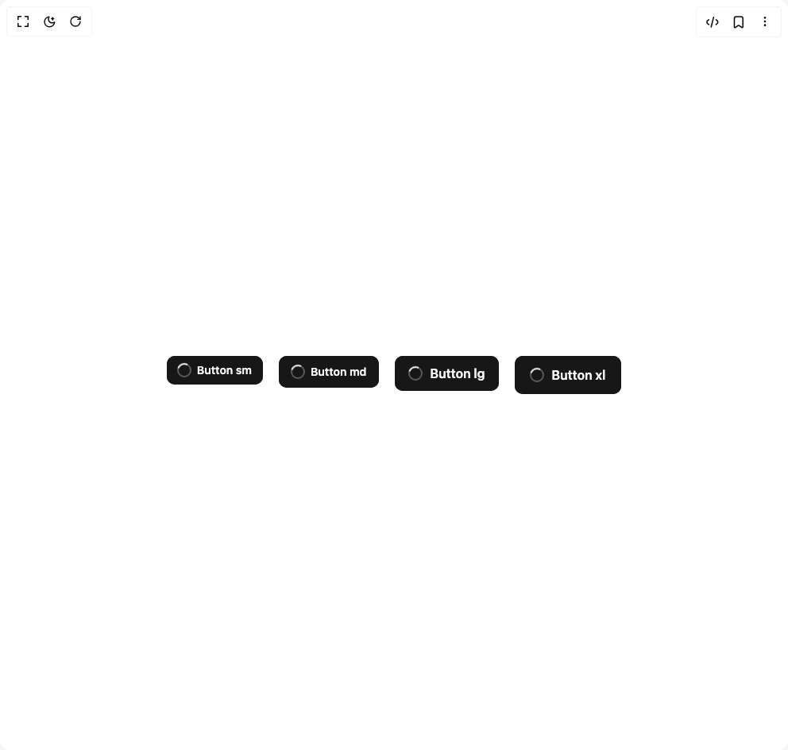

# Build Button 1 in BuilderStudio

> Build this component in our Agentic IDE: [BuilderStudio](https://builderstudio.dev).
>
> Join the BuilderStudio community on [Discord](https://discord.gg/QdWeSGCqfe) and [Reddit](https://reddit.com/r/builderstudio).



## Component

- Author group: `untitledui`
- Component: `button-1`
- Variant: `loading-buttons`
- Rendered HTML snapshot: [`rendered.html`](rendered.html)

## BuilderStudio prompt

You are implementing a React component based on a component reference.

## Component identity

- Author: untitledui
- Component slug: button-1
- Demo slug: loading-buttons
- Title: button-1
- Description: 

## Goal

Recreate this component in a React + TypeScript + Tailwind CSS project. Preserve the visual layout, spacing, colors, border radius, shadows, interaction behavior, animation behavior, responsive behavior, and dark mode behavior shown in the rendered demo.

## Implementation requirements

- Use React and TypeScript.
- Use Tailwind CSS classes whenever possible.
- Keep the component self-contained unless the source files require helper components.
- If the source uses CSS variables, custom CSS, animations, or keyframes, include them.
- If the source uses external packages, list and use the required packages.
- Preserve accessibility attributes, button semantics, links, keyboard behavior, and ARIA attributes when visible in the source.
- Do not replace the component with a simplified placeholder.
- Return complete production-ready code.

## Dependencies

No reference metadata available.

## Rendered DOM snapshot

This is the rendered demo HTML extracted from the live preview. Use it to verify structure, class names, visible content, and layout.

```html
<div id="root"><div class="w-screen min-h-screen flex justify-center items-center"><div class="w-screen min-h-screen flex justify-center items-center"><div class="flex flex-wrap gap-5"><button data-loading="true" class="group relative inline-flex h-max cursor-pointer items-center justify-center whitespace-nowrap outline-brand transition duration-100 ease-linear before:absolute focus-visible:outline-2 focus-visible:outline-offset-2 in-data-input-wrapper:shadow-xs in-data-input-wrapper:focus:!z-50 in-data-input-wrapper:in-data-leading:-mr-px in-data-input-wrapper:in-data-leading:rounded-r-none in-data-input-wrapper:in-data-leading:before:rounded-r-none in-data-input-wrapper:in-data-trailing:-ml-px in-data-input-wrapper:in-data-trailing:rounded-l-none in-data-input-wrapper:in-data-trailing:before:rounded-l-none disabled:cursor-not-allowed disabled:text-fg-disabled disabled:*:data-icon:text-fg-disabled_subtle *:data-icon:pointer-events-none *:data-icon:size-5 *:data-icon:shrink-0 *:data-icon:transition-inherit-all gap-1 rounded-lg px-3 py-2 text-sm font-semibold before:rounded-[7px] data-icon-only:p-2 in-data-input-wrapper:px-3.5 in-data-input-wrapper:py-2.5 in-data-input-wrapper:data-icon-only:p-2.5 bg-primary text-secondary shadow-xs-skeumorphic ring-1 ring-primary ring-inset hover:bg-primary_hover hover:text-secondary_hover data-loading:bg-primary_hover disabled:shadow-xs disabled:ring-disabled_subtle *:data-icon:text-fg-quaternary hover:*:data-icon:text-fg-quaternary_hover pointer-events-none [&amp;&gt;*:not([data-icon=loading]):not([data-text])]:hidden" data-rac="" type="button" tabindex="0" data-react-aria-pressable="true" id="react-aria8107362774-«r0»" aria-disabled="true" data-pending="true"><svg fill="none" data-icon="loading" viewBox="0 0 20 20" class="pointer-events-none size-5 shrink-0 transition-inherit-all"><circle class="stroke-current opacity-30" cx="10" cy="10" r="8" fill="none" stroke-width="2"></circle><circle class="origin-center animate-spin stroke-current" cx="10" cy="10" r="8" fill="none" stroke-width="2" stroke-dasharray="12.5 50" stroke-linecap="round"></circle></svg><span data-text="true" class="transition-inherit-all px-0.5">Button sm</span></button><button data-loading="true" class="group relative inline-flex h-max cursor-pointer items-center justify-center whitespace-nowrap outline-brand transition duration-100 ease-linear before:absolute focus-visible:outline-2 focus-visible:outline-offset-2 in-data-input-wrapper:shadow-xs in-data-input-wrapper:focus:!z-50 in-data-input-wrapper:in-data-leading:-mr-px in-data-input-wrapper:in-data-leading:rounded-r-none in-data-input-wrapper:in-data-leading:before:rounded-r-none in-data-input-wrapper:in-data-trailing:-ml-px in-data-input-wrapper:in-data-trailing:rounded-l-none in-data-input-wrapper:in-data-trailing:before:rounded-l-none disabled:cursor-not-allowed disabled:text-fg-disabled disabled:*:data-icon:text-fg-disabled_subtle *:data-icon:pointer-events-none *:data-icon:size-5 *:data-icon:shrink-0 *:data-icon:transition-inherit-all gap-1 rounded-lg px-3.5 py-2.5 text-sm font-semibold before:rounded-[7px] data-icon-only:p-2.5 in-data-input-wrapper:gap-1.5 in-data-input-wrapper:px-4 in-data-input-wrapper:text-md in-data-input-wrapper:data-icon-only:p-3 bg-primary text-secondary shadow-xs-skeumorphic ring-1 ring-primary ring-inset hover:bg-primary_hover hover:text-secondary_hover data-loading:bg-primary_hover disabled:shadow-xs disabled:ring-disabled_subtle *:data-icon:text-fg-quaternary hover:*:data-icon:text-fg-quaternary_hover pointer-events-none [&amp;&gt;*:not([data-icon=loading]):not([data-text])]:hidden" data-rac="" type="button" tabindex="0" data-react-aria-pressable="true" id="react-aria8107362774-«r2»" aria-disabled="true" data-pending="true"><svg fill="none" data-icon="loading" viewBox="0 0 20 20" class="pointer-events-none size-5 shrink-0 transition-inherit-all"><circle class="stroke-current opacity-30" cx="10" cy="10" r="8" fill="none" stroke-width="2"></circle><circle class="origin-center animate-spin stroke-current" cx="10" cy="10" r="8" fill="none" stroke-width="2" stroke-dasharray="12.5 50" stroke-linecap="round"></circle></svg><span data-text="true" class="transition-inherit-all px-0.5">Button md</span></button><button data-loading="true" class="group relative inline-flex h-max cursor-pointer items-center justify-center whitespace-nowrap outline-brand transition duration-100 ease-linear before:absolute focus-visible:outline-2 focus-visible:outline-offset-2 in-data-input-wrapper:shadow-xs in-data-input-wrapper:focus:!z-50 in-data-input-wrapper:in-data-leading:-mr-px in-data-input-wrapper:in-data-leading:rounded-r-none in-data-input-wrapper:in-data-leading:before:rounded-r-none in-data-input-wrapper:in-data-trailing:-ml-px in-data-input-wrapper:in-data-trailing:rounded-l-none in-data-input-wrapper:in-data-trailing:before:rounded-l-none disabled:cursor-not-allowed disabled:text-fg-disabled disabled:*:data-icon:text-fg-disabled_subtle *:data-icon:pointer-events-none *:data-icon:size-5 *:data-icon:shrink-0 *:data-icon:transition-inherit-all gap-1.5 rounded-lg px-4 py-2.5 text-md font-semibold before:rounded-[7px] data-icon-only:p-3 bg-primary text-secondary shadow-xs-skeumorphic ring-1 ring-primary ring-inset hover:bg-primary_hover hover:text-secondary_hover data-loading:bg-primary_hover disabled:shadow-xs disabled:ring-disabled_subtle *:data-icon:text-fg-quaternary hover:*:data-icon:text-fg-quaternary_hover pointer-events-none [&amp;&gt;*:not([data-icon=loading]):not([data-text])]:hidden" data-rac="" type="button" tabindex="0" data-react-aria-pressable="true" id="react-aria8107362774-«r4»" aria-disabled="true" data-pending="true"><svg fill="none" data-icon="loading" viewBox="0 0 20 20" class="pointer-events-none size-5 shrink-0 transition-inherit-all"><circle class="stroke-current opacity-30" cx="10" cy="10" r="8" fill="none" stroke-width="2"></circle><circle class="origin-center animate-spin stroke-current" cx="10" cy="10" r="8" fill="none" stroke-width="2" stroke-dasharray="12.5 50" stroke-linecap="round"></circle></svg><span data-text="true" class="transition-inherit-all px-0.5">Button lg</span></button><button data-loading="true" class="group relative inline-flex h-max cursor-pointer items-center justify-center whitespace-nowrap outline-brand transition duration-100 ease-linear before:absolute focus-visible:outline-2 focus-visible:outline-offset-2 in-data-input-wrapper:shadow-xs in-data-input-wrapper:focus:!z-50 in-data-input-wrapper:in-data-leading:-mr-px in-data-input-wrapper:in-data-leading:rounded-r-none in-data-input-wrapper:in-data-leading:before:rounded-r-none in-data-input-wrapper:in-data-trailing:-ml-px in-data-input-wrapper:in-data-trailing:rounded-l-none in-data-input-wrapper:in-data-trailing:before:rounded-l-none disabled:cursor-not-allowed disabled:text-fg-disabled disabled:*:data-icon:text-fg-disabled_subtle *:data-icon:pointer-events-none *:data-icon:size-5 *:data-icon:shrink-0 *:data-icon:transition-inherit-all gap-1.5 rounded-lg px-4.5 py-3 text-md font-semibold before:rounded-[7px] data-icon-only:p-3.5 bg-primary text-secondary shadow-xs-skeumorphic ring-1 ring-primary ring-inset hover:bg-primary_hover hover:text-secondary_hover data-loading:bg-primary_hover disabled:shadow-xs disabled:ring-disabled_subtle *:data-icon:text-fg-quaternary hover:*:data-icon:text-fg-quaternary_hover pointer-events-none [&amp;&gt;*:not([data-icon=loading]):not([data-text])]:hidden" data-rac="" type="button" tabindex="0" data-react-aria-pressable="true" id="react-aria8107362774-«r6»" aria-disabled="true" data-pending="true"><svg fill="none" data-icon="loading" viewBox="0 0 20 20" class="pointer-events-none size-5 shrink-0 transition-inherit-all"><circle class="stroke-current opacity-30" cx="10" cy="10" r="8" fill="none" stroke-width="2"></circle><circle class="origin-center animate-spin stroke-current" cx="10" cy="10" r="8" fill="none" stroke-width="2" stroke-dasharray="12.5 50" stroke-linecap="round"></circle></svg><span data-text="true" class="transition-inherit-all px-0.5">Button xl</span></button></div></div></div></div>
```

## Reference source files

No reference source files were available.
