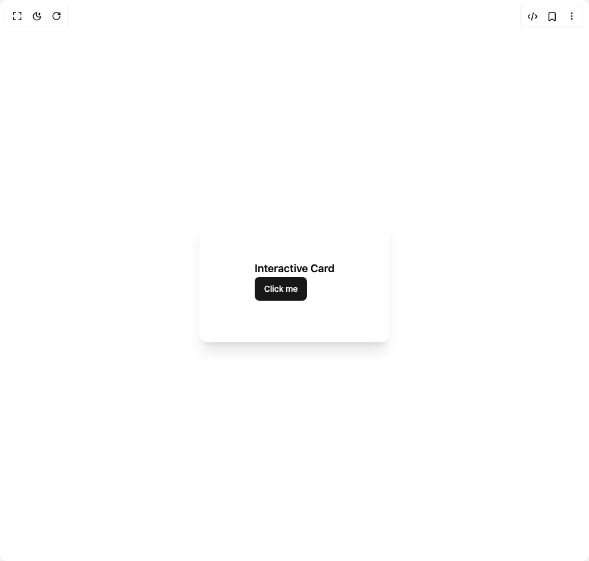
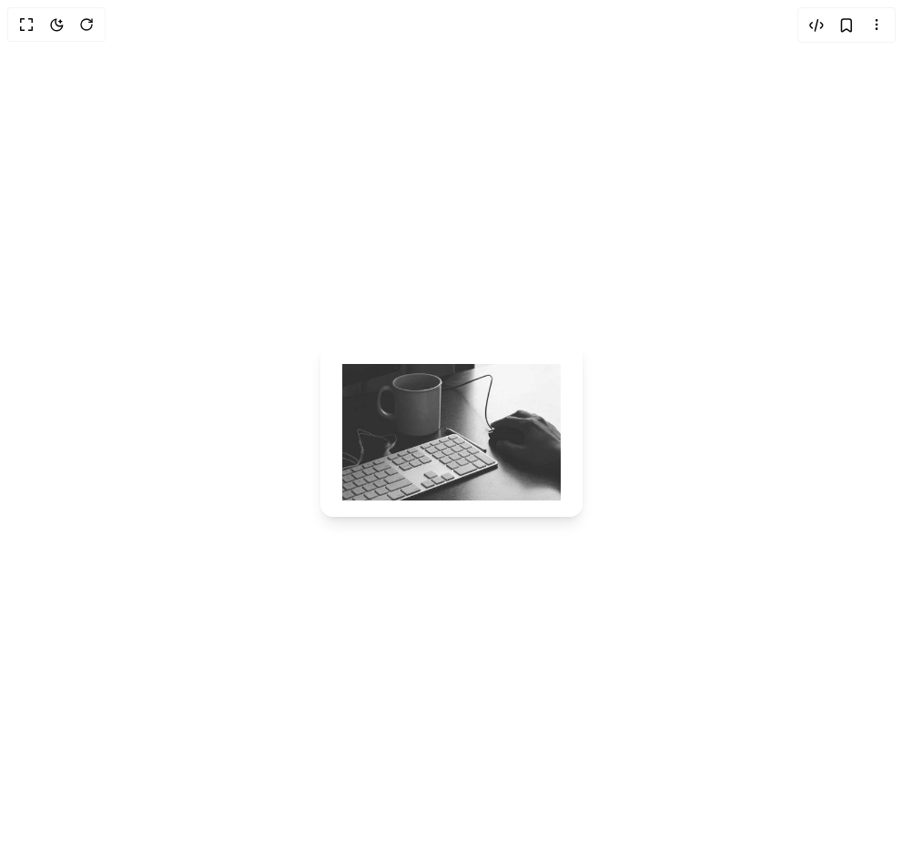
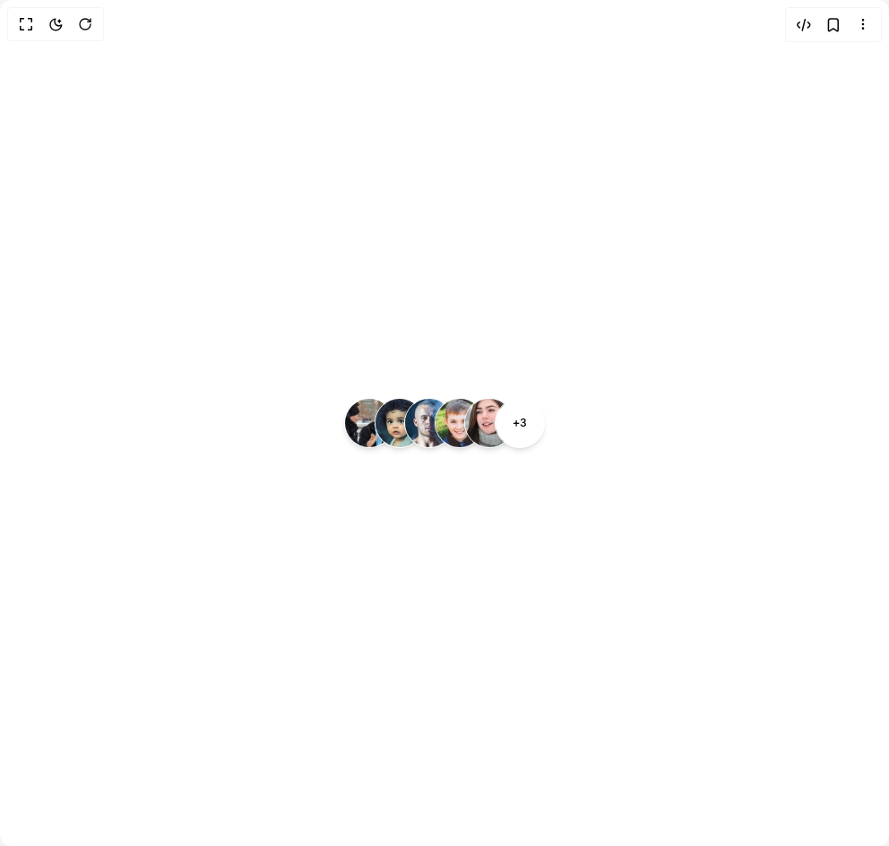

# User Hardp Components

7 components are available in this author group.

> Build any component in [BuilderStudio](https://builderstudio.dev), then share improvements with the community on [Discord](https://discord.gg/QdWeSGCqfe) or [Reddit](https://reddit.com/r/builderstudio).

| Preview | Component | Variant |
| --- | --- | --- |
|  | [Interactive Card](interactive-card/card-with-content/README.md) | `card-with-content` |
|  | [Interactive Card](interactive-card/card-with-image/README.md) | `card-with-image` |
|  | [Interactive Card](interactive-card/default/README.md) | `default` |
|  | [Sparkle Card](sparkle-card/default/README.md) | `default` |
|  | [Suggestive Search](suggestive-search/default/README.md) | `default` |
|  | [Switch Button](switch-button/default/README.md) | `default` |
|  | [User Avatars](user-avatars/default/README.md) | `default` |
