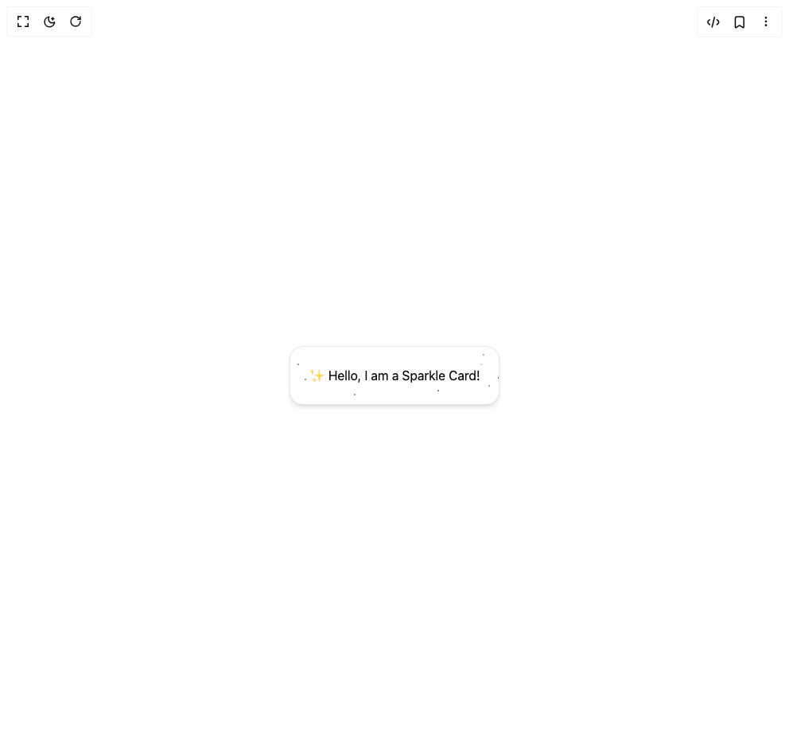

# Build Sparkle Card in BuilderStudio

> Build this component in our Agentic IDE: [BuilderStudio](https://builderstudio.dev).
>
> Join the BuilderStudio community on [Discord](https://discord.gg/QdWeSGCqfe) and [Reddit](https://reddit.com/r/builderstudio).



## Component

- Author group: `user_hardp`
- Component: `sparkle-card`
- Variant: `default`
- Rendered HTML snapshot: [`rendered.html`](rendered.html)

## BuilderStudio prompt

You are implementing a React component based on a component reference.

## Component identity

- Author: user_hardp
- Component slug: sparkle-card
- Demo slug: default
- Title: sparkle-card
- Description: 

## Goal

Recreate this component in a React + TypeScript + Tailwind CSS project. Preserve the visual layout, spacing, colors, border radius, shadows, interaction behavior, animation behavior, responsive behavior, and dark mode behavior shown in the rendered demo.

## Implementation requirements

- Use React and TypeScript.
- Use Tailwind CSS classes whenever possible.
- Keep the component self-contained unless the source files require helper components.
- If the source uses CSS variables, custom CSS, animations, or keyframes, include them.
- If the source uses external packages, list and use the required packages.
- Preserve accessibility attributes, button semantics, links, keyboard behavior, and ARIA attributes when visible in the source.
- Do not replace the component with a simplified placeholder.
- Return complete production-ready code.

## Dependencies

No reference metadata available.

## Rendered DOM snapshot

This is the rendered demo HTML extracted from the live preview. Use it to verify structure, class names, visible content, and layout.

```html
<div id="root"><div class="w-screen min-h-screen flex justify-center items-center"><div class="w-screen min-h-screen flex justify-center items-center"><div class="relative overflow-hidden rounded-2xl border border-border p-6 bg-background shadow-md"><div class="absolute inset-0 pointer-events-none"><span class="absolute" style="top: 75.0015%; left: 70.583%; transform: scale(0.903447);"><span class="block w-0.5 h-0.5 rounded-full bg-black dark:bg-white"></span></span><span class="absolute" style="top: 82.4508%; left: 30.6432%; transform: scale(0.994081);"><span class="block w-0.5 h-0.5 rounded-full bg-black dark:bg-white"></span></span><span class="absolute" style="top: 54.6838%; left: 77.879%; transform: scale(0.732252);"><span class="block w-0.5 h-0.5 rounded-full bg-black dark:bg-white"></span></span><span class="absolute" style="top: 87.0216%; left: 88.9771%; transform: scale(0.5);"><span class="block w-0.5 h-0.5 rounded-full bg-black dark:bg-white"></span></span><span class="absolute" style="top: 63.4338%; left: 93.6392%; transform: scale(0.552681);"><span class="block w-0.5 h-0.5 rounded-full bg-black dark:bg-white"></span></span><span class="absolute" style="top: 29.3035%; left: 91.1827%; transform: scale(0.756408);"><span class="block w-0.5 h-0.5 rounded-full bg-black dark:bg-white"></span></span><span class="absolute" style="top: 30.8675%; left: 74.7628%; transform: scale(0.5);"><span class="block w-0.5 h-0.5 rounded-full bg-black dark:bg-white"></span></span><span class="absolute" style="top: 66.6598%; left: 95.0002%; transform: scale(0.983006);"><span class="block w-0.5 h-0.5 rounded-full bg-black dark:bg-white"></span></span><span class="absolute" style="top: 6.96617%; left: 69.56%; transform: scale(0.542738);"><span class="block w-0.5 h-0.5 rounded-full bg-black dark:bg-white"></span></span><span class="absolute" style="top: 14.8572%; left: 44.7763%; transform: scale(0.5);"><span class="block w-0.5 h-0.5 rounded-full bg-black dark:bg-white"></span></span><span class="absolute" style="top: 52.649%; left: 99.4436%; transform: scale(0.939315);"><span class="block w-0.5 h-0.5 rounded-full bg-black dark:bg-white"></span></span><span class="absolute" style="top: 55.6595%; left: 7.05578%; transform: scale(0.873667);"><span class="block w-0.5 h-0.5 rounded-full bg-black dark:bg-white"></span></span><span class="absolute" style="top: 29.2101%; left: 3.57107%; transform: scale(0.996506);"><span class="block w-0.5 h-0.5 rounded-full bg-black dark:bg-white"></span></span><span class="absolute" style="top: 12.5453%; left: 92.3812%; transform: scale(0.818605);"><span class="block w-0.5 h-0.5 rounded-full bg-black dark:bg-white"></span></span><span class="absolute" style="top: 74.9814%; left: 48.5003%; transform: scale(0.525569);"><span class="block w-0.5 h-0.5 rounded-full bg-black dark:bg-white"></span></span></div><div class="relative z-10"><div class="text-center text-foreground">✨ Hello, I am a Sparkle Card!</div></div></div></div></div></div>
```

## Reference source files

No reference source files were available.
