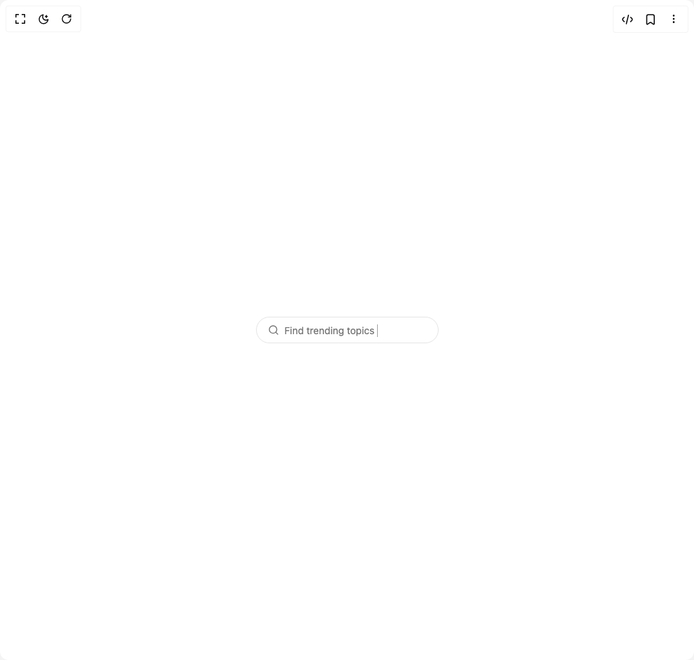

# Build Suggestive Search in BuilderStudio

> Build this component in our Agentic IDE: [BuilderStudio](https://builderstudio.dev).
>
> Join the BuilderStudio community on [Discord](https://discord.gg/QdWeSGCqfe) and [Reddit](https://reddit.com/r/builderstudio).



## Component

- Author group: `user_hardp`
- Component: `suggestive-search`
- Variant: `default`
- Rendered HTML snapshot: [`rendered.html`](rendered.html)

## BuilderStudio prompt

You are implementing a React component based on a component reference.

## Component identity

- Author: user_hardp
- Component slug: suggestive-search
- Demo slug: default
- Title: suggestive-search
- Description: 

## Goal

Recreate this component in a React + TypeScript + Tailwind CSS project. Preserve the visual layout, spacing, colors, border radius, shadows, interaction behavior, animation behavior, responsive behavior, and dark mode behavior shown in the rendered demo.

## Implementation requirements

- Use React and TypeScript.
- Use Tailwind CSS classes whenever possible.
- Keep the component self-contained unless the source files require helper components.
- If the source uses CSS variables, custom CSS, animations, or keyframes, include them.
- If the source uses external packages, list and use the required packages.
- Preserve accessibility attributes, button semantics, links, keyboard behavior, and ARIA attributes when visible in the source.
- Do not replace the component with a simplified placeholder.
- Return complete production-ready code.

## Dependencies

No reference metadata available.

## Rendered DOM snapshot

This is the rendered demo HTML extracted from the live preview. Use it to verify structure, class names, visible content, and layout.

```html
<div id="root"><div class="w-screen min-h-screen flex justify-center items-center"><div class="w-screen min-h-screen flex justify-center items-center"><div class="flex justify-center p-10"><div class="relative flex items-center gap-x-2 py-2 px-4 border border-border rounded-full" style="max-width: 100%;"><div class="flex-shrink-0"><svg xmlns="http://www.w3.org/2000/svg" width="24" height="24" viewBox="0 0 24 24" fill="none" stroke="currentColor" stroke-width="2" stroke-linecap="round" stroke-linejoin="round" class="lucide lucide-search size-4 text-muted-foreground" aria-hidden="true"><circle cx="11" cy="11" r="8"></circle><path d="m21 21-4.3-4.3"></path></svg></div><input class="bg-transparent outline-none text-sm text-foreground placeholder:text-transparent w-full" placeholder="" aria-label="search" type="text" value="" style="min-width: 195px;"><div class="flex-shrink-0"></div><div aria-hidden="true" style="position: absolute; inset: 0px 16px 0px 40px; display: flex; align-items: center; pointer-events: none; overflow: hidden; white-space: nowrap;"><div style="display: inline-block; overflow: hidden; white-space: nowrap; align-items: center;"><div style="display: inline-flex; align-items: center; overflow: hidden; white-space: nowrap; width: 100%;"><span class="text-sm text-muted-foreground select-none">Find trending topics</span><span aria-hidden="true" class="bg-muted-foreground" style="display: inline-block; width: 1px; margin-left: 4px; height: 1.1em; vertical-align: middle;"></span></div></div></div></div></div></div></div></div>
```

## Reference source files

No reference source files were available.
