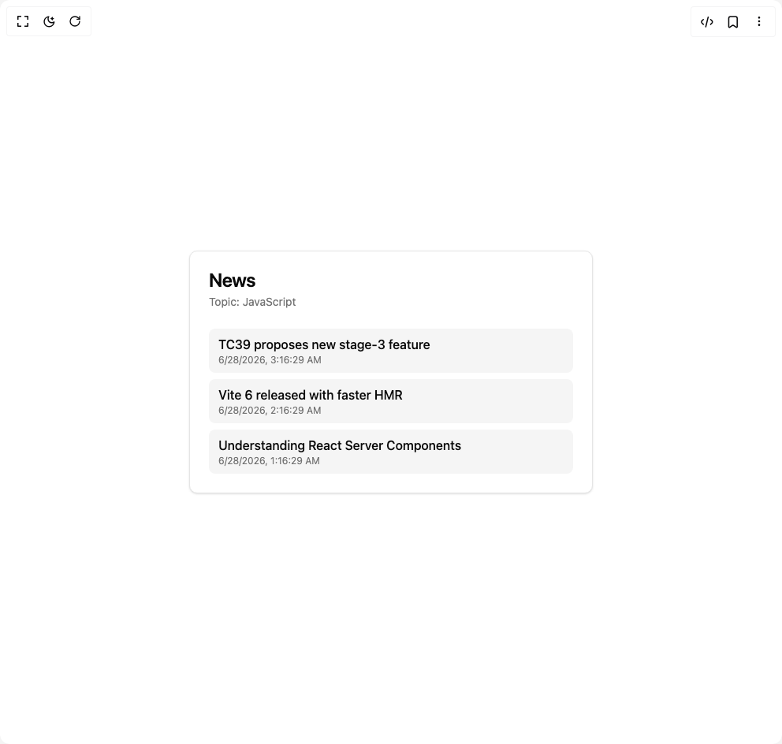

# Build News Search in BuilderStudio

> Build this component in our Agentic IDE: [BuilderStudio](https://builderstudio.dev).
>
> Join the BuilderStudio community on [Discord](https://discord.gg/QdWeSGCqfe) and [Reddit](https://reddit.com/r/builderstudio).



## Component

- Author group: `user_xn1cklas`
- Component: `news-search`
- Variant: `default`
- Rendered HTML snapshot: [`rendered.html`](rendered.html)

## BuilderStudio prompt

You are implementing a React component based on a component reference.

## Component identity

- Author: user_xn1cklas
- Component slug: news-search
- Demo slug: default
- Title: news-search
- Description: 

## Goal

Recreate this component in a React + TypeScript + Tailwind CSS project. Preserve the visual layout, spacing, colors, border radius, shadows, interaction behavior, animation behavior, responsive behavior, and dark mode behavior shown in the rendered demo.

## Implementation requirements

- Use React and TypeScript.
- Use Tailwind CSS classes whenever possible.
- Keep the component self-contained unless the source files require helper components.
- If the source uses CSS variables, custom CSS, animations, or keyframes, include them.
- If the source uses external packages, list and use the required packages.
- Preserve accessibility attributes, button semantics, links, keyboard behavior, and ARIA attributes when visible in the source.
- Do not replace the component with a simplified placeholder.
- Return complete production-ready code.

## Dependencies

No reference metadata available.

## Rendered DOM snapshot

This is the rendered demo HTML extracted from the live preview. Use it to verify structure, class names, visible content, and layout.

```html
<div id="root"><div class="w-screen min-h-screen flex justify-center items-center"><div class="w-screen min-h-screen flex justify-center items-center"><div class="rounded-lg border bg-card text-card-foreground shadow-sm w-full max-w-lg"><div class="flex flex-col space-y-1.5 p-6"><h3 class="text-2xl font-semibold leading-none tracking-tight">News</h3><p class="text-sm text-muted-foreground">Topic: JavaScript</p></div><div class="p-6 pt-0"><ul class="space-y-2"><li class="rounded-md bg-muted px-3 py-2"><a href="https://example.com/tc39-stage-3" class="font-medium hover:underline" target="_blank" rel="noreferrer">TC39 proposes new stage-3 feature</a><div class="text-xs text-muted-foreground">6/28/2026, 3:16:29 AM</div></li><li class="rounded-md bg-muted px-3 py-2"><a href="https://example.com/vite-6" class="font-medium hover:underline" target="_blank" rel="noreferrer">Vite 6 released with faster HMR</a><div class="text-xs text-muted-foreground">6/28/2026, 2:16:29 AM</div></li><li class="rounded-md bg-muted px-3 py-2"><a href="https://example.com/rsc-guide" class="font-medium hover:underline" target="_blank" rel="noreferrer">Understanding React Server Components</a><div class="text-xs text-muted-foreground">6/28/2026, 1:16:29 AM</div></li></ul></div></div></div></div></div>
```

## Reference source files

No reference source files were available.
